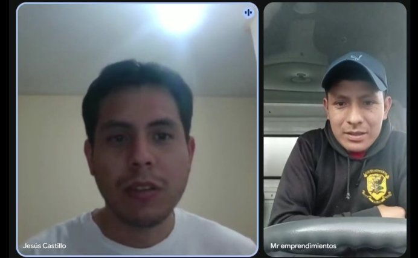
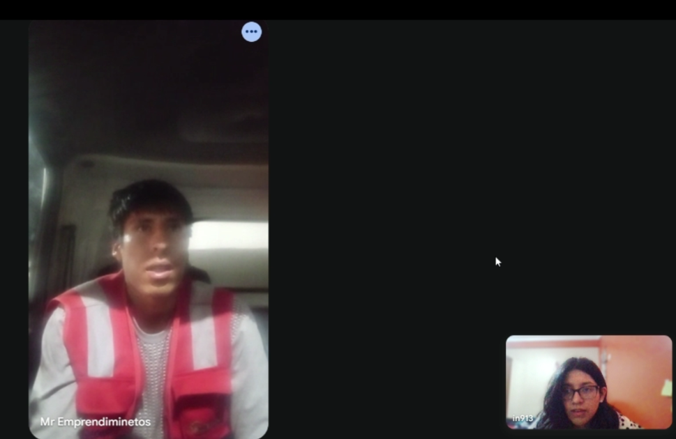
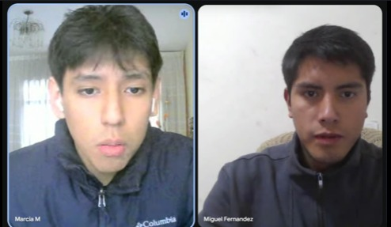
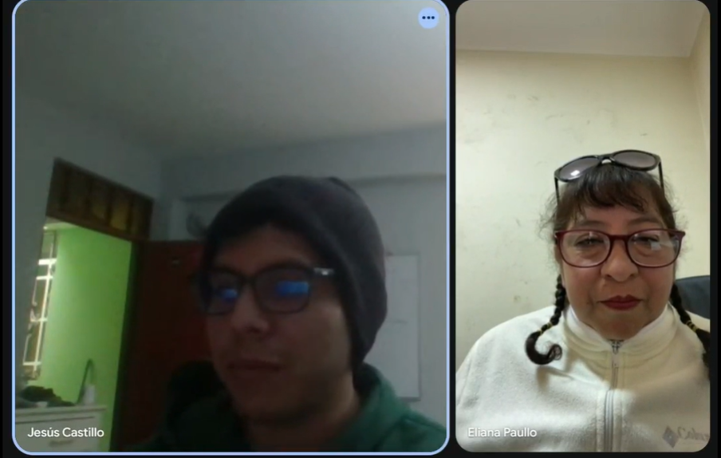
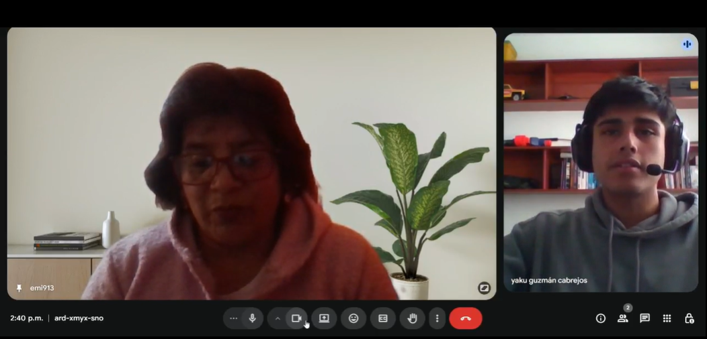

## Capítulo II: Requirements Elicitation & Analysis
### 2.1. Competidores.
### 2.1.1. Análisis competitivo.

<table style="width:100%; border-collapse:collapse; table-layout:fixed;" border="1" align="center">

<!-- Título -->
<tr>
<th colspan="6" align="center">Competitive Analysis Landscape</th>
</tr>

<!-- Objetivo -->
<tr>
<td rowspan="2" colspan="1" align="center"><b>¿Por qué llevar a cabo este análisis?</b></td>
<td colspan="6" align="center">Escriba en el recuadro la pregunta que busca responder o el objetivo de este análisis.</td>
</tr>
 <tr>
    <td colspan="6">
       <b></b> ...   
    </td>
  </tr>

<!-- Cabeceras -->
<tr>
<th colspan="2" style="width:12%">(En la cabecera colocar por cada competidor nombre y logo)</th>
<th style="width:22%">Su Startup

</th>
<th style="width:22%">Competidor 1

</th>
<th style="width:22%">Competidor 2

</th>
   
<th style="width:22%">Competidor 3

</th>
</tr>

<!-- PERFIL -->
<tr>
<td rowspan="2" colspan="1" align="center" ><b>Perfil</b></td>
<td style="word-wrap:break-word; white-space:normal;"><b>Overview</b></td>
   <td  style="word-wrap:break-word; white-space:normal;"><b></b> aaaa </td>
   <td  style="word-wrap:break-word; white-space:normal;"><b></b> aaaa </td>
   <td  style="word-wrap:break-word; white-space:normal;"><b></b> aaaa </td>
   <td  style="word-wrap:break-word; white-space:normal;"><b></b> aaaa </td>
</tr>
<tr>
<td  style="word-wrap:break-word; white-space:normal;"><b>Ventaja competitiva: ¿Qué valor ofrece a los clientes?</b></td>
   <td  style="word-wrap:break-word; white-space:normal;"><b></b> bbbb </td>
   <td  style="word-wrap:break-word; white-space:normal;"><b></b> bbbb </td>
   <td  style="word-wrap:break-word; white-space:normal;"><b></b> bbbb </td>
   <td  style="word-wrap:break-word; white-space:normal;"><b></b> bbbb </td>
</tr>

<!-- PERFIL DE MARKETING -->
<tr>
<td rowspan="2" colspan="1" align="center"><b>Perfil de Marketing</b></td>
<td style="word-wrap:break-word; white-space:normal;"><b>Mercado objetivo</b></td>
   <td  style="word-wrap:break-word; white-space:normal;"><b></b> bbbb </td>
   <td  style="word-wrap:break-word; white-space:normal;"><b></b> bbbb </td>
   <td  style="word-wrap:break-word; white-space:normal;"><b></b> bbbb </td>
   <td  style="word-wrap:break-word; white-space:normal;"><b></b> bbbb </td>
</tr>
<tr>
<td  style="word-wrap:break-word; white-space:normal;"><b>Estrategias de marketing</b></td>
   <td  style="word-wrap:break-word; white-space:normal;"><b></b> bbbb </td>
   <td  style="word-wrap:break-word; white-space:normal;"><b></b> bbbb </td>
   <td  style="word-wrap:break-word; white-space:normal;"><b></b> bbbb </td>
   <td  style="word-wrap:break-word; white-space:normal;"><b></b> bbbb </td>
</tr>

<!-- PERFIL DE PRODUCTO -->
<tr>
<td rowspan="3" colspan="1" align="center"><b>Perfil de Producto</b></td>
<td style="word-wrap:break-word; white-space:normal;"><b>Productos & Servicios</b></td>
   <td  style="word-wrap:break-word; white-space:normal;"><b></b> bbbb </td>
   <td  style="word-wrap:break-word; white-space:normal;"><b></b> bbbb </td>
   <td  style="word-wrap:break-word; white-space:normal;"><b></b> bbbb </td>
   <td  style="word-wrap:break-word; white-space:normal;"><b></b> bbbb </td>
</tr>
<tr>
<td " style="word-wrap:break-word; white-space:normal;"><b>Precios & Costos</b></td>
   <td  style="word-wrap:break-word; white-space:normal;"><b></b> bbbb </td>
   <td  style="word-wrap:break-word; white-space:normal;"><b></b> bbbb </td>
   <td  style="word-wrap:break-word; white-space:normal;"><b></b> bbbb </td>
   <td  style="word-wrap:break-word; white-space:normal;"><b></b> bbbb </td>
</tr>
<tr>
<td  style="word-wrap:break-word; white-space:normal;"><b>Canales de distribución (Web y/o Móvil)</b></td>
   
   <td  style="word-wrap:break-word; white-space:normal;"><b></b> bbbb </td>
   <td  style="word-wrap:break-word; white-space:normal;"><b></b> bbbb </td>
   <td  style="word-wrap:break-word; white-space:normal;"><b></b> bbbb </td>
   <td  style="word-wrap:break-word; white-space:normal;"><b></b> bbbb </td>
</tr>

<!-- ANÁLISIS SWOT -->
<tr>
<td rowspan="4" colspan="1" align="center"><b>Análisis SWOT</b></td>
<td  style="word-wrap:break-word; white-space:normal;"><b>Fortalezas</b></td>
   
   <td  style="word-wrap:break-word; white-space:normal;"><b></b> bbbb </td>
   <td  style="word-wrap:break-word; white-space:normal;"><b></b> bbbb </td>
   <td  style="word-wrap:break-word; white-space:normal;"><b></b> bbbb </td>
   <td  style="word-wrap:break-word; white-space:normal;"><b></b> bbbb </td>
</tr>
<tr>
<td  style="word-wrap:break-word; white-space:normal;"><b>Debilidades</b></td>
   
   <td  style="word-wrap:break-word; white-space:normal;"><b></b> bbbb </td>
   <td  style="word-wrap:break-word; white-space:normal;"><b></b> bbbb </td>
   <td  style="word-wrap:break-word; white-space:normal;"><b></b> bbbb </td>
   <td  style="word-wrap:break-word; white-space:normal;"><b></b> bbbb </td>
</tr>
<tr>
<td  style="word-wrap:break-word; white-space:normal;"><b>Oportunidades</b></td>
   
   <td  style="word-wrap:break-word; white-space:normal;"><b></b> bbbb </td>
   <td  style="word-wrap:break-word; white-space:normal;"><b></b> bbbb </td>
   <td  style="word-wrap:break-word; white-space:normal;"><b></b> bbbb </td>
   <td  style="word-wrap:break-word; white-space:normal;"><b></b> bbbb </td>
</tr>
<tr>
<td  style="word-wrap:break-word; white-space:normal;"><b>Amenazas</b></td>
   
   <td  style="word-wrap:break-word; white-space:normal;"><b></b> bbbb </td>
   <td  style="word-wrap:break-word; white-space:normal;"><b></b> bbbb </td>
   <td  style="word-wrap:break-word; white-space:normal;"><b></b> bbbb </td>
   <td  style="word-wrap:break-word; white-space:normal;"><b></b> bbbb </td>
</tr>

</table>

### 2.1.2. Estrategias y tácticas frente a competidores.
### 2.2. Entrevistas.
### 2.2.1. Diseño de entrevistas.
**Preguntas Generales**

**Objetivo:** obtener información personal y de contexto laboral del entrevistado.  
**Presentación con:** Nombres, apellidos, edad.

   - **Principal:** ¿Cuál es tu rol dentro de la empresa de transporte?
   - **Principal:** ¿Qué responsabilidades tienes en tu área?
   - **Complementaria:** ¿Qué herramientas digitales/apps usas ahora para tu trabajo y qué te frustra de ellas?
  
**Primer Segmento Objetivo: Transportistas**

**Objetivo:** identificar cómo reciben, procesan y ejecutan la información de entregas, así como dificultades comunes en ruta.

   - **Principal:** Actualmente, ¿cómo te pasan las ubicaciones de entrega (canal, formato y con cuánta anticipación) y quiénes son los que deciden?
   - **Principal:** Si no conoces el lugar, ¿qué haces para encontrar el punto de entrega?
   - **Principal:** ¿Qué información mínima necesitas por entrega?
   - **Principal:** ¿Cómo confirmas una entrega realizada (firma, foto) y qué te complica de ese proceso?
   - **Principal:** ¿Qué factores te retrasan con mayor frecuencia (tráfico, direcciones erróneas, esperas, documentación) y cómo los resuelves hoy?
   - **Complementaria:** ¿Cómo reportas incidencias durante el reparto y qué tipos de incidencias son las más comunes?
  
**Segundo Segmento Objetivo: Administradores**

**Objetivo:** conocer procesos actuales de planificación y monitoreo, así como problemas y oportunidades de mejora.

   - **Principal:** ¿Cómo registran actualmente qué productos se cargan en cada camión?
   - **Complementaria:** ¿Han tenido incidentes de pérdida, daño o confusión en las cargas? ¿Cómo los resolvieron?
   - **Principal:** ¿Qué problemas suelen enfrentar con la planificación de rutas?
   - **Principal:** ¿Cómo registran la finalización de una ruta o la entrega al cliente?
   - **Principal:** ¿Cómo monitorean hoy en día si un camión está siguiendo la ruta prevista?
   - **Complementaria:** ¿Qué hacen cuando un camión se retrasa o cambia de ruta?

### 2.2.2. Registro de entrevistas.
#### 1. Primer Segmento Objetivo:

**1️⃣ Primer Segmento Objetivo: Transportistas**
<table style="width: 100%" align='center'>
<tr>
<th>Entrevistado 1</th>
<th>Entrevistado 2</th>
<th>Entrevistado 3</th>
</tr>

<tr>
<td align='center'>

</td>

<!--Colocar Screenshot y el enlace para el video -->
<td align='center'>

</td>

<!--Colocar Screenshot y el enlace para el video -->
<td align='center'>

</td>

   <tr>
   <td>
    <b>Entrevistador:</b> Christofer William Costa Morales  
    <b>Entrevistado:</b> Jhon Willy Huaman Huaman  
    <b>Edad:</b> 34 años  
    <b>Distrito:</b> San Sebastian - Cusco  
    <b>Inicio de la entrevista:</b>  Entrevista Jhon Huaman  
    <b> Resumen: </b>John Willy es un chofer y encargado de una empresa de transporte, que esta encargado de hacer las rutas y la liquidación de los pedidos de transporte. Este utiliza la dirección en las boletas que emite para calcular su ruta, además, con la información que el cliente le proporcione sobre la ruta (accidentes, desfiles, etc). Sin embargo, todos estos procesos pueden conllevan a muchos inconvenientes, cómo la confirmación de la ruta y de la dirección final, la recepción por parte del cliente, la zona en donde se despacha el pedido, la actitud de los clientes y el tiempo de espera. Adicionalmente, nos comento no usar su aplicativo laboral, ya que, gracias a su experiencia puede manejar mejor algún problema y lo considera algo innecesario y tedioso de utilizar al poseer características muy intrusivas para su flujo laboral. 
    

    

   </td>
   <td>
    <b>Entrevistador:</b> Jesus Ivan Castillo Vidal  
    <b>Entrevistado:</b> Carlos Maque Huachaca  
    <b>Edad:</b> 30 años  
    <b>Distrito:</b> Santiago - Cusco  
    <b>Inicio de la entrevista:</b> Entrevista Carlos Maque  
    <b> Resumen:</b> Carlos Maque es un conductor y encargado, su rol es de transportista de producto de la marca Gloria. Este utiliza una aplicación llamada el "Beetrack", la cual le otorga la geolocalización del cliente en un mapa, previamente proporcionado por la empresa. Además, la aplicación le proporciona un número de contacto de los clientes, en caso se pierda o la dirección sea incorrecta, y le otorga opciones para confirmar, rechazar o justificar la entrega o devolución de los pedidos. Por otro lado, se guia con las boletas para obtener la información necesaria del pedido. Adicionalmente, los retrasos en los pedidos más importantes, según el entrevistado, son: las tiendas cerradas, clientes sin dinero y mala geoposición. Por lo anterior, el reporta los inconvenientes por el WhatsApp y el Beetrack. Sin embargo, este ultimo no funciona correctamente en las zonas con poca señal, por ello, se puede retrasar las confirmaciones de la entrega del pedidos y necesitan dirigirse a una zona con mejor señal para que cargue las confirmaciones. 
  
 

   </td>
      <td>
    <b>Entrevistador:</b> Ingrid Melani Medina Merma  
    <b>Entrevistado:</b> Danny Riverra Ticona 
    <b>Edad:</b> 24 años  
    <b>Distrito:</b> San Jeronimo - Cusco  
    <b>Inicio de la entrevista:</b> Entrevista Danny Riverra  
     <b>Resumen:</b> Danny Riverra, encargado y chofer en una empresa de transporte, utiliza el teléfono móvil y la aplicación "Beetrack" para gestionar entregas, junto con documentos de oficina. Usa Beetrack para localizar direcciones y referencias de clientes, necesitando solo la dirección exacta y calles cercanas. Registra las entregas con la firma del cliente y valida en Beetrack, aunque las fallas de internet complican el proceso. Los retrasos principales son por tráfico, demoras en alistar mercadería y clientes sin pedidos, lo que requiere contactar al vendedor y reportar en WhatsApp. Los incidentes más comunes son locales cerrados o clientes sin dinero, también notificados por WhatsApp. El entrevistado muestra una actitud práctica y confianza en herramientas digitales, pero se frustra por factores externos como el tráfico, la falta de preparación de clientes y la dependencia de internet.
  
      
 
     

   </td>
   </tr>

</table>

**2️⃣ Segundo Segmento Objetivo: Administradores**

<table style="width: 100%" align='center'>
<tr>
<th>Entrevistado 1</th>
<th>Entrevistado 2</th>
<th>Entrevistado 3</th>
</tr>

<tr>
<td align='center'>

</td>

<!--Colocar Screenshot y el enlace para el video -->
<td align='center'>

</td>

<!--Colocar Screenshot y el enlace para el video -->
<td align='center'>

</td>

   <tr>
   <td>
    <b>Entrevistador:</b> Santiago Alonso Gordillo Ramos  
    <b>Entrevistado:</b> Miguel Alcelmo Fernandez  
    <b>Edad:</b> 27 años  
    <b>Distrito:</b> Cusco  
    <b>Inicio de la entrevista:</b>  0:55  
    <b> Resumen:</b> es un radiotransportista en la empresa de RM emprendimientos  
    

   </td>
   <td>
    <b>Entrevistador: </b> Jesus Ivan Castillo Vidal  
    <b>Entrevistado:</b>Eliana Paullo Palma 
    <b>Inicio de la entrevista:</b> 
    <b>Edad:</b> 49 años  
    <b>Distrito:</b> Lima  
    <b>Inicio de la entrevista:</b>  0:17  
    <b> Resumen:</b> Eliana Paullo es una administradora de la empresa MR emprendimientos, esta encargada de la planificación de los camiones, el monitoreo de personal y transportes, evaluar y ayudar al personal. Después, nos menciona que todo el personal de la empresa, por camión, usa el aplicativo "Beetrack", el cual le ayuda a monitorear el porcentaje de avance que posee cada camión y los clientes y productos asignados a cada camión. Además, utilizan GPS para mantener un control de las rutas de los camiones y del uso de sensores, ya que los productos deben mantenerse refrigerados y este le alerta si esta o no activado el refrigerante. Los principales incidentes que sufrieron son: Confunción en el cargamento del camión, a causa de la forma en cómo estan divididos los camiones, y el daño de los productos y la compensación económica por los mismos. Luego, nos comenta cómo realizan la planificación de las rutas y cómo lidian con problemas que pueden ocurrir el mismo dia de entrega. Esto lo realizan de manera manual, con llamadas y mensajes a los clientes para informarle de los retrasos. Adicionalmente, nos comenta que se utiliza bastante Whatsapp para la coordinación de pedidos para los diferentes conductores. Finalmente, nos comento su sugerencia para mejorar las herramientas que usan, este seria la Opción para identificar a clientes complicados y deribarlos a un plan de pago adelantado para evitar problemas al momento de realizar las entregas.  
   

   

   </td>
      <td>
    <b>Entrevistador:</b> Yaku Mateo Guzmán Cabrejos   
    <b>Entrevistado: </b>Adriana Merma Noblega 
    <b>Inicio de la entrevista:</b> 
    <b>Edad:</b> 50 años  
    <b>Distrito:</b> Lima  
    <b>Inicio de la entrevista:</b>  0:08  
    <b> Resumen:</b> Adriana Merma es una gerente de una empresa de transporte que se encarga de la gestión de las diferentes áreas y del personal. El entrevistado dice que poseen varios aplicativos empresariales con diferentes usos. Por ejemplo, uno de ellos le da actualizaciones del avance del trabajo en las diferente áreas, otro le ayuda a mantener su inventario ordenado, qué se debe transportar en cada pedido y de informar de algún error o daños en los productos, y otro más para poder registrar la finalización del trabajo y poder registrarlo. Además, comenta que no hay muchos errores en las planificación de rutas, en caso los haya, se utilizarían los aplicativos anteriormente mencionado y documentos de registros o control. Al final, el entrevistado nos comenta que todo lo que realizan, siempre usan varios aplicativos durante todo el proceso.  
     

     

   </td>
   </tr>

</table>

### 2.2.3. Análisis de entrevistas.

#### Segmento 1: Transportistas

Se realizo el analisis de 3 entrevistas a los transportistas con experiencia en el sector. Con la información obtenida se puede identificar las características claves para el perfil de nuestros segmento objetivo de transportistas.  

##### Caracteristicas

<table>

<tr>

<th>Características</th>
<th>Mención</th>
<th>Porcentaje</th>
<th>Evidencia</th>

</tr>

<tr>

<td>Características</td>
<td>Mención</td>
<td>Porcentaje</td>
<td>Evidencia</td>

</tr>

<tr>

<td>Características</td>
<td>Mención</td>
<td>Porcentaje</td>
<td>Evidencia</td>

</tr>

<tr>

<td>Características</td>
<td>Mención</td>
<td>Porcentaje</td>
<td>Evidencia</td>

</tr>

<tr>

<td>Características</td>
<td>Mención</td>
<td>Porcentaje</td>
<td>Evidencia</td>

</tr>

</table>

##### Insights

#### Segmento 2: Administradores

Se realizo el analisis de 3 entrevistas a los administradores con experiencia en el sector. Con la información obtenida se puede identificar las características claves para el perfil de nuestros segmento objetivo de transportistas. 

##### Caracteristicas

<table>

<tr>

<th>Características</th>
<th>Mención</th>
<th>Porcentaje</th>
<th>Evidencia</th>

</tr>

<tr>

<td>Características</td>
<td>Mención</td>
<td>Porcentaje</td>
<td>Evidencia</td>

</tr>

<tr>

<td>Características</td>
<td>Mención</td>
<td>Porcentaje</td>
<td>Evidencia</td>

</tr>

<tr>

<td>Características</td>
<td>Mención</td>
<td>Porcentaje</td>
<td>Evidencia</td>

</tr>

<tr>

<td>Características</td>
<td>Mención</td>
<td>Porcentaje</td>
<td>Evidencia</td>

</tr>

</table>

##### Insights

### 2.3. Needfinding.
### 2.3.1. User Personas.
### 2.3.2. User Task Matrix.
### 2.3.3. User Journey Mapping.
### 2.3.4. Empathy Mapping.
### 2.4. Big Picture EventStorming.
### 2.5. Ubiquitous Language.
