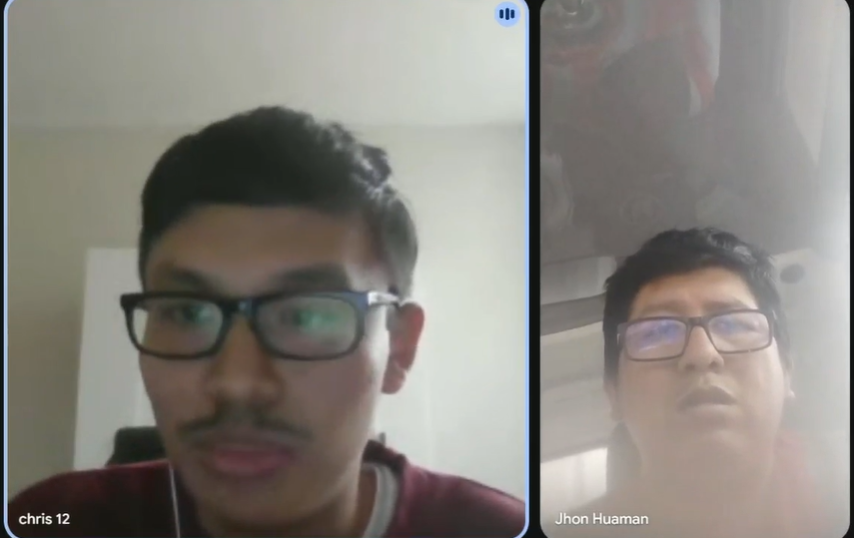

## Capítulo II: Requirements Elicitation & Analysis
### 2.1. Competidores.
### 2.1.1. Análisis competitivo.
### 2.1.2. Estrategias y tácticas frente a competidores.
### 2.2. Entrevistas.
### 2.2.1. Diseño de entrevistas.
**Preguntas Generales**

**Objetivo:** obtener información personal y de contexto laboral del entrevistado.  
**Presentación con:** Nombres, apellidos, edad.

   - **Principal:** ¿Cuál es tu rol dentro de la empresa de transporte?
   - **Principal:** ¿Qué responsabilidades tienes en tu área?
   - **Complementaria:** ¿Qué herramientas digitales/apps usas ahora para tu trabajo y qué te frustra de ellas?
  
**Primer Segmento Objetivo: Transportistas**

**Objetivo:** identificar cómo reciben, procesan y ejecutan la información de entregas, así como dificultades comunes en ruta.

   - **Principal:** Actualmente, ¿cómo te pasan las ubicaciones de entrega (canal, formato y con cuánta anticipación) y quiénes son los que deciden?
   - **Principal:** Si no conoces el lugar, ¿qué haces para encontrar el punto de entrega?
   - **Principal:** ¿Qué información mínima necesitas por entrega?
   - **Principal:** ¿Cómo confirmas una entrega realizada (firma, foto) y qué te complica de ese proceso?
   - **Principal:** ¿Qué factores te retrasan con mayor frecuencia (tráfico, direcciones erróneas, esperas, documentación) y cómo los resuelves hoy?
   - **Complementaria:** ¿Cómo reportas incidencias durante el reparto y qué tipos de incidencias son las más comunes?
  
**Segundo Segmento Objetivo: Administradores**

**Objetivo:** conocer procesos actuales de planificación y monitoreo, así como problemas y oportunidades de mejora.

   - **Principal:** ¿Cómo registran actualmente qué productos se cargan en cada camión?
   - **Complementaria:** ¿Han tenido incidentes de pérdida, daño o confusión en las cargas? ¿Cómo los resolvieron?
   - **Principal:** ¿Qué problemas suelen enfrentar con la planificación de rutas?
   - **Principal:** ¿Cómo registran la finalización de una ruta o la entrega al cliente?
   - **Principal:** ¿Cómo monitorean hoy en día si un camión está siguiendo la ruta prevista?
   - **Complementaria:** ¿Qué hacen cuando un camión se retrasa o cambia de ruta?

### 2.2.2. Registro de entrevistas.
#### 1. Primer Segmento Objetivo:

**1️⃣ Primer Segmento Objetivo: Transportistas**
<table style="width: 100%" align='center'>
<tr>
<th>Entrevistado 1</th>
<th>Entrevistado 2</th>
<th>Entrevistado 3</th>
</tr>

<tr>
<td align='center'>

</td>

<!--Colocar Screenshot y el enlace para el video -->
<td align='center'>

</td>

<!--Colocar Screenshot y el enlace para el video -->
<td align='center'>

</td>

   <tr>
   <td>
    <b>Entrevistador:</b> Christofer William Costa Morales  
    <b>Entrevistado:</b> John Huaman Huaman  
    <b>Inicio de la entrevista:</b>
    
 John Huaman 
    

   </td>
   <td>
    <b>Entrevistador:</b>   
    <b>Entrevistado:</b>  
    <b>Inicio de la entrevista:</b> 

   

   </td>
      <td>
    <b>Entrevistador:Ingrid Melani Medina Merma</b>   
    <b>Entrevistado:Danny Riverra Ticona</b>  
    <b>Inicio de la entrevista:Entrevista Danny Riverra</b> 
     

     

   </td>
   </tr>

</table>

**2️⃣ Segundo Segmento Objetivo: Administradores**

<table style="width: 100%" align='center'>
<tr>
<th>Entrevistado 1</th>
<th>Entrevistado 2</th>
<th>Entrevistado 3</th>
</tr>

<tr>
<td align='center'>

</td>

<!--Colocar Screenshot y el enlace para el video -->
<td align='center'>

</td>

<!--Colocar Screenshot y el enlace para el video -->
<td align='center'>

</td>

   <tr>
   <td>
    <b>Entrevistador:</b>   
    <b>Entrevistado:</b>  
    <b>Inicio de la entrevista:</b> 
    
  
    

   </td>
   <td>
    <b>Entrevistador:</b>   
    <b>Entrevistado:</b>  
    <b>Inicio de la entrevista:</b> 
   

   

   </td>
      <td>
    <b>Entrevistador:</b>   
    <b>Entrevistado:</b>  
    <b>Inicio de la entrevista:</b> 
     

     

   </td>
   </tr>

</table>

### 2.2.3. Análisis de entrevistas.
### 2.3. Needfinding.
### 2.3.1. User Personas.
### 2.3.2. User Task Matrix.
### 2.3.3. User Journey Mapping.
### 2.3.4. Empathy Mapping.
### 2.4. Big Picture EventStorming.
### 2.5. Ubiquitous Language.
