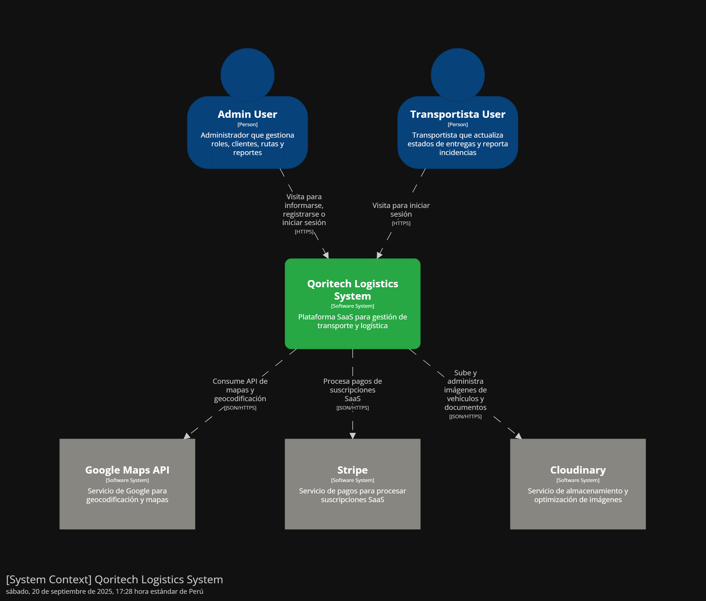
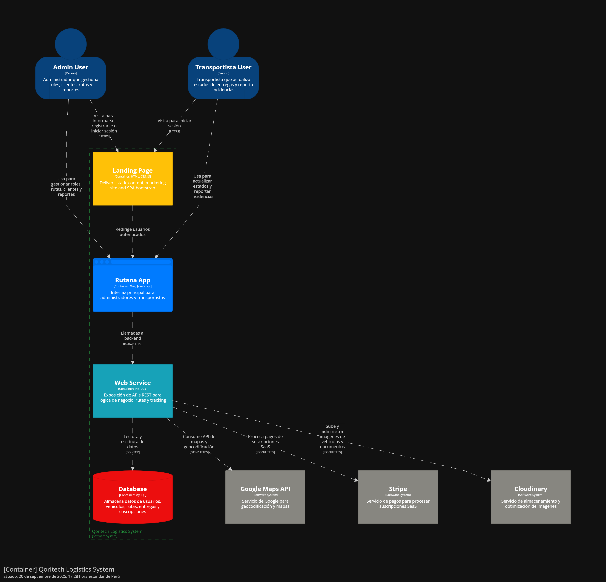

##  Capítulo IV: Product Design
### 4.1. Style Guidelines.
### 4.1.1. General Style Guidelines.
### 4.1.2. Web Style Guidelines.
### 4.2. Information Architecture.
### 4.2.1. Organization Systems.
### 4.2.2. Labeling Systems.
### 4.2.3. SEO Tags and Meta Tags
### 4.2.4. Searching Systems.
### 4.2.5. Navigation Systems.
### 4.3. Landing Page UI Design.
### 4.3.1. Landing Page Wireframe.
### 4.3.2. Landing Page Mock-up.
### 4.4. Web Applications UX/UI Design.
### 4.4.1. Web Applications Wireframes.
### 4.4.2. Web Applications Wireflow Diagrams.
### 4.4.2. Web Applications Mock-ups.
### 4.4.3. Web Applications User Flow Diagrams.
### 4.5. Web Applications Prototyping.
### 4.6. Domain-Driven Software Architecture.
### 4.6.1. Design-Level EventStorming.
### 4.6.2. Software Architecture Context Diagram.
Este diagrama muestra una vista general del sistema dentro de su entorno,
identificando a los actores externos (como administradores o transportistas) y cómo interactúan con el sistema.

### 4.6.3. Software Architecture Container Diagrams.
Aquí se describen los principales contenedores del sistema (landing page, web application, web service y base de datos). El diagrama detalla cómo se divide la aplicación en
diferentes partes desplegables

### 4.6.4. Software Architecture Components Diagrams.
### 4.7. Software Object-Oriented Design.
### 4.7.1. Class Diagrams.
### 4.8. Database Design.
### 4.8.1. Database Diagrams