## Capítulo V: Product Implementation, Validation & Deployment

### 5.1. Software Configuration Management.

### 5.1.1. Software Development Environment Configuration.

<table>
  <thead>
    <tr>
      <th>Actividad</th>
      <th>Herramienta/Guía</th>
      <th>Propósito</th>
      <th>Tipo de acceso/Ruta (links)</th>
    </tr>
  </thead>
  <tbody>
    <tr>
      <td>Gestión de proyecto</td>
      <td>Trello</td>
      <td>Organizar y dar seguimiento a tareas</td>
      <td><a href="https://trello.com" target="_blank">Trello</a></td>
    </tr>
    <tr>
      <td>Gestión de requerimientos</td>
      <td>Gherkin Conventions</td>
      <td>Definir criterios de aceptación claros</td>
      <td><a href="https://cucumber.io/docs/gherkin/" target="_blank">Guía Gherkin</a></td>
    </tr>
    <tr>
      <td>Producto UI/UX</td>
      <td>Figma</td>
      <td>Diseño de interfaces y prototipos</td>
      <td><a href="https://figma.com" target="_blank">Figma</a></td>
    </tr>
    <tr>
      <td>Landing Page desarrollo</td>
      <td>Visual Studio Code</td>
      <td>Edición y desarrollo de código</td>
      <td><a href="https://code.visualstudio.com/" target="_blank">VS Code</a></td>
    </tr>
    <tr>
      <td>Control de versiones</td>
      <td>Git</td>
      <td>Gestión de versiones del código</td>
      <td><a href="https://git-scm.com/" target="_blank">Git</a></td>
    </tr>
    <tr>
      <td>Despliegue</td>
      <td>GitHub Pages</td>
      <td>Publicar la aplicación web</td>
      <td><a href="https://pages.github.com/" target="_blank">GitHub Pages</a></td>
    </tr>
    <tr>
      <td>Event Storming</td>
      <td>Miro</td>
      <td>Colaboración y modelado de procesos</td>
      <td><a href="https://miro.com/" target="_blank">Miro</a></td>
    </tr>
    <tr>
      <td>Diagramas</td>
      <td>PlantUML</td>
      <td>Generación de diagramas UML</td>
      <td><a href="https://plantuml.com/" target="_blank">PlantUML</a></td>
    </tr>
  </tbody>
</table>

### 5.1.2. Source Code Management.

Para la gestión del código fuente se implementa el modelo de ramificación GitFlow, el versionado semántico y las convenciones de mensajes de commit, detallados a continuación:

**GitFlow Workflow**

Se utiliza el modelo de ramificación propuesto por Vincent Driessen (“A successful Git branching model”), conocido como GitFlow. Las ramas principales son:

- **main**: Rama principal, contiene siempre el código en producción.
- **develop**: Rama de desarrollo principal, donde se integran las funcionalidades antes de pasar a producción.
- **feature/\***: Ramas creadas a partir de develop para nuevas funcionalidades.  
  Convención: `feature/<nombre-corto-descriptivo>`  
  Ejemplo: `feature/login-auth`
- **release/\***: Ramas creadas desde develop para preparar una nueva versión.  
  Convención: `release/<versión>`  
  Ejemplo: `release/1.2.0`
- **hotfix/\***: Ramas creadas desde main para corregir errores críticos en producción.  
  Convención: `hotfix/<descripción-corta>`  
  Ejemplo: `hotfix/fix-payment-bug`

**Versionado Semántico**

Se aplica Semantic Versioning 2.0.0, con el formato:

- **MAJOR**: Cambios incompatibles en la API.
- **MINOR**: Nuevas funcionalidades compatibles.
- **PATCH**: Correcciones menores y ajustes sin afectar funcionalidades.

Ejemplo de versión: `v1.3.2`

**Convenciones de Commits**

Se emplea el estándar Conventional Commits para los mensajes de commit, facilitando la automatización en integración continua y generación de changelogs.

Ejemplos de mensajes:

- `feat: add login functionality`
- `fix: correct null pointer exception on user service`
- `chore: update dependencies`

Estas prácticas aseguran trazabilidad, organización y calidad en la gestión del código fuente del proyecto.

### 5.1.3. Source Code Style Guide & Conventions.

#### Landing Page Style Guide & Conventions

##### Project Structure

```
/public        (images, favicon, manifest.json)
/src
    /css         (styles.css + partials/modules)
    /js            (main.js + modules)
    /components    (HTML fragments if needed)
    /index.html
```

###### HTML

- **Semantics first**: use `header`, `nav`, `main`, `section`, `article`, `footer`.
- **Accessibility (a11y)**:
  - Add `alt` text to images.
  - Use `aria-*` attributes for dynamic components.
  - Keep logical tab order in the DOM.
  - Always show a visible focus state.
- **SEO**:
  - Include `<title>` and `<meta name="description">`.
  - Add Open Graph / Twitter meta tags.
  - Set `lang="en"` (or appropriate language) on `<html>`.
- **Performance**:
  - Use `loading="lazy"` on ``.
  - Minimize inline CSS/JS.
- **Conventions**:
  - Use **kebab-case** for class names.
  - Use `id` only for JS hooks or anchors, not for styling.

###### CSS

- **Naming**: Follow **BEM** → `.block__element--modifier`.
- **Variables**: Define tokens in `:root`:
  ```css
  :root {
    --color-primary: #0ea5e9;
    --color-secondary: #64748b;
    --font-base: 1rem;
  }
  ```
- **Architecture**:
  - Separate utilities (spacing, grid) and components (buttons, cards).
- **Responsive**:
  - Mobile-first approach with `min-width` breakpoints.
  - Common breakpoints: 480px, 768px, 1024px, 1280px.
- **Typography & spacing**:
  - Use `rem` for scalability.
  - Avoid hard-coded magic numbers.
- **States**:
  - Define consistent `:hover`, `:focus-visible`, and `:disabled`.
- **Property order**:
  - Group logically: Layout → Box Model → Typography → Visual → Misc.

###### JavaScript

- **Structure**:
  - Modular design; keep one `main.js` entry point.
  - Split reusable logic into separate modules.
- **Conventions**:
  - Use **camelCase** for variables/functions.
  - Use **PascalCase** for classes/constructors.
  - Constants in `UPPER_CASE`.
- **Best Practices**:
  - Prefer `const` and `let` over `var`.
  - Add comments for non-trivial logic.
  - Keep DOM selectors cached.
  - Use `addEventListener` (avoid inline `onclick`).
  - Wrap code in IIFEs or modules to avoid global leaks.

### 5.1.4. Software Deployment Configuration.

#### 1. Landing Page – HTML, CSS y JavaScript

##### Repositorio de Código Fuente

La Landing Page se implementa empleando únicamente HTML, CSS y JavaScript nativo. Todos los archivos del proyecto deben almacenarse en un repositorio en GitHub, asegurando que el archivo **`index.html`** se ubique en la raíz del repositorio (`/`). Esto es indispensable para que GitHub Pages lo reconozca automáticamente como punto de entrada del sitio.

##### Activación de GitHub Pages

1. Acceder al repositorio en GitHub.
2. Ir a la pestaña **Settings**.
3. En el menú lateral, seleccionar la opción **Pages**.
4. En el campo **Source**, configurar:
   - Rama: `main`
   - Carpeta: `/ (root)`
5. Guardar los cambios.

##### Publicación

Tras guardar la configuración, GitHub generará de forma automática una URL pública donde estará disponible la Landing Page. El formato de la URL es:

```
https://<usuario>.github.io/<repositorio>/
```

##### Actualizaciones

Cualquier commit realizado en la rama `main` será desplegado automáticamente en la página publicada, sin necesidad de pasos adicionales.

### 5.2. Landing Page, Services & Applications Implementation.

### 5.2.1. Sprint 1

A continuación, se expone la planificación de nuestro Sprint 1, orientado principalmente a la construcción de la landing page de Rutana. En esta primera fase, el equipo definió la meta del sprint, priorizó las historias de usuario más significativas y determinó los entregables esenciales que harán posible presentar una versión inicial funcional y con un diseño atractivo. Esta planificación busca garantizar una visión común entre todos los integrantes del equipo y establecer un punto de partida sólido para transmitir con claridad el valor de la plataforma a los futuros usuarios.

### 5.2.1.1. Sprint Planning 1.

<table>
<tr>
<th>Sprint #</th>
<th>Sprint 1</th>
</tr>
<tr>
<td colspan="2"><strong>Sprint Planning Background</strong></td>

</tr>
<tr>
<td><strong>Date</strong></td>
<td>2025-09-20</td>
</tr>
<tr>
<td><strong>Time</strong></td>
<td>18:50 PM (GMT-5)</td>
</tr>
<tr>
<td><strong>Location</strong></td>
<td>Modalidad remota mediante la plataforma Discord</td>
</tr>
<tr>
<td><strong>Prepared By</strong></td>
<td>Jesús Castillo Vidal</td>
</tr>
<tr>
<td><strong>Attendees (to planning meeting)</strong></td>
<td>Castillo Vidal, Jesús Iván / Costa Morales, Christofer William / Gordillo Ramos, Santiago Alonso / Guzmán Cabrejos, Yaku Mateo / Medina Merma, Ingrid Melani</td>
</tr>
<tr>
<td><strong>Sprint 0 Review Summary</strong></td>
<td>Dado que este es el sprint inicial, no se presenta un resumen del sprint anterior.</td>
</tr>
<tr>
<td><strong>Sprint 0 Retrospective Summary</strong></td>
<td>Dado que este es el sprint inicial, no se presenta una retroalimentación del sprint anterior.</td>
</tr>
<tr>
<td colspan="2"><strong>Sprint Goal & User Stories</strong></td>

</tr>
<tr>
<td><strong>Sprint 1 Goal</strong></td>
<td><strong>Nuestro propósito es</strong> diseñar y entregar una primera versión de la landing page para nuestra plataforma de gestión de rutas, basada en entrevistas con administradores y transportistas de una empresa distribuidora. <strong>Creemos que esto aportará</strong> claridad y valor inicial a los usuarios potenciales, comunicando el propósito del producto y la visión del equipo. <strong>Esto se confirmará cuando</strong> los visitantes puedan comprender fácilmente los beneficios de la plataforma y muestren interés en conocer más o contactarnos a través de la landing page.</td>
</tr>
<tr>
<td><strong>Sprint 1 Velocity</strong></td>
<td>15 puntos</td>
</tr>
<tr>
<td><strong>Sum of Story Points</strong></td>
<td>15 puntos</td>
</tr>
</table>

### 5.2.1.2. Aspect Leaders and Collaborators

En esta sección se presenta la **Leadership-and-Collaboration Matrix (LACX)** correspondiente al Sprint 1. Cada aspecto se relaciona con tareas clave del sprint, asignando un **líder (L)** responsable principal y **colaboradores (C)** que apoyan en su ejecución.

<table>
<tr>
<th>Team Member (Last Name, First Name)</th>
<th>GitHub Username</th>
<th>Mockup (L/C)</th>
<th>Entrevistas (L/C)</th>
<th>Wireframes (L/C)</th>
<th>Landing Page (L/C)</th>
</tr>
<tr>
<td>Castillo Vidal, Jesús Iván</td>
<td>Jcdev04</td>
<td>L</td>
<td>C</td>
<td>C</td>
<td>C</td>
</tr>
<tr>
<td>Costa Morales, Christofer William</td>
<td>miniChorri</td>
<td>C</td>
<td>L</td>
<td>C</td>
<td>C</td>
</tr>
<tr>
<td>Gordillo Ramos, Santiago Alonso</td>
<td>SantiIHC</td>
<td>C</td>
<td>C</td>
<td>L</td>
<td>C</td>
</tr>
<tr>
<td>Guzmán Cabrejos, Yaku Mateo</td>
<td>yak-cod</td>
<td>C</td>
<td>C</td>
<td>C</td>
<td>L</td>
</tr>
<tr>
<td>Medina Merma, Ingrid Melani</td>
<td>Grini913</td>
<td>C</td>
<td>C</td>
<td>C</td>
<td>C</td>
</tr>
</table>

**Notas:**

- Cada integrante asume liderazgo en al menos un aspecto para distribuir responsabilidades.
- Los colaboradores apoyan al líder en la ejecución, revisión y validación de las tareas correspondientes.
- La organización de líderes y colaboradores se vincula directamente con la selección posterior de tasks en el Sprint.

### 5.2.1.3. Sprint Backlog 1.

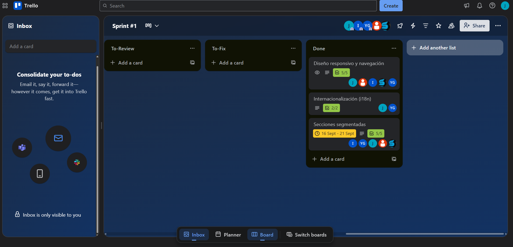
  <br>
  <a href="https://trello.com/b/vqfXmatr/sprint-1" target="_blank">
    <span>Tablero Sprint 1 en Trello</span>
  </a>

A continuación, se presenta el Sprint Backlog correspondiente al **Sprint 1**, en el cual se incluyen las User Stories seleccionadas y su descomposición en tasks. Cada ítem contiene su respectiva descripción, estimación en horas, asignación y estado actual.

<table>
<tr>
<th>Sprint #</th>
<th>User Story Id</th>
<th>User Story Title</th>
<th>Work-Item / Task Id</th>
<th>Task Title</th>
<th>Description</th>
<th>Estimation (Hours)</th>
<th>Assigned To</th>
<th>Status (To-Do / In-Process / To-Review / Done)</th>
</tr>
<tr>
<td>1</td>
<td>US33</td>
<td>Diseño responsivo y navegación</td>
<td>US33-T001</td>
<td>Hero Section</td>
<td>Implementar sección hero con diseño responsivo y navegación clara.</td>
<td>1</td>
<td>Jesús</td>
<td>Done</td>
</tr>
<tr>
<td></td>
<td></td>
<td></td>
<td>US33-T002</td>
<td>Our Value</td>
<td>Desarrollar sección de valores con estilo adaptable a móviles, tablets y desktop.</td>
<td>1</td>
<td>Santiago</td>
<td>Done</td>
</tr>
<tr>
<td></td>
<td></td>
<td></td>
<td>US33-T003</td>
<td>About Us</td>
<td>Crear sección "Sobre nosotros" con diseño adaptable a diferentes dispositivos.</td>
<td>1</td>
<td>Ingrid</td>
<td>Done</td>
</tr>
<tr>
<td></td>
<td></td>
<td></td>
<td>US33-T004</td>
<td>Our Team</td>
<td>Diseñar sección de equipo con estructura clara y responsiva.</td>
<td>1</td>
<td>Yaku</td>
<td>Done</td>
</tr>
<tr>
<td></td>
<td></td>
<td></td>
<td>US33-T005</td>
<td>Testimonials & FAQ</td>
<td>Implementar testimonios, preguntas frecuentes y footer con diseño responsivo.</td>
<td>1</td>
<td>Christopher</td>
<td>Done</td>
</tr>
<tr>
<td>1</td>
<td>US34</td>
<td>Secciones segmentadas</td>
<td>US34-T001</td>
<td>Hero Section</td>
<td>Adaptar sección hero enfocada en beneficios y planes para empresas de transporte.</td>
<td>1</td>
<td>Jesús</td>
<td>Done</td>
</tr>
<tr>
<td></td>
<td></td>
<td></td>
<td>US34-T002</td>
<td>Our Value</td>
<td>Diseñar sección de valores segmentada con enfoque en transporte.</td>
<td>1</td>
<td>Santiago</td>
<td>Done</td>
</tr>
<tr>
<td></td>
<td></td>
<td></td>
<td>US34-T003</td>
<td>About Us</td>
<td>Implementar sección "Sobre nosotros" con contenido dirigido a empresas de transporte.</td>
<td>1</td>
<td>Ingrid</td>
<td>Done</td>
</tr>
<tr>
<td></td>
<td></td>
<td></td>
<td>US34-T004</td>
<td>Our Team</td>
<td>Diseñar sección de equipo adaptada a la segmentación de transporte.</td>
<td>1</td>
<td>Yaku</td>
<td>Done</td>
</tr>
<tr>
<td></td>
<td></td>
<td></td>
<td>US34-T005</td>
<td>Testimonials & FAQ</td>
<td>Incluir testimonios, preguntas frecuentes y footer orientados a empresas de transporte.</td>
<td>1</td>
<td>Christopher</td>
<td>Done</td>
</tr>
<tr>
<td>1</td>
<td>US35</td>
<td>Internacionalización (i18n)</td>
<td>US35-T001</td>
<td>English</td>
<td>Implementar opción de idioma inglés en la landing page.</td>
<td>1</td>
<td>Jesús</td>
<td>Done</td>
</tr>
<tr>
<td></td>
<td></td>
<td></td>
<td>US35-T002</td>
<td>Spanish</td>
<td>Implementar opción de idioma español en la landing page (idioma por defecto).</td>
<td>1</td>
<td>Yaku</td>
<td>Done</td>
</tr>
</table>

### 5.2.1.4. Development Evidence for Sprint Review.

Durante el Sprint 1, el equipo se enfocó exclusivamente en el desarrollo de la Landing Page de la plataforma Rutana. El objetivo principal fue construir una página pública funcional, atractiva visualmente y completamente responsiva, que comunique eficazmente la propuesta de valor de la plataforma a los usuarios potenciales. A lo largo del Sprint se diseñaron e implementaron secciones clave como Hero, Sobre Nosotros, Beneficios, Testimonios, Preguntas Frecuentes, etc.

| Repository                                   | Branch | Commit Id | Commit Message                                                                            | Commit Message Body                                                                                                          | Commited on (Date) |
| -------------------------------------------- | ------ | --------- | ----------------------------------------------------------------------------------------- | ---------------------------------------------------------------------------------------------------------------------------- | ------------------ |
| Jesús Castillo Vidal/Landing-Page-Repository | main   | 3e17fea   | fix: Defer from javascript was deleted                                                    | Se eliminó funcionalidad/código relacionado con: fix: Defer from javascript was deleted                                      | 21/09/2025         |
| Jesús Castillo Vidal/Landing-Page-Repository | main   | 290e9e4   | feature: Added icon to the webpage                                                        | Se implementó nueva funcionalidad: feature: Added icon to the webpage                                                        | 21/09/2025         |
| Jesús Castillo Vidal/Landing-Page-Repository | main   | 100102a   | fix: hero section were replaced into main tag                                             | Se corrigieron errores relacionados con: fix: hero section were replaced into main tag                                       | 21/09/2025         |
| miniChorri/Landing-Page-Repository           | main   | 85511ea   | feat: Added more css for the langing page                                                 | Se implementó nueva funcionalidad: feat: Added more css for the langing page                                                 | 21/09/2025         |
| miniChorri/Landing-Page-Repository           | main   | fe3e1e1   | feat(update): Updated the index to add the scripts                                        | Se mejoró el módulo: feat(update): Updated the index to add the scripts                                                      | 21/09/2025         |
| miniChorri/Landing-Page-Repository           | main   | 062922e   | feat(scripts): Added the last scripts for the Landing page                                | Se implementó nueva funcionalidad: feat(scripts): Added the last scripts for the Landing page                                | 21/09/2025         |
| miniChorri/Landing-Page-Repository           | main   | 353156b   | feat(script): add more scripts in scripts.js file                                         | Se implementó nueva funcionalidad: feat(script): add more scripts in scripts.js file                                         | 21/09/2025         |
| miniChorri/Landing-Page-Repository           | main   | 954b45a   | feat(scripts): added the script.js file also added smooth scrolling and faq functionality | Se implementó nueva funcionalidad: feat(scripts): added the script.js file also added smooth scrolling and faq functionality | 21/09/2025         |
| Jesús Castillo Vidal/Landing-Page-Repository | main   | ccf45bd   | refactor: Plans card now responsive                                                       | Detalles adicionales sobre: refactor: Plans card now responsive                                                              | 21/09/2025         |
| Jesús Castillo Vidal/Landing-Page-Repository | main   | 1f04b52   | feat: Adding testimonial images                                                           | Se implementó nueva funcionalidad: feat: Adding testimonial images                                                           | 21/09/2025         |
| Jesús Castillo Vidal/Landing-Page-Repository | main   | b682ba7   | fix: team section updated with responsive cards                                           | Se mejoró el módulo: fix: team section updated with responsive cards                                                         | 21/09/2025         |
| Jesús Castillo Vidal/Landing-Page-Repository | main   | 602c45d   | fix: Plan section updated with responsive cards                                           | Se mejoró el módulo: fix: Plan section updated with responsive cards                                                         | 21/09/2025         |
| Jesús Castillo Vidal/Landing-Page-Repository | main   | faacf9d   | fix: Testimonial section now with better format and styling                               | Se corrigieron errores relacionados con: fix: Testimonial section now with better format and styling                         | 21/09/2025         |
| Jesús Castillo Vidal/Landing-Page-Repository | main   | bf7b4a0   | fix: FAQs Section styling and layout improved                                             | Se mejoró el módulo: fix: FAQs Section styling and layout improved                                                           | 21/09/2025         |
| Jesús Castillo Vidal/Landing-Page-Repository | main   | da3498d   | fix: Footer Section styling and layout ere updated and improved                           | Se mejoró el módulo: fix: Footer Section styling and layout ere updated and improved                                         | 21/09/2025         |
| Jesús Castillo Vidal/Landing-Page-Repository | main   | 7b2b034   | fix: Footer Section styling and layout ere updated and improved                           | Se mejoró el módulo: fix: Footer Section styling and layout ere updated and improved                                         | 21/09/2025         |
| Jesús Castillo Vidal/Landing-Page-Repository | main   | 5cc32e4   | fix(index.html): Global css was added to index.html                                       | Se implementó nueva funcionalidad: fix(index.html): Global css was added to index.html                                       | 21/09/2025         |
| Jesús Castillo Vidal/Landing-Page-Repository | main   | 299e1af   | fix(index.html): Importing for logo were updated                                          | Se mejoró el módulo: fix(index.html): Importing for logo were updated                                                        | 21/09/2025         |
| Jesús Castillo Vidal/Landing-Page-Repository | main   | 82198f5   | fix(index.html): Importing images were fixed                                              | Se corrigieron errores relacionados con: fix(index.html): Importing images were fixed                                        | 21/09/2025         |
| Jesús Castillo Vidal/Landing-Page-Repository | main   | f4cfe5b   | fix(index.html): adding importing for styling                                             | Se implementó nueva funcionalidad: fix(index.html): adding importing for styling                                             | 21/09/2025         |
| Jesús Castillo Vidal/Landing-Page-Repository | main   | 51fff2c   | feat(testimonial.css): Added styling for testimonial.css                                  | Se implementó nueva funcionalidad: feat(testimonial.css): Added styling for testimonial.css                                  | 21/09/2025         |
| Jesús Castillo Vidal/Landing-Page-Repository | main   | 6807470   | feat(pricing.css): Added styling for pricing                                              | Se implementó nueva funcionalidad: feat(pricing.css): Added styling for pricing                                              | 21/09/2025         |
| Jesús Castillo Vidal/Landing-Page-Repository | main   | 36f2a55   | feat(team.css): Added styling for team sefction                                           | Se implementó nueva funcionalidad: feat(team.css): Added styling for team sefction                                           | 21/09/2025         |
| Jesús Castillo Vidal/Landing-Page-Repository | main   | 6de46af   | refactor(index.html): Team section was added with i18n                                    | Se implementó nueva funcionalidad: refactor(index.html): Team section was added with i18n                                    | 21/09/2025         |
| Jesús Castillo Vidal/Landing-Page-Repository | main   | eae92f7   | refactor(index.html): Plan section was added with i18n                                    | Se implementó nueva funcionalidad: refactor(index.html): Plan section was added with i18n                                    | 21/09/2025         |
| Jesús Castillo Vidal/Landing-Page-Repository | main   | 2d0a234   | refactor(index.html): Testimonial section was added with i18n                             | Se implementó nueva funcionalidad: refactor(index.html): Testimonial section was added with i18n                             | 21/09/2025         |
| Yaku Guzman/Landing-Page-Repository          | main   | f99bd42   | feat(footer): add footer section and css file                                             | Se implementó nueva funcionalidad: feat(footer): add footer section and css file                                             | 21/09/2025         |
| Yaku Guzman/Landing-Page-Repository          | main   | aa1e112   | feat(faq): add faq section and css file                                                   | Se implementó nueva funcionalidad: feat(faq): add faq section and css file                                                   | 21/09/2025         |
| Yaku Guzman/Landing-Page-Repository          | main   | 1ad198b   | fix(fix-format): fixing files format                                                      | Se corrigieron errores relacionados con: fix(fix-format): fixing files format                                                | 20/09/2025         |
| Grini913/Landing-Page-Repository             | main   | ea89e33   | feat(logo): add logos to logo folder                                                      | Se implementó nueva funcionalidad: feat(logo): add logos to logo folder                                                      | 20/09/2025         |
| Grini913/Landing-Page-Repository             | main   | 8c87288   | feat(landing): add file for language switching and HTML structure                         | Se implementó nueva funcionalidad: feat(landing): add file for language switching and HTML structure                         | 20/09/2025         |

**Productos según alcance del Sprint:**
**1. Landing Page**

Durante el Sprint 1 se implementó la Landing Page de Rutana. Los principales avances fueron:

- Diseño responsivo para diferentes tamaños de pantalla.
- Creación de secciones: Hero, Sobre Nosotros, Features, Testimonios, Preguntas Frecuentes y Footer.
- Aplicación de buenas prácticas de accesibilidad (etiquetado semántico, contraste adecuado).
- Optimización inicial para motores de búsqueda (SEO básico).
- Implementación de navegación fluida entre secciones.

### 5.2.1.5. Execution Evidence for Sprint Review.

En este primer sprint, se desarrolló la Landing Page de Rutana, que sirve como punto de entrada para los usuarios interesados en la plataforma. Esto incluye la presentación de nuestro servicio, información sobre la empresa y acceso a funcionalidades clave. Se implementaron secciones como:
Hero Section:
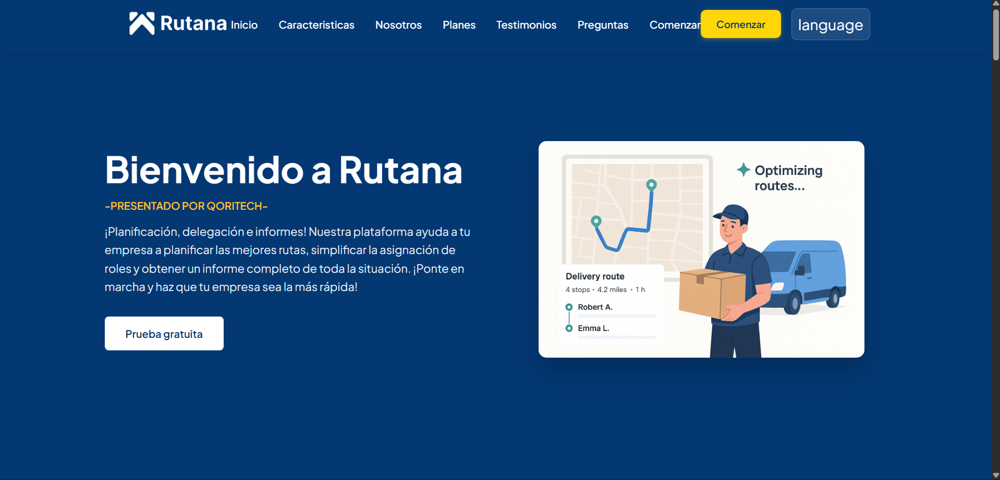

Feature:


Sobre Nosotros:
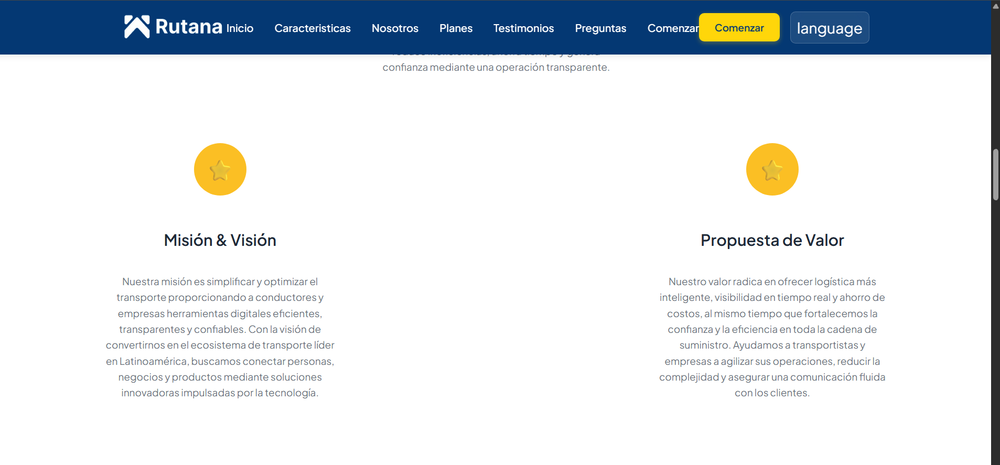

Nuestro Equipo:
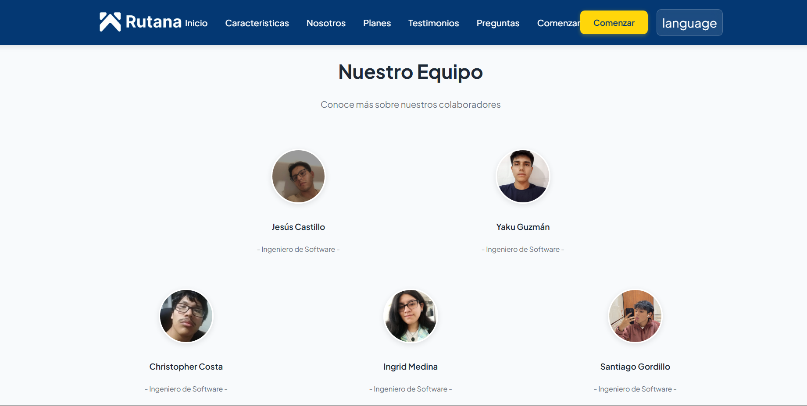

FaQ:


### 5.2.1.6. Services Documentation Evidence for Sprint Review.

Durante este sprint se completó el diseño e implementación del Landing Page del sistema, el cual forma parte del acceso inicial al sistema. Aunque no se implementaron endpoints tradicionales de tipo REST en este sprint, se documenta a continuación la URL del recurso publicado, junto con evidencia de despliegue, interacción y commits relacionados.

**Descripción del Logro:**

-Implementación del Landing Page estático.

-Deployment del landing page.

### Recursos del Sprint

| Recurso      | Acción implementada   | Método HTTP | URL / Endpoint                                           | Link de repositorio                                      |
| ------------ | --------------------- | ----------- | -------------------------------------------------------- | -------------------------------------------------------- |
| Landing Page | Visualización inicial | GET         | https://qoritech-7468.github.io/Landing-Page-Repository/ | https://github.com/QoriTech-7468/Landing-Page-Repository |

### 5.2.1.7. Software Deployment Evidence for Sprint Review.

1. **Se activó GitHub Pages** en el repositorio `Landing-Page-Repository`
   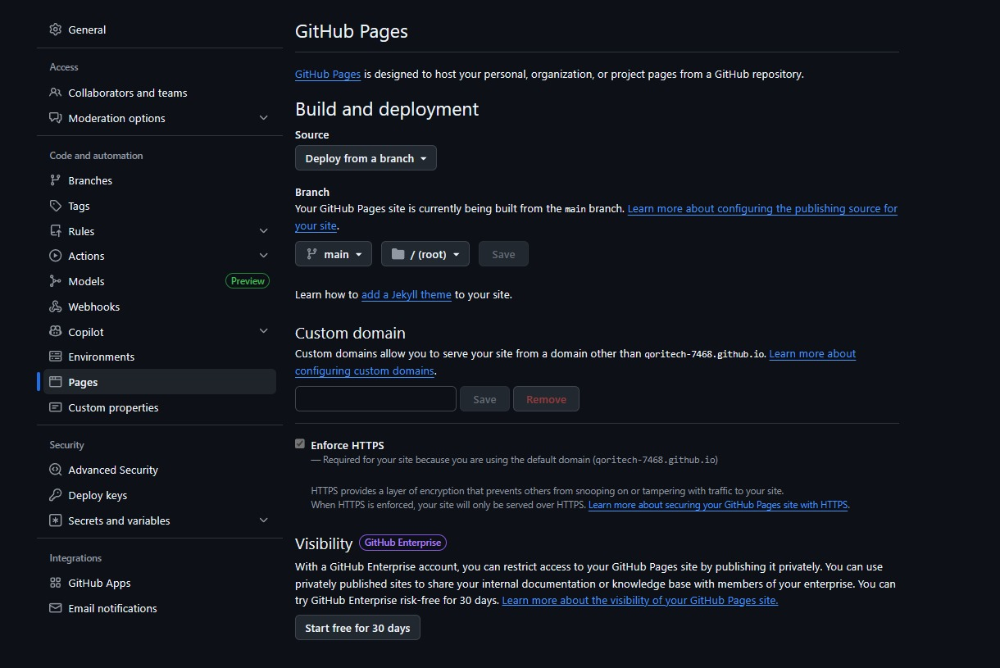
   **Se configuró la rama `main`** como fuente de publicación.
2. **Verificando en el Workflow de GitHub Actions** que el despliegue se haya realizado correctamente.
   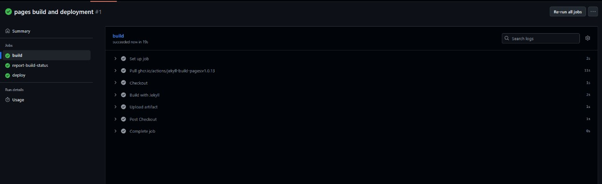
3. **Se documentó la URL pública** y se compartió con el equipo para su revisión y feedback.
   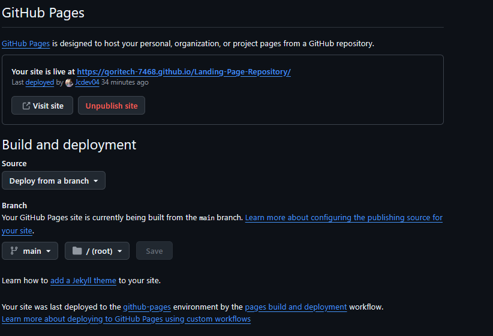

4. **Se probó la accesibilidad pública** de la Landing Page mediante la URL generada por GitHub Pages.
   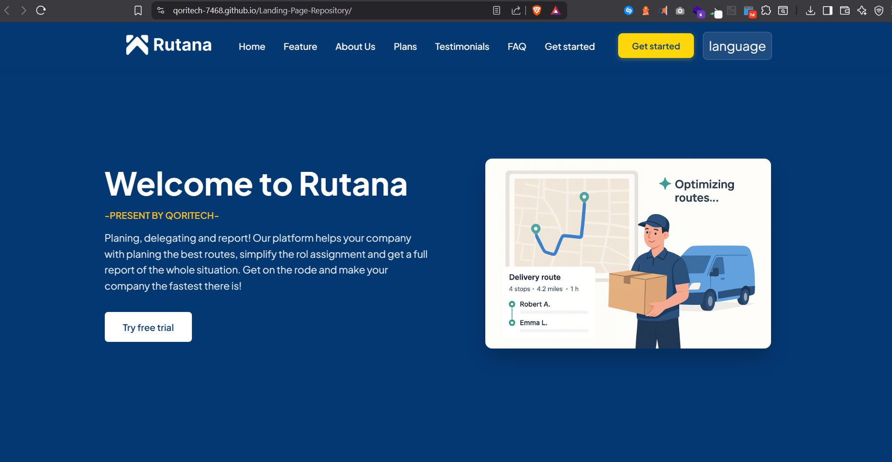

### 5.2.1.8. Team Collaboration Insights during Sprint.

Durante el Sprint 1, el equipo de Qoritec se enfocó en el desarrollo de la **Landing Page**.
Las actividades de implementación se llevaron a cabo de la siguiente manera:

- Se crearon ramas específicas para cada sección o funcionalidad (`feature/[nombre-de-seccion]`)
- Cada miembro del equipo asumió la responsabilidad de desarrollar una o más secciones de la Landing Page.
- Se realizaron commits frecuentes, registrando avances de manera continua y detallada.
- Las funcionalidades desarrolladas se integraron mediante Pull Requests hacia la rama `develop`.
- Se mantuvo una comunicación constante mediante la plataforma Discord para coordinar avances y resolver dudas en tiempo real.

Gracias a esta organización, se logró cumplir de manera efectiva el objetivo del sprint, garantizando que todos los integrantes contribuyeran de forma activa en el desarrollo de la Landing Page.

##### Evidencia de Colaboración en GitHub

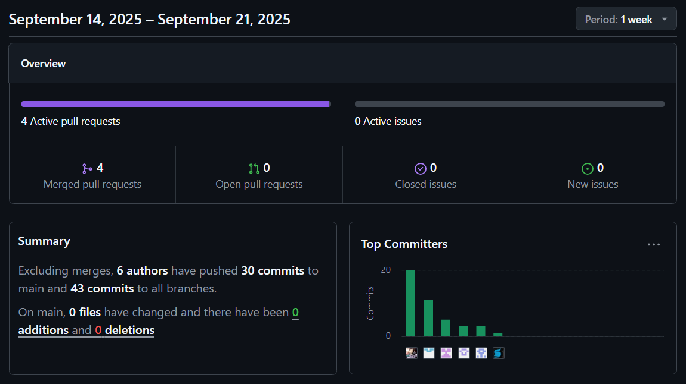

### 5.2.2. Sprint 2

#### 5.2.2.1. Sprint Planning 2.

<table>
<tr>
<th>Sprint #</th>
<th>Sprint 2</th>
</tr>
<tr>
<td colspan="2"><strong>Sprint Planning Background</strong></td>
</tr>
<tr>
<td><strong>Date</strong></td>
<td>2025-10-09</td>
</tr>
<tr>
<td><strong>Time</strong></td>
<td>19:00 PM (GMT-5)</td>
</tr>
<tr>
<td><strong>Location</strong></td>
<td>Modalidad remota mediante la plataforma Discord</td>
</tr>
<tr>
<td><strong>Prepared By</strong></td>
<td>Jesús Castillo Vidal</td>
</tr>
<tr>
<td><strong>Attendees (to planning meeting)</strong></td>
<td>Castillo Vidal, Jesús Iván / Costa Morales, Christofer William / Gordillo Ramos, Santiago Alonso / Guzmán Cabrejos, Yaku Mateo / Medina Merma, Ingrid Melani</td>
</tr>
<tr>
<td><strong>Sprint 1 Review Summary</strong></td>
<td>El Sprint 1 logró completar exitosamente la landing page de Rutana con un diseño atractivo y funcional. Se implementaron todas las secciones planificadas incluyendo hero, features, testimonials, FAQ y footer. Además de sentar las bases con respecto al diseño de la aplicación frontend de este sprint. La página fue desplegada en GitHub Pages y validada con usuarios potenciales. Sin embargo, se identificaron oportunidades de mejora en la organización del equipo y seguimiento del statement de trabajo.</td>
</tr>
<tr>
<td><strong>Sprint 1 Retrospective Summary</strong></td>
<td>El trabajo en equipo no fue tan eficaz como se esperaba debido a que, al ser un equipo nuevo, el líder no conocía completamente las fortalezas y debilidades de cada miembro. Esto resultó en asignaciones de tareas que no aprovecharon al máximo las capacidades individuales. Además, no se siguió estrictamente el statement de trabajo, especialmente en la fase de ejecución, donde se desviaron algunos aspectos del plan original. Sin embargo, también se identificaron aspectos positivos: el equipo logró comprender profundamente el problema del usuario y sus necesidades reales, lo cual fue crucial para proponer funcionalidades apropiadas y desarrollar un entendimiento sólido del lenguaje ubicuo del dominio. Para Sprint 2, se implementará una mejor comunicación, evaluación de habilidades del equipo y seguimiento más estricto del plan de trabajo.</td>
</tr>
<tr>
<td colspan="2"><strong>Sprint Goal & User Stories</strong></td>

</tr>
<tr>
<td><strong>Sprint 2 Goal</strong></td>
<td><strong>Nuestro propósito es</strong> implementar el frontend parcial de la aplicación Rutana utilizando Vue.js y PrimeVue, desarrollando los bounded contexts core (Fleet and Resource Management, Customer & Location Management, Route Planning & Execution, e Identity and Access Management) con una Fake API para simular funcionalidades backend. <strong>Creemos que esto aportará</strong> una aplicación web funcional que valide la experiencia de usuario y demuestre las capacidades del sistema. <strong>Esto se confirmará cuando</strong> los usuarios puedan interactuar con una aplicación operativa que simule el comportamiento real del sistema de gestión de rutas.</td>
</tr>
<tr>
<td><strong>Sprint 2 Velocity</strong></td>
<td>25 puntos</td>
</tr>
<tr>
<td><strong>Sum of Story Points</strong></td>
<td>25 puntos</td>
</tr>
</table>

#### 5.2.2.2. Aspect Leaders and Collaborators.

En esta sección se presenta la **Leadership-and-Collaboration Matrix (LACX)** correspondiente al Sprint 2. Cada aspecto se relaciona con los bounded contexts y responsabilidades clave del sprint, asignando un **líder (L)** responsable principal y **colaboradores (C)** que apoyan en su ejecución.

<table>
<tr>
<th>Team Member (Last Name, First Name)</th>
<th>GitHub Username</th>
<th>Identity & Access Management (L/C)</th>
<th>Fleet & Resource Management (L/C)</th>
<th>Shared Setup Inicial (L/C)</th>
<th>Route Planning & Execution (L/C)</th>
<th>Documentación Trello & i18n (L/C)</th>
<th>Design Level Event Storming (L/C)</th>
<th>Update Documentos & UI/UX (L/C)</th>
</tr>
<tr>
<td>Castillo Vidal, Jesús Iván</td>
<td>Jcdev04</td>
<td>C</td>
<td>C</td>
<td>C</td>
<td>C</td>
<td>C</td>
<td>L</td>
<td>L</td>
</tr>
<tr>
<td>Costa Morales, Christofer William</td>
<td>miniChorri</td>
<td>C</td>
<td>L</td>
<td>L</td>
<td>C</td>
<td>C</td>
<td>C</td>
<td>C</td>
</tr>
<tr>
<td>Gordillo Ramos, Santiago Alonso</td>
<td>SantiIHC</td>
<td>L</td>
<td>L</td>
<td>C</td>
<td>C</td>
<td>C</td>
<td>C</td>
<td>C</td>
</tr>
<tr>
<td>Guzmán Cabrejos, Yaku Mateo</td>
<td>yak-cod</td>
<td>C</td>
<td>C</td>
<td>C</td>
<td>L</td>
<td>C</td>
<td>C</td>
<td>C</td>
</tr>
<tr>
<td>Medina Merma, Ingrid Melani</td>
<td>Grini913</td>
<td>C</td>
<td>C</td>
<td>C</td>
<td>C</td>
<td>L</td>
<td>C</td>
<td>C</td>
</tr>
</table>

**Notas:**

- Cada integrante asumió liderazgo en aspectos específicos relacionados con los bounded contexts core del sistema.
- Santiago lideró tanto Identity & Access Management como Fleet & Resource Management debido a su experiencia técnica.
- Christofer se encargó del setup inicial compartido y Fleet & Resource Management para asegurar consistencia en la configuración base.
- Yaku lideró Route Planning & Execution, enfocándose en la lógica de negocio más compleja del sistema.
- Ingrid gestionó la documentación en Trello y la implementación de internacionalización (i18n).
- Jesús coordinó el Design Level Event Storming y las mejoras generales de UI/UX del producto.

#### 5.2.2.3. Sprint Backlog 2.

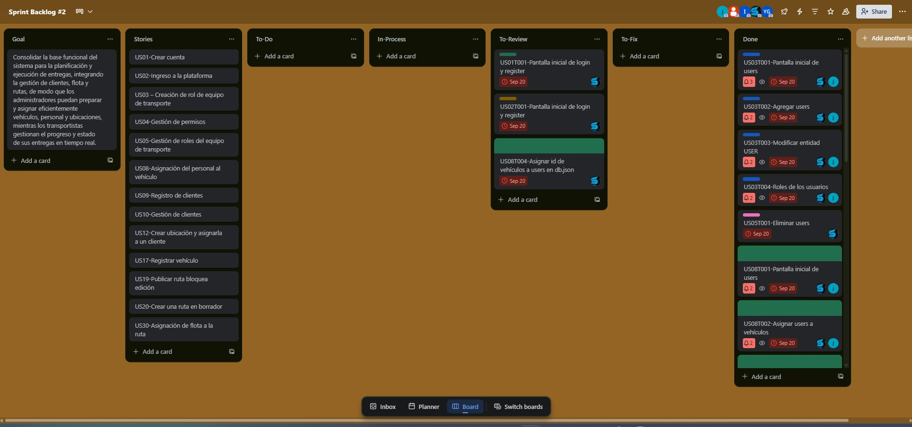
<br>
<a href="https://trello.com/b/wku0a52u/sprint-backlog-2" target="_blank">
  <span>Tablero Sprint 2 en Trello</span>
</a>

A continuación, se presenta el Sprint Backlog correspondiente al **Sprint 2**, en el cual se incluyen las User Stories seleccionadas y su descomposición en tasks. Cada ítem contiene su respectiva descripción, estimación en horas, asignación y estado actual.

| Sprint # | User Story Id | User Story Title                         | Work-Item / Task Id | Task Title                                           | Description                                                                 | Estimation (Hours) | Assigned To         | Status    |
| -------- | ------------- | ---------------------------------------- | ------------------- | ---------------------------------------------------- | --------------------------------------------------------------------------- | ------------------ | ------------------- | --------- |
| 2        | US01          | Pantalla inicial de login y register     | US01T001            | Pantalla inicial de login y register                 | Diseñar e implementar la interfaz de login y registro.                      | 1                  | Santiago            | To-Review |
| 2        | US02          | Pantalla inicial de login y register     | US02T001            | Pantalla inicial de login y register                 | Configurar la autenticación básica para login y registro.                   | 1                  | Santiago            | To-Review |
| 2        | US03          | Gestión de usuarios                      | US03T001            | Pantalla inicial de users                            | Implementar vista principal de gestión de usuarios.                         | 1                  | Santiago y Jesús    | Done      |
| 2        |               |                                          | US03T002            | Agregar users                                        | Crear funcionalidad para registrar nuevos usuarios.                         | 1                  | Santiago y Jesús    | Done      |
| 2        |               |                                          | US03T003            | Modificar entidad USER                               | Actualizar estructura de la entidad USER en el backend y frontend.          | 1                  | Santiago y Jesús    | Done      |
| 2        |               |                                          | US03T004            | Roles de los usuarios                                | Asignar roles y permisos según tipo de usuario.                             | 1                  | Santiago y Jesús    | Done      |
| 2        | US04          | Roles y permisos                         | US04T001            | Gestionar permisos de usuario                        | Implementar la asignación y edición de permisos a usuarios.                 | 1                  | Santiago            | Done      |
| 2        | US05          | Eliminación de usuarios                  | US05T001            | Eliminar users                                       | Implementar funcionalidad para eliminar usuarios registrados.               | 1                  | Santiago            | Done      |
| 2        | US08          | Asignación de personal al vehículo       | US08T001            | Pantalla inicial de users                            | Crear vista para asignación de personal a vehículos.                        | 1                  | Santiago y Jesús    | Done      |
| 2        |               |                                          | US08T002            | Asignar users a vehículos                            | Desarrollar funcionalidad para asignar usuarios a vehículos específicos.    | 1                  | Santiago y Jesús    | Done      |
| 2        |               |                                          | US08T003            | Eliminar users de vehículos                          | Implementar función para quitar usuarios asignados a vehículos.             | 1                  | Santiago y Jesús    | Done      |
| 2        |               |                                          | US08T004            | Asignar id de vehículos a users en db.json           | Actualizar base de datos local con IDs de vehículos asignados.              | 1                  | Santiago            | To-Review |
| 2        | US09          | Registro de clientes                     | US09T001            | Pantalla inicial de clients                          | Crear vista principal para el registro de clientes.                         | 1                  | Christofer e Ingrid | Done      |
| 2        |               |                                          | US09T002            | Crear clientes en base al nombre                     | Desarrollar formulario para registrar clientes con nombre y datos básicos.  | 1                  | Christofer e Ingrid | Done      |
| 2        | US10          | Gestión de clientes                      | US10T001            | Listar y filtrar clientes                            | Implementar funcionalidad para visualizar y filtrar clientes existentes.    | 1                  | Christofer e Ingrid | Done      |
| 2        |               |                                          | US10T002            | Editar información del cliente                       | Permitir modificar datos de contacto y estado del cliente.                  | 1                  | Christofer e Ingrid | Done      |
| 2        | US12          | Crear ubicación y asignarla a un cliente | US12T001            | Funcionalidad “agregar locación”                     | Desarrollar funcionalidad para registrar nuevas ubicaciones.                | 1                  | Christofer          | Done      |
| 2        |               |                                          | US12T002            | Agregar location a client                            | Permitir asignar la nueva ubicación a un cliente existente.                 | 1                  | Christofer          | Done      |
| 2        | US17          | Registrar vehículo                       | US17T001            | Pantalla inicial de vehicles                         | Crear vista principal de gestión de vehículos.                              | 1                  | Christofer e Ingrid | Done      |
| 2        |               |                                          | US17T002            | Botón de registrar vehículos                         | Implementar botón y lógica de registro de nuevos vehículos.                 | 1                  | Christofer          | Done      |
| 2        | US19          | Publicar ruta bloquea edición            | US19T001            | Cambiar estado de la ruta a Published                | Desarrollar acción para cambiar estado de ruta a “Publicado”.               | 1                  | Christofer          | Done      |
| 2        |               |                                          | US19T002            | Modo solo lectura de datos relacionados a route      | Habilitar modo de solo lectura al publicar una ruta.                        | 1                  | Christofer          | Done      |
| 2        | US20          | Crear una ruta en borrador               | US20T001            | Creación de ruta inicial y en borrador               | Implementar opción para guardar rutas como “borrador” antes de publicarlas. | 1                  | Christofer          | Done      |
| 2        | US30          | Asignación de flota a la ruta            | US30T001            | Diseñar interfaz para selección de vehículo por ruta | Crear interfaz visual para elegir vehículos por ruta.                       | 1                  | Yaku                | Done      |
| 2        |               |                                          | US30T002            | Eliminar vehículos                                   | Implementar opción para remover vehículos asignados a rutas.                | 1                  | Yaku                | Done      |
| 2        |               |                                          | US30T003            | Seleccionar una flota para asignarla a la ruta       | Implementar lógica para asociar flotas específicas a rutas.                 | 1                  | Christofer          | Done      |

#### 5.2.2.4. Development Evidence for Sprint Review.

| Repository              | Branch | Commit Id | Commit Message                                                                                     | Commit Message Body | Commited on (Date) |
| ----------------------- | ------ | --------- | -------------------------------------------------------------------------------------------------- | ------------------- | ------------------ |
| FrontEnd-WebApplication | main   | ffb29e2   | fix(Users.vue): case sensitive was done                                                            | 10/10/2025          |                    |
| FrontEnd-WebApplication | main   | 9a713e0   | fix(yml): Added npm ci to github actions' workflow                                                 | 10/10/2025          |                    |
| FrontEnd-WebApplication | main   | bd1cc6c   | feat(firebase): Firebase Hosting now connected to main branch to autodeploy                        | 10/10/2025          |                    |
| FrontEnd-WebApplication | main   | 8884819   | fix: changin rutana_api_url for production                                                         | 10/10/2025          |                    |
| FrontEnd-WebApplication | main   | 7f099fc   | fix: updated the clients-sidebar.vue                                                               | 10/10/2025          |                    |
| FrontEnd-WebApplication | main   | ec987fd   | feat: added the clients and location js and views                                                  | 10/10/2025          |                    |
| FrontEnd-WebApplication | main   | 8e88c10   | feat: added add-team-member.vue                                                                    | 10/10/2025          |                    |
| FrontEnd-WebApplication | main   | 17db4a0   | feat: update users.vue and entity                                                                  | 10/10/2025          |                    |
| FrontEnd-WebApplication | main   | 14263c5   | feat: update db.json and vehicles                                                                  | 10/10/2025          |                    |
| FrontEnd-WebApplication | main   | 59257d6   | feat(i18n): add internationalization support to Users and Vehicles modules                         | 10/10/2025          |                    |
| FrontEnd-WebApplication | main   | 6925ec9   | feat(route-planning-execution): add i18n files                                                     | 09/10/2025          |                    |
| FrontEnd-WebApplication | main   | 2648b6e   | feat(route-planning-execution): improve style and implement i18n                                   | 09/10/2025          |                    |
| FrontEnd-WebApplication | main   | dafe774   | feat(i18n): add internationalization support to Clients and Users modules                          | 09/10/2025          |                    |
| FrontEnd-WebApplication | main   | 21bfac8   | feat(route-planning-execution): fix vehicle response handling and add team member mapping          | 09/10/2025          |                    |
| FrontEnd-WebApplication | main   | 3eeb1ea   | feat(route-planning-execution): fix vehicle response handling and add team member mapping          | 09/10/2025          |                    |
| FrontEnd-WebApplication | main   | 26546d7   | feat(route-planning-execution): fix vehicle response handling and add team member mapping          | 09/10/2025          |                    |
| FrontEnd-WebApplication | main   | 899a7ec   | feat(route-planning-execution): add assembler classes for deliveries, locations, and routes        | 09/10/2025          |                    |
| FrontEnd-WebApplication | main   | bd532cd   | feat(env): add routes and locations endpoints to development and production environments           | 09/10/2025          |                    |
| FrontEnd-WebApplication | main   | a599dad   | feat: updated db.json and Users                                                                    | 09/10/2025          |                    |
| FrontEnd-WebApplication | main   | 65a5868   | feat: added the user js and added the functions                                                    | 09/10/2025          |                    |
| FrontEnd-WebApplication | main   | 05459aa   | feat(db.json): Adding Fake JSON data                                                               | 09/10/2025          |                    |
| FrontEnd-WebApplication | main   | bf9d5dd   | feat: added the vehicles js to post and the db json                                                | 09/10/2025          |                    |
| FrontEnd-WebApplication | main   | f86ea68   | fix(interactive-map): Implementation for interactive map and using 100% height                     | 08/10/2025          |                    |
| FrontEnd-WebApplication | main   | 3791794   | feat(teams-card, location-details): Added the property isReadOnly                                  | 08/10/2025          |                    |
| FrontEnd-WebApplication | main   | 93af1c5   | fix(teams-card, teams-tab): Styling improved and layout                                            | 08/10/2025          |                    |
| FrontEnd-WebApplication | main   | 1646340   | feat: Interactive Editing routes for locations                                                     | 08/10/2025          |                    |
| FrontEnd-WebApplication | main   | 069697e   | fix(location-details): better layout organization and styling improvement                          | 08/10/2025          |                    |
| FrontEnd-WebApplication | main   | c1b6691   | fix(selected-locations-list): Styling and replacing for a mockup                                   | 08/10/2025          |                    |
| FrontEnd-WebApplication | main   | 5a104a6   | fix(draf-layout): Improvement for layout to organice better the content                            | 08/10/2025          |                    |
| FrontEnd-WebApplication | main   | 710f4e7   | fix(routes): Styling improvement for cards, fonts, etc.                                            | 08/10/2025          |                    |
| FrontEnd-WebApplication | main   | 399626d   | fix(clients,users,vehicles): Styling improvement for header and buttons normalization              | 08/10/2025          |                    |
| FrontEnd-WebApplication | main   | b48c27a   | fix: routes into management and adding a layout container                                          | 08/10/2025          |                    |
| FrontEnd-WebApplication | main   | 464f981   | feat(route-planning-execution): implement toast notifications and enhance route actions            | 08/10/2025          |                    |
| FrontEnd-WebApplication | main   | f04a9f6   | feat(route-planning-execution): add route monitoring view and enhance route navigation             | 08/10/2025          |                    |
| FrontEnd-WebApplication | main   | 9f65ca4   | feat(route-planning-execution): implement interactive map and location and team details components | 08/10/2025          |                    |
| FrontEnd-WebApplication | main   | 70e7705   | feat(route-planning-execution): implement interactive map and location and team details components | 08/10/2025          |                    |
| FrontEnd-WebApplication | main   | d3ebfd1   | feat(route-planning-execution): add routes management with lazy-loaded components                  | 08/10/2025          |                    |
| FrontEnd-WebApplication | main   | c67efed   | feat(route-planning-execution): integrate i18n support and add Toast and Confirmation services     | 08/10/2025          |                    |
| FrontEnd-WebApplication | main   | ee5ed3d   | feat(roue-planning-execution): add internationalization support with English and Spanish locales   | 08/10/2025          |                    |
| FrontEnd-WebApplication | main   | cd75e3a   | feat: added the routing js to navigate the views                                                   | 08/10/2025          |                    |
| FrontEnd-WebApplication | main   | 1d511fd   | feat: added router js and locales en and es json                                                   | 08/10/2025          |                    |
| FrontEnd-WebApplication | main   | b5a2ab7   | feat: updated the clients.vue to add the nav bar                                                   | 08/10/2025          |                    |
| FrontEnd-WebApplication | main   | b2fb465   | feat: added the vehicle main view in presentation                                                  | 08/10/2025          |                    |
| FrontEnd-WebApplication | main   | 80d0eef   | feat: added the sidebar for the vehicles view                                                      | 08/10/2025          |                    |
| FrontEnd-WebApplication | main   | b8c82f2   | feat: added the vehicle details panel                                                              | 08/10/2025          |                    |
| FrontEnd-WebApplication | main   | 5527180   | feat: added the dialog add-vehicle.vue                                                             | 08/10/2025          |                    |
| FrontEnd-WebApplication | main   | 4c3bfe2   | feat: added the directories and db and routes json                                                 | 07/10/2025          |                    |
| FrontEnd-WebApplication | main   | 1bc44b8   | feat: added the clients sidebar and main view                                                      | 07/10/2025          |                    |
| FrontEnd-WebApplication | main   | 377f776   | feat: added the add-location and location panel views                                              | 07/10/2025          |                    |
| FrontEnd-WebApplication | main   | 049bf10   | feat: added the addclient dialog and update main.js                                                | 07/10/2025          |                    |
| FrontEnd-WebApplication | main   | 86d2c8c   | feat: added Subscription.vue and App.vue                                                           | 04/10/2025          |                    |
| FrontEnd-WebApplication | main   | e60ed25   | feat: added Subscription.vue and App.vue                                                           | 04/10/2025          |                    |
| FrontEnd-WebApplication | main   | 1c5c1a9   | feat: added Rutana Logo                                                                            | 04/10/2025          |                    |
| FrontEnd-WebApplication | main   | 69b1f1a   | feat: added Users.vue and Navbar.vue                                                               | 04/10/2025          |                    |
| FrontEnd-WebApplication | main   | e49f2ed   | feat: added code Infrastructure and LoginRegister.vue                                              | 04/10/2025          |                    |
| FrontEnd-WebApplication | main   | fa956a2   | feat: added initial configurations for primevue theme                                              | 04/10/2025          |                    |

#### 5.2.2.5. Execution Evidence for Sprint Review.

Durante el Sprint 2 se ejecutaron exitosamente las funcionalidades principales de los bounded contexts implementados, validando la operatividad del sistema en un entorno de producción.

**Evidencias de Ejecución:**

1. **Aplicación Funcional**: Frontend completamente operativo con todas las funcionalidades core implementadas
2. **Testing en Producción**: Pruebas realizadas en entorno Firebase similar a producción
3. **Validación de UX**: Experiencia de usuario validada con componentes PrimeVue
4. **Performance**: Evaluación de rendimiento en entorno de producción
5. **Cross-browser Testing**: Compatibilidad verificada en diferentes navegadores

**Evidencias Visuales de Ejecución:**

<div style="text-align: left;">
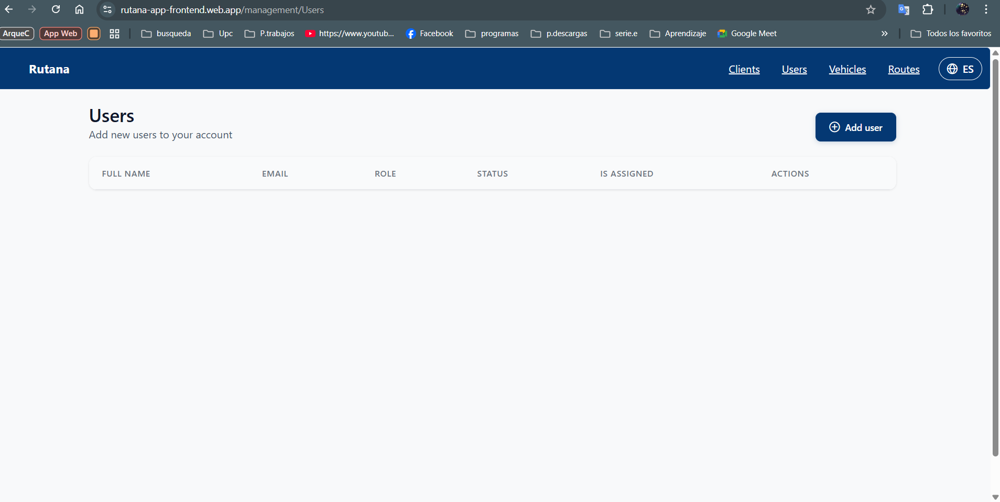
<p><em>Módulo de gestión de usuarios - Identity & Access Management</em></p>
</div>

<div style="text-align: left;">
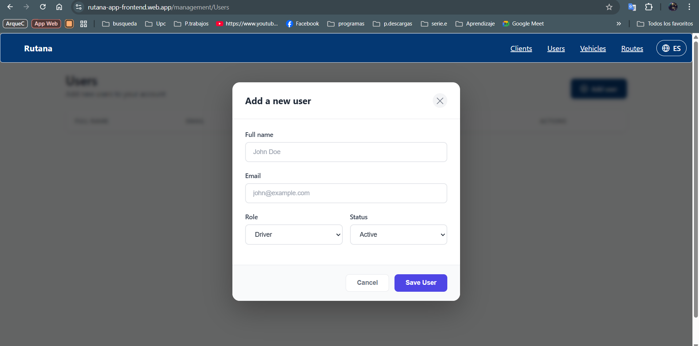
<p><em>Funcionalidad de creación de nuevos usuarios</em></p>
</div>

<div style="text-align: left;">
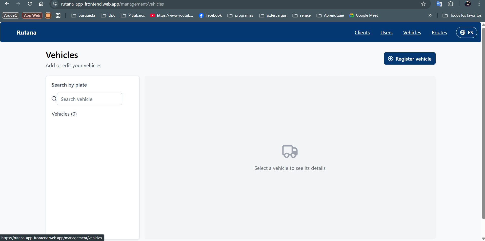
<p><em>Módulo de gestión de vehículos - Fleet & Resource Management</em></p>
</div>

<div style="text-align: left;">
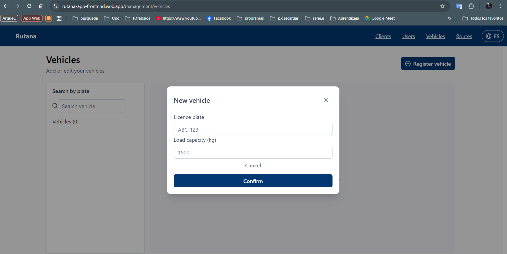
<p><em>Funcionalidad de registro de nuevos vehículos</em></p>
</div>

<div style="text-align: left;">
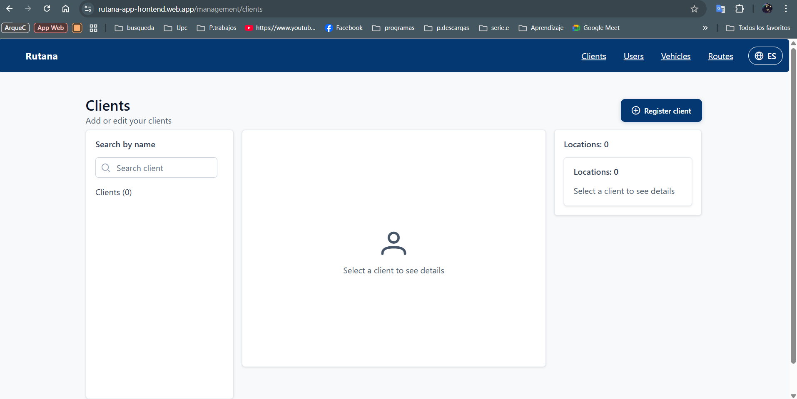
<p><em>Módulo de gestión de clientes - Customer & Location Management</em></p>
</div>

<div style="text-align: left;">
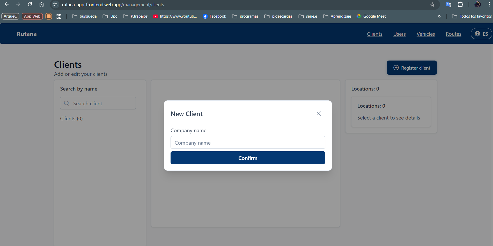
<p><em>Funcionalidad de creación de nuevos clientes</em></p>
</div>

<div style="text-align: left;">
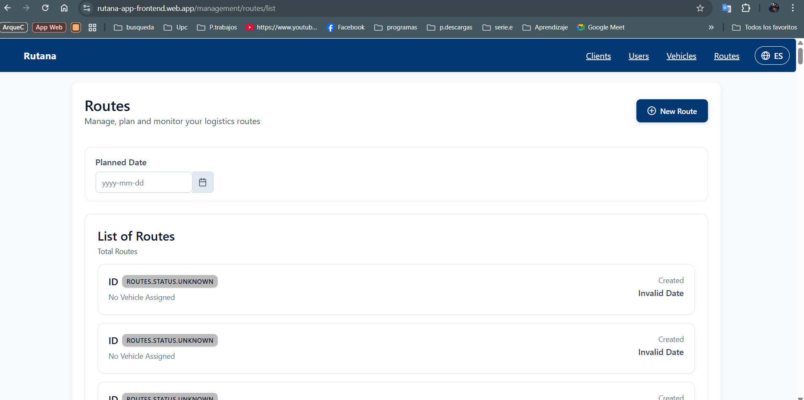
<p><em>Módulo de gestión de rutas - Route Planning & Execution</em></p>
</div>

<div style="text-align: left;">
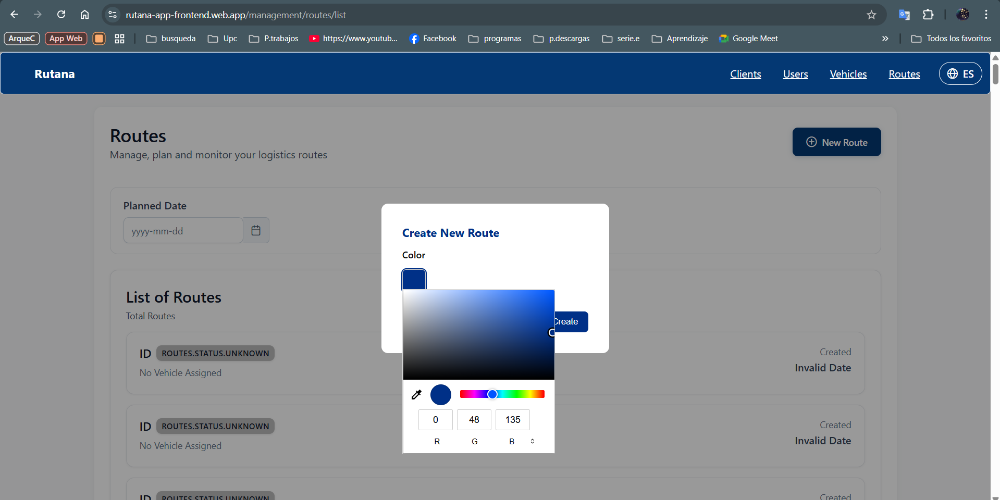
<p><em>Funcionalidad de creación de nuevas rutas</em></p>
</div>

<div style="text-align: left;">
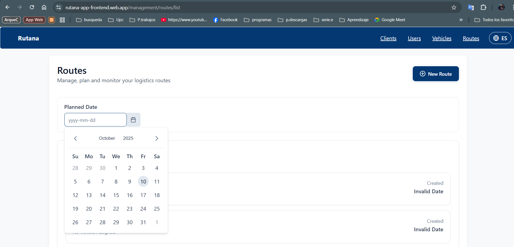
<p><em>Funcionalidad de planificación de rutas con fechas</em></p>
</div>

#### 5.2.2.6. Services Documentation Evidence for Sprint Review.

Durante este sprint se completó la implementación del frontend de la aplicación Rutana utilizando Vue.js y PrimeVue, con despliegue exitoso en Firebase Hosting. Aunque no se completaron todas las funcionalidades planificadas, se logró implementar los bounded contexts core y desplegar una aplicación funcional.

**Descripción del Logro:**

- Implementación del frontend con Vue.js y PrimeVue components
- Desarrollo de los bounded contexts principales (IAM, Fleet & Resource Management, Customer & Location Management, Route Planning & Execution)
- Implementación de Fake API con JSON Server
- Configuración de internacionalización con Vue i18n
- Deployment exitoso en Firebase Hosting

Recursos del Sprint

<table>
<tr>
<th>Recurso</th>
<th>Acción implementada</th>
<th>Método HTTP</th>
<th>URL / Endpoint</th>
<th>Link de repositorio</th>
</tr>
<tr>
<td>Frontend Application</td>
<td>Aplicación web completa</td>
<td>GET</td>
<td>https://rutana-app-frontend.web.app/management/routes/list</td>
<td>https://github.com/QoriTech-7468/FrontEnd-WebApplication/</td>
</tr>
<tr>
</table>

**Documentación de Servicios:**

1. **API Documentation**: Documentación de la Fake API implementada con JSON Server
2. **Component Documentation**: Documentación de componentes Vue.js desarrollados con PrimeVue
3. **Deployment Guide**: Guía de despliegue en Firebase Hosting con configuración de producción
4. **Architecture Updates**: Documentación de mejoras arquitectónicas aplicadas con Domain Driven Design
5. **Repository Documentation**: Documentación completa del código fuente en GitHub con 73 commits

#### 5.2.2.7. Software Deployment Evidence for Sprint Review.

Durante el Sprint 2 se logró el despliegue exitoso de la aplicación frontend de Rutana en Firebase Hosting, implementando los bounded contexts principales y validando la funcionalidad en un entorno de producción.

**Evidencias de Despliegue:**

1. **Firebase Hosting**: Aplicación desplegada exitosamente en Firebase con configuración de producción
2. **SSL Certificate**: Certificado SSL automático de Firebase habilitado para conexiones seguras
3. **CDN**: Distribución global mediante CDN de Firebase para optimización de rendimiento
4. **Environment Configuration**: Configuración de variables de entorno para producción y desarrollo
5. **Build Process**: Proceso de build automatizado con Vite y Vue.js optimizado para producción

**URLs de Despliegue:**

- **Producción Principal**: https://rutana-app-frontend.web.app
- **Repositorio GitHub**: https://github.com/QoriTech-7468/FrontEnd-WebApplication/

**Evidencias Visuales del Despliegue:**

<div style="text-align:start;">
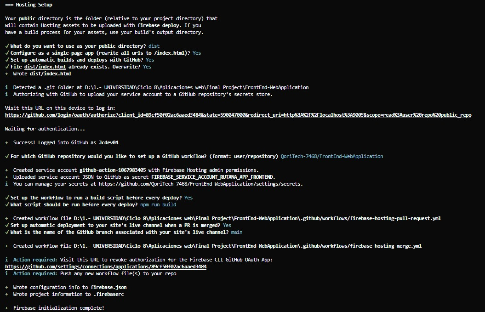
<p><em>Configuración de despliegue en Firebase Hosting con firebase CLI</em></p>
</div>

<div style="text-align:start;">
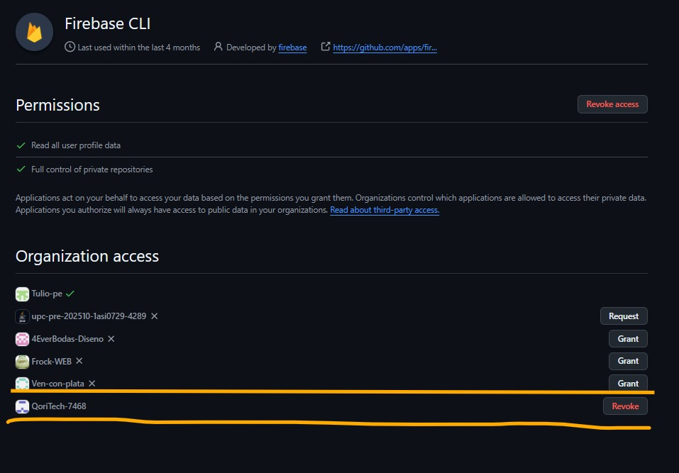
<p><em>Dar acceso para que firebase accede a la organización</em></p>
</div>

<div style="text-align:start;">
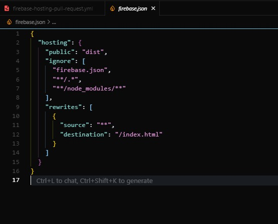
<p><em>Configurar firebase config y revisar que apunte correctamente al archivo index.html</em></p>
</div>

<div style="text-align:start;">
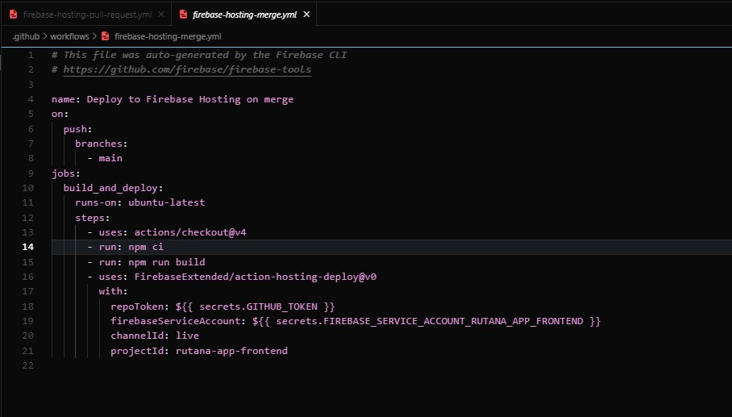
<p><em>Proceso de build automatizado con github actions</em></p>
</div>

<div style="text-align:start;">
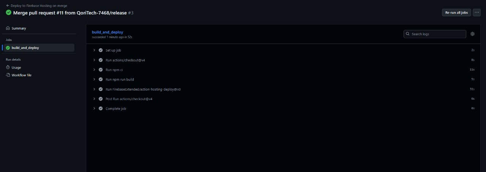
<p><em>Verificación del workflow del githubactions</em></p>
</div>

#### 5.2.2.8. Team Collaboration Insights during Sprint.

**Insights de Colaboración del Equipo:**

Durante el Sprint 2, el equipo demostró una colaboración efectiva enfocada en la implementación práctica de los conceptos definidos en el sprint anterior. La división clara de responsabilidades por bounded contexts permitió un desarrollo paralelo eficiente, mientras que las revisiones cruzadas aseguraron la consistencia en la implementación.

**Logros Destacados:**

- Implementación exitosa de los cuatro bounded contexts principales
- Desarrollo ágil con PrimeVue components
- Validación temprana mediante Fake API
- Despliegue exitoso en Firebase Hosting
- Mejora continua de la arquitectura con principios DDD

**Lecciones Aprendidas:**

- La Fake API facilitó la iteración rápida y validación de UX
- PrimeVue proporcionó componentes robustos y consistentes
- Firebase Hosting simplificó significativamente el proceso de despliegue
- La internacionalización mejoró la accesibilidad del sistema

##### Evidencia de Colaboración en GitHub

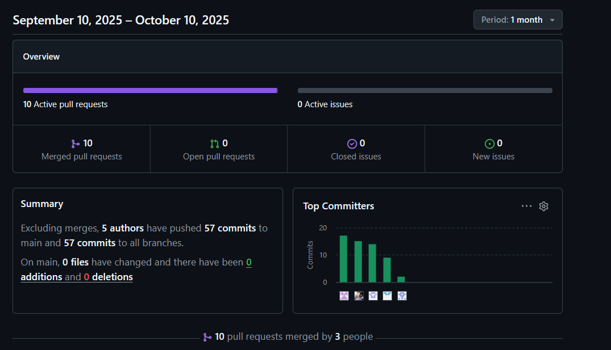

### 5.2.3. Sprint 3

#### 5.2.3.1. Sprint Planning 3.

<table>
<tr>
<th>Sprint #</th>
<th>Sprint 3</th>
</tr>
<tr>
<td colspan="2"><strong>Sprint Planning Background</strong></td>

</tr>
<tr>
<td><strong>Date</strong></td>
<td>2025-10-20</td>
</tr>
<tr>
<td><strong>Time</strong></td>
<td>12:18 PM (GMT-5)</td>
</tr>
<tr>
<td><strong>Location</strong></td>
<td>Modalidad remota mediante la plataforma Discord</td>
</tr>
<tr>
<td><strong>Prepared By</strong></td>
<td>Jesús Castillo Vidal</td>
</tr>
<tr>
<td><strong>Attendees (to planning meeting)</strong></td>
<td>Castillo Vidal, Jesús Iván / Costa Morales, Christofer William / Gordillo Ramos, Santiago Alonso / Guzmán Cabrejos, Yaku Mateo / Medina Merma, Ingrid Melani</td>
</tr>
<tr>
<td><strong>Sprint 2 Review Summary</strong></td>
<td>Durante el Sprint 2 se logró implementar parcialmente el frontend de la aplicación Rutana utilizando Vue.js y PrimeVue, desarrollando los bounded contexts principales: Fleet and Resource Management, Customer & Location Management, Route Planning & Execution e Identity and Access Management. Se integró una Fake API para simular el comportamiento del backend, permitiendo validar la experiencia de usuario y la usabilidad general del sistema. Sin embargo, la implementación no se completó totalmente debido a dificultades técnicas en la configuración y despliegue del archivo <code>db.json</code> en Beeceptor, así como la complejidad de simular relaciones tipo join entre entidades. A nivel de UX/UI se respetó el diseño planteado en el producto, logrando una interfaz coherente y funcional. Este sprint permitió consolidar la base del sistema y fortalecer el entendimiento del equipo sobre la arquitectura frontend aplicada.</td>
</tr>
<tr>
<td><strong>Sprint 2 Retrospective Summary</strong></td>
<td>El equipo enfrentó varios retos durante el Sprint 2, especialmente relacionados con la integración del código y el trabajo colaborativo. Se presentaron conflictos de merge al unificar los avances individuales, lo que afectó el ritmo de desarrollo. Además, persistió parte de la deuda técnica del sprint anterior, especialmente en la comprensión de la arquitectura y simulación del backend. A pesar de ello, el equipo mostró una mejora significativa en comunicación, coordinación y dominio de las herramientas. Se destaca el cumplimiento del diseño de producto y la capacidad de resolver problemas técnicos de manera colaborativa. Para el siguiente sprint se priorizará la reducción de deuda técnica y la implementación completa de las funcionalidades restantes.</td>
</tr>
<tr>
<td colspan="2"><strong>Sprint Goal & User Stories</strong></td>
</tr>
<tr>
<td><strong>Sprint 3 Goal</strong></td>
<td><strong>Nuestro propósito está</strong> en ofrecer una aplicación utilizable de punta a punta para administradores y transportistas: implementar la gestión de suscripciones, desarrollar las vistas de Dispatchers, completar las operaciones de edición y eliminación pendientes en datos maestros. Además, dejaremos operativo y documentado los endpoints críticos y de core business de los bounded contexts de Subscriptions, Fleet, Planning y CRM. Realizaremos el deployment de esta versión del backend y estará disponible para pruebas. Por otro lado, actualizaremos la landing page con las correcciones de términos y condiciones, video-about-the-team y video-about-the-product. <strong>Creemos que esto aportará</strong> a administradores mayor control operativo (gestión completa de suscripciones, flotas y usuarios con datos maestros actualizados), a transportistas una experiencia fluida para gestionar sus rutas y visualizar información en el mapa, y al negocio una reducción de retrabajos y tiempo de puesta en marcha al contar con endpoints críticos estables y documentados, además de una landing page actualizada que refleje correctamente los términos del servicio. <strong>Esto se confirmará cuando: </strong>Cualquier usuario pueda registrarse, iniciar y cerrar sesión con manejo de errores y persistencia de sesión en la UI. El administrador pueda gestionar suscripciones, listar, editar y eliminar registros de Flotas y Usuarios (con roles) con validaciones y confirmaciones visibles. Los Dispatchers tengan acceso completo a las vistas de Fleet, Planning y CRM con funcionalidades operativas. El backend esté desplegado y disponible para pruebas, con los endpoints críticos y de core business operativos y documentados (Swagger) para los bounded contexts de Subscriptions, Fleet, Planning y CRM. La landing page esté actualizada con términos y condiciones corregidos, video-about-the-team y video-about-the-product implementados.</td>
</tr>
<tr>
<td><strong>Sprint 3 Velocity</strong></td>
<td>30</td>
</tr>
<tr>
<td><strong>Sum of Story Points</strong></td>
<td>30</td>
</tr>
</table>

#### 5.2.3.2. Aspect Leaders and Collaborators.

En esta sección se presenta la **Leadership-and-Collaboration Matrix (LACX)** correspondiente al Sprint 3. Cada aspecto se relaciona con los bounded contexts, funcionalidades frontend/backend y responsabilidades clave del sprint, asignando un **líder (L)** responsable principal y **colaboradores (C)** que apoyan en su ejecución.

<table>
<tr>
<th>Team Member (Last Name, First Name)</th>
<th>GitHub Username</th>
<th>Subscriptions (BC Backend) (L/C)</th>
<th>Fleet, Planning & CRM (BC Backend) (L/C)</th>
<th>Auth & Subscriptions (Frontend) (L/C)</th>
<th>Dispatchers Views (Frontend) (L/C)</th>
<th>Frontend Corrections & Google API (L/C)</th>
<th>Backend Architecture & Technical Stories (L/C)</th>
<th>Backend Deployment (L/C)</th>
<th>Landing Page Updates (L/C)</th>
<th>Media & Documentation (L/C)</th>
</tr>
<tr>
<td>Castillo Vidal, Jesús Iván</td>
<td>Jcdev04</td>
<td>L</td>
<td>C</td>
<td>C</td>
<td>C</td>
<td>C</td>
<td>L</td>
<td>L</td>
<td>C</td>
<td>C</td>
</tr>
<tr>
<td>Costa Morales, Christofer William</td>
<td>miniChorri</td>
<td>C</td>
<td>C</td>
<td>C</td>
<td>C</td>
<td>L</td>
<td>C</td>
<td>C</td>
<td>C</td>
<td>C</td>
</tr>
<tr>
<td>Gordillo Ramos, Santiago Alonso</td>
<td>SantiIHC</td>
<td>C</td>
<td>C</td>
<td>C</td>
<td>C</td>
<td>L</td>
<td>C</td>
<td>C</td>
<td>C</td>
<td>C</td>
</tr>
<tr>
<td>Guzmán Cabrejos, Yaku Mateo</td>
<td>yak-cod</td>
<td>C</td>
<td>L</td>
<td>C</td>
<td>L</td>
<td>C</td>
<td>C</td>
<td>C</td>
<td>C</td>
<td>C</td>
</tr>
<tr>
<td>Medina Merma, Ingrid Melani</td>
<td>Grini913</td>
<td>C</td>
<td>C</td>
<td>L</td>
<td>C</td>
<td>C</td>
<td>C</td>
<td>C</td>
<td>L</td>
<td>L</td>
</tr>
</table>

**Notas:**

- Cada integrante asumió liderazgo en aspectos específicos relacionados con los bounded contexts y funcionalidades del Sprint 3.
- Jesús lideró el bounded context de Subscriptions (backend), la definición de technical stories, los diagramas de arquitectura del backend y el deployment, además de guiar al equipo de frontend en mejoras.
- Yaku lideró el bounded context de Fleet, Planning y CRM (backend) y el desarrollo del frontend para las vistas de Dispatchers.
- Ingrid lideró el frontend de Auth y Subscriptions, la actualización de la landing page, y coordinó la creación de videotutoriales, media y documentación.
- Santiago y Christofer lideraron conjuntamente las correcciones de vistas de frontend, la resolución de bugs, la implementación de Google API, y la corrección de bugs de backend y relaciones incorrectas.

#### 5.2.3.3. Sprint Backlog 3.

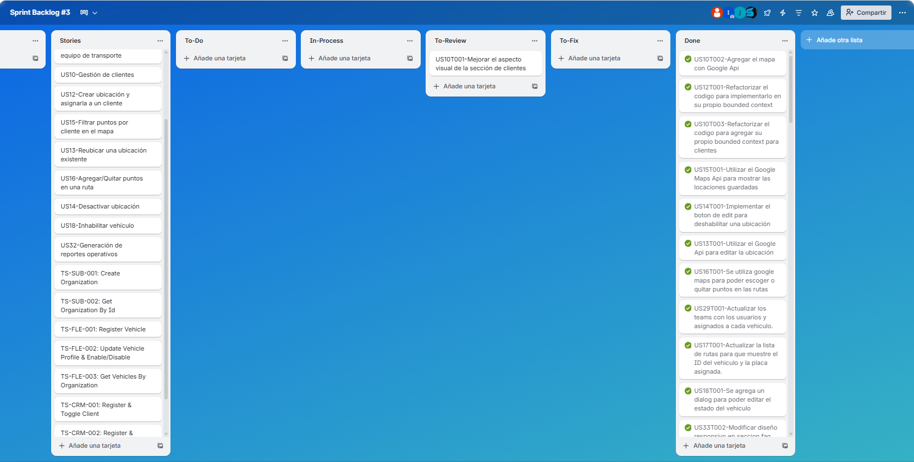
<br>
<a href="https://trello.com/b/1n7Mp1Xp/sprint-backlog-3" target="_blank">
  <span>Tablero Sprint 3 en Trello</span>
</a>

A continuación, se presenta el Sprint Backlog correspondiente al **Sprint 3**, en el cual se incluyen las User Stories seleccionadas y su descomposición en tasks. Cada ítem contiene su respectiva descripción, estimación en horas, asignación y estado actual.

| Sprint # | User Story Id | User Story Title                         | Work-Item / Task Id | Task Title                                           | Description                                                                 | Estimation (Hours) | Assigned To         | Status    |
| -------- | ------------- | ---------------------------------------- | ------------------- | ---------------------------------------------------- | --------------------------------------------------------------------------- | ------------------ | ------------------- | --------- |
| 3        | US33          | Diseño responsivo y navegación           | US33T001            | Modificar diseño responsivo en seccion about         | Actualizar el diseño responsivo de la sección "About" para mejorar la experiencia en diferentes dispositivos. | 2                  | Ingrid              | Done      |
| 3        |               |                                          | US33T002            | Modificar diseño responsivo en seccion faq           | Actualizar el diseño responsivo de la sección FAQ para adaptarse a diferentes tamaños de pantalla. | 2                  | Ingrid              | Done      |
| 3        |               |                                          | US33T003            | Modificar diseño responsivo en seccion header        | Mejorar el diseño responsivo del header para una mejor navegación en móviles y tablets. | 2                  | Ingrid              | Done      |
| 3        |               |                                          | US33T004            | Modificar diseño responsivo en seccion services      | Actualizar el diseño responsivo de la sección de servicios para diferentes dispositivos. | 2                  | Ingrid              | Done      |
| 3        |               |                                          | US33T005            | Modificar diseño responsivo en seccion footer        | Mejorar el diseño responsivo del footer para una mejor visualización en todos los dispositivos. | 2                  | Ingrid              | Done      |
| 3        | US34          | Secciones segmentadas                    | US34T001            | Agregar seccion de enganche final                    | Implementar sección de enganche final en la landing page para mejorar la conversión. | 2                  | Ingrid              | Done      |
| 3        |               |                                          | US34T002            | Se agrego seccion de Terminos y Condiciones          | Implementar sección de Términos y Condiciones en la landing page con contenido actualizado. | 2                  | Ingrid              | Done      |
| 3        |               |                                          | US34T003            | Se agrego seccion de Politica de Privacidad          | Implementar sección de Política de Privacidad en la landing page con contenido actualizado. | 2                  | Ingrid              | Done      |
| 3        | US10          | Gestión de clientes                      | US10T002            | Agregar el mapa con Google Api                       | Integrar Google Maps API en la gestión de clientes para visualizar ubicaciones en el mapa. | 3                  | Santiago y Christofer | Done      |
| 3        |               |                                          | US10T003            | Refactorizar el codigo para agregar su propio bounded context para clientes | Refactorizar el código de clientes para implementarlo en su propio bounded context. | 2                  | Santiago y Christofer | Done      |
| 3        | US12          | Crear ubicación y asignarla a un cliente | US12T001            | Refactorizar el codigo para implementarlo en su propio bounded context | Refactorizar el código de ubicaciones para implementarlo en su propio bounded context. | 2                  | Santiago y Christofer | Done      |
| 3        | US15          | Filtrar puntos por cliente en el mapa   | US15T001            | Utilizar el Google Maps Api para mostrar las locaciones guardadas | Implementar funcionalidad para mostrar las ubicaciones guardadas usando Google Maps API. | 3                  | Santiago y Christofer | Done      |
| 3        | US13          | Reubicar una ubicación existente         | US13T001            | Utilizar el Google Api para editar la ubicación       | Implementar funcionalidad para editar y reubicar ubicaciones existentes usando Google Maps API. | 3                  | Santiago y Christofer | Done      |
| 3        | US14          | Desactivar ubicación                     | US14T001            | Implementar el boton de edit para deshabilitar una ubicación | Agregar funcionalidad para desactivar ubicaciones mediante un botón de edición. | 2                  | Santiago y Christofer | Done      |
| 3        | US16          | Agregar/Quitar puntos en una ruta        | US16T001            | Se utiliza google maps para poder escoger o quitar puntos en las rutas | Implementar funcionalidad para agregar o quitar puntos en rutas usando Google Maps. | 3                  | Yaku                | Done      |
| 3        | US17          | Registrar vehículo                       | US17T001            | Actualizar la lista de rutas para que muestre el ID del vehiculo y la placa asignada | Actualizar la visualización de rutas para mostrar el ID del vehículo y la placa asignada. | 2                  | Yaku                | Done      |
| 3        | US18          | Inhabilitar vehículo                    | US18T001            | Se agrega un dialog para poder editar el estado del vehiculo | Implementar diálogo para editar el estado del vehículo (habilitar/inhabilitar). | 2                  | Yaku                | Done      |
| 3        | US29          | Gestión de roles del equipo de transporte | US29T001            | Actualizar los teams con los usuarios y asignados a cada vehiculo | Actualizar la gestión de equipos para mostrar usuarios asignados a cada vehículo. | 2                  | Yaku                | Done      |
| 3        | US05          | Gestión de roles del equipo de transporte | US05T001            | Gestionar roles y permisos del equipo de transporte | Implementar funcionalidad para gestionar roles y permisos de los miembros del equipo de transporte. | 2                  | Yaku                | Done      |
| 3        | US32          | Generación de reportes operativos         | US32T001            | Implementar generación de reportes operativos       | Desarrollar funcionalidad para generar reportes operativos del sistema. | 3                  | Jesús               | Done      |
| 3        | TS-SUB-001    | Create Organization                        | TS-SUB-001-T001     | Crear entidad Organization y repositorio OrganizationRepository | Crear la entidad Organization y su repositorio correspondiente en el bounded context de Subscriptions. | 2                  | Jesús               | Done      |
| 3        |               |                                            | TS-SUB-001-T002     | Implementar comando CreateOrganizationCommand y su handler | Implementar el comando CreateOrganizationCommand y su handler para crear organizaciones. | 2                  | Jesús               | Done      |
| 3        |               |                                            | TS-SUB-001-T003     | Implementar endpoint POST /api/v1/organization con validaciones | Implementar el endpoint POST para crear organizaciones con las validaciones correspondientes. | 2                  | Jesús               | Done      |
| 3        | TS-SUB-002    | Get Organization By Id                     | TS-SUB-002-T001     | Crear query GetOrganizationByIdQuery y su handler | Crear la query GetOrganizationByIdQuery y su handler para obtener organizaciones por ID. | 2                  | Jesús               | Done      |
| 3        |               |                                            | TS-SUB-002-T002     | Implementar OrganizationResource y endpoint GET /api/v1/organization/{organizationId} | Implementar el OrganizationResource y el endpoint GET para obtener una organización por ID. | 2                  | Jesús               | Done      |
| 3        | TS-FLE-001    | Register Vehicle                           | TS-FLE-001-T001     | Crear entidad Vehicle y repositorio VehicleRepository en bounded context Fleet | Crear la entidad Vehicle y su repositorio correspondiente en el bounded context de Fleet. | 2                  | Jesús               | Done      |
| 3        |               |                                            | TS-FLE-001-T002     | Implementar comando RegisterVehicleCommand y su handler | Implementar el comando RegisterVehicleCommand y su handler para registrar vehículos. | 2                  | Jesús               | Done      |
| 3        |               |                                            | TS-FLE-001-T003     | Implementar endpoint POST /api/v1/vehicles con validaciones | Implementar el endpoint POST para registrar vehículos con las validaciones correspondientes. | 2                  | Jesús               | Done      |
| 3        | TS-FLE-002    | Update Vehicle Profile & Enable/Disable   | TS-FLE-002-T001     | Implementar comando UpdateVehicleCommand y endpoint PUT /api/v1/vehicles/{vehicleId} | Implementar el comando UpdateVehicleCommand y el endpoint PUT para actualizar vehículos. | 2                  | Jesús               | Done      |
| 3        |               |                                            | TS-FLE-002-T002     | Crear comandos EnableVehicleCommand y DisableVehicleCommand con sus handlers | Crear los comandos EnableVehicleCommand y DisableVehicleCommand con sus respectivos handlers. | 2                  | Jesús               | Done      |
| 3        |               |                                            | TS-FLE-002-T003     | Implementar endpoints PATCH /enable y /disable para vehículos | Implementar los endpoints PATCH para habilitar y deshabilitar vehículos. | 2                  | Jesús               | Done      |
| 3        | TS-FLE-003    | Get Vehicles By Organization               | TS-FLE-003-T001     | Crear queries GetVehicleByIdQuery y GetVehiclesByOrganizationQuery con sus handlers | Crear las queries GetVehicleByIdQuery y GetVehiclesByOrganizationQuery con sus respectivos handlers. | 2                  | Jesús               | Done      |
| 3        |               |                                            | TS-FLE-003-T002     | Implementar VehicleResource para respuestas | Implementar el VehicleResource para estructurar las respuestas de los endpoints de vehículos. | 2                  | Jesús               | Done      |
| 3        |               |                                            | TS-FLE-003-T003     | Implementar endpoints GET para vehículo individual y por organización | Implementar los endpoints GET para obtener un vehículo individual y vehículos por organización. | 2                  | Jesús               | Done      |
| 3        |               |                                            | TS-FLE-003-T004     | Agregar filtro por estado enabled y su endpoint | Agregar funcionalidad de filtrado por estado enabled y su endpoint correspondiente. | 2                  | Jesús               | Done      |
| 3        | TS-CRM-001    | Register & Toggle Client                   | TS-CRM-001-T001     | Crear entidad Client y repositorio ClientRepository en bounded context CRM | Crear la entidad Client y su repositorio correspondiente en el bounded context de CRM. | 2                  | Jesús               | Done      |
| 3        |               |                                            | TS-CRM-001-T002     | Implementar comando RegisterClientCommand y endpoint POST /api/v1/clients | Implementar el comando RegisterClientCommand y el endpoint POST para registrar clientes. | 2                  | Jesús               | Done      |
| 3        |               |                                            | TS-CRM-001-T003     | Crear comandos Enable/DisableClientCommand y sus endpoints PATCH | Crear los comandos EnableClientCommand y DisableClientCommand con sus respectivos endpoints PATCH. | 2                  | Jesús               | Done      |
| 3        | TS-CRM-002    | Register & Toggle Location                 | TS-CRM-002-T001     | Crear entidad Location y repositorio LocationRepository en bounded context CRM | Crear la entidad Location y su repositorio correspondiente en el bounded context de CRM. | 2                  | Jesús               | Done      |
| 3        |               |                                            | TS-CRM-002-T002     | Implementar comando RegisterLocationCommand y endpoint POST /api/v1/locations | Implementar el comando RegisterLocationCommand y el endpoint POST para registrar ubicaciones. | 2                  | Jesús               | Done      |
| 3        |               |                                            | TS-CRM-002-T003     | Crear comandos Enable/DisableLocationCommand y sus endpoints PATCH | Crear los comandos EnableLocationCommand y DisableLocationCommand con sus respectivos endpoints PATCH. | 2                  | Jesús               | Done      |
| 3        | TS-CRM-003    | Query Clients and Locations                | TS-CRM-003-T001     | Crear queries para Client (ById, ByOrganization, WithLocations) y sus handlers | Crear las queries GetClientByIdQuery, GetClientsByOrganizationQuery y GetClientsWithLocationsQuery con sus handlers. | 3                  | Jesús               | Done      |
| 3        |               |                                            | TS-CRM-003-T002     | Implementar ClientResource y endpoints GET para clientes | Implementar el ClientResource y los endpoints GET para obtener clientes. | 2                  | Jesús               | Done      |
| 3        |               |                                            | TS-CRM-003-T003     | Crear queries para Location (ById, ByClient) y sus handlers | Crear las queries GetLocationByIdQuery y GetLocationsByClientQuery con sus respectivos handlers. | 2                  | Jesús               | Done      |
| 3        |               |                                            | TS-CRM-003-T004     | Implementar LocationResource y endpoints GET para locations | Implementar el LocationResource y los endpoints GET para obtener ubicaciones. | 2                  | Jesús               | Done      |


| Sprint # | User Story Id | User Story Title                              | Work-Item / Task Id | Task Title                                      | Description                                                                                     | Estimation (Hours) | Assigned To              | Status |
|-----------|----------------|-----------------------------------------------|---------------------|------------------------------------------------|-------------------------------------------------------------------------------------------------|--------------------|---------------------------|---------|
3 | US10| Gestión de clientes| US10T001|Mejorar el apartado visual|... |2|...|To Review|
3| US10| Gestión de clientes|US10T002|Agregar el mapa con Google Api|...|2|...| Done|
3| US10| Gestión de clientes| US10T003|Refactorizar el codigo para agregar su propio bounded context para clientes|...|2|...|Done|
3|US12|Crear ubicación y asignarla a un cliente|US12T001|Refactorizar el codigo para implementarlo en su propio bounded context|...|2|...|Done|
3|US13|Reubicar una ubicación existente|US13T001|Utilizar el Google Api para editar la ubicación|...|2|...|Done|
3|US14|Desactivar ubicación|US14T001|Implementar el boton de edit para deshabilitar una ubicación|...|2|...|Done|
3|US15|Filtrar puntos por cliente en el mapa|US15T001|Utilizar el Google Maps Api para mostrar las locaciones guardadas|...|2|...|Done|
3|US16|Agregar/Quitar puntos en una ruta|US16T001|Se utiliza google maps para poder escoger o quitar puntos en las rutas|...|2|...|Done|
3|US17|Registrar vehículo|US17T001|Actualizar la lista de rutas para que muestre el ID del vehiculo y la placa asignada.|...|2|...|Done|
3|US18|Inhabilitar vehículo|US18T001|Se agrega un dialog para poder editar el estado del vehiculo|...|2|...|Done|
3|TS-SUB-001|Create Organization|TS-SUB-001-T001| Crear entidad Organization y repositorio OrganizationRepository |...|3|...|Done|
3| | | TS-SUB-001-T002| Implementar comando CreateOrganizationCommand y su handler|...|3|...|Done|
3| | |TS-SUB-001-T003| Implementar endpoint POST /api/v1/organization con validaciones|...|3|...|Done|
3|TS-SUB-002| Get Organization By Id|TS-SUB-002-T001| Crear query GetOrganizationByIdQuery y su handler|...|3|Done|
3| | |TS-SUB-002-T002| Implementar OrganizationResource y endpoint GET /api/v1/organization/{organizationId}|...|3|...|Done|
3|TS-FLE-001|Register Vehicle|TS-FLE-001-T001| Crear entidad Vehicle y repositorio VehicleRepository en bounded context Fleet|...|3|...|Done|
3| | | TS-FLE-001-T002|Implementar comando RegisterVehicleCommand y su handler|...|3|...|Done|
3| | |TS-FLE-001-T003| Implementar endpoint POST /api/v1/vehicles con validaciones|...|3|...|Done|


#### 5.2.3.4. Development Evidence for Sprint Review.
| Repository | Branch | Commit Id | Commit Message | Commit Message Body | Commited on (Date) |
|------------|--------|-----------|----------------|----------------------|---------------------|
| Jesús Castillo Vidal/UI-Topic-Frontend | develop | 7450a9b | feat: Dockerfile added for deployment | Added Docker configuration files to enable containerized deployment of the application with optimized build stages and production-ready settings. | 16/11/2025 |
| Jesús Castillo Vidal/UI-Topic-Frontend | develop | 56d9a5d | feat: Mysql connection for production | Configured MySQL database connection string for production environment with proper credentials management and connection pooling. | 16/11/2025 |
| Jesús Castillo Vidal/UI-Topic-Frontend | develop | 02849d2 | fix: Refactoring ClientId and LocationId | Refactored ClientId and LocationId to use value objects pattern, improving type safety and domain model consistency across bounded contexts. | 16/11/2025 |
| Jesús Castillo Vidal/UI-Topic-Frontend | develop | 8211980 | fix(CRM): Replacing int locationId for LocationId VO | Replaced primitive int type with LocationId value object in CRM bounded context to enforce domain invariants and improve code maintainability. | 16/11/2025 |
| Jesús Castillo Vidal/UI-Topic-Frontend | develop | 7e1445e | fix(CRM): Replacing int clientId for ClientId VO | Replaced primitive int type with ClientId value object in CRM bounded context repositories and services for better type safety. | 16/11/2025 |
| miniChorri/UI-Topic-Frontend | develop | 335ee2c | fix: change the ModelBuilderExtensions.cs of the crm bounded context | Updated ModelBuilderExtensions to properly configure entity relationships and value object conversions in the CRM database context. | 16/11/2025 |
| Jesús Castillo Vidal/UI-Topic-Frontend | develop | 77deab9 | chore(docs): Suscriptions.puml | Added PlantUML diagram documentation for Subscriptions bounded context showing aggregate structure and domain relationships. | 16/11/2025 |
| Jesús Castillo Vidal/UI-Topic-Frontend | develop | bf8ae13 | refactor(CRM): Adding OrganizationId | Integrated OrganizationId value object into CRM aggregate roots to establish proper relationships with the Subscriptions bounded context. | 16/11/2025 |
| Jesús Castillo Vidal/UI-Topic-Frontend | develop | 1c7732a | fix(Organizations/Fleet): IMproving better mapping for modelbuilderextension in both. Fixing some bugs in repository for vehicle and adding VOs for repository's parameters | Enhanced entity mappings in both Organizations and Fleet contexts, corrected vehicle repository query bugs, and implemented value objects for repository method parameters. | 16/11/2025 |
| Yaku Guzman/UI-Topic-Frontend | develop | 8d39e42 | feat(crm): Enhance AppDbContext and Program for crm context configuration. | Configured CRM DbContext with proper entity mappings and registered context services in Program.cs with dependency injection setup. | 16/11/2025 |
| Yaku Guzman/UI-Topic-Frontend | develop | db2cd53 | feat(crm): add client and locations controllers | Implemented REST API controllers for Client and Location aggregates with CRUD endpoints following RESTful conventions. | 16/11/2025 |
| Yaku Guzman/UI-Topic-Frontend | develop | d07dc9b | feat(crm): Add assemblers for converting ClientWithLocations and RegisterLocation resources | Created resource assemblers to transform between domain entities and REST API DTOs for client-location relationships. | 16/11/2025 |
| Yaku Guzman/UI-Topic-Frontend | develop | e34fb89 | feat(crm): Add assemblers for converting Client entities and resources | Implemented assembler pattern for bidirectional conversion between Client domain entities and API resource representations. | 16/11/2025 |
| Yaku Guzman/UI-Topic-Frontend | develop | 8f639e3 | feat(crm): Add resources for registering clients and locations in REST API | Defined resource DTOs for client and location registration endpoints with proper validation attributes. | 16/11/2025 |
| Yaku Guzman/UI-Topic-Frontend | develop | 8d2c53c | feat(crm): Add resources for Client and related entities in REST API | Created comprehensive resource models for Client aggregate and associated entities to support API operations. | 16/11/2025 |
| Jesús Castillo Vidal/UI-Topic-Frontend | develop | 97daa03 | refactor(Suscriptions): OrganizationRepository now placed with correct sintax to initiate | Corrected OrganizationRepository initialization syntax and dependency injection configuration in Subscriptions context. | 16/11/2025 |
| Yaku Guzman/UI-Topic-Frontend | develop | 352cb20 | feat(crm): Implement repositories for Client and Location aggregates | Developed repository implementations for Client and Location aggregates with async operations and query methods. | 16/11/2025 |
| Yaku Guzman/UI-Topic-Frontend | develop | 77b3d08 | feat(crm): Add extension method for registering CRM context services | Created extension method to register all CRM bounded context services in dependency injection container. | 16/11/2025 |
| Jesús Castillo Vidal/UI-Topic-Frontend | develop | 35963d9 | feat(Suscriptions): Adding DBContext for Suscriptions, specifically with Organization | Implemented dedicated DbContext for Subscriptions bounded context with Organization entity configuration and mappings. | 16/11/2025 |
| Jesús Castillo Vidal/UI-Topic-Frontend | develop | 6d3c4aa | feat(Suscriptions): Adding WebApplicationBuilderExtension for Suscriptions BC | Created extension method to configure Subscriptions bounded context services in the application builder pipeline. | 16/11/2025 |
| Jesús Castillo Vidal/UI-Topic-Frontend | develop | 83c6e1d | refactor: Removing Appdbcontext for suscription | Removed obsolete AppDbContext configuration for subscriptions in favor of dedicated bounded context implementation. | 16/11/2025 |
| Yaku Guzman/UI-Topic-Frontend | develop | 3e244ae | feat(crm): Add command and query services for managing clients and locations | Implemented CQRS pattern services for Client and Location aggregates separating command and query responsibilities. | 16/11/2025 |
| Yaku Guzman/UI-Topic-Frontend | develop | 1764895 | feat(crm): Implement Location command and query services for managing locations | Created command service for location modifications and query service for location retrieval operations. | 16/11/2025 |
| Yaku Guzman/UI-Topic-Frontend | develop | b8073b5 | feat(crm): Implement Client command and query services for managing clients | Developed command service for client state changes and query service for client data retrieval. | 16/11/2025 |
| Yaku Guzman/UI-Topic-Frontend | develop | 43ca592 | feat(crm): Add Client and Location aggregate roots with enabling/disabling functionality | Implemented Client and Location as aggregate roots with business methods for enabling and disabling entities. | 16/11/2025 |
| Yaku Guzman/UI-Topic-Frontend | develop | 3b4936e | feat(crm): Add queries for retrieving clients and locations by identifiers | Defined query objects for retrieving Client and Location entities by their unique identifiers. | 16/11/2025 |
| Yaku Guzman/UI-Topic-Frontend | develop | 677142b | feat(crm): Add commands for client and location management | Created command objects representing client and location management operations following CQRS pattern. | 16/11/2025 |
| Yaku Guzman/UI-Topic-Frontend | develop | 505697e | feat(crm): Add value objects for ClientId, CompanyName, LocationId, LocationName, OrganizationId, and Proximity | Implemented value objects for CRM domain ensuring immutability and encapsulating business rules for entity identifiers and properties. | 16/11/2025 |
| Yaku Guzman/UI-Topic-Frontend | develop | 12a16f0 | feat(fleet): Enhance AppDbContext and Program for fleet context configuration | Configured Fleet DbContext with entity mappings and registered fleet services in the application startup configuration. | 16/11/2025 |
| Yaku Guzman/UI-Topic-Frontend | develop | 530e3c2 | feat(fleet): Implement VehiclesController for managing fleet vehicles | Created REST API controller for Vehicle aggregate with endpoints for vehicle registration, updates, and queries. | 16/11/2025 |
| Yaku Guzman/UI-Topic-Frontend | develop | 05f06e4 | feat(fleet): Add assemblers for vehicle registration and profile update commands | Implemented assembler pattern for converting between vehicle API resources and domain commands. | 16/11/2025 |
| Yaku Guzman/UI-Topic-Frontend | develop | f79fd8c | feat(fleet): Add resources for vehicle registration and profile updates | Defined DTOs for vehicle registration and profile update operations in the REST API layer. | 16/11/2025 |
| Yaku Guzman/UI-Topic-Frontend | develop | 0b53602 | feat(fleet): Implement VehicleCommandService and VehicleQueryService for vehicle management operations | Developed CQRS services for vehicle command operations and query operations with business logic validation. | 16/11/2025 |
| Yaku Guzman/UI-Topic-Frontend | develop | 04e6da4 | feat(fleet): Add ModelBuilder extensions and Vehicle repository implementation for aggregate management | Created entity configuration extensions and repository implementation for Vehicle aggregate persistence operations. | 16/11/2025 |
| Yaku Guzman/UI-Topic-Frontend | develop | f23b117 | feat(fleet): Add value objects for LicensePlate, OrganizationId, VehicleId, VehicleCapacityKg, and VehicleState | Implemented value objects for Fleet domain ensuring type safety and encapsulating validation rules for vehicle properties. | 16/11/2025 |
| Yaku Guzman/UI-Topic-Frontend | develop | 7c48c50 | feat(fleet): Add IVehicleCommandService and IVehicleQueryService interfaces for vehicle command and query operations | Defined service interfaces for vehicle command and query operations following CQRS and dependency inversion principles. | 16/11/2025 |
| Yaku Guzman/UI-Topic-Frontend | develop | 5738a6d | feat(fleet): Add IVehicleRepository interface for vehicle management operations | Created repository interface defining contract for vehicle persistence and retrieval operations. | 16/11/2025 |
| Yaku Guzman/UI-Topic-Frontend | develop | dbda9b3 | feat(fleet): Implement Vehicle aggregate root with properties and methods for management | Developed Vehicle as aggregate root with domain logic for vehicle lifecycle management and state transitions. | 16/11/2025 |
| Yaku Guzman/UI-Topic-Frontend | develop | 2da835d | feat: Add queries for retrieving vehicles by organization ID and vehicle ID | Defined query objects for vehicle retrieval by organization and individual vehicle identifier. | 16/11/2025 |
| Yaku Guzman/UI-Topic-Frontend | develop | bf0a0f8 | feat: Add vehicle command records for enabling, disabling, registering, and updating vehicle profiles | Created command records representing vehicle lifecycle operations including registration and profile management. | 16/11/2025 |
| Jesús Castillo Vidal/UI-Topic-Frontend | develop | 63bd5a1 | feat(Suscriptions): Adding Organization Controller GetOrganizationById and CreateOrganization | Implemented REST API controller with endpoints for creating organizations and retrieving them by identifier. | 16/11/2025 |
| Jesús Castillo Vidal/UI-Topic-Frontend | develop | d6ddc6d | feat(Suscriptions): Resources and Transform were added for interfaces layer | Created resource DTOs and transformation logic for Subscriptions API interface layer. | 16/11/2025 |
| Jesús Castillo Vidal/UI-Topic-Frontend | develop | 06ed4c4 | feat(Suscriptions): Adding Organization Command And Query services | Implemented CQRS services for Organization aggregate with command and query separation. | 16/11/2025 |
| Jesús Castillo Vidal/UI-Topic-Frontend | develop | b158574 | refactor(Suscriptions): Restructuring packages | Reorganized Subscriptions bounded context package structure for better separation of concerns and maintainability. | 16/11/2025 |
| Jesús Castillo Vidal/UI-Topic-Frontend | develop | 109af60 | feat(Suscription): Implementation for OrganizationRepository interface and Class | Developed repository implementation for Organization aggregate with persistence operations. | 16/11/2025 |
| Jesús Castillo Vidal/UI-Topic-Frontend | develop | 16a97e4 | feat(Suscriptions): Creating Commands and Queries for organization and Interface for Application Layer | Defined command and query objects for organization operations and application layer service interfaces. | 16/11/2025 |
| Jesús Castillo Vidal/UI-Topic-Frontend | develop | fe8fc0d | refactor(Suscriptions): OrganizationId now with int id | Refactored OrganizationId value object to use integer identifier for better database performance. | 16/11/2025 |
| Jesús Castillo Vidal/UI-Topic-Frontend | develop | 814ac86 | refactor(Suscription): VO OrganizationId now placed inside of Shared | Moved OrganizationId value object to Shared kernel for reuse across multiple bounded contexts. | 16/11/2025 |
| Jesús Castillo Vidal/UI-Topic-Frontend | develop | 2adc7a1 | fix(Suscription): Updated Organization and Organization Audit for better audit and partial class with IEntityWithCreatedUpdatedDate | Enhanced Organization entity with proper audit trail support and temporal tracking interface implementation. | 16/11/2025 |
| Jesús Castillo Vidal/UI-Topic-Frontend | develop | 8ff9661 | feat(Suscription): Organization model were created with its VOs and Audit model | Implemented Organization domain model with associated value objects and audit entity for temporal tracking. | 16/11/2025 |
| Yaku Guzman/UI-Topic-Frontend | develop | 175fcec | feat: Remove connection string from appsettings.Development.json for security reasons | Removed hardcoded connection strings from configuration files and moved to environment variables for enhanced security. | 16/11/2025 |
| Yaku Guzman/UI-Topic-Frontend | develop | 50a3a6c | feat: Enhance Program.cs with database services, OpenAPI documentation, and shared context configuration | Configured application startup with database services registration, Swagger documentation, and shared bounded context setup. | 16/11/2025 |
| Yaku Guzman/UI-Topic-Frontend | develop | bdddc69 | feat: Add database services and creation assurance extensions for WebApplicationBuilder | Created extension methods for registering database services and ensuring database creation on application startup. | 16/11/2025 |
| Yaku Guzman/UI-Topic-Frontend | develop | 745614c | feat: Implement logging command behavior and add configuration services for Cortex Mediator | Added logging pipeline behavior for Mediator commands and configured Cortex Mediator services for CQRS implementation. | 16/11/2025 |
| Yaku Guzman/UI-Topic-Frontend | develop | c0fbcad | feat: Add extension method for shared context services in WebApplicationBuilder | Implemented extension method to register shared bounded context services in dependency injection container. | 16/11/2025 |
| Yaku Guzman/UI-Topic-Frontend | develop | 8666a27 | feat: Add OpenAPI documentation services and middleware extensions | Configured Swagger/OpenAPI documentation generation and middleware for API exploration and testing. | 16/11/2025 |
| Yaku Guzman/UI-Topic-Frontend | develop | c8044f1 | feat: Add IEvent and IEventHandler interfaces for domain event handling | Defined interfaces for domain event pattern enabling event-driven architecture across bounded contexts. | 16/11/2025 |
| Yaku Guzman/UI-Topic-Frontend | develop | 97b7d0d | feat: Update project dependencies and enable XML documentation generation | Updated NuGet packages to latest stable versions and enabled XML documentation for API reference generation. | 16/11/2025 |
| Yaku Guzman/UI-Topic-Frontend | develop | 3f9df21 | feat: Update configuration files with token settings and connection strings | Configured JWT token settings and database connection strings in application configuration files. | 16/11/2025 |
| Jesús Castillo Vidal/UI-Topic-Frontend | develop | 4a2355c | feat: Implement app-db-context and repository pattern with snake case naming convention | Created base application DbContext and repository pattern infrastructure with snake_case database naming convention. | 25/10/2025 |
| Jesús Castillo Vidal/UI-Topic-Frontend | develop | 217cde8 | feat: IUnitOfWork added | Implemented Unit of Work pattern interface for coordinating multiple repository operations in a single transaction. | 25/10/2025 |
| Jesús Castillo Vidal/UI-Topic-Frontend | develop | 767d4a2 | feat: IBaseRepository added | Created base repository interface defining common CRUD operations for all aggregate repositories. | 25/10/2025 |
| Jesús Castillo Vidal/UI-Topic-Frontend | develop | 34eed34 | chore: Adding core nuget packages | Added essential NuGet packages including Entity Framework Core, ASP.NET Core, and other infrastructure dependencies. | 25/10/2025 |
| Jesús Castillo Vidal/UI-Topic-Frontend | develop | 15703b2 | chore: Initial setup | Initial project setup with solution structure, project references, and basic configuration files. | 25/10/2025 |


#### 5.2.3.5. Execution Evidence for Sprint Review.

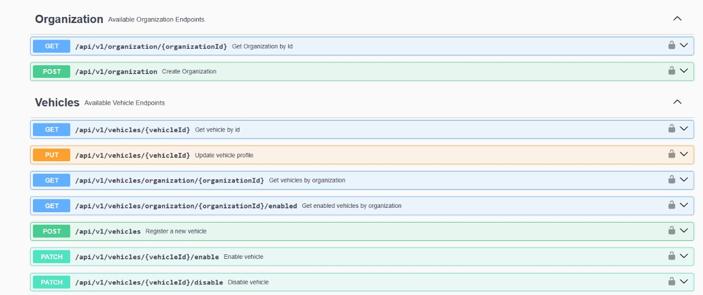
<br>


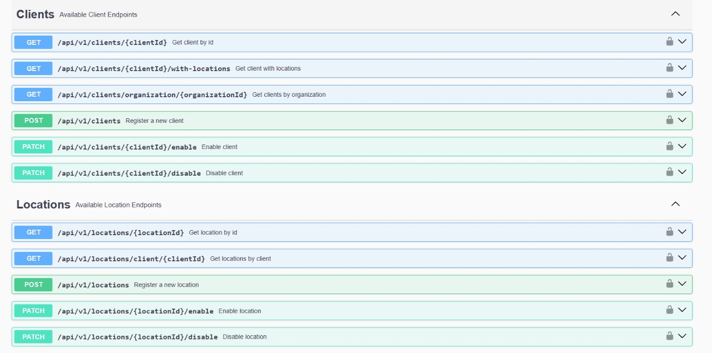
<br>

#### 5.2.3.6. Services Documentation Evidence for Sprint Review.

Durante este sprint se completó una versión preliminar del backend de la aplicación Rutana utilizando la estructura net9.0, con el lenguaje C# y la plantilla de Web API, con despliegue exitoso en onRender. Aunque no se completaron todas los endpoint que se planificaron, se logró implementar los bounded contexts core y desplegar sus respectivos endpoint.

**Descripción del Logro:**

- Implementación del backend con net9.0 y C#
- Desarrollo de los bounded contexts principales (Subscription, Fleet & Resource Management, Customer & Location Management)
- Implementación de los metodos HTTP: Get, Post, Put y Patch
- Deployment exitoso en onRender

Recursos del Sprint

<table>
<tr>
<th>Recurso</th>
<th>Acción implementada</th>
<th>Método HTTP</th>
<th>URL / Endpoint</th>
<th>Link de repositorio</th>
</tr>
<tr>
<td>Backend Application</td>
<td>Aplicación web Api</td>
<td>GET</td>
<td>https://backend-webapplication.onrender.com/swagger/index.html</td>
<td>https://github.com/QoriTech-7468/BackEnd-WebApplication.git</td>
</tr>
<tr>
<td>Backend Application</td>
<td>Aplicación web Api</td>
<td>Post</td>
<td>https://backend-webapplication.onrender.com/swagger/index.html</td>
<td>https://github.com/QoriTech-7468/BackEnd-WebApplication.git</td>
</tr>
<tr>
<td>Backend Application</td>
<td>Aplicación web Api</td>
<td>Put</td>
<td>https://backend-webapplication.onrender.com/swagger/index.html</td>
<td>https://github.com/QoriTech-7468/BackEnd-WebApplication.git</td>
</tr>
<tr>
<td>Backend Application</td>
<td>Aplicación web Api</td>
<td>Patch</td>
<td>https://backend-webapplication.onrender.com/swagger/index.html</td>
<td>https://github.com/QoriTech-7468/BackEnd-WebApplication.git</td>
</tr>
<tr>
</table>

**Documentación de Servicios:**

1. **API Documentation**: Documentación de los endpoint con la estructura net9.0
2. **Component Documentation**: Documentación de componentes Vue.js desarrollados con PrimeVue
3. **Deployment Guide**: Guía de despliegue en onRender con configuración de producción
4. **Architecture Documentation**: Documentación de la arquitectura con Domain Driven Design
5. **Repository Documentation**: Documentación completa del código fuente en GitHub con 89 commits

#### 5.2.3.7. Software Deployment Evidence for Sprint Review.

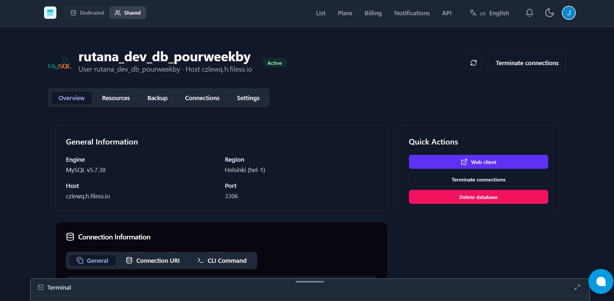
<br>
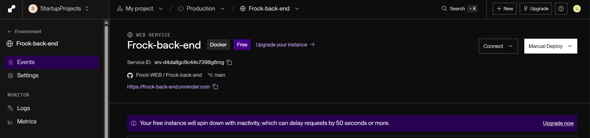
<br>

### 5.2.4. Sprint 4
### 5.2.4.1.Spring Planning 4.
<table>
<tr>
<th>Sprint #</th>
<th>Sprint 4</th>
</tr>
<tr>
<td colspan="2"><strong>Sprint Planning Background</strong></td>

</tr>
<tr>
<td><strong>Date</strong></td>
<td>2025-12-01</td>
</tr>
<tr>
<td><strong>Time</strong></td>
<td>12:18 PM (GMT-5)</td>
</tr>
<tr>
<td><strong>Location</strong></td>
<td>Modalidad remota mediante la plataforma Discord</td>
</tr>
<tr>
<td><strong>Prepared By</strong></td>
<td>Jesús Castillo Vidal</td>
</tr>
<tr>
<td><strong>Attendees (to planning meeting)</strong></td>
<td>Castillo Vidal, Jesús Iván / Costa Morales, Christofer William / Gordillo Ramos, Santiago Alonso / Guzmán Cabrejos, Yaku Mateo / Medina Merma, Ingrid Melani</td>
</tr>
<tr>
<td><strong>Sprint 3 Review Summary</strong></td>
<td>...</td>
</tr>
<tr>
<td><strong>Sprint 3 Retrospective Summary</strong></td>
<td> ... </td>
</tr>
<tr>
<td colspan="2"><strong>Sprint Goal & User Stories</strong></td>
</tr>
<tr>
<td><strong>Sprint 4 Goal</strong></td>
<td><strong>Nuestro propósito está</strong>   </td>
</tr>
<tr>
<td><strong>Sprint 4 Velocity</strong></td>
<td></td>
</tr>
<tr>
<td><strong>Sum of Story Points</strong></td>
<td></td>
</tr>
</table>

### 5.2.4.2. Aspect Leaders and Collaborators.


### 5.2.4.3.Sprint Backlog 4.

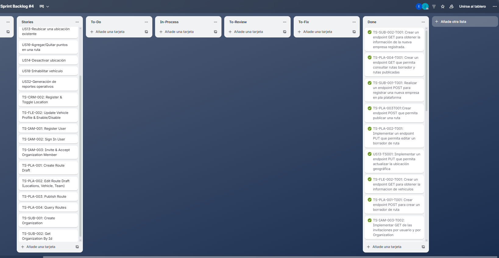
<br>
<a href="https://trello.com/b/0eTLOSys/sprint-backlog-4" target="_blank">
  <span>Tablero Sprint 4 en Trello</span>
</a>

### 5.2.4.4.Development Evidence for Sprint Review.

### 5.2.4.5.Execution Evidence for Sprint Review.

### 5.2.4.6.Services Documentation Evidence for Sprint Review.

### 5.2.4.7.Software Deployment Evidence for Sprint Review.

### 5.2.4.8.Team Collaboration Insights during Sprint.


#### 5.3. Validation Interviews.

#### 5.3.1. Diseño de Entrevistas.

**Preguntas Generales**

**Objetivo:** Conocer percepción global del proyecto RUTANA.
- **Principal:** ¿Qué fue lo primero que pensaste al ver o escuchar sobre RUTANA?

- **Principal:** En tus palabras, ¿qué problema crees que resuelve RUTANA?

- **Principal**En una escala del 1 al 10, ¿qué tan útil crees que sería RUTANA para tu día a día? ¿Por qué ese puntaje?
- **Complementaria:** ¿Qué fue lo que más te gustó de lo que viste?
- **Complementaria:** ¿Qué fue lo que menos te convenció o te generó dudas?

**Primer Segmento Objetivo: Transportistas**

**Objetivo:** Obtener la opinión directa del transportista sobre la utilidad, usabilidad y deseabilidad de RUTANA, y cómo resuelve sus principales problemas en ruta.

- **Principal:** Cuando ingresas a RUTANA, ¿la forma en que se te presentan las rutas asignadas y las entregas pendientes es clara y te permite empezar a trabajar rápidamente?

- **Principal:** El proceso de marcar una entrega como "Completada"¿te parece simple y rápido de hacer al terminar con el cliente?

- **Principal:** ¿Qué tan fácil o difícil fue navegar por la aplicación?

- **Principal:** ¿Qué tan dispuesto estarías a usarla como tu principal herramienta de trabajo?  

- **Complementaria:** ¿Hay algo en la interfaz o en el flujo que te pareció confuso o que cambiarías?

- **Complementaria:** ¿Recomendarías esta aplicación a otros compañeros conductores? ¿Por qué sí o por qué no?


**Segundo Segmento Objetivo: Administradores**

**Objetivo:** Evaluar si RUTANA cumple con sus necesidades de planificación, monitoreo en tiempo real, control de carga y gestión de incidencias, y el valor que perciben.

- **Principal:** ¿Qué tan útil consideras la vista en tiempo real del camión y su progreso?
- **Principal:** El sistema de monitoreo en tiempo real de RUTANA, ¿te proporciona suficiente información para saber si un camión está siguiendo la ruta y cumpliendo los horarios?
- **Principal:**¿La información presentada te permitiría tomar decisiones operativas mejor que ahora?
- **Principal:** Si tuvieras que decidir implementar RUTANA, ¿cuál es el beneficio principal que te convencería de adoptarlo? (Ej. Reducción de costos, mejora de servicio, etc.)
- **Complementaria:** La posibilidad de crear roles de equipo de transporte con permisos limitados, ¿Es un beneficio importante para la seguridad y organización de tu operación?


####  5.3.2. Registro de Entrevistas.

####  5.3.3. Evaluaciones según heurísticas.

####  5.4. Video About-the-Product.
<p align="center">
  <a href="https://youtu.be/2dZIAQPCCvM" target="_blank">
    
  </a>
</p>
   <strong>Link:</strong>
    <a href="https://youtu.be/2dZIAQPCCvM" target="_blank">
      https://youtu.be/2dZIAQPCCvM
    </a>


