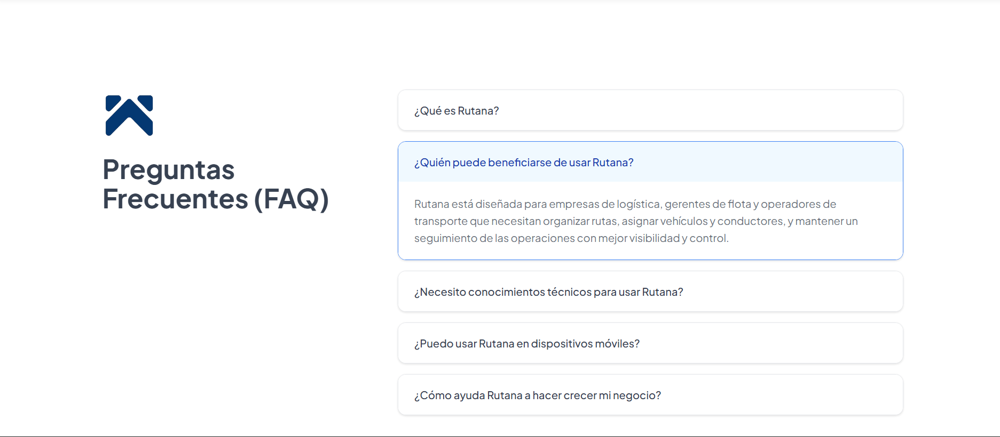

## Capítulo V: Product Implementation, Validation & Deployment

### 5.1. Software Configuration Management.

### 5.1.1. Software Development Environment Configuration.

<table>
  <thead>
    <tr>
      <th>Actividad</th>
      <th>Herramienta/Guía</th>
      <th>Propósito</th>
      <th>Tipo de acceso/Ruta (links)</th>
    </tr>
  </thead>
  <tbody>
    <tr>
      <td>Gestión de proyecto</td>
      <td>Trello</td>
      <td>Organizar y dar seguimiento a tareas</td>
      <td><a href="https://trello.com" target="_blank">Trello</a></td>
    </tr>
    <tr>
      <td>Gestión de requerimientos</td>
      <td>Gherkin Conventions</td>
      <td>Definir criterios de aceptación claros</td>
      <td><a href="https://cucumber.io/docs/gherkin/" target="_blank">Guía Gherkin</a></td>
    </tr>
    <tr>
      <td>Producto UI/UX</td>
      <td>Figma</td>
      <td>Diseño de interfaces y prototipos</td>
      <td><a href="https://figma.com" target="_blank">Figma</a></td>
    </tr>
    <tr>
      <td>Landing Page desarrollo</td>
      <td>Visual Studio Code</td>
      <td>Edición y desarrollo de código</td>
      <td><a href="https://code.visualstudio.com/" target="_blank">VS Code</a></td>
    </tr>
    <tr>
      <td>Control de versiones</td>
      <td>Git</td>
      <td>Gestión de versiones del código</td>
      <td><a href="https://git-scm.com/" target="_blank">Git</a></td>
    </tr>
    <tr>
      <td>Despliegue</td>
      <td>GitHub Pages</td>
      <td>Publicar la aplicación web</td>
      <td><a href="https://pages.github.com/" target="_blank">GitHub Pages</a></td>
    </tr>
    <tr>
      <td>Event Storming</td>
      <td>Miro</td>
      <td>Colaboración y modelado de procesos</td>
      <td><a href="https://miro.com/" target="_blank">Miro</a></td>
    </tr>
    <tr>
      <td>Diagramas</td>
      <td>PlantUML</td>
      <td>Generación de diagramas UML</td>
      <td><a href="https://plantuml.com/" target="_blank">PlantUML</a></td>
    </tr>
  </tbody>
</table>

### 5.1.2. Source Code Management.

Para la gestión del código fuente se implementa el modelo de ramificación GitFlow, el versionado semántico y las convenciones de mensajes de commit, detallados a continuación:

**GitFlow Workflow**

Se utiliza el modelo de ramificación propuesto por Vincent Driessen (“A successful Git branching model”), conocido como GitFlow. Las ramas principales son:

- **main**: Rama principal, contiene siempre el código en producción.
- **develop**: Rama de desarrollo principal, donde se integran las funcionalidades antes de pasar a producción.
- **feature/\***: Ramas creadas a partir de develop para nuevas funcionalidades.  
  Convención: `feature/<nombre-corto-descriptivo>`  
  Ejemplo: `feature/login-auth`
- **release/\***: Ramas creadas desde develop para preparar una nueva versión.  
  Convención: `release/<versión>`  
  Ejemplo: `release/1.2.0`
- **hotfix/\***: Ramas creadas desde main para corregir errores críticos en producción.  
  Convención: `hotfix/<descripción-corta>`  
  Ejemplo: `hotfix/fix-payment-bug`

**Versionado Semántico**

Se aplica Semantic Versioning 2.0.0, con el formato:

- **MAJOR**: Cambios incompatibles en la API.
- **MINOR**: Nuevas funcionalidades compatibles.
- **PATCH**: Correcciones menores y ajustes sin afectar funcionalidades.

Ejemplo de versión: `v1.3.2`

**Convenciones de Commits**

Se emplea el estándar Conventional Commits para los mensajes de commit, facilitando la automatización en integración continua y generación de changelogs.

Ejemplos de mensajes:

- `feat: add login functionality`
- `fix: correct null pointer exception on user service`
- `chore: update dependencies`

Estas prácticas aseguran trazabilidad, organización y calidad en la gestión del código fuente del proyecto.

### 5.1.3. Source Code Style Guide & Conventions.

#### Landing Page Style Guide & Conventions

##### Project Structure

```
/public        (images, favicon, manifest.json)
/src
    /css         (styles.css + partials/modules)
    /js            (main.js + modules)
    /components    (HTML fragments if needed)
    /index.html
```

###### HTML

- **Semantics first**: use `header`, `nav`, `main`, `section`, `article`, `footer`.
- **Accessibility (a11y)**:
  - Add `alt` text to images.
  - Use `aria-*` attributes for dynamic components.
  - Keep logical tab order in the DOM.
  - Always show a visible focus state.
- **SEO**:
  - Include `<title>` and `<meta name="description">`.
  - Add Open Graph / Twitter meta tags.
  - Set `lang="en"` (or appropriate language) on `<html>`.
- **Performance**:
  - Use `loading="lazy"` on ``.
  - Minimize inline CSS/JS.
- **Conventions**:
  - Use **kebab-case** for class names.
  - Use `id` only for JS hooks or anchors, not for styling.

###### CSS

- **Naming**: Follow **BEM** → `.block__element--modifier`.
- **Variables**: Define tokens in `:root`:
  ```css
  :root {
    --color-primary: #0ea5e9;
    --color-secondary: #64748b;
    --font-base: 1rem;
  }
  ```
- **Architecture**:
  - Separate utilities (spacing, grid) and components (buttons, cards).
- **Responsive**:
  - Mobile-first approach with `min-width` breakpoints.
  - Common breakpoints: 480px, 768px, 1024px, 1280px.
- **Typography & spacing**:
  - Use `rem` for scalability.
  - Avoid hard-coded magic numbers.
- **States**:
  - Define consistent `:hover`, `:focus-visible`, and `:disabled`.
- **Property order**:
  - Group logically: Layout → Box Model → Typography → Visual → Misc.

###### JavaScript

- **Structure**:
  - Modular design; keep one `main.js` entry point.
  - Split reusable logic into separate modules.
- **Conventions**:
  - Use **camelCase** for variables/functions.
  - Use **PascalCase** for classes/constructors.
  - Constants in `UPPER_CASE`.
- **Best Practices**:
  - Prefer `const` and `let` over `var`.
  - Add comments for non-trivial logic.
  - Keep DOM selectors cached.
  - Use `addEventListener` (avoid inline `onclick`).
  - Wrap code in IIFEs or modules to avoid global leaks.

### 5.1.4. Software Deployment Configuration.

#### 1. Landing Page – HTML, CSS y JavaScript

##### Repositorio de Código Fuente

La Landing Page se implementa empleando únicamente HTML, CSS y JavaScript nativo. Todos los archivos del proyecto deben almacenarse en un repositorio en GitHub, asegurando que el archivo **`index.html`** se ubique en la raíz del repositorio (`/`). Esto es indispensable para que GitHub Pages lo reconozca automáticamente como punto de entrada del sitio.

##### Activación de GitHub Pages

1. Acceder al repositorio en GitHub.
2. Ir a la pestaña **Settings**.
3. En el menú lateral, seleccionar la opción **Pages**.
4. En el campo **Source**, configurar:
   - Rama: `main`
   - Carpeta: `/ (root)`
5. Guardar los cambios.

##### Publicación

Tras guardar la configuración, GitHub generará de forma automática una URL pública donde estará disponible la Landing Page. El formato de la URL es:

```
https://<usuario>.github.io/<repositorio>/
```

##### Actualizaciones

Cualquier commit realizado en la rama `main` será desplegado automáticamente en la página publicada, sin necesidad de pasos adicionales.

### 5.2. Landing Page, Services & Applications Implementation.

### 5.2.1. Sprint 1

A continuación, se expone la planificación de nuestro Sprint 1, orientado principalmente a la construcción de la landing page de Rutana. En esta primera fase, el equipo definió la meta del sprint, priorizó las historias de usuario más significativas y determinó los entregables esenciales que harán posible presentar una versión inicial funcional y con un diseño atractivo. Esta planificación busca garantizar una visión común entre todos los integrantes del equipo y establecer un punto de partida sólido para transmitir con claridad el valor de la plataforma a los futuros usuarios.

### 5.2.1.1. Sprint Planning 1.

| Sprint #                            | Sprint 1                                                                                                                                                                                                                                                                                                                                                                                                                                                                                                                                                          |
| ----------------------------------- | ----------------------------------------------------------------------------------------------------------------------------------------------------------------------------------------------------------------------------------------------------------------------------------------------------------------------------------------------------------------------------------------------------------------------------------------------------------------------------------------------------------------------------------------------------------------- |
| **Sprint Planning Background**      |                                                                                                                                                                                                                                                                                                                                                                                                                                                                                                                                                                   |
| **Date**                            | 2025-09-20                                                                                                                                                                                                                                                                                                                                                                                                                                                                                                                                                        |
| **Time**                            | 18:50 PM (GMT-5)                                                                                                                                                                                                                                                                                                                                                                                                                                                                                                                                                  |
| **Location**                        | Modalidad remota mediante la plataforma Discord                                                                                                                                                                                                                                                                                                                                                                                                                                                                                                                   |
| **Prepared By**                     | Jesús Castillo Vidal                                                                                                                                                                                                                                                                                                                                                                                                                                                                                                                                              |
| **Attendees (to planning meeting)** | Castillo Vidal, Jesús Iván / Costa Morales, Christofer William / Gordillo Ramos, Santiago Alonso / Guzmán Cabrejos, Yaku Mateo / Medina Merma, Ingrid Melani                                                                                                                                                                                                                                                                                                                                                                                                      |
| **Sprint 0 Review Summary**         | Dado que este es el sprint inicial, no se presenta un resumen del sprint anterior.                                                                                                                                                                                                                                                                                                                                                                                                                                                                                |
| **Sprint 0 Retrospective Summary**  | Dado que este es el sprint inicial, no se presenta una retroalimentación del sprint anterior.                                                                                                                                                                                                                                                                                                                                                                                                                                                                     |
| **Sprint Goal & User Stories**      |                                                                                                                                                                                                                                                                                                                                                                                                                                                                                                                                                                   |
| **Sprint 1 Goal**                   | **Nuestro propósito es** diseñar y entregar una primera versión de la landing page para nuestra plataforma de gestión de rutas, basada en entrevistas con administradores y transportistas de una empresa distribuidora. **Creemos que esto aportará** claridad y valor inicial a los usuarios potenciales, comunicando el propósito del producto y la visión del equipo. **Esto se confirmará cuando** los visitantes puedan comprender fácilmente los beneficios de la plataforma y muestren interés en conocer más o contactarnos a través de la landing page. |
| **Sprint 1 Velocity**               | 15 puntos                                                                                                                                                                                                                                                                                                                                                                                                                                                                                                                                                         |
| **Sum of Story Points**             | 15 puntos                                                                                                                                                                                                                                                                                                                                                                                                                                                                                                                                                         |

### 5.2.1.2. Aspect Leaders and Collaborators

En esta sección se presenta la **Leadership-and-Collaboration Matrix (LACX)** correspondiente al Sprint 1. Cada aspecto se relaciona con tareas clave del sprint, asignando un **líder (L)** responsable principal y **colaboradores (C)** que apoyan en su ejecución.

| Team Member (Last Name, First Name) | GitHub Username | Mockup (L/C) | Entrevistas (L/C) | Wireframes (L/C) | Landing Page (L/C) |
| ----------------------------------- | --------------- | ------------ | ----------------- | ---------------- | ------------------ |
| Castillo Vidal, Jesús Iván          | Jcdev04         | L            | C                 | C                | C                  |
| Costa Morales, Christofer William   | miniChorri      | C            | L                 | C                | C                  |
| Gordillo Ramos, Santiago Alonso     | SantiIHC        | C            | C                 | L                | C                  |
| Guzmán Cabrejos, Yaku Mateo         | yak-cod         | C            | C                 | C                | L                  |
| Medina Merma, Ingrid Melani         | Grini913        | C            | C                 | C                | C                  |

**Notas:**

- Cada integrante asume liderazgo en al menos un aspecto para distribuir responsabilidades.
- Los colaboradores apoyan al líder en la ejecución, revisión y validación de las tareas correspondientes.
- La organización de líderes y colaboradores se vincula directamente con la selección posterior de tasks en el Sprint.

### 5.2.1.3. Sprint Backlog 1.


  <br>
  <a href="https://trello.com/b/vqfXmatr/sprint-1" target="_blank">
    <span>Tablero Sprint 1 en Trello</span>
  </a>

A continuación, se presenta el Sprint Backlog correspondiente al **Sprint 1**, en el cual se incluyen las User Stories seleccionadas y su descomposición en tasks. Cada ítem contiene su respectiva descripción, estimación en horas, asignación y estado actual.

| Sprint # | User Story Id | User Story Title               | Work-Item / Task Id | Task Title         | Description                                                                             | Estimation (Hours) | Assigned To | Status (To-Do / In-Process / To-Review / Done) |
| -------- | ------------- | ------------------------------ | ------------------- | ------------------ | --------------------------------------------------------------------------------------- | ------------------ | ----------- | ---------------------------------------------- |
| 1        | US28          | Diseño responsivo y navegación | T28-1               | Hero Section       | Implementar sección hero con diseño responsivo y navegación clara.                      | 1                  | Jesús       | To-Do                                          |
|          |               |                                | T28-2               | Our Value          | Desarrollar sección de valores con estilo adaptable a móviles, tablets y desktop.       | 1                  | Santiago    | Done                                           |
|          |               |                                | T28-3               | About Us           | Crear sección “Sobre nosotros” con diseño adaptable a diferentes dispositivos.          | 1                  | Ingrid      | Done                                           |
|          |               |                                | T28-4               | Our Team           | Diseñar sección de equipo con estructura clara y responsiva.                            | 1                  | Yaku        | Done                                           |
|          |               |                                | T28-5               | Testimonials & FAQ | Implementar testimonios, preguntas frecuentes y footer con diseño responsivo.           | 1                  | Christopher | Done                                           |
| 1        | US29          | Secciones segmentadas          | T29-1               | Hero Section       | Adaptar sección hero enfocada en beneficios y planes para empresas de transporte.       | 1                  | Jesús       | Done                                           |
|          |               |                                | T29-2               | Our Value          | Diseñar sección de valores segmentada con enfoque en transporte.                        | 1                  | Santiago    | Done                                           |
|          |               |                                | T29-3               | About Us           | Implementar sección “Sobre nosotros” con contenido dirigido a empresas de transporte.   | 1                  | Ingrid      | Done                                           |
|          |               |                                | T29-4               | Our Team           | Diseñar sección de equipo adaptada a la segmentación de transporte.                     | 1                  | Yaku        | Done                                           |
|          |               |                                | T29-5               | Testimonials & FAQ | Incluir testimonios, preguntas frecuentes y footer orientados a empresas de transporte. | 1                  | Christopher | Done                                           |
| 1        | US30          | Internacionalización (i18n)    | T30-1               | English            | Implementar opción de idioma inglés en la landing page.                                 | 1                  | Jesús       | Done                                           |
|          |               |                                | T30-2               | Spanish            | Implementar opción de idioma español en la landing page (idioma por defecto).           | 1                  | Yaku        | Done                                           |

### 5.2.1.4. Development Evidence for Sprint Review.

Durante el Sprint 1, el equipo se enfocó exclusivamente en el desarrollo de la Landing Page de la plataforma Rutana. El objetivo principal fue construir una página pública funcional, atractiva visualmente y completamente responsiva, que comunique eficazmente la propuesta de valor de la plataforma a los usuarios potenciales. A lo largo del Sprint se diseñaron e implementaron secciones clave como Hero, Sobre Nosotros, Beneficios, Testimonios, Preguntas Frecuentes, etc.

| Repository                                   | Branch | Commit Id | Commit Message                                                                            | Commit Message Body                                                                                                          | Commited on (Date) |
| -------------------------------------------- | ------ | --------- | ----------------------------------------------------------------------------------------- | ---------------------------------------------------------------------------------------------------------------------------- | ------------------ |
| Jesús Castillo Vidal/Landing-Page-Repository | main   | 3e17fea   | fix: Defer from javascript was deleted                                                    | Se eliminó funcionalidad/código relacionado con: fix: Defer from javascript was deleted                                      | 21/09/2025         |
| Jesús Castillo Vidal/Landing-Page-Repository | main   | 290e9e4   | feature: Added icon to the webpage                                                        | Se implementó nueva funcionalidad: feature: Added icon to the webpage                                                        | 21/09/2025         |
| Jesús Castillo Vidal/Landing-Page-Repository | main   | 100102a   | fix: hero section were replaced into main tag                                             | Se corrigieron errores relacionados con: fix: hero section were replaced into main tag                                       | 21/09/2025         |
| miniChorri/Landing-Page-Repository           | main   | 85511ea   | feat: Added more css for the langing page                                                 | Se implementó nueva funcionalidad: feat: Added more css for the langing page                                                 | 21/09/2025         |
| miniChorri/Landing-Page-Repository           | main   | fe3e1e1   | feat(update): Updated the index to add the scripts                                        | Se mejoró el módulo: feat(update): Updated the index to add the scripts                                                      | 21/09/2025         |
| miniChorri/Landing-Page-Repository           | main   | 062922e   | feat(scripts): Added the last scripts for the Landing page                                | Se implementó nueva funcionalidad: feat(scripts): Added the last scripts for the Landing page                                | 21/09/2025         |
| miniChorri/Landing-Page-Repository           | main   | 353156b   | feat(script): add more scripts in scripts.js file                                         | Se implementó nueva funcionalidad: feat(script): add more scripts in scripts.js file                                         | 21/09/2025         |
| miniChorri/Landing-Page-Repository           | main   | 954b45a   | feat(scripts): added the script.js file also added smooth scrolling and faq functionality | Se implementó nueva funcionalidad: feat(scripts): added the script.js file also added smooth scrolling and faq functionality | 21/09/2025         |
| Jesús Castillo Vidal/Landing-Page-Repository | main   | ccf45bd   | refactor: Plans card now responsive                                                       | Detalles adicionales sobre: refactor: Plans card now responsive                                                              | 21/09/2025         |
| Jesús Castillo Vidal/Landing-Page-Repository | main   | 1f04b52   | feat: Adding testimonial images                                                           | Se implementó nueva funcionalidad: feat: Adding testimonial images                                                           | 21/09/2025         |
| Jesús Castillo Vidal/Landing-Page-Repository | main   | b682ba7   | fix: team section updated with responsive cards                                           | Se mejoró el módulo: fix: team section updated with responsive cards                                                         | 21/09/2025         |
| Jesús Castillo Vidal/Landing-Page-Repository | main   | 602c45d   | fix: Plan section updated with responsive cards                                           | Se mejoró el módulo: fix: Plan section updated with responsive cards                                                         | 21/09/2025         |
| Jesús Castillo Vidal/Landing-Page-Repository | main   | faacf9d   | fix: Testimonial section now with better format and styling                               | Se corrigieron errores relacionados con: fix: Testimonial section now with better format and styling                         | 21/09/2025         |
| Jesús Castillo Vidal/Landing-Page-Repository | main   | bf7b4a0   | fix: FAQs Section styling and layout improved                                             | Se mejoró el módulo: fix: FAQs Section styling and layout improved                                                           | 21/09/2025         |
| Jesús Castillo Vidal/Landing-Page-Repository | main   | da3498d   | fix: Footer Section styling and layout ere updated and improved                           | Se mejoró el módulo: fix: Footer Section styling and layout ere updated and improved                                         | 21/09/2025         |
| Jesús Castillo Vidal/Landing-Page-Repository | main   | 7b2b034   | fix: Footer Section styling and layout ere updated and improved                           | Se mejoró el módulo: fix: Footer Section styling and layout ere updated and improved                                         | 21/09/2025         |
| Jesús Castillo Vidal/Landing-Page-Repository | main   | 5cc32e4   | fix(index.html): Global css was added to index.html                                       | Se implementó nueva funcionalidad: fix(index.html): Global css was added to index.html                                       | 21/09/2025         |
| Jesús Castillo Vidal/Landing-Page-Repository | main   | 299e1af   | fix(index.html): Importing for logo were updated                                          | Se mejoró el módulo: fix(index.html): Importing for logo were updated                                                        | 21/09/2025         |
| Jesús Castillo Vidal/Landing-Page-Repository | main   | 82198f5   | fix(index.html): Importing images were fixed                                              | Se corrigieron errores relacionados con: fix(index.html): Importing images were fixed                                        | 21/09/2025         |
| Jesús Castillo Vidal/Landing-Page-Repository | main   | f4cfe5b   | fix(index.html): adding importing for styling                                             | Se implementó nueva funcionalidad: fix(index.html): adding importing for styling                                             | 21/09/2025         |
| Jesús Castillo Vidal/Landing-Page-Repository | main   | 51fff2c   | feat(testimonial.css): Added styling for testimonial.css                                  | Se implementó nueva funcionalidad: feat(testimonial.css): Added styling for testimonial.css                                  | 21/09/2025         |
| Jesús Castillo Vidal/Landing-Page-Repository | main   | 6807470   | feat(pricing.css): Added styling for pricing                                              | Se implementó nueva funcionalidad: feat(pricing.css): Added styling for pricing                                              | 21/09/2025         |
| Jesús Castillo Vidal/Landing-Page-Repository | main   | 36f2a55   | feat(team.css): Added styling for team sefction                                           | Se implementó nueva funcionalidad: feat(team.css): Added styling for team sefction                                           | 21/09/2025         |
| Jesús Castillo Vidal/Landing-Page-Repository | main   | 6de46af   | refactor(index.html): Team section was added with i18n                                    | Se implementó nueva funcionalidad: refactor(index.html): Team section was added with i18n                                    | 21/09/2025         |
| Jesús Castillo Vidal/Landing-Page-Repository | main   | eae92f7   | refactor(index.html): Plan section was added with i18n                                    | Se implementó nueva funcionalidad: refactor(index.html): Plan section was added with i18n                                    | 21/09/2025         |
| Jesús Castillo Vidal/Landing-Page-Repository | main   | 2d0a234   | refactor(index.html): Testimonial section was added with i18n                             | Se implementó nueva funcionalidad: refactor(index.html): Testimonial section was added with i18n                             | 21/09/2025         |
| Yaku Guzman/Landing-Page-Repository          | main   | f99bd42   | feat(footer): add footer section and css file                                             | Se implementó nueva funcionalidad: feat(footer): add footer section and css file                                             | 21/09/2025         |
| Yaku Guzman/Landing-Page-Repository          | main   | aa1e112   | feat(faq): add faq section and css file                                                   | Se implementó nueva funcionalidad: feat(faq): add faq section and css file                                                   | 21/09/2025         |
| Yaku Guzman/Landing-Page-Repository          | main   | 1ad198b   | fix(fix-format): fixing files format                                                      | Se corrigieron errores relacionados con: fix(fix-format): fixing files format                                                | 20/09/2025         |
| Grini913/Landing-Page-Repository             | main   | ea89e33   | feat(logo): add logos to logo folder                                                      | Se implementó nueva funcionalidad: feat(logo): add logos to logo folder                                                      | 20/09/2025         |
| Grini913/Landing-Page-Repository             | main   | 8c87288   | feat(landing): add file for language switching and HTML structure                         | Se implementó nueva funcionalidad: feat(landing): add file for language switching and HTML structure                         | 20/09/2025         |

**Productos según alcance del Sprint:**
**1. Landing Page**

Durante el Sprint 1 se implementó la Landing Page de Rutana. Los principales avances fueron:
- Diseño responsivo para diferentes tamaños de pantalla.
- Creación de secciones: Hero, Sobre Nosotros, Features, Testimonios, Preguntas Frecuentes y Footer.
- Aplicación de buenas prácticas de accesibilidad (etiquetado semántico, contraste adecuado).
- Optimización inicial para motores de búsqueda (SEO básico).
- Implementación de navegación fluida entre secciones.

### 5.2.1.5. Execution Evidence for Sprint Review.

En este primer sprint, se desarrolló la Landing Page de Rutana, que sirve como punto de entrada para los usuarios interesados en la plataforma. Esto incluye la presentación de nuestro servicio, información sobre la empresa y acceso a funcionalidades clave. Se implementaron secciones como:
Hero Section: 


Feature: 


Sobre Nosotros:


Nuestro Equipo:


FaQ:


### 5.2.1.6. Services Documentation Evidence for Sprint Review.

Durante este sprint se completó el diseño e implementación del Landing Page del sistema, el cual forma parte del acceso inicial al sistema. Aunque no se implementaron endpoints tradicionales de tipo REST en este sprint, se documenta a continuación la URL del recurso publicado, junto con evidencia de despliegue, interacción y commits relacionados.

**Descripción del Logro:**

-Implementación del Landing Page estático.

-Deployment del landing page.

### Recursos del Sprint

| Recurso      | Acción implementada   | Método HTTP | URL / Endpoint                                           | Link de repositorio                                      |
| ------------ | --------------------- | ----------- | -------------------------------------------------------- | -------------------------------------------------------- |
| Landing Page | Visualización inicial | GET         | https://qoritech-7468.github.io/Landing-Page-Repository/ | https://github.com/QoriTech-7468/Landing-Page-Repository |

### 5.2.1.7. Software Deployment Evidence for Sprint Review.

### 5.2.1.8. Team Collaboration Insights during Sprint.

Durante el Sprint 1, el equipo de Qoritec se enfocó en el desarrollo de la **Landing Page**.
Las actividades de implementación se llevaron a cabo de la siguiente manera:

- Se crearon ramas específicas para cada sección o funcionalidad (`feature/[nombre-de-seccion]`)
- Cada miembro del equipo asumió la responsabilidad de desarrollar una o más secciones de la Landing Page.
- Se realizaron commits frecuentes, registrando avances de manera continua y detallada.
- Las funcionalidades desarrolladas se integraron mediante Pull Requests hacia la rama `develop`.
- Se mantuvo una comunicación constante mediante la plataforma Discord para coordinar avances y resolver dudas en tiempo real.

Gracias a esta organización, se logró cumplir de manera efectiva el objetivo del sprint, garantizando que todos los integrantes contribuyeran de forma activa en el desarrollo de la Landing Page.

##### Evidencia de Colaboración en GitHub

