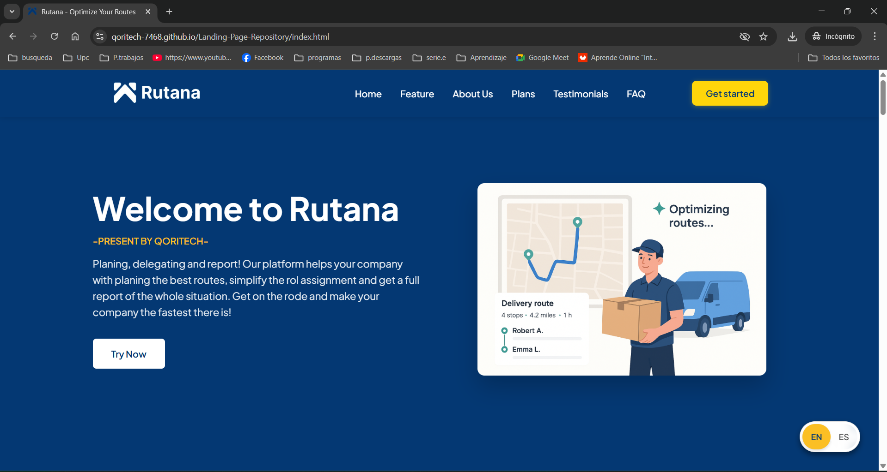
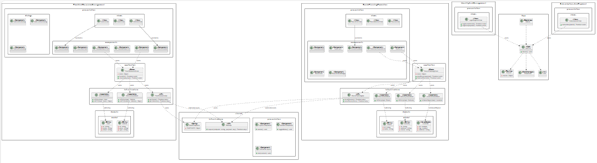
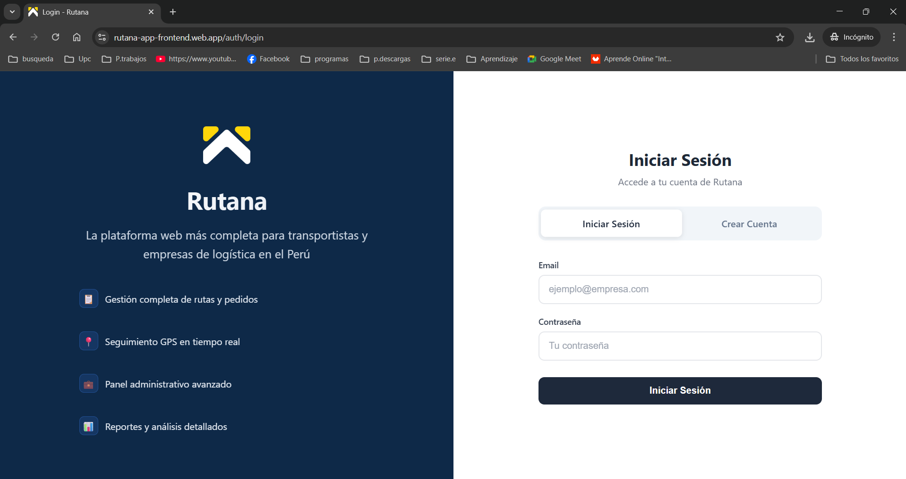
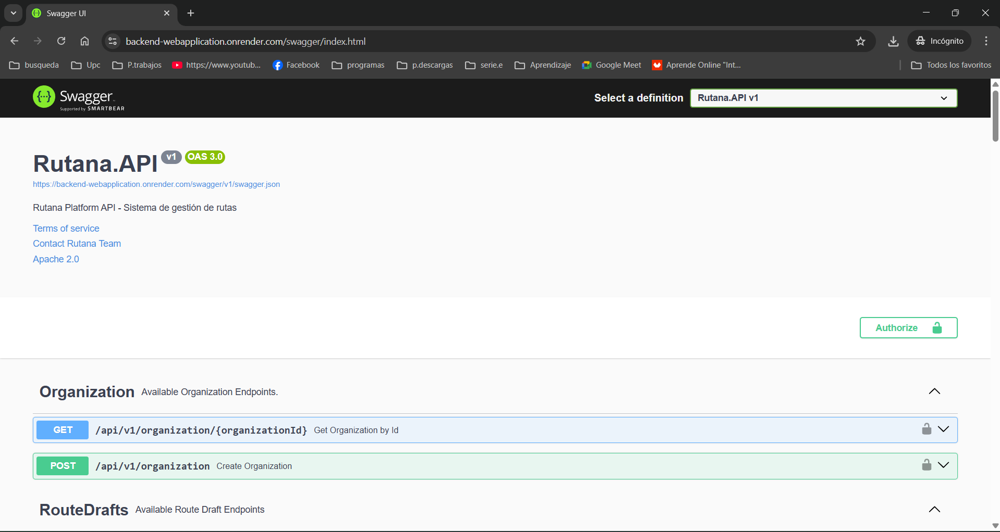

## Conclusiones

### Conclusiones y recomendaciones.

#### Conclusiones

Durante el **Sprint 1** se logró construir la base conceptual, de diseño y de arquitectura de *Rutana (Qoritech Logistics System)*. Se abordaron de manera integral los aspectos de **startup profile**, **solution profile** y **segmentos objetivo**, lo que permitió comprender claramente el problema de los procesos logísticos actuales y definir el alcance de la solución.

Se consolidaron técnicas de **elicitation & analysis**, incluyendo entrevistas, needfinding y modelado con herramientas como **user personas, empathy maps y user journey maps**, que guiaron la definición precisa de las necesidades reales de los actores del sistema. Además, el **event storming** y la definición del **lenguaje ubicuo** sentaron una comunicación compartida y consistente entre el equipo y los stakeholders.

En la fase de **requirements specification**, se elaboraron **user stories, impact mapping y product backlog**, proporcionando una visión clara de los objetivos de negocio y de producto.

En **product design**, se desarrollaron lineamientos de estilo, arquitectura de información, wireframes, mockups y prototipos, tanto para la **Landing Page** como para la **Web App**, lo que permitió validar de forma temprana la experiencia de usuario y la organización de los flujos principales.

Finalmente, en **arquitectura de software**, se definieron diagramas C4 a nivel de contexto, contenedores y componentes, así como los primeros modelos de base de datos y diagramas de clases, estableciendo un marco sólido para los próximos sprints.

En resumen, este sprint cumplió con sentar las bases conceptuales, de diseño y técnicas que permitirán abordar la implementación progresiva de las funcionalidades core en las siguientes iteraciones.

Durante el **Sprint 2** se logró materializar la arquitectura conceptual definida en el sprint anterior mediante la implementación del frontend de *Rutana (Qoritech Logistics System)*. Se desarrolló una aplicación web completa utilizando **PrimeVue** como framework de componentes, implementando los cuatro bounded contexts principales identificados en el diseño arquitectónico.

Se implementaron exitosamente los módulos de **Fleet and Resource Management** para la gestión de vehículos y recursos, **Customer & Location Management** para la administración de clientes finales y sus puntos de entrega, **Route Planning & Execution** para la creación, publicación, monitoreo y cierre de rutas, e **Identity and Access Management** para el control de usuarios y permisos.

El desarrollo se apoyó en una **Fake API** que simuló los principales endpoints de creación, permitiendo validar la funcionalidad completa del sistema sin depender de servicios backend reales. Esta aproximación facilitó la iteración rápida y la validación temprana de la experiencia de usuario además de también usar **i18n**

Adicionalmente, se refinaron y mejoraron los diagramas C4 y la arquitectura aplicando principios de **Domain Driven Design**, consolidando una estructura más robusta y escalable. El sistema fue desplegado en **Firebase** y sometido a pruebas en un entorno similar a producción, lo que permitió evaluar el rendimiento y la experiencia real de usuario.

En resumen, este sprint cumplió con transformar los conceptos y diseños del Sprint 1 en una aplicación funcional, estableciendo una base sólida para la implementación de los servicios backend en las siguientes iteraciones.

---

#### Recomendaciones

* **Validar prototipos con usuarios reales** antes del inicio del Sprint 2 para recoger retroalimentación temprana sobre la experiencia de la Landing Page y la Web App.
* **Refinar el backlog** priorizando aquellas historias de usuario que aportan mayor valor al negocio (ej. gestión de rutas y despachos), evitando dispersión en funcionalidades accesorias.
* **Alinear continuamente el lenguaje ubicuo** con los stakeholders para asegurar que todos los términos se correspondan con la operación real de los transportistas y clientes.
* **Preparar pruebas técnicas de integración** entre frontend y backend, anticipando la conexión con servicios externos (Google Maps, Stripe, Cloudinary) en el siguiente sprint.
* **Iniciar un plan de calidad de software** con convenciones de código, pruebas automatizadas y lineamientos de documentación, garantizando consistencia en la implementación futura.

## Bibliografía

- Atlassian. (2025). *Gitflow Workflow*. Atlassian Git Tutorials. Recuperado el 10 de setiembre de 2025 de [Atlassian Gitflow](https://www.atlassian.com/git/tutorials/comparing-workflows/gitflow-workflow)
- Chatuev, A. (2025). *Big Picture Event Storming*. Medium. Recuperado el 10 de setiembre de 2025 de [Medium Event Storming](https://medium.com/@chatuev/big-picture-event-storming-7a1fe18ffabb)
- Cucumber Team. (2025). *Gherkin Reference*. Cucumber Documentation. Recuperado el 10 de setiembre de 2025 de [Cucumber Gherkin](https://cucumber.io/docs/gherkin/)
- Event Storming Journal. (2025). *How to explain Design Level Event Storming to your mother*. Event Storming Journal. Recuperado el 10 de setiembre de 2025 de [Event Storming Journal](https://www.eventstormingjournal.com/software%20design/how-to-explain-design-level-event-storming-to-your-mother/)
- Flock Freight. (14 de septiembre de 2023). *Flock Freight Study Reveals Freight Inefficiencies Fuel America’s Food and Beverage Waste, Leading to Price Increases.* Recuperado el 10 de setiembre de 2025 de [Flock Freight](https://www.flockfreight.com/company/press-releases/flock-freight-study-reveals-freight-inefficiencies-fuel-americas-food-and-beverage-waste-leading-to-price-increases)
- Google. (2025). *Get started with Firebase Hosting*. Firebase Documentation. Recuperado el 10 de setiembre de 2025 de [Firebase Hosting](https://firebase.google.com/docs/hosting/quickstart)
- Inbound Logistics. (marzo de 2025). *IoT in Logistics: What It Is, Applications, and Benefits.* Recuperado el 10 de setiembre de 2025 de [Inbound Logistics](https://www.inboundlogistics.com/articles/iot-in-logistics/)
- Locke, J. (2025, 18 de agosto). *IoT in Logistics: Applications and Benefits.* DIGI. Recuperado el 10 de setiembre del 2025 de [Digi](https://www.digi.com/blog/post/iot-in-logistics?utm_source)
- Loong, J. (2023, 28 de marzo). *9 Key Challenges in Freight Logistics & Transportation Industry.* Track-POD. Recuperado el 10 de setiembre de 2025 de [Track-POD](https://www.track-pod.com/blog/freight-logistics-challenges/)
- Showen, J. (2025, 10 de julio). *What Are the Top 5 Issues in the Transportation and Logistics Industry?* ECAM. Recuperado el 10 de setiembre de 2025 de [ECAM](https://ecam.com/security-blog/what-are-the-top-5-issues-in-the-transportation-and-logistics-industry)
- Vue.js Team. (2025). *Vue.js - The Progressive JavaScript Framework*. Vue.js Official Documentation. Recuperado el 10 de setiembre de 2025 de [Vue.js](https://vuejs.org/)
- Vue i18n Team. (2025). *Vue I18n - Internationalization plugin for Vue.js*. Vue I18n Documentation. Recuperado el 10 de setiembre de 2025 de [Vue I18n](https://vue-i18n.intlify.dev/)
- PrimeVue Team. (2025). *PrimeVue - Vue UI Component Library*. PrimeVue Documentation. Recuperado el 10 de setiembre de 2025 de [PrimeVue](https://primevue.org/)

## Anexos

### Anexo A. Contenido con Videos

<table>
<thead>
    <tr>
        <th>Sección</th>
        <th>Características del video</th>
        <th>Sobre el contenido</th>
        <th>Integración y entrega</th>
    </tr>
</thead>
<tbody>
<!--========================================= FILA 1 ======================================-->
<tr>
  <td>Needfinding Interviews</td>
  <td>
    Cantidad de videos: 6 
    Nomenclatura: upc-pre-202520-1asi0730-7468-QoriTech-needfinding-sprint-1 
    Formato: .mp4
  </td>
  <td> Consolida todas las entrevistas realizadas </td>
  <td> 
    <strong>Link:</strong> 
    <a href="https://tinyurl.com/2amttkcn" target="_blank">
      https://tinyurl.com/2amttkcn
    </a>
</td>
</tr>
<!--========================================= FILA 2 ======================================-->
<tr>
  <td rowspan="4">Presentations</td>
  <td>
    Cantidad de videos: 1  
    Nomenclatura: upc-pre-202520-1asi0730-7468-QoriTech-expo-tb1  
    Formato: .mp4
  </td>
  <td>Consolida la exposición de la TB1</td>
  <td>
    <strong>Link:</strong> 
    <a href="https://tinyurl.com/yspubw8k" target="_blank">
      https://tinyurl.com/yspubw8k
    </a>
  </td>
</tr>
<tr>
  <td>
    Cantidad de videos: 1  
    Nomenclatura: upc-pre-202520-1asi0730-7468-QoriTech-expo-tp1  
    Formato: .mp4
  </td>
  <td>Consolida la exposición de la Tp1</td>
  <td>
    <strong>Link:</strong> 
    <a href="https://shorturl.at/zGhAA" target="_blank">
      https://shorturl.at/zGhAA
    </a>
  </td>
</tr>
<tr>
  <td>
    Cantidad de videos: 1  
    Nomenclatura: upc-pre-202520-1asi0730-7468-QoriTech-expo-Tb2  
    Formato: .mp4
  </td>
  <td>Consolida la exposición de la TB2</td>
  <td>
    <strong>Link:</strong> 
    <a href="https://shorturl.at/asdasd" target="_blank">
      https://shorturl.at/asdasd
    </a>
  </td>
</tr>
<tr>
  <td>
    Cantidad de videos: 1  
    Nomenclatura: upc-pre-202520-1asi0730-7468-QoriTech-expo-tf1  
    Formato: .mp4
  </td>
  <td>Consolida la exposición de la TF1</td>
  <td>
    <strong>Link:</strong> 
    <a href=" " target="_blank">
      Ver video
    </a>
  </td>
</tr>
<!--========================================= FILA 3 ======================================-->
<tr>
  <td>
    Prototypes Navigation / Product Navigation
  </td>
  <td>
    Cantidad de videos: 1 
    Nomenclatura: upc-pre-202520-1asi0730-7468-QoriTech-prototype-navigation-sprint-1 
    Formato: .mp4
  </td>
  <td>
    Consolida demostración del flujo de navegación de las aplicaciones, priorizando los user flows relacionados con el core business.	
  </td>
  <td>
     <strong>Link:</strong> 
    <a href=" " target="_blank">
      Ver video
    </a>
  </td>
</tr>
<!--========================================= FILA 4 ======================================-->
<tr>
  <td>
    Validation Interviews
  </td>
  <td>
   Cantidad de Videos: 
    Nomenclatura:
    upc-pre-202520-1asi0730-7468-QoriTech-validation-sprint-4
Formato: .mp4
  </td>
  <td>
    Contenido 
  </td>
  <td>
    <strong>Link:</strong>
    <a href="https://tinyurl.com/yuush9bw" target="_blank">
      https://tinyurl.com/yuush9bw
    </a>
  </td>
</tr>
<!--========================================= FILA 5 ======================================-->
<tr>
  <td>
    About the Product
  </td>
  <td>
    Cantidad de videos: 1 
    Nomenclatura: upc-pre-202520-1asi0730-7468-QoriTech-aboutthe-product-sprint-3 
    Formato: .mp4 
  </td>
  <td>
    Orientación promocional, resumiendo el modelo de negocio, las características y beneficios del producto, incluyendo algunas escenas de interacción con el producto y al menos una opinión por cada segmento objetivo.
  </td>
  <td>
   <strong>Link:</strong> 
    <a href="https://youtu.be/2dZIAQPCCvM" target="_blank">
      https://youtu.be/2dZIAQPCCvM
    </a>
  </td>
</tr>
<!--========================================= FILA 6 ======================================-->
<tr>
  <td>
    About the Team
  </td>
  <td>
    Cantidad de videos: 1 
    Nomenclatura: upc-pre-202520-1asi0730-7468-QoriTech-aboutthe-team-sprint-3 
    Formato: .mp4  
  </td>
  <td>
    En este video se presenta un breve resumen del proceso de investigación de la lógica de negocio, así como las técnicas y métodos utilizados para el trabajo en equipo, e incluye testimonios breves de cada integrante sobre su experiencia en el desarrollo del proyecto.
  </td>
  <td>
   <strong>Link:</strong> 
    <a href="https://youtu.be/yTjJL1V40TA" target="_blank">
      https://youtu.be/yTjJL1V40TA
    </a>
  </td>
</tr>
</tbody>
</table>

### Anexo B. Trello
<table>
<thead>
    <tr>
        <th>Sección</th>
        <th>Características</th>
        <th>Sobre el contenido</th>
        <th>Link del Trello</th>
    </tr>
</thead>
<tr>
  <td>
    Product Backlog
  </td>
  <td>
    Cantidad de Sprints: 3
  </td>
  <td>
    Es un tablero de Trello que muestra la organización del proyecto mediante un Product Backlog y varios Sprints, donde se distribuyen las historias de usuario y tareas (como creación de cuentas, gestión de roles, clientes y rutas) para planificar y controlar el desarrollo de la aplicación de forma ágil.
  </td>
  <td>
    <strong>Link:</strong> 
    <a href="https://tinyurl.com/y3ap6aaf" target="_blank">
      https://tinyurl.com/y3ap6aaf
    </a>
  </td>
</tr>
<tr>
  <td>
    Sprint Backlog #1
  </td>
  <td>
    Cantidad de tareas: 13
  </td>
  <td>
    Es un tablero de Trello enfocado en un Sprint, donde se define la meta del sprint y se distribuyen las tareas en diferentes estados para organizar el trabajo del equipo y dar seguimiento al progreso durante el desarrollo del proyecto.
  </td>
  <td>
    <strong>Link:</strong> 
    <a href="https://tinyurl.com/3mzf4e3d" target="_blank">
      https://tinyurl.com/3mzf4e3d
    </a>
  </td>
</tr>
<tr>
  <td>
    Sprint Backlog #2
  </td>
  <td>
    Cantidad de tareas: 23
  </td>
  <td>
    Es un tablero de Trello enfocado en un Sprint, donde se define la meta del sprint y se distribuyen las tareas en diferentes estados para organizar el trabajo del equipo y dar seguimiento al progreso durante el desarrollo del proyecto.
  </td>
  <td>
    <strong>Link:</strong> 
    <a href="https://tinyurl.com/32ksv7vd" target="_blank">
      https://tinyurl.com/32ksv7vd
    </a>
  </td>
</tr>
<tr>
  <td>
    Sprint Backlog #3
  </td>
  <td>
    Cantidad de tareas: 51
  </td>
  <td>
    Es un tablero de Trello enfocado en un Sprint, donde se define la meta del sprint y se distribuyen las tareas en diferentes estados para organizar el trabajo del equipo y dar seguimiento al progreso durante el desarrollo del proyecto.
  </td>
  <td>
    <strong>Link:</strong> 
    <a href="https://tinyurl.com/43mfv7ey" target="_blank">
      https://tinyurl.com/43mfv7ey
    </a>
  </td>
</tr>
<tr>
  <td>
    Sprint Backlog #4
  </td>
  <td>
    Cantidad de tareas: 
  </td>
  <td>
    Es un tablero de Trello enfocado en un Sprint, donde se define la meta del sprint y se distribuyen las tareas en diferentes estados para organizar el trabajo del equipo y dar seguimiento al progreso durante el desarrollo del proyecto.
  </td>
  <td>
    <strong>Link:</strong> 
    <a href="https://tinyurl.com/mr33c6yw" target="_blank">
      https://tinyurl.com/mr33c6yw
    </a>
  </td>
</tr>
<table>

### Anexo C. Diseño y Prototipo

Enlace de Figma: <a href= "https://www.figma.com/design/5jPKslsPd2yzl8DypTv23M/Landing-page-Qoritech?node-id=0-1&t=c9KtMK86xgb6Tnmi-1"> https://www.figma.com/design/5jPKslsPd2yzl8DypTv23M/Landing-page-Qoritech?node-id=0-1&t=c9KtMK86xgb6Tnmi-1</a>

### Anexo D. Deployment de landing page
Link de la landing page: <a href="https://qoritech-7468.github.io/Landing-Page-Repository/index.html" target="_blank">
     https://qoritech-7468.github.io/Landing-Page-Repository/index.html
    </a>

### Anexo E. Diagrama de Clases Frontend
Link del diagrama: <a href="https://shorturl.at/J0nyP" target="_blank">
      https://shorturl.at/J0nyP
    </a>
    

### Anexo F. Deployment de aplicación frontend
Link de aplicación frontend:<a href="https://shorturl.at/g93lZ" target="_blank">
      https://shorturl.at/g93lZ
    </a> 

  

### Anexo G. Deploynment backend
Link del video: <a href="https://backend-webapplication.onrender.com/swagger/index.html" target="_blank">
      https://backend-webapplication.onrender.com/swagger/index.html
    </a>

  
