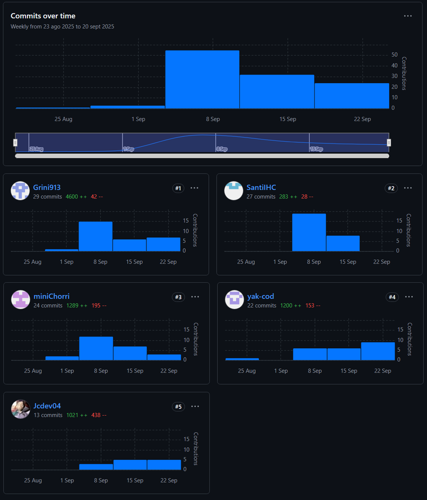
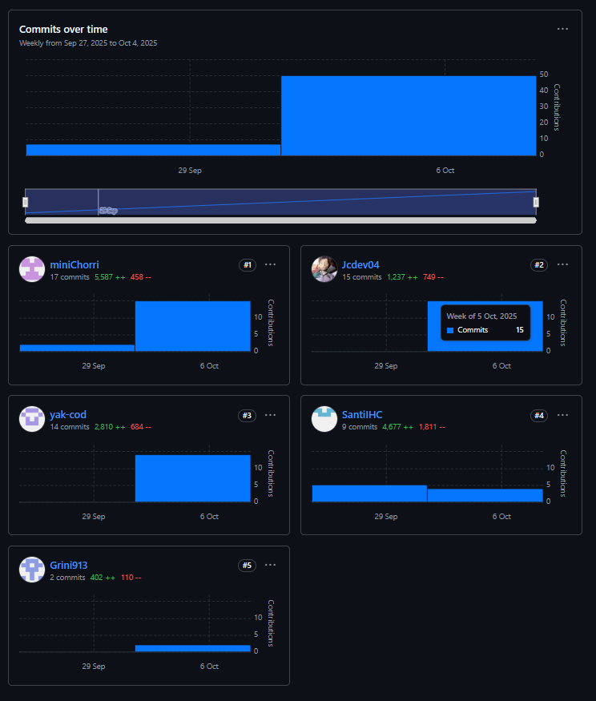

  
### Universidad Peruana de Ciencias Aplicadas

**Ingeniería de software - 2025-02**  

**Curso:** 1ASI0730 Aplicaciones Web  

**NRC:** 7468  

**Profesor:** Velásquez Núñez, Ángel Augusto  

**StartUp:** QoriTech  

**Producto:** Rutana  

**Informe Trabajo Final**  

<table align="center"> 
<tr>
<th>Integrantes</th>
<th>Código</th>
</tr> 
<tr>
<td>Castillo Vidal, Jesus Ivan</td>
<td>U202322952</td>
</tr> 
<tr>
<td>Costa Morales, Christofer William</td>
<td>U202315968</td>
</tr> 
<tr>
<td>Gordillo Ramos, Santiago Alonso </td>
<td>U202215160</td>
</tr> 
<tr>
<td>Guzmán Cabrejos, Yaku Mateo </td>
<td>U20231B173</td>
</tr> 
<tr>
<td>Medina Merma, Ingrid Melani </td>
<td>U202213185</td>
</tr>
</table>

 Septiembre 2025 

## **Registro de versiones del Informe**

<table>
  <tr>
    <th>Version</th>
    <th>Fecha</th>
    <th>Autor</th>
    <th>Descripción de modificación </th>
  </tr>
   <tr>
    <td align="center">1.0</td>
    <td align="center">2025-09-10</td>
    <td> Guzmán Cabrejos, Yaku Mateo</td>
    <td> 
      Se creo la ramificación del repositorio y adicionó los documentos en su versión inicial previa a la investigacón</td>
  </tr>
  <tr>
    <td align="center">1.1</td>
    <td align="center">2025-09-10</td>
    <td> Guzmán Cabrejos, Yaku Mateo</td>
    <td> 
        <ul>
          <li>Startup Profile</li>
          <li>Descripción de la Startup</li>
          <li>Perfiles de integrantes del equipo</li>
        </ul></td>
  </tr>
  <tr>
  <td align="center">1.2</td>
    <td align="center">2025-09-10</td>
    <td> Medina Merma, Ingrid Melani</td>
    <td>
        <ul>
          <li>Solution Profile</li>
          <li>Antecedentes y problemática</li>
          <li>Bibliografía</li>
        </ul></td>
  </tr>
    <tr>
    <td align="center">1.3</td>
    <td align="center">2025-09-10</td>
    <td>Gordillo Ramos, Santiago Alonso</td>
    <td>
        <ul>
          <li> Lean UX Process.</li>
          <li> Lean UX Problem Statements.</li>
          <li> Lean UX Assumptions.</li>
        </ul></td>
  </tr>
      <tr>
      <td align="center">1.4</td>
    <td align="center">2025-09-10</td>
    <td>Castillo Vidal, Jesus Ivan</td>
    <td>
        <ul>
          <li> Lean UX Hypothesis Statements.</li>
        </ul></td>
  </tr>
      <tr>
      <td align="center">1.5</td>
    <td align="center">2025-09-10</td>
    <td>Costa Morales, Christofer William</td>
    <td>
        <ul>
          <li>  Lean UX Canvas.</li>
        </ul></td>
  </tr>
        <tr>
      <td align="center">1.6</td>
    <td align="center">2025-09-10</td>
    <td>Castillo Vidal, Jesus Ivan</td>
    <td>
        <ul>
          <li>Segmentos objetivo.</li>
        </ul></td>
  </tr>
<tr>
<td align="center">1.7</td>
    <td align="center">2025-09-11</td>
    <td>Castillo Vidal, Jesus Ivan</td>
    <td> 
        <ul>
          <li>Competidores.</li>
          <li>Análisis competitivo.</li>
          <li>Estrategias y tácticas frente a competidores.</li>
        </ul></td>
</tr>
<tr>
<td align="center">1.8</td>
    <td align="center">2025-09-11</td>
    <td>Costa Morales, Christofer William</td>
    <td> 
        <ul>
          <li>Se agrego el Diseño de entrevistas hecho en grupo</li>
          <li>Registro de entrevistas (foto, descripción).</li>
          <li> Análisis de entrevistas</li>
        </ul></td>
</tr>
<tr>
<td align="center">1.9</td>
    <td align="center">2025-09-12</td>
    <td>Costa Morales, Christofer William</td>
    <td> 
        <ul>
          <li>User Personas</li>
          <li>User Task Matrix</li>
        </ul></td>
</tr>
<tr>
<td align="center">1.10</td>
    <td align="center">2025-09-12</td>
    <td>Medina Merma, Ingrid Melani</td>
    <td> 
        <ul>
          <li>User Journey Mapping</li>
        </ul></td>
</tr>
<tr>
<td align="center">1.11</td>
    <td align="center">2025-09-12</td>
    <td>Medina Merma, Ingrid Melani</td>
    <td> 
        <ul>
          <li>User Journey Mapping</li>
        </ul></td>
</tr>
<tr>
<td align="center">1.12</td>
    <td align="center">2025-09-12</td>
    <td>Guzmán Cabrejos, Yaku Mateo</td>
    <td> 
        <ul>
          <li>Empathy Mapping.</li>
        </ul></td>
</tr>
<tr>
<td align="center">1.13</td>
    <td align="center">2025-09-15</td>
    <td>Medina Merma, Ingrid Melani</td>
    <td> 
        <ul>
          <li>Big Picture EventStorming</li>
        </ul></td>
</tr>
<tr>
<td align="center">1.14</td>
    <td align="center">2025-09-15</td>
     <td>Guzmán Cabrejos, Yaku Mateo</td>
    <td> 
        <ul>
          <li>Ubiquitous Language</li>
        </ul></td>
</tr>
<tr>
<td align="center">1.15</td>
    <td align="center">2025-09-15</td>
    <td>Guzmán Cabrejos, Yaku Mateo</td>
    <td> 
        <ul>
          <li>User Stories (epics)</li>
        </ul></td>
</tr>
<tr>
<td align="center">1.15</td>
    <td align="center">2025-09-16</td>
    <td>Castillo Vidal, Jesus Ivan</td>
    <td> 
        <ul>
          <li>Impact Mapping</li>
        </ul></td>
</tr>
<tr>
<td align="center">1.17</td>
    <td align="center">2025-09-16</td>
    <td>Guzmán Cabrejos, Yaku Mateo</td>
    <td> 
        <ul>
          <li>Product Backlog.</li>
        </ul></td>
</tr>
<tr>
<td align="center">1.18</td>
    <td align="center">2025-09-18</td>
    <td>Costa Morales, Christofer William</td>
    <td> 
        <ul>
          <li>Style Guidelines.</li>
          <li>General Style Guidelines.</li>
          <li>Web Style Guidelines.</li>
          <li>Organization Systems.</li>
          <li>Labeling Systems.</li>
        </ul></td>
</tr>
<td align="center">1.19</td>
    <td align="center">2025-09-18</td>
    <td>Gordillo Ramos, Santiago Alonso</td>
    <td> 
        <ul>
          <li>SEO Tags and Meta Tags</li>
          <li> Searching Systems</li>
          <li>Navigation Systems.</li>
          <li>Landing Page UI Design.</li>
          <li>Landing Page Wireframe.</li>
          <li>Landing Page Mock-up.</li>
        </ul></td>
</tr>
<tr>
<td align="center">1.20</td>
    <td align="center">2025-09-18</td>
    <td>Castillo Vidal, Jesus Ivan</td>
    <td> 
        <ul>
          <li>Web Applications UX/UI Design.</li>
          <li> Web Applications Wireframes.</li>
          <li>Web Applications Wireflow Diagrams.</li>
          <li>Web Applications Mock-ups.</li>
          <li> Web Applications User Flow Diagrams.</li>
          <li>Web Applications Prototyping.</li>
        </ul></td>
</tr>
<tr>
<td align="center">1.21</td>
    <td align="center">2025-09-19</td>
    <td>Medina Merma, Ingrid Melani</td>
    <td> 
        <ul>
          <li> Domain-Driven Software Architecture.</li>
          <li>Design-Level EventStorming.</li>
        </ul></td>
</tr>
<tr>
<td align="center">1.22</td>
    <td align="center">2025-09-19</td>
    <td>Guzmán Cabrejos, Yaku Mateo</td>
    <td> 
        <ul>
          <li>Software Architecture Context Diagram.</li>
          <li>Software Architecture Container Diagrams.</li>
          <li>Software Architecture Components Diagrams.</li>
        </ul></td>
</tr>
<tr>
<td align="center">1.23</td>
    <td align="center">2025-09-20</td>
    <td>Medina Merma, Ingrid Melani</td>
    <td> 
        <ul>
          <li>Software Object-Oriented Design.</li>
          <li>Class Diagrams.</li>
          <li>Database Design.</li>
          <li> Database Diagrams.</li>
        </ul></td>
</tr>
<tr>
<td align="center">1.24</td>
    <td align="center">2025-09-20</td>
    <td>Castillo Vidal, Jesus Ivan</td>
    <td> 
        <ul>
          <li>Software Configuration Management.</li>
          <li>Software Development Environment Configuration.</li>
          <li>Source Code Management.</li>
          <li>Source Code Style Guide & Conventions.</li>
          <li>Software Deployment Configuration.</li>
          <li> Landing Page, Services & Applications Implementation.</li>
          <li>Sprint Planning 1.</li>
        </ul></td>
</tr>
<tr>
<td align="center">1.25</td>
    <td align="center">2025-09-20</td>
    <td>Guzmán Cabrejos, Yaku Mateo</td>
    <td> 
        <ul>
          <li>Aspect Leaders and Collaborators.</li>
          <li>Sprint Backlog 1.</li>
          <li>Development Evidence for Sprint Review.</li>
          <li>Execution Evidence for Sprint Review.</li>
          <li>Services Documentation Evidence for Sprint Review.</li>
          <li>Software Deployment Evidence for Sprint Review.</li>
          <li>Team Collaboration Insights during Sprint.</li>
          <li>Anexos.</li>
        </ul></td>
</tr>
<tr>
<td align="center">2.0</td>
    <td align="center">2025-10-04</td>
    <td>Medina Merma, Ingrid Melani</td>
    <td> 
        <ul>
          <li>Se actualizarn las conclusiones en Student Outcome</li>
          <li>Se modifico la tabla de Registro de versión del Informe</li>
        </ul></td>
</tr>
<tr>
<td align="center">2.1</td>
    <td align="center">2025-10-07</td>
    <td>Medina Merma, Ingrid Melani</td>
    <td> 
        <ul>
          <li>Se corrigio el Lean UX Hypothesis Statements.</li>
          <li>Product Baclog</li>
          <li>Entrevistas</li>
        </ul></td>
</tr>
<tr>
<td align="center">2.2</td>
    <td align="center">2025-10-09</td>
    <td>Castillo Vidal, Jesus Ivan</td>
    <td> 
        <ul>
          <li>Domain-Driven Software Architecture</li>
          <li>Sprint 2</li>
          <li>Sprint Planning 2.</li>
          <li>Aspect Leaders and Collaborators.</li>
          <li>Sprint Backlog 2</li>
          <li>Development Evidence for Sprint Review.</li>
          <li>Execution Evidence for Sprint Review.</li>
          <li>Software Deployment Evidence for Sprint Review.</li>
          <li>Team Collaboration Insights during Sprint.</li>
          <li>Conclusiones</li>
          <li>Bibliografia</li>
          <li>Anexos</li>
        </ul></td>
</tr>
<td align="center">2.3</td>
    <td align="center">2025-10-10</td>
    <td>Castillo Vidal, Jesus Ivan</td>
    <td> 
        <ul>
          <li>Student Outcome</li>
        </ul></td>
</tr>
</tr>
<td align="center">2.4</td>
    <td align="center">2025-10-10</td>
    <td>Guzmán Cabrejos, Yaku Mateo</td>
    <td> 
        <ul>
          <li>Student Outcome</li>
        </ul></td>
</tr>
</tr>
<td align="center">2.5</td>
    <td align="center">2025-10-1</td>
    <td>Gordillo Ramos, Santiago Alonso</td>
    <td> 
        <ul>
          <li>Student Outcome</li>
        </ul></td>
</tr>
</tr>
<td align="center">2.6</td>
    <td align="center">2025-10-10</td>
    <td>Costa Morales, Christofer Williamn</td>
    <td> 
        <ul>
          <li>Student Outcome</li>
        </ul></td>
</tr>
</tr>
<td align="center">2.7</td>
    <td align="center">2025-10-10</td>
    <td>Medina Merma, Ingrid Melani</td>
    <td> 
        <ul>
          <li>Student Outcome</li>
        </ul></td>
</tr>
</table>

## Project Report Collaboration Insights

Para el desarrollo del **Project Report**, se utilizó un repositorio dentro de la organización del equipo en GitHub. A continuación, se presenta la evidencia de colaboración correspondiente, en coherencia con el Registro de Versiones del Informe.

**Repositorio del informe del proyecto:**
[https://shorturl.at/aQDFp](https://shorturl.at/aQDFp)

- **Total de commits:** 59
- **Autores contribuyentes:**
  - Jesús Castillo
  - Ingrid Medina
  - Christofer Costa
  - Yaku Guzmán
  - Santiago Gordillo
- Actividad distribuida por ramas correspondientes a cada sección del informe.

## TB1 - Informe inicial y Landing Page (8 de setiembre - 21 de setiembre de 2025)

Durante esta fase, el equipo elaboró el informe base del proyecto, abarcando la definición del problema, justificación, objetivos y marco teórico. Simultáneamente, se desarrolló la **Landing Page** utilizando HTML5, CSS3 y JavaScript puro.

- Jesús Castillo: 13 commits, 1021 adiciones, 438 eliminaciones
- Ingrid Medina: 29 commits, 4600 adiciones, 42 eliminaciones
- Christofer Costa: 24 commits, 1289 adiciones, 195 eliminaciones
- Yaku Guzmán: 33 commits, 1200 adiciones, 153 eliminaciones
- Santiago Gordillo: 27 commits, 283 adiciones, 28 eliminaciones
- **Total de commits en TB1:** 59

## TP1 - Aplicación Frontend (22 de setiembre - 10 de octubre de 2025)

Durante esta fase, el equipo desarrolló la aplicación frontend completa utilizando Vue.js y PrimeVue, implementando los bounded contexts principales y desplegando la aplicación en Firebase Hosting.

- **miniChorri (Christofer Costa):** 17 commits, 5,587 adiciones, 458 eliminaciones
- **Jcdev04 (Jesús Castillo):** 15 commits, 1,237 adiciones, 749 eliminaciones
- **yak-cod (Yaku Guzmán):** 14 commits, 2,810 adiciones, 684 eliminaciones
- **SantiIHC (Santiago Gordillo):** 9 commits, 4,677 adiciones, 1,811 eliminaciones
- **Grini913 (Ingrid Medina):** 2 commits, 402 adiciones, 110 eliminaciones
- **Total de commits en TP1:** 57

# Tabla de contenidos

## [Capítulo I: Introducción](Capitulo_1.md)

- [1.1 Startup Profile](Capitulo_1.md#11-startup-profile)
  - [1.1.1 Descripción de la Startup](Capitulo_1.md#111-descripción-de-la-startup)
  - [1.1.2 Perfiles de integrantes del equipo](Capitulo_1.md#112-perfiles-de-integrantes-del-equipo)
- [1.2 Solution Profile](Capitulo_1.md#12-solution-profile)
  - [1.2.1 Antecedentes y problemática](Capitulo_1.md#121-antecedentes-y-problemática)
  - [1.2.2 Lean UX Process](Capitulo_1.md#122-lean-ux-process)
    - [1.2.2.1 Lean UX Problem Statements](Capitulo_1.md#1221-lean-ux-problem-statements)
    - [1.2.2.2 Lean UX Assumptions](Capitulo_1.md#1222-lean-ux-assumptions)
    - [1.2.2.3 Lean UX Hypothesis Statements](Capitulo_1.md#1223-lean-ux-hypothesis-statements)
    - [1.2.2.4 Lean UX Canvas](Capitulo_1.md#1224-lean-ux-canvas)
- [1.3 Segmentos Objetivos](Capitulo_1.md#13-segmentos-objetivo)

## [Capítulo II: Requirements Elicitation & Analysis](Capitulo_2.md)

- [2.1 Competidores](Capitulo_2.md#21-competidores)
  - [2.1.1 Análisis competitivo](Capitulo_2.md#211-análisis-competitivo)
  - [2.1.2 Estrategias y tácticas frente a competidores](Capitulo_2.md#212-estrategias-y-tácticas-frente-a-competidores)
- [2.2 Entrevistas](Capitulo_2.md#22-entrevistas)
  - [2.2.1 Diseño de entrevistas](Capitulo_2.md#221-diseño-de-entrevistas)
  - [2.2.2 Registro de entrevistas](Capitulo_2.md#222-registro-de-entrevistas)
  - [2.2.3 Análisis de entrevistas](Capitulo_2.md#223-análisis-de-entrevistas)
- [2.3 Needfinding](Capitulo_2.md#23-needfinding)
  - [2.3.1 User Personas](Capitulo_2.md#231-user-personas)
  - [2.3.2 User Task Matrix](Capitulo_2.md#232-user-task-matrix)
  - [2.3.3 User Journey Mapping](Capitulo_2.md#233-user-journey-mapping)
  - [2.3.4 Empathy Mapping](Capitulo_2.md#234-empathy-mapping)
- [2.4 Big Picture EventStorming](Capitulo_2.md#24-big-picture-eventstorming)
- [2.5 Ubiquitous Language](Capitulo_2.md#25-ubiquitous-language)

## [Capítulo III: Requirements Specification](Capitulo_3.md)

- [3.1 User Stories](Capitulo_3.md#31-user-stories)
- [3.2 Impact Mapping](Capitulo_3.md#32-impact-mapping)
- [3.3 Product Backlog](Capitulo_3.md#33-product-backlog)

## [Capítulo IV: Product Design](Capitulo_4.md)

- [4.1 Style Guidelines](Capitulo_4.md#41-style-guidelines)
  - [4.1.1 General Style Guidelines](Capitulo_4.md#411-general-style-guidelines)
  - [4.1.2 Web Style Guidelines](Capitulo_4.md#412-web-style-guidelines)
- [4.2 Information Architecture](Capitulo_4.md#42-information-architecture)
  - [4.2.1 Organization Systems](Capitulo_4.md#421-organization-systems)
  - [4.2.2 Labeling Systems](Capitulo_4.md#422-labeling-systems)
  - [4.2.3 SEO Tags and Meta Tags](Capitulo_4.md#423-seo-tags-and-meta-tags)
  - [4.2.4 Searching Systems](Capitulo_4.md#424-searching-systems)
  - [4.2.5 Navigation Systems](Capitulo_4.md#425-navigation-systems)
- [4.3 Landing Page UI Design](Capitulo_4.md#43-landing-page-ui-design)
  - [4.3.1 Landing Page Wireframe](Capitulo_4.md#431-landing-page-wireframe)
  - [4.3.2 Landing Page Mock-up](Capitulo_4.md#432-landing-page-mock-up)
- [4.4 Web Applications UX/UI Design](Capitulo_4.md#44-web-applications-uxui-design)
  - [4.4.1 Web Applications Wireframes](Capitulo_4.md#441-web-applications-wireframes)
  - [4.4.2 Web Applications Wireflow Diagrams](Capitulo_4.md#442-web-applications-wireflow-diagrams)
  - [4.4.3 Web Applications Mock-ups](Capitulo_4.md#443-web-applications-mock-ups)
  - [4.4.4 Web Applications User Flow Diagrams](Capitulo_4.md#444-web-applications-user-flow-diagrams)
- [4.5 Web Applications Prototyping](Capitulo_4.md#45-web-applications-prototyping)
- [4.6 Domain-Driven Software Architecture](Capitulo_4.md#46-domain-driven-software-architecture)
  - [4.6.1 Design-Level EventStorming](Capitulo_4.md#461-design-level-eventstorming)
  - [4.6.2 Software Architecture Context Diagram](Capitulo_4.md#462-software-architecture-context-diagram)
  - [4.6.3 Software Architecture Container Diagrams](Capitulo_4.md#463-software-architecture-container-diagrams)
  - [4.6.4 Software Architecture Components Diagrams](Capitulo_4.md#464-software-architecture-components-diagrams)
- [4.7 Software Object-Oriented Design](Capitulo_4.md#47-software-object-oriented-design)
  - [4.7.1 Class Diagrams](Capitulo_4.md#471-class-diagrams)
  - [4.7.2 Class Dictionary](Capitulo_4.md#472-class-dictionary)
- [4.8 Database Design](Capitulo_4.md#48-database-design)
  - [4.8.1 Database Diagrams](Capitulo_4.md#481-database-diagrams)
- [4.9 DDD Estratégico](Capitulo_4.md#49-ddd-estratégico)

## [Capítulo V: Product Implementation, Validation & Deployment](Capitulo_5.md)

- [5.1 Software Configuration Management](Capitulo_5.md#51-software-configuration-management)
  - [5.1.1 Software Development Environment Configuration](Capitulo_5.md#511-software-development-environment-configuration)
  - [5.1.2 Source Code Management](Capitulo_5.md#512-source-code-management)
  - [5.1.3 Source Code Style Guide & Conventions](Capitulo_5.md#513-source-code-style-guide--conventions)
  - [5.1.4 Software Deployment Configuration](Capitulo_5.md#514-software-deployment-configuration)
- [5.2 Landing Page, Services & Applications Implementation](Capitulo_5.md#52-landing-page-services--applications-implementation)
  - [5.2.1 Sprint 1](Capitulo_5.md#521-sprint-1)
    - [5.2.1.1 Sprint Planning 1](Capitulo_5.md#5211-sprint-planning-1)
    - [5.2.1.2 Aspect Leaders and Collaborators](Capitulo_5.md#5212-aspect-leaders-and-collaborators)
    - [5.2.1.3 Sprint Backlog 1](Capitulo_5.md#5213-sprint-backlog-1)
    - [5.2.1.4 Development Evidence for Sprint Review](Capitulo_5.md#5214-development-evidence-for-sprint-review)
    - [5.2.1.5 Execution Evidence for Sprint Review](Capitulo_5.md#5215-execution-evidence-for-sprint-review)
    - [5.2.1.6 Services Documentation Evidence for Sprint Review](Capitulo_5.md#5216-services-documentation-evidence-for-sprint-review)
    - [5.2.1.7 Software Deployment Evidence for Sprint Review](Capitulo_5.md#5217-software-deployment-evidence-for-sprint-review)
    - [5.2.1.8 Team Collaboration Insights during Sprint](Capitulo_5.md#5218-team-collaboration-insights-during-sprint)
  - [5.2.2 Sprint 2](Capitulo_5.md#522-sprint-2)
    - [5.2.2.1 Sprint Planning 2](Capitulo_5.md#5221-sprint-planning-2)
    - [5.2.2.2 Aspect Leaders and Collaborators](Capitulo_5.md#5222-aspect-leaders-and-collaborators)
    - [5.2.2.3 Sprint Backlog 2](Capitulo_5.md#5223-sprint-backlog-2)
    - [5.2.2.4 Development Evidence for Sprint Review](Capitulo_5.md#5224-development-evidence-for-sprint-review)
    - [5.2.2.5 Execution Evidence for Sprint Review](Capitulo_5.md#5225-execution-evidence-for-sprint-review)
    - [5.2.2.6 Services Documentation Evidence for Sprint Review](Capitulo_5.md#5226-services-documentation-evidence-for-sprint-review)
    - [5.2.2.7 Software Deployment Evidence for Sprint Review](Capitulo_5.md#5227-software-deployment-evidence-for-sprint-review)
    - [5.2.2.8 Team Collaboration Insights during Sprint](Capitulo_5.md#5228-team-collaboration-insights-during-sprint)
  - [5.2.3 Sprint 3](Capitulo_5.md#523-sprint-3)
    - [5.2.3.1 Sprint Planning 3](Capitulo_5.md#5231-sprint-planning-3)
    - [5.2.3.2 Aspect Leaders and Collaborators](Capitulo_5.md#5232-aspect-leaders-and-collaborators)
    - [5.2.3.3 Sprint Backlog 3](Capitulo_5.md#5233-sprint-backlog-3)
    - [5.2.3.4 Development Evidence for Sprint Review](Capitulo_5.md#5234-development-evidence-for-sprint-review)
    - [5.2.3.5 Execution Evidence for Sprint Review](Capitulo_5.md#5235-execution-evidence-for-sprint-review)
    - [5.2.3.6 Services Documentation Evidence for Sprint Review](Capitulo_5.md#5236-services-documentation-evidence-for-sprint-review)
    - [5.2.3.7 Software Deployment Evidence for Sprint Review](Capitulo_5.md#5237-software-deployment-evidence-for-sprint-review)
    - [5.2.3.8 Team Collaboration Insights during Sprint](Capitulo_5.md#5238-team-collaboration-insights-during-sprint)
  - [5.2.3 Sprint 3](Capitulo_5.md#523-sprint-3)
    - [5.2.3.1 Sprint Planning 3](Capitulo_5.md#5231-sprint-planning-3)
    - [5.2.3.2 Aspect Leaders and Collaborators](Capitulo_5.md#5232-aspect-leaders-and-collaborators)
    - [5.2.3.3 Sprint Backlog 3](Capitulo_5.md#5233-sprint-backlog-3)

## [Conclusiones](Conclusiones_bibliografica.md#conclusiones)

- [Conclusiones y recomendaciones](Conclusiones_bibliografica.md#conclusiones-y-recomendaciones)
- [Video About-the-Team](Conclusiones_bibliografica.md#video-about-the-team)

## [Bibliografía](Conclusiones_bibliografica.md#bibliografía)

## [Anexos](Conclusiones_bibliografica.md#anexos)

## Student Outcome

ABET – EAC - Student Outcome 5 Criterio: La capacidad de funcionar efectivamente en un equipo cuyos miembros juntos proporcionan liderazgo, crean un entorno de colaboración e inclusivo, establecen objetivos, planifican tareas y cumplen objetivos.

| Criterio                                                                                        | Acciones realizadas                                                                                                                                                                                                                                                                                                                                                                                                                                                                                                                                                                                                                                                                                                                                                                                                                                                                                                                                                                                                                                                                                                                                                                                                                                                                                                                                                                                                                                                                                                                                                                                                                                                                                                                                                                                                                                                                                                                     | Conclusiones                                                                                                                                                                                                                                                                                                                                                                                                                                                                                                                                                                                                                                                                                                                                                                                                                                                                                                                                                                                                                                                                                                                                      |
| ----------------------------------------------------------------------------------------------- | --------------------------------------------------------------------------------------------------------------------------------------------------------------------------------------------------------------------------------------------------------------------------------------------------------------------------------------------------------------------------------------------------------------------------------------------------------------------------------------------------------------------------------------------------------------------------------------------------------------------------------------------------------------------------------------------------------------------------------------------------------------------------------------------------------------------------------------------------------------------------------------------------------------------------------------------------------------------------------------------------------------------------------------------------------------------------------------------------------------------------------------------------------------------------------------------------------------------------------------------------------------------------------------------------------------------------------------------------------------------------------------------------------------------------------------------------------------------------------------------------------------------------------------------------------------------------------------------------------------------------------------------------------------------------------------------------------------------------------------------------------------------------------------------------------------------------------------------------------------------------------------------------------------------------------------- | ------------------------------------------------------------------------------------------------------------------------------------------------------------------------------------------------------------------------------------------------------------------------------------------------------------------------------------------------------------------------------------------------------------------------------------------------------------------------------------------------------------------------------------------------------------------------------------------------------------------------------------------------------------------------------------------------------------------------------------------------------------------------------------------------------------------------------------------------------------------------------------------------------------------------------------------------------------------------------------------------------------------------------------------------------------------------------------------------------------------------------------------------- |
| Trabaja en equipo para proporcionar liderazgo en forma conjunta.                                | **Jesús Castillo:** **TB1:** Organizó al equipo, convocó reuniones, lideró sesiones de "event storming" y definió historias de usuario. Realizó wireframes y dio dirección al producto. **TP1:** Lideró la corrección del Design Level Event Storming, mejoró diagramas C4, documentó el Capítulo 5 del Sprint 2, definió la estructura del sprint, corrigió diseños en Figma y mejoró la UI/UX del frontend.  **Christofer Costa:** **TB1:** Aportó en "event storming", lideró el diseño de mockups y wireflows, generó imágenes y contribuyó en la landing page. **TP1:** Lideró el bounded context de Fleet & Resource Management, gestionó el módulo de clientes (Customer & Location Management) y configuró la infraestructura inicial del proyecto frontend con Vue.js y PrimeVue.  **Santiago Gordillo:** **TB1:** Gestionó el desarrollo de la landing page, organizó las tareas con gitflow y conventional commits, participó en entrevistas y elaboró el canvas. **TP1:** Lideró el bounded context de Identity & Access Management (IAM) y Fleet Management, implementando autenticación, gestión de usuarios, roles y permisos del sistema.  **Yaku Guzmán:** **TB1:** Brindó retroalimentación constante, orientó la documentación, apoyó en gitflow, artefactos, entrevistas y la landing page. **TP1:** Lideró el bounded context de Route Planning & Execution, desarrollando diagramas C4 específicos y gestionando toda la funcionalidad relacionada con rutas y entregas.  **Ingrid Medina:** **TB1:** Coordinó entrevistas, editó videos, aportó conocimientos del sector, realizó diagramas y wireframes, participando activamente en reuniones. **TP1:** Lideró la implementación de internacionalización (i18n), gestionó el Big Picture Event Storming, documentó tareas en Trello, mantuvo control del proyecto y coordinó la comunicación del equipo. | **TB1:**  El equipo demostró un sólido trabajo colaborativo, combinando liderazgo compartido y compromiso en cada etapa del proyecto. A través de una comunicación constante, una adecuada organización y el compromiso colectivo, se logró mantener la cohesión del grupo, equilibrando los aportes técnicos, visuales y metodológicos. Este trabajo en conjunto permitió desarrollar una propuesta sólida, bien estructurada y con un enfoque práctico, evidenciando una gestión eficiente y un liderazgo distribuido que potenció el desempeño grupal.  **TP1:** El equipo consolidó su liderazgo distribuido, donde cada miembro asumió responsabilidades específicas en bounded contexts particulares, demostrando especialización técnica y capacidad de comunicación efectiva. La distribución clara de roles permitió un desarrollo paralelo eficiente, mientras que la coordinación constante aseguró la integración exitosa de todos los módulos. Este enfoque especializado, combinado con liderazgo técnico y comunicación fluida, resultó en una aplicación frontend completamente funcional y desplegada en producción. |
| Crea un entorno colaborativo e inclusivo, establece metas, planifica tareas y cumple objetivos. | **Jesús Castillo:** **TB1:** Definió metas claras, repartió responsabilidades y dio seguimiento a avances, asegurando cumplimiento. **TP1:** Estableció objetivos técnicos claros para el frontend, coordinó la integración de bounded contexts y aseguró la calidad del diseño y documentación.  **Christofer Costa:** **TB1:** Propuso mejoras en los diseños, facilitó colaboración creativa y apoyó la ejecución de la landing page. **TP1:** Creó un entorno colaborativo para el desarrollo frontend, estableció estándares técnicos y facilitó la integración entre módulos de Fleet y Customer Management.  **Santiago Gordillo:** **TB1:** Dividió el trabajo, gestionó entregas técnicas y garantizó orden en el flujo de trabajo. **TP1:** Planificó y ejecutó las tareas de IAM y Fleet Management, estableciendo metas técnicas específicas y asegurando la integración con otros bounded contexts.  **Yaku Guzmán:** **TB1:** Promovió disciplina en la documentación y la integración del equipo, reforzando estándares de trabajo. **TP1:** Estableció metas claras para Route Planning & Execution, desarrolló diagramas C4 y coordinó la integración de funcionalidades de rutas con el sistema general.  **Ingrid Medina:** **TB1:** Apoyó en la planificación con entrevistas, diagramas y videos, reforzando la comunicación en el equipo. **TP1:** Creó un entorno inclusivo mediante la gestión de i18n, coordinó la documentación en Trello, estableció metas de comunicación y aseguró el cumplimiento de objetivos del proyecto.                                                                                                                                                                                                                                                                                                                        | **TB1:** El equipo logró crear un entorno colaborativo e inclusivo donde cada integrante aportó desde su área de especialidad para alcanzar metas comunes. Desde la planificación inicial, se establecieron metas claras y tareas bien definidas, lo que permitió mantener el orden y la eficiencia en el desarrollo del proyecto. Este enfoque favoreció la creatividad, el compromiso y la cooperación, asegurando el cumplimiento de los objetivos y fortaleciendo la cohesión grupal a lo largo del proceso.  **TP1:** El equipo evolucionó hacia un modelo de especialización técnica con comunicación efectiva, donde cada miembro lideró bounded contexts específicos mientras mantenía coordinación constante. Se establecieron metas técnicas claras por módulo, se planificaron tareas especializadas y se cumplieron objetivos de integración, resultando en una aplicación frontend completamente funcional. Este enfoque especializado, combinado con comunicación fluida y liderazgo distribuido, demostró la capacidad del equipo para adaptarse a desafíos técnicos complejos manteniendo la cohesión grupal.         |

