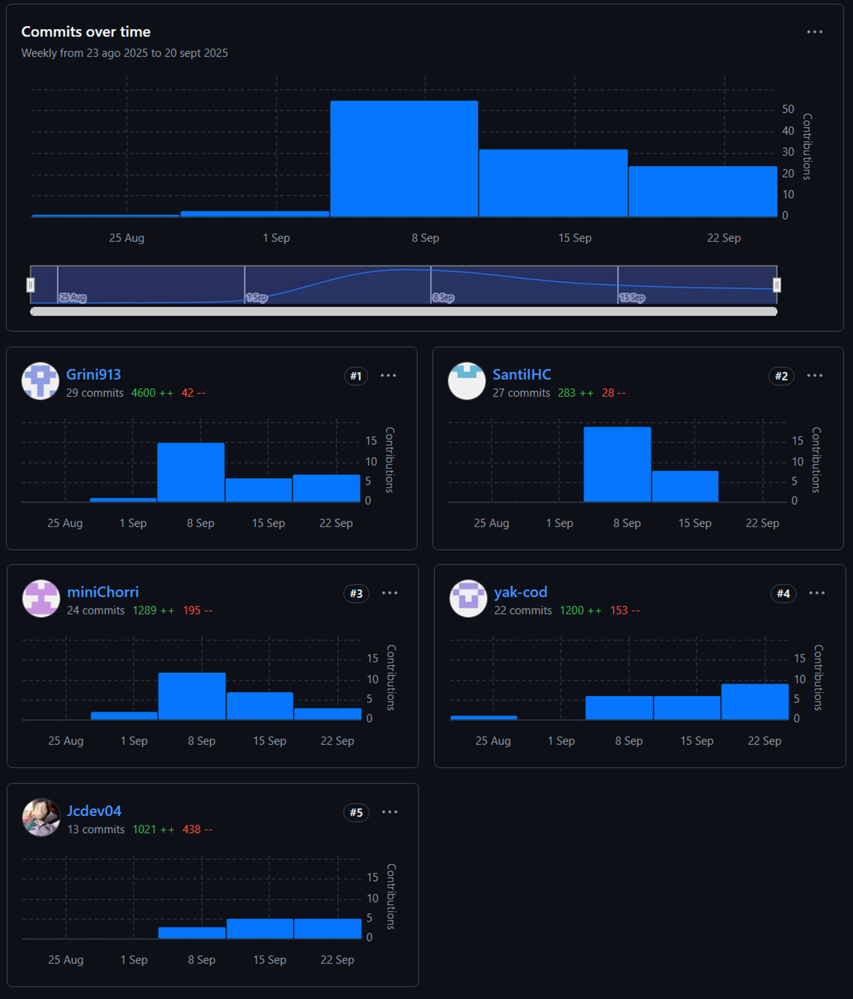
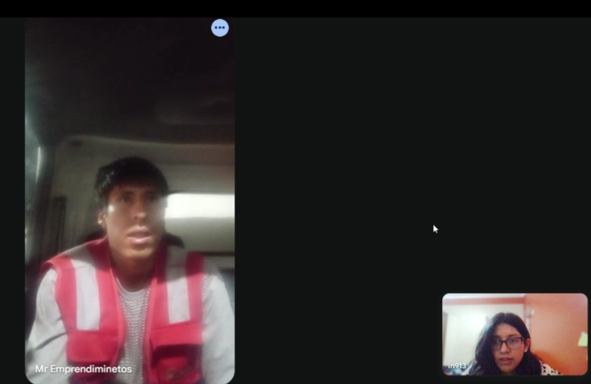
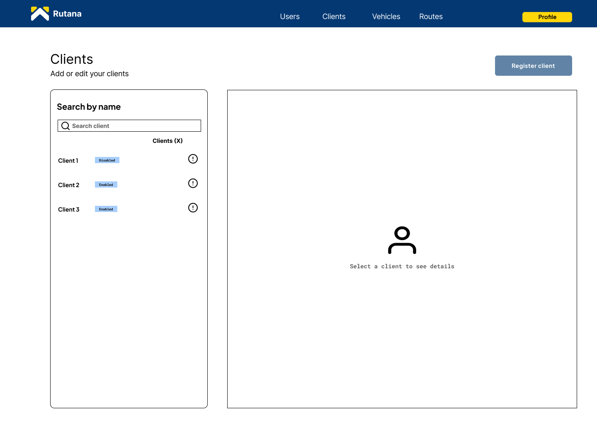
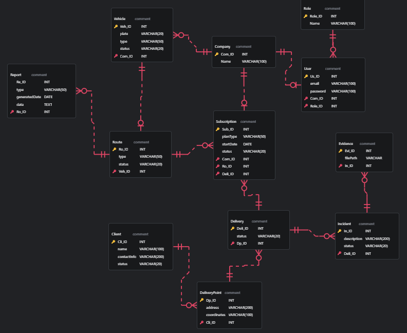
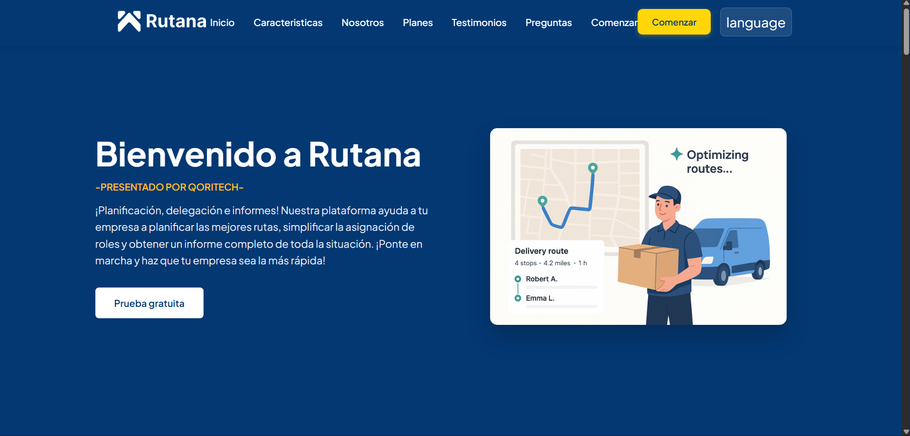
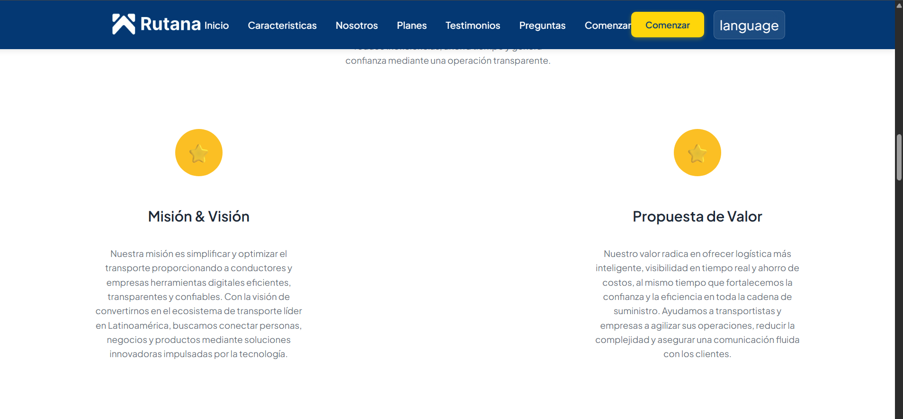
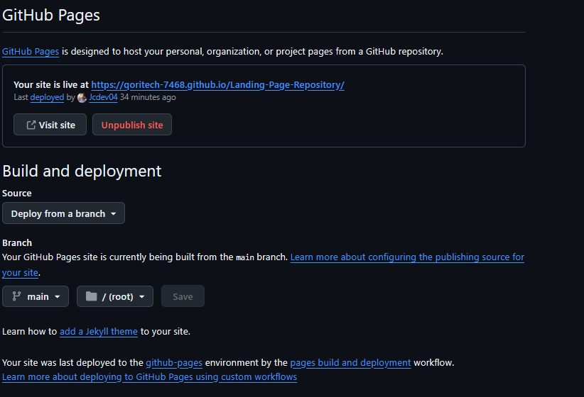

<div align= "center">
  
### Universidad Peruana de Ciencias Aplicadas

**Ingeniería de software - 2025-02**<br><br>

**Curso:** 1ASI0730 Aplicaciones Web<br><br>

**NRC:** 7468<br><br>

**Profesor:** Velásquez Núñez, Ángel Augusto<br><br>

**StartUp:** QoriTech<br><br>

**Producto:** Rutana<br><br>

**Informe Trabajo Final**<br><br>

<table align="center"> 
<tr>
<th>Integrantes</th>
<th>Código</th>
</tr> 
<tr>
<td>Castillo Vidal, Jesus Ivan</td>
<td>U202322952</td>
</tr> 
<tr>
<td>Costa Morales, Christofer William</td>
<td>U202315968</td>
</tr> 
<tr>
<td>Gordillo Ramos, Santiago Alonso </td>
<td>U202215160</td>
</tr> 
<tr>
<td>Guzmán Cabrejos, Yaku Mateo </td>
<td>U20231B173</td>
</tr> 
<tr>
<td>Medina Merma, Ingrid Melani </td>
<td>U202213185</td>
</tr>
</table>
<div> Septiembre 2025 </div>
</div>

## **Registro de versiones del Informe**

<table>
  <tr>
    <th>Version</th>
    <th>Fecha</th>
    <th>Autor</th>
    <th>Descripción de modificación </th>
  </tr>
   <tr>
    <td align="center">1.0</td>
    <td align="center">2025-09-10</td>
    <td> Guzmán Cabrejos, Yaku Mateo</td>
    <td> 
      Se creo la ramificación del repositorio y adicionó los documentos en su versión inicial previa a la investigacón</td>
  </tr>
  <tr>
    <td align="center">1.1</td>
    <td align="center">2025-09-10</td>
    <td> Guzmán Cabrejos, Yaku Mateo</td>
    <td> 
        <ul>
          <li>Startup Profile</li>
          <li>Descripción de la Startup</li>
          <li>Perfiles de integrantes del equipo</li>
        </ul></td>
  </tr>
  <tr>
  <td align="center">1.2</td>
    <td align="center">2025-09-10</td>
    <td> Medina Merma, Ingrid Melani</td>
    <td>
        <ul>
          <li>Solution Profile</li>
          <li>Antecedentes y problemática</li>
          <li>Bibliografía</li>
        </ul></td>
  </tr>
    <tr>
    <td align="center">1.3</td>
    <td align="center">2025-09-10</td>
    <td>Gordillo Ramos, Santiago Alonso</td>
    <td>
        <ul>
          <li> Lean UX Process.</li>
          <li> Lean UX Problem Statements.</li>
          <li> Lean UX Assumptions.</li>
        </ul></td>
  </tr>
      <tr>
      <td align="center">1.4</td>
    <td align="center">2025-09-10</td>
    <td>Castillo Vidal, Jesus Ivan</td>
    <td>
        <ul>
          <li> Lean UX Hypothesis Statements.</li>
        </ul></td>
  </tr>
      <tr>
      <td align="center">1.5</td>
    <td align="center">2025-09-10</td>
    <td>Costa Morales, Christofer William</td>
    <td>
        <ul>
          <li>  Lean UX Canvas.</li>
        </ul></td>
  </tr>
        <tr>
      <td align="center">1.6</td>
    <td align="center">2025-09-10</td>
    <td>Castillo Vidal, Jesus Ivan</td>
    <td>
        <ul>
          <li>Segmentos objetivo.</li>
        </ul></td>
  </tr>
<tr>
<td align="center">1.7</td>
    <td align="center">2025-09-11</td>
    <td>Castillo Vidal, Jesus Ivan</td>
    <td> 
        <ul>
          <li>Competidores.</li>
          <li>Análisis competitivo.</li>
          <li>Estrategias y tácticas frente a competidores.</li>
        </ul></td>
</tr>
<tr>
<td align="center">1.8</td>
    <td align="center">2025-09-11</td>
    <td>Costa Morales, Christofer William</td>
    <td> 
        <ul>
          <li>Se agrego el Diseño de entrevistas hecho en grupo</li>
          <li>Registro de entrevistas (foto, descripción).</li>
          <li> Análisis de entrevistas</li>
        </ul></td>
</tr>
<tr>
<td align="center">1.9</td>
    <td align="center">2025-09-12</td>
    <td>Costa Morales, Christofer William</td>
    <td> 
        <ul>
          <li>User Personas</li>
          <li>User Task Matrix</li>
        </ul></td>
</tr>
<tr>
<td align="center">1.10</td>
    <td align="center">2025-09-12</td>
    <td>Medina Merma, Ingrid Melani</td>
    <td> 
        <ul>
          <li>User Journey Mapping</li>
        </ul></td>
</tr>
<tr>
<td align="center">1.11</td>
    <td align="center">2025-09-12</td>
    <td>Medina Merma, Ingrid Melani</td>
    <td> 
        <ul>
          <li>User Journey Mapping</li>
        </ul></td>
</tr>
<tr>
<td align="center">1.12</td>
    <td align="center">2025-09-12</td>
    <td>Guzmán Cabrejos, Yaku Mateo</td>
    <td> 
        <ul>
          <li>Empathy Mapping.</li>
        </ul></td>
</tr>
<tr>
<td align="center">1.13</td>
    <td align="center">2025-09-15</td>
    <td>Medina Merma, Ingrid Melani</td>
    <td> 
        <ul>
          <li>Big Picture EventStorming</li>
        </ul></td>
</tr>
<tr>
<td align="center">1.14</td>
    <td align="center">2025-09-15</td>
     <td>Guzmán Cabrejos, Yaku Mateo</td>
    <td> 
        <ul>
          <li>Ubiquitous Language</li>
        </ul></td>
</tr>
<tr>
<td align="center">1.15</td>
    <td align="center">2025-09-15</td>
    <td>Guzmán Cabrejos, Yaku Mateo</td>
    <td> 
        <ul>
          <li>User Stories (epics)</li>
        </ul></td>
</tr>
<tr>
<td align="center">1.15</td>
    <td align="center">2025-09-16</td>
    <td>Castillo Vidal, Jesus Ivan</td>
    <td> 
        <ul>
          <li>Impact Mapping</li>
        </ul></td>
</tr>
<tr>
<td align="center">1.17</td>
    <td align="center">2025-09-16</td>
    <td>Guzmán Cabrejos, Yaku Mateo</td>
    <td> 
        <ul>
          <li>Product Backlog.</li>
        </ul></td>
</tr>
<tr>
<td align="center">1.18</td>
    <td align="center">2025-09-18</td>
    <td>Costa Morales, Christofer William</td>
    <td> 
        <ul>
          <li>Style Guidelines.</li>
          <li>General Style Guidelines.</li>
          <li>Web Style Guidelines.</li>
          <li>Organization Systems.</li>
          <li>Labeling Systems.</li>
        </ul></td>
</tr>
<td align="center">1.19</td>
    <td align="center">2025-09-18</td>
    <td>Gordillo Ramos, Santiago Alonso</td>
    <td> 
        <ul>
          <li>SEO Tags and Meta Tags</li>
          <li> Searching Systems</li>
          <li>Navigation Systems.</li>
          <li>Landing Page UI Design.</li>
          <li>Landing Page Wireframe.</li>
          <li>Landing Page Mock-up.</li>
        </ul></td>
</tr>
<tr>
<td align="center">1.20</td>
    <td align="center">2025-09-18</td>
    <td>Castillo Vidal, Jesus Ivan</td>
    <td> 
        <ul>
          <li>Web Applications UX/UI Design.</li>
          <li> Web Applications Wireframes.</li>
          <li>Web Applications Wireflow Diagrams.</li>
          <li>Web Applications Mock-ups.</li>
          <li> Web Applications User Flow Diagrams.</li>
          <li>Web Applications Prototyping.</li>
        </ul></td>
</tr>
<tr>
<td align="center">1.21</td>
    <td align="center">2025-09-19</td>
    <td>Medina Merma, Ingrid Melani</td>
    <td> 
        <ul>
          <li> Domain-Driven Software Architecture.</li>
          <li>Design-Level EventStorming.</li>
        </ul></td>
</tr>
<tr>
<td align="center">1.22</td>
    <td align="center">2025-09-19</td>
    <td>Guzmán Cabrejos, Yaku Mateo</td>
    <td> 
        <ul>
          <li>Software Architecture Context Diagram.</li>
          <li>Software Architecture Container Diagrams.</li>
          <li>Software Architecture Components Diagrams.</li>
        </ul></td>
</tr>
<tr>
<td align="center">1.23</td>
    <td align="center">2025-09-20</td>
    <td>Medina Merma, Ingrid Melani</td>
    <td> 
        <ul>
          <li>Software Object-Oriented Design.</li>
          <li>Class Diagrams.</li>
          <li>Database Design.</li>
          <li> Database Diagrams.</li>
        </ul></td>
</tr>
<tr>
<td align="center">1.24</td>
    <td align="center">2025-09-20</td>
    <td>Castillo Vidal, Jesus Ivan</td>
    <td> 
        <ul>
          <li>Software Configuration Management.</li>
          <li>Software Development Environment Configuration.</li>
          <li>Source Code Management.</li>
          <li>Source Code Style Guide & Conventions.</li>
          <li>Software Deployment Configuration.</li>
          <li> Landing Page, Services & Applications Implementation.</li>
          <li>Sprint Planning 1.</li>
        </ul></td>
</tr>
<tr>
<td align="center">1.25</td>
    <td align="center">2025-09-20</td>
    <td>Guzmán Cabrejos, Yaku Mateo</td>
    <td> 
        <ul>
          <li>Aspect Leaders and Collaborators.</li>
          <li>Sprint Backlog 1.</li>
          <li>Development Evidence for Sprint Review.</li>
          <li>Execution Evidence for Sprint Review.</li>
          <li>Services Documentation Evidence for Sprint Review.</li>
          <li>Software Deployment Evidence for Sprint Review.</li>
          <li>Team Collaboration Insights during Sprint.</li>
          <li>Anexos.</li>
        </ul></td>
</tr>
<tr>
<td align="center">2.0</td>
    <td align="center">2025-10-04</td>
    <td>Medina Merma, Ingrid Melani</td>
    <td> 
        <ul>
          <li>Se actualizarn las conclusiones en Student Outcome</li>
          <li>Se modifico la tabla de Registro de versión del Informe</li>
        </ul></td>
</tr>
<tr>
<td align="center">2.1</td>
    <td align="center">2025-10-07</td>
    <td>Medina Merma, Ingrid Melani</td>
    <td> 
        <ul>
          <li>Se corrigio el Lean UX Hypothesis Statements.</li>
          <li>Product Baclog</li>
          <li>Entrevistas</li>
        </ul></td>
</tr>
<tr>
<td align="center">2.2</td>
    <td align="center">2025-10-09</td>
    <td>Castillo Vidal, Jesus Ivan</td>
    <td> 
        <ul>
          <li>Sprint 2</li>
          <li>Sprint Planning 2.</li>
          <li>Aspect Leaders and Collaborators.</li>
          <li>Sprint Backlog 2</li>
          <li>Development Evidence for Sprint Review.</li>
          <li>Execution Evidence for Sprint Review.</li>
          <li>Software Deployment Evidence for Sprint Review.</li>
          <li>Team Collaboration Insights during Sprint.</li>
        </ul></td>
</tr>
<td align="center">2.3</td>
    <td align="center">2025-10-10</td>
    <td>Castillo Vidal, Jesus Ivan</td>
    <td> 
        <ul>
          <li>Student Outcome</li>
        </ul></td>
</tr>
</tr>
<td align="center">2.4</td>
    <td align="center">2025-10-10</td>
    <td>Guzmán Cabrejos, Yaku Mateo</td>
    <td> 
        <ul>
          <li>Student Outcome</li>
        </ul></td>
</tr>
</tr>
<td align="center">2.5</td>
    <td align="center">2025-10-1</td>
    <td>Gordillo Ramos, Santiago Alonso</td>
    <td> 
        <ul>
          <li>Student Outcome</li>
        </ul></td>
</tr>
</tr>
<td align="center">2.6</td>
    <td align="center">2025-10-10</td>
    <td>Costa Morales, Christofer Williamn</td>
    <td> 
        <ul>
          <li>Student Outcome</li>
        </ul></td>
</tr>
</tr>
<td align="center">2.7</td>
    <td align="center">2025-10-10</td>
    <td>Medina Merma, Ingrid Melani</td>
    <td> 
        <ul>
          <li>Student Outcome</li>
        </ul></td>
</tr>
</table>

## Project Report Collaboration Insights

Para el desarrollo del **Project Report**, se utilizó un repositorio dentro de la organización del equipo en GitHub. A continuación, se presenta la evidencia de colaboración correspondiente, en coherencia con el Registro de Versiones del Informe.

**Repositorio del informe del proyecto:**
[https://shorturl.at/aQDFp](https://shorturl.at/aQDFp)



- **Total de commits:** 59
- **Autores contribuyentes:**
  - Jesús Castillo
  - Ingrid Medina
  - Christofer Costa
  - Yaku Guzmán
  - Santiago Gordillo
- Actividad distribuida por ramas correspondientes a cada sección del informe.

## TB1 - Informe inicial y Landing Page (8 de setiembre - 21 de setiembre de 2025)

Durante esta fase, el equipo elaboró el informe base del proyecto, abarcando la definición del problema, justificación, objetivos y marco teórico. Simultáneamente, se desarrolló la **Landing Page** utilizando HTML5, CSS3 y JavaScript puro.


  - Jesús Castillo: 13 commits, 1021 adiciones, 438 eliminaciones
  - Ingrid Medina: 29 commits, 4600 adiciones, 42 eliminaciones
  - Christofer Costa: 24 commits, 1289 adiciones, 195 eliminaciones
  - Yaku Guzmán: 33 commits, 1200 adiciones, 153 eliminaciones
  - Santiago Gordillo: 27 commits, 283 adiciones, 28 eliminaciones
- **Total de commits en TB1:** 59

## TP1 - Aplicación Frontend (22 de setiembre - 10 de octubre de 2025)

Durante esta fase, el equipo desarrolló la aplicación frontend completa utilizando Vue.js y PrimeVue, implementando los bounded contexts principales y desplegando la aplicación en Firebase Hosting.


- **miniChorri (Christofer Costa):** 17 commits, 5,587 adiciones, 458 eliminaciones
- **Jcdev04 (Jesús Castillo):** 15 commits, 1,237 adiciones, 749 eliminaciones
- **yak-cod (Yaku Guzmán):** 14 commits, 2,810 adiciones, 684 eliminaciones
- **SantiIHC (Santiago Gordillo):** 9 commits, 4,677 adiciones, 1,811 eliminaciones
- **Grini913 (Ingrid Medina):** 2 commits, 402 adiciones, 110 eliminaciones
- **Total de commits en TP1:** 57

# Tabla de contenidos

## [Capítulo I: Introducción](#capítulo-i-introducción)

- [1.1 Startup Profile](#11-startup-profile)
  - [1.1.1 Descripción de la Startup](#111-descripción-de-la-startup)
  - [1.1.2 Perfiles de integrantes del equipo](#112-perfiles-de-integrantes-del-equipo)
- [1.2 Solution Profile](#12-solution-profile)
  - [1.2.1 Antecedentes y problemática](#121-antecedentes-y-problemática)
  - [1.2.2 Lean UX Process](#122-lean-ux-process)
    - [1.2.2.1 Lean UX Problem Statements](#1221-lean-ux-problem-statements)
    - [1.2.2.2 Lean UX Assumptions](#1222-lean-ux-assumptions)
    - [1.2.2.3 Lean UX Hypothesis Statements](#1223-lean-ux-hypothesis-statements)
    - [1.2.2.4 Lean UX Canvas](#1224-lean-ux-canvas)
- [1.3 Segmentos Objetivos](#13-segmentos-objetivo)

## [Capítulo II: Requirements Elicitation & Analysis](#capítulo-ii-requirements-elicitation--analysis)

- [2.1 Competidores](#21-competidores)
  - [2.1.1 Análisis competitivo](#211-análisis-competitivo)
  - [2.1.2 Estrategias y tácticas frente a competidores](#212-estrategias-y-tácticas-frente-a-competidores)
- [2.2 Entrevistas](#22-entrevistas)
  - [2.2.1 Diseño de entrevistas](#221-diseño-de-entrevistas)
  - [2.2.2 Registro de entrevistas](#222-registro-de-entrevistas)
  - [2.2.3 Análisis de entrevistas](#223-análisis-de-entrevistas)
- [2.3 Needfinding](#23-needfinding)
  - [2.3.1 User Personas](#231-user-personas)
  - [2.3.2 User Task Matrix](#232-user-task-matrix)
  - [2.3.3 User Journey Mapping](#233-user-journey-mapping)
  - [2.3.4 Empathy Mapping](#234-empathy-mapping)
- [2.4 Big Picture EventStorming](#24-big-picture-eventstorming)
- [2.5 Ubiquitous Language](#25-ubiquitous-language)

## [Capítulo III: Requirements Specification](#capítulo-iii-requirements-specification)

- [3.1 User Stories](#31-user-stories)
- [3.2 Impact Mapping](#32-impact-mapping)
- [3.3 Product Backlog](#33-product-backlog)

## [Capítulo IV: Product Design](#capítulo-iv-product-design)

- [4.1 Style Guidelines](#41-style-guidelines)
  - [4.1.1 General Style Guidelines](#411-general-style-guidelines)
  - [4.1.2 Web Style Guidelines](#412-web-style-guidelines)
- [4.2 Information Architecture](#42-information-architecture)
  - [4.2.1 Organization Systems](#421-organization-systems)
  - [4.2.2 Labeling Systems](#422-labeling-systems)
  - [4.2.3 SEO Tags and Meta Tags](#423-seo-tags-and-meta-tags)
  - [4.2.4 Searching Systems](#424-searching-systems)
  - [4.2.5 Navigation Systems](#425-navigation-systems)
- [4.3 Landing Page UI Design](#43-landing-page-ui-design)
  - [4.3.1 Landing Page Wireframe](#431-landing-page-wireframe)
  - [4.3.2 Landing Page Mock-up](#432-landing-page-mock-up)
- [4.4 Web Applications UX/UI Design](#44-web-applications-uxui-design)
  - [4.4.1 Web Applications Wireframes](#441-web-applications-wireframes)
  - [4.4.2 Web Applications Wireflow Diagrams](#442-web-applications-wireflow-diagrams)
  - [4.4.3 Web Applications Mock-ups](#443-web-applications-mock-ups)
  - [4.4.4 Web Applications User Flow Diagrams](#444-web-applications-user-flow-diagrams)
- [4.5 Web Applications Prototyping](#45-web-applications-prototyping)
- [4.6 Domain-Driven Software Architecture](#46-domain-driven-software-architecture)
  - [4.6.1 Design-Level EventStorming](#461-design-level-eventstorming)
  - [4.6.2 Software Architecture Context Diagram](#462-software-architecture-context-diagram)
  - [4.6.3 Software Architecture Container Diagrams](#463-software-architecture-container-diagrams)
  - [4.6.4 Software Architecture Components Diagrams](#464-software-architecture-components-diagrams)
- [4.7 Software Object-Oriented Design](#47-software-object-oriented-design)
  - [4.7.1 Class Diagrams](#471-class-diagrams)
  - [4.7.2 Class Dictionary](#472-class-dictionary)
- [4.8 Database Design](#48-database-design)
  - [4.8.1 Database Diagrams](#481-database-diagrams)
- [4.9 DDD Estratégico](#49-ddd-estratégico)

## [Capítulo V: Product Implementation, Validation & Deployment](#capítulo-v-product-implementation-validation--deployment)

- [5.1 Software Configuration Management](#51-software-configuration-management)
  - [5.1.1 Software Development Environment Configuration](#511-software-development-environment-configuration)
  - [5.1.2 Source Code Management](#512-source-code-management)
  - [5.1.3 Source Code Style Guide & Conventions](#513-source-code-style-guide--conventions)
  - [5.1.4 Software Deployment Configuration](#514-software-deployment-configuration)
- [5.2 Landing Page, Services & Applications Implementation](#52-landing-page-services--applications-implementation)
  - [5.2.1 Sprint 1](#521-sprint-1)
    - [5.2.1.1 Sprint Planning 1](#5211-sprint-planning-1)
    - [5.2.1.2 Aspect Leaders and Collaborators](#5212-aspect-leaders-and-collaborators)
    - [5.2.1.3 Sprint Backlog 1](#5213-sprint-backlog-1)
    - [5.2.1.4 Development Evidence for Sprint Review](#5214-development-evidence-for-sprint-review)
    - [5.2.1.5 Execution Evidence for Sprint Review](#5215-execution-evidence-for-sprint-review)
    - [5.2.1.6 Services Documentation Evidence for Sprint Review](#5216-services-documentation-evidence-for-sprint-review)
    - [5.2.1.7 Software Deployment Evidence for Sprint Review](#5217-software-deployment-evidence-for-sprint-review)
    - [5.2.1.8 Team Collaboration Insights during Sprint](#5218-team-collaboration-insights-during-sprint)
  - [5.2.2 Sprint 2](#522-sprint-2)
    - [5.2.2.1 Sprint Planning 2](#5221-sprint-planning-2)
    - [5.2.2.2 Aspect Leaders and Collaborators](#5222-aspect-leaders-and-collaborators)
    - [5.2.2.3 Sprint Backlog 2](#5223-sprint-backlog-2)
    - [5.2.2.4 Development Evidence for Sprint Review](#5224-development-evidence-for-sprint-review)
    - [5.2.2.5 Execution Evidence for Sprint Review](#5225-execution-evidence-for-sprint-review)
    - [5.2.2.6 Services Documentation Evidence for Sprint Review](#5226-services-documentation-evidence-for-sprint-review)
    - [5.2.2.7 Software Deployment Evidence for Sprint Review](#5227-software-deployment-evidence-for-sprint-review)
    - [5.2.2.8 Team Collaboration Insights during Sprint](#5228-team-collaboration-insights-during-sprint)


## [Conclusiones](#conclusiones)

- [Conclusiones y recomendaciones](#conclusiones-y-recomendaciones)
- [Video About-the-Team](#video-about-the-team)


## [Bibliografía](#bibliografía)

## [Anexos](#anexos)


## Student Outcome

ABET – EAC - Student Outcome 5 Criterio: La capacidad de funcionar efectivamente en un equipo cuyos miembros juntos proporcionan liderazgo, crean un entorno de colaboración e inclusivo, establecen objetivos, planifican tareas y cumplen objetivos.

| Criterio                                                                                        | Acciones realizadas                                                                                                                                                                                                                                                                                                                                                                                                                                                                                                                                                                                                                                                                                                                                                                                                                                                                                   | Conclusiones                                                                                                                                                                                                                                                                                                                                                                                                                                                                                                                                                                                                                                                                       |
| ----------------------------------------------------------------------------------------------- | ----------------------------------------------------------------------------------------------------------------------------------------------------------------------------------------------------------------------------------------------------------------------------------------------------------------------------------------------------------------------------------------------------------------------------------------------------------------------------------------------------------------------------------------------------------------------------------------------------------------------------------------------------------------------------------------------------------------------------------------------------------------------------------------------------------------------------------------------------------------------------------------------------- | ---------------------------------------------------------------------------------------------------------------------------------------------------------------------------------------------------------------------------------------------------------------------------------------------------------------------------------------------------------------------------------------------------------------------------------------------------------------------------------------------------------------------------------------------------------------------------------------------------------------------------------------------------------------------------------- |
| Trabaja en equipo para proporcionar liderazgo en forma conjunta.                                | **Jesús Castillo:**<br>**TB1:** Organizó al equipo, convocó reuniones, lideró sesiones de "event storming" y definió historias de usuario. Realizó wireframes y dio dirección al producto.<br>**TP1:** Lideró la corrección del Design Level Event Storming, mejoró diagramas C4, documentó el Capítulo 5 del Sprint 2, definió la estructura del sprint, corrigió diseños en Figma y mejoró la UI/UX del frontend.<br><br>**Christofer Costa:**<br>**TB1:** Aportó en "event storming", lideró el diseño de mockups y wireflows, generó imágenes y contribuyó en la landing page.<br>**TP1:** Lideró el bounded context de Fleet & Resource Management, gestionó el módulo de clientes (Customer & Location Management) y configuró la infraestructura inicial del proyecto frontend con Vue.js y PrimeVue.<br><br>**Santiago Gordillo:**<br>**TB1:** Gestionó el desarrollo de la landing page, organizó las tareas con gitflow y conventional commits, participó en entrevistas y elaboró el canvas.<br>**TP1:** Lideró el bounded context de Identity & Access Management (IAM) y Fleet Management, implementando autenticación, gestión de usuarios, roles y permisos del sistema.<br><br>**Yaku Guzmán:**<br>**TB1:** Brindó retroalimentación constante, orientó la documentación, apoyó en gitflow, artefactos, entrevistas y la landing page.<br>**TP1:** Lideró el bounded context de Route Planning & Execution, desarrollando diagramas C4 específicos y gestionando toda la funcionalidad relacionada con rutas y entregas.<br><br>**Ingrid Medina:**<br>**TB1:** Coordinó entrevistas, editó videos, aportó conocimientos del sector, realizó diagramas y wireframes, participando activamente en reuniones.<br>**TP1:** Lideró la implementación de internacionalización (i18n), gestionó el Big Picture Event Storming, documentó tareas en Trello, mantuvo control del proyecto y coordinó la comunicación del equipo. |**TB1:** <br>El equipo demostró un sólido trabajo colaborativo, combinando liderazgo compartido y compromiso en cada etapa del proyecto. A través de una comunicación constante, una adecuada organización y el compromiso colectivo, se logró mantener la cohesión del grupo, equilibrando los aportes técnicos, visuales y metodológicos. Este trabajo en conjunto permitió desarrollar una propuesta sólida, bien estructurada y con un enfoque práctico, evidenciando una gestión eficiente y un liderazgo distribuido que potenció el desempeño grupal.<br><br>**TP1:**<br>El equipo consolidó su liderazgo distribuido, donde cada miembro asumió responsabilidades específicas en bounded contexts particulares, demostrando especialización técnica y capacidad de comunicación efectiva. La distribución clara de roles permitió un desarrollo paralelo eficiente, mientras que la coordinación constante aseguró la integración exitosa de todos los módulos. Este enfoque especializado, combinado con liderazgo técnico y comunicación fluida, resultó en una aplicación frontend completamente funcional y desplegada en producción.|
| Crea un entorno colaborativo e inclusivo, establece metas, planifica tareas y cumple objetivos. | **Jesús Castillo:**<br>**TB1:** Definió metas claras, repartió responsabilidades y dio seguimiento a avances, asegurando cumplimiento.<br>**TP1:** Estableció objetivos técnicos claros para el frontend, coordinó la integración de bounded contexts y aseguró la calidad del diseño y documentación.<br><br>**Christofer Costa:**<br>**TB1:** Propuso mejoras en los diseños, facilitó colaboración creativa y apoyó la ejecución de la landing page.<br>**TP1:** Creó un entorno colaborativo para el desarrollo frontend, estableció estándares técnicos y facilitó la integración entre módulos de Fleet y Customer Management.<br><br>**Santiago Gordillo:**<br>**TB1:** Dividió el trabajo, gestionó entregas técnicas y garantizó orden en el flujo de trabajo.<br>**TP1:** Planificó y ejecutó las tareas de IAM y Fleet Management, estableciendo metas técnicas específicas y asegurando la integración con otros bounded contexts.<br><br>**Yaku Guzmán:**<br>**TB1:** Promovió disciplina en la documentación y la integración del equipo, reforzando estándares de trabajo.<br>**TP1:** Estableció metas claras para Route Planning & Execution, desarrolló diagramas C4 y coordinó la integración de funcionalidades de rutas con el sistema general.<br><br>**Ingrid Medina:**<br>**TB1:** Apoyó en la planificación con entrevistas, diagramas y videos, reforzando la comunicación en el equipo.<br>**TP1:** Creó un entorno inclusivo mediante la gestión de i18n, coordinó la documentación en Trello, estableció metas de comunicación y aseguró el cumplimiento de objetivos del proyecto. | **TB1:**<br>El equipo logró crear un entorno colaborativo e inclusivo donde cada integrante aportó desde su área de especialidad para alcanzar metas comunes. Desde la planificación inicial, se establecieron metas claras y tareas bien definidas, lo que permitió mantener el orden y la eficiencia en el desarrollo del proyecto. Este enfoque favoreció la creatividad, el compromiso y la cooperación, asegurando el cumplimiento de los objetivos y fortaleciendo la cohesión grupal a lo largo del proceso.<br><br>**TP1:**<br>El equipo evolucionó hacia un modelo de especialización técnica con comunicación efectiva, donde cada miembro lideró bounded contexts específicos mientras mantenía coordinación constante. Se establecieron metas técnicas claras por módulo, se planificaron tareas especializadas y se cumplieron objetivos de integración, resultando en una aplicación frontend completamente funcional. Este enfoque especializado, combinado con comunicación fluida y liderazgo distribuido, demostró la capacidad del equipo para adaptarse a desafíos técnicos complejos manteniendo la cohesión grupal.|

</div>


---

## Capítulo I: Introducción

### 1.1. Startup Profile

### 1.1.1. Descripción de la Startup

**Qoritech** nace con el propósito de digitalizar y optimizar la gestión del transporte de carga en el Perú, ofreciendo una solución integral para empresas que buscan modernizar sus procesos logísticos. En un sector donde predominan los registros manuales, la falta de trazabilidad y los altos riesgos por pérdidas o retrasos, nuestra propuesta tecnológica se centra en proporcionar orden, visibilidad en tiempo real y eficiencia operativa.

Nuestra plataforma, bajo el modelo SaaS, permite a las empresas gestionar centralizadamente el ingreso de vehículos, la planificación de rutas, el monitoreo de viajes y el despacho de cargas, integrando toda la operación en un solo ecosistema digital. Desde un panel web intuitivo, los administradores pueden supervisar camiones en ruta, controlar la carga de cada vehículo y generar reportes automáticos, mientras que los transportistas acceden a rutas optimizadas, listados digitales de productos y alertas de incidencias, facilitando su labor y mejorando la puntualidad en las entregas.

Qoritech se enfoca en apoyar a pequeñas y medianas empresas de transporte, centros de acopio y clientes corporativos, brindando herramientas accesibles y escalables que fortalecen la productividad, la seguridad y la trazabilidad de la cadena de suministro. Además, proyectamos la integración con tecnologías IoT como GPS en camiones y sensores de carga, consolidando un sistema de monitoreo avanzado que garantice mayor control y confianza en las operaciones.

Creemos firmemente que la digitalización del transporte de carga es un pilar esencial para la competitividad y sostenibilidad del sector logístico en el Perú, contribuyendo a reducir pérdidas, optimizar tiempos y mejorar la experiencia tanto de transportistas como de administradores.

**Misión:**
Nuestra misión es revolucionar la gestión del transporte de carga en el Perú mediante una plataforma SaaS que optimice la planificación de rutas, el monitoreo de viajes y la trazabilidad de productos. Buscamos reducir pérdidas operativas, incrementar la seguridad y mejorar la eficiencia de las empresas de transporte, ofreciendo una solución accesible, intuitiva y adaptable a sus necesidades.

**Visión:**
Visualizamos un futuro en el que todas las empresas de transporte, sin importar su tamaño, cuenten con herramientas digitales de última generación que les permitan operar con precisión, transparencia y sostenibilidad. Aspiramos a convertirnos en líderes en la transformación digital del transporte de carga en Latinoamérica, impulsando la innovación tecnológica y fortaleciendo la confianza en la cadena de suministro.

### 1.1.2. Perfiles de integrantes del equipo

**Jesús Iván Castillo Vidal (U202322952)**

<div style="display: flex; align-items: center;">
  
  <div style="flex: 1;">
  <p> Soy estudiante de Ingeniería de Software y un apasionado por la creación de productos digitales que simplifiquen procesos y ayuden a las personas a ahorrar tiempo para enfocarse en lo que realmente importa. Me motiva transformar problemas en soluciones prácticas, eficientes y con impacto real. Creativo por naturaleza, encuentro en la programación y la música una forma de expresión. Disfruto liderar equipos, escuchar activamente y potenciar las habilidades de los demás a través de la enseñanza, ayudándolos a alcanzar su mejor versión. Me encanta el ecosistema de TypeScript y JavaScript, y busco constantemente nuevas oportunidades para aplicar estas tecnologías en la construcción de productos innovadores. 
   </p>
   </div> 
</div>

<br>

**Santiago Gordillo Ramos (U202215160)**

<div style="display: flex; align-items: center;">
  
  <div style="flex: 1;">
  <p>me encuentro estudiando ingeniería de software, cuento con conocimiento de frontend, me interesa javascript, cuento con base sólida con html y css, trabajo bien en equipo, trato de organizarme de manera eficaz para poder terminar el trabajo correctamente. A futuro busco especializarme en ciberseguridad ya que es una rubro que me interesa mucho.
  </div>
</div>

<br>

**Yaku Mateo Guzmán Cabrejos (u20231b173)**

<div style="display: flex; align-items: center;">
  
  <div style="flex: 1;">
<p> 
  Soy estudiante de Ingeniería de Software, motivado por el desarrollo de aplicaciones y por entender cómo funcionan las tecnologías detrás de ellas. 
  Tengo experiencia en frontend y backend, con conocimientos en Spring Boot, TypeScript y Angular, así como en la construcción de APIs RESTful. 
  Además, poseo bases sólidas en estructuras de datos, patrones de diseño y arquitectura de software, lo que me permite crear soluciones útiles, eficientes, seguras y escalables.  
  A futuro, me gustaría especializarme en informática forense y ciberseguridad. Me interesa aprender nuevas herramientas y metodologías que mejoren el desarrollo y la calidad del software.  
  Me considero analítico, con buenas prácticas en trabajo en equipo y organización usando Git.
</p>
   </div> 
</div>

<br>

**Ingrid Melani Medina Merma (U202213185)**

<div style="display: flex; align-items: center;">
  
  <div style="flex: 1;">
  <p> 
  Soy estudiante de la carrera de Ingeniería de Software. Poseo conocimiento en programas de edición y lenguajes como el c++, un poco de python y typescript, tengo una buena adaptabilidad y un gusto por aprender y ayudar en lo que pueda
  </p>
  </div> 
</div>

<br>

**Christofer William Costa Morales (U202315968)**

<div style="display: flex; align-items: center;">
  
  <div style="flex: 1;">
  <p>Soy estudiante de la carrera de Ingeniería de Software. Cuento con conocimientos en programación C++, edición de videos en canvas, experiencia con los formatos Start up y conocimiento con los programas de Office, como Excel. </p>
  </div>
</div>

<br>

### 1.2. Solution Profile

### 1.2.1 Antecedentes y problemática
**Antecedentes**

El sector de transporte y logística enfrenta desafíos globales debido al aumento del comercio electrónico, la globalización y eventos disruptivos como la pandemia de COVID-19, que han incrementado la congestión vial, costos operativos y escasez de mano de obra. En el transporte de alimentos, las ineficiencias generan pérdidas de más de 6 millones de dólares anuales por empresa debido a daños y retrasos, con un desperdicio de 2.4 millones de libras de alimentos al año. En Perú, estos problemas se agravan por congestión vial y rutas improvisadas, especialmente en agroexportación y distribución de perecibles. Tecnologías como IoT permiten mejorar la trazabilidad, reducir costos en un 10-15% y minimizar pérdidas por robo en un 40%, optimizando rutas y monitoreo en tiempo real. Sin embargo, las soluciones actuales son fragmentadas, basadas en procesos manuales o herramientas como WhatsApp, que no ofrecen integración ni visibilidad completa.

Las empresas de transporte enfrentan retrasos por tráfico, demoras en preparación de mercancía y clientes no preparados (locales cerrados o falta de pago), generando reportes manuales ineficientes vía WhatsApp. Estos problemas ocurren en rutas, puntos de entrega y vehículos, especialmente en horarios pico o rutas desconocidas, afectando a personal de Administración (planificación y monitoreo), transportistas (entregas y reportes) y clientes por falta de trazabilidad. Lo que las soluciones actuales no logran es una plataforma integral que centralice la planificación, monitoreo y reporte de incidencias en tiempo real.

Qoritech aborda esta brecha con una plataforma SaaS que optimiza la gestión logística, enfocándose inicialmente en el transporte de perecibles en Perú, donde la digitalización es crítica. El éxito se medirá por la mejora en la eficiencia operativa y la satisfacción del cliente, reflejada en la adopción de la plataforma y el cumplimiento de metas de suscripción en el primer año.

**Problematica**

**5W**

**What (Qué)**

¿Qué problema enfrentan las empresas de transporte actualmente?

Las empresas de transporte enfrentan problemas como retrasos frecuentes por tráfico intenso, demoras en la preparación de la mercancía y situaciones con clientes no preparados (por ejemplo, locales cerrados o falta de pago al momento de la entrega), lo que obliga a reportes manuales vía WhatsApp y genera ineficiencias en la comunicación y el monitoreo.

**When (Cuándo)**

¿Cuándo evidencia mas problemas el proceso de transporte?

Los problemas se evidencian principalmente durante la fase de entrega y en ruta, como cuando ocurren retrasos por tráfico, pérdidas de productos, errores en la entrega o al momento de confirmar la entrega. También surgen incidencias comunes al reportar eventos como locales cerrados o clientes sin fondos, típicamente en horarios pico de tráfico o cuando los transportistas deben improvisar rutas no conocidas, lo que agrava las demoras en periodos de alta demanda o congestión vial

**Where (Dónde)**

¿Dónde ocurre el problema?

Los problemas ocurren principalmente en las rutas de transporte, en los puntos de entrega a clientes y dentro de los vehículos durante el viaje, donde factores como el tráfico o la falta de señalización en calles pueden causar confusión con en punto de entrega.

**Who (Quién)**

¿Quiénes son los involucrados?

Los involucrados principales son el personal de Administración, responsable de la planificación de rutas, registro de cargas y monitoreo general, y los Transportistas como choferes y auxiliares, quienes ejecutan las entregas, reportan incidencias y manejan herramientas digitales en el terreno. Además, afectan indirectamente a clientes/dueños de la carga por la falta de trazabilidad.

**Why (Porqué)**

¿Por qué se implementa este sistema?

Se implementa este sistema para optimizar la planificación, mejorar la trazabilidad de los envíos, reducir riesgos de pérdida y aumentar la eficiencia y confianza en el servicio.Esto agrega valor a las empresas al ofrecer alertas inmediatas y datos confiables, beneficiando a Administración en la planificación y a Transportistas en la resolución de problemas en ruta, fomentando mayor transparencia y competitividad.


**2H**

How (Cómo)

¿Cómo se puede dar solución al problema identificado?

La solución se puede lograr mediante la implementación de una plataforma digital con módulos específicos: Control de Ingreso para validar documentos digitalmente, Rutas para asignar y monitorear trayectos en tiempo real, Despacho para registrar cargas y confirmaciones, e integración IoT para sensores que envíen alertas sobre condiciones de la carga y desviaciones. Para Administración, esto optimiza la planificación y reduce confusiones; para Transportistas, facilita la localización con GPS y reportes automáticos, minimizando la dependencia de WhatsApp o conexiones inestables.

**How much(Cuánto)**


¿Cuánto afecta este problema? 

Según *Flock Freight (2023)*:

- **Pérdidas económicas**: cada empresa de alimentos y bebidas pierde más de **6 millones de dólares al año** por daños y pérdidas en envíos.  
  En Perú, esto puede representar millones de soles anuales para agroexportadoras, supermercados y distribuidoras de productos perecibles.  

- **Desperdicio de alimentos**: el **46 % de los transportistas** ha descartado envíos completos por retrasos, lo que equivale a **2.4 millones de libras de alimento desperdiciado por año**.  
  En Perú, frutas, verduras y productos frescos suelen deteriorarse por demoras logísticas o falta de refrigeración adecuada.  

- **Impacto en ventas**: retrasos de transporte generan una caída de hasta **8 % en ventas**.  
  En el mercado peruano, esto significa pérdida de contratos de exportación y menor disponibilidad de productos en góndola.  

- **Costos adicionales**: el **77 % de los transportistas** atribuye aumentos de precios al costo del transporte.  
  En Perú, factores como combustible, peajes e ineficiencia de rutas encarecen los productos finales para los consumidores.  

**En síntesis**: el problema genera pérdidas económicas significativas, desperdicio de alimentos, retrasos en la cadena de suministro, insatisfacción de clientes y mayor carga administrativa.


### 1.2.2 Lean UX Process.

### 1.2.2.1. Lean UX Problem Statements.

 
En la actualidad, las empresas de transporte y distribución enfrentan dificultades para poder gestionar y enviar de manera
eficiente sus productos. La falta de soluciones que permitan monitorear en tiempo real los vehículos, el estado de los productos, generan constantes retrasos, ciertas pérdidas de información y errores en las entregas. Esta situación impacta directamente en el cliente, que exige cada vez mayor rapidez y confiabilidad en los procesos de distribución de sus productos.

Frente a esta situación, nuestra aplicación se presenta como una alternativa innovadora que integra el seguimiento de tiempo real de los camiones con un gps integrado sin errores con una gestión de productos que logrará optimizar los tiempos de las entregas. La plataforma esta pensada paralos administradores y transportistas para que puedan llevar un control detallado de los paquetes, los productos entregados, y los que faltan entregar. En resumen, nuestra herramienta busca garantizar eficiencia, confiabilidad y simplicidad a nuestros usuarios.

### 1.2.2.2. Lean UX Assumptions.

#### A. Business Assumptions  
1. Creemos que nuestros clientes necesitan **reducir costos operativos y errores en la distribución de productos** mediante una mejor visibilidad de sus rutas y camiones.  
2. Estas necesidades se resuelven con una **plataforma ligera** que unifique seguimiento GPS, gestión de pedidos y monitoreo de camiones.  
3. Nuestros primeros clientes serán **empresas medianas de transporte y distribución**, así como **proveedores que gestionan múltiples entregas diarias**.  
4. Valor #1 esperado: **visibilidad en tiempo real** de la ubicación de camiones, estado de productos y entregas.  
5. Beneficios adicionales: **optimización de rutas, reducción de tiempos de entrega, consolidación de pedidos duplicados, trazabilidad de entregas y mayor satisfacción del cliente final**.  
6. Adquisición: **referencias en el sector logístico, visitas comerciales a empresas de transporte y asociaciones con proveedores.**.  
7. Ingresos: **modelo de suscripción mensual escalonado** según el rol (administradores / transportistas).  
8. Competencia principal: **Beetrack, SimpliRoute, Driv.in**.  
9. Ventaja competitiva: **corrección de errores recurrentes en otras apps, interfaz más intuitiva y pricing accesible**.  
10. Mayor riesgo de producto: **baja adopción por resistencia tecnológica de transportistas**.  
11. Mitigación: **onboarding guiado, capacitación en campo, quick-wins como consolidación automática de pedidos y soporte en tiempo real**.  
12. Otros supuestos críticos: **conectividad estable en las rutas, disposición de transportistas a usar dispositivos móviles y correcta integración de datos entre empresa–camión–cliente**.  

#### B. User Assumptions  
- **¿Quién es el usuario?** Administradores y transportistas.  
- **¿Dónde encaja el producto?** En la **gestión diaria de operaciones**, desde la planificación de rutas hasta la confirmación de entregas, accesible vía desktop y móvil.  
- **Problema a resolver:** falta de visibilidad en rutas, duplicidad de pedidos, registros manuales y errores en entregas.  
- **Uso típico:** visualizar ubicación del camión en tiempo real, monitorear estado del vehículo, consolidar pedidos, registrar entregas, reportar incidencias.  
- **Características importantes:** GPS integrado, consolidación de pedidos duplicados, gestión de paquetes cargados/entregados, alertas en tiempo real, reportes de desempeño.  
- **Look & feel:** interfaz clara y responsiva; dashboard con mapa en vivo, indicadores visuales de entregas y alertas de incidencias.  

#### C. User Outcome & Benefit Assumptions  
- Rutas más eficientes y menos viajes innecesarios.  
- Entregas puntuales y reducción de costos operativos.  
- Consolidación de pedidos duplicados → **menos errores y mayor productividad**.  
- Clientes finales más satisfechos al recibir pedidos de forma ordenada y sin retrasos.  
- Administradores con **mejor control y decisiones basadas en datos en tiempo real**.  

#### D. Business Outcome Assumptions (métricas objetivo)  
- **Aumentar en un 25 % el DAU (Daily Active Users)** en los primeros 2 meses.  
- **Reducir en un 40 % los errores de entrega y viajes duplicados** en 6 meses.  
- **Optimizar rutas y disminuir tiempos de entrega en un 30 %**.  
- Alcanzar **300 camiones activos en la plataforma en el primer año (2025)**.  
- **Consolidar el 90 % de pedidos duplicados automáticamente**, reduciendo desplazamientos innecesarios.  

#### E. Feature Assumptions  
1. **GPS integrado en camiones** mejora la visibilidad y reduce retrasos.  
2. **Consolidación automática de pedidos duplicados** optimiza rutas y evita viajes innecesarios.  
3. **Dashboard de administradores + app para transportistas** facilita coordinación y control en tiempo real.  
4. **Alertas de pago** mejor gestión de los pagos de los pedidos.  
5. **Reportes automáticos de entregas y tiempos de ruta** mejoran la toma de decisiones estratégicas.
     
### 1.2.2.3. Lean UX Hypothesis Statements.
Para la elaboración de los Hypothesis Statements se utilizó el formato Lean UX: [Creemos que], [Esto logrará] y [Sabremos que]
- #### 1. Optimización de tiempos

  - **Hipótesis:**  
    **Creemos que** si implementamos un módulo de optimización de rutas con geolocalización en tiempo real para transportistas y administradores,<br><br>**Entonces esto logrará** reducir el tiempo promedio de entrega en 1 hora por reparto, mejorar la eficiencia operativa y aumentar la satisfacción del cliente.<br><br>**Sabremos que** estamos en lo cierto<br><br>**Cuando** los registros de GPS muestren una reducción del 15–20 % en los tiempos promedio de entrega y los transportistas comenten: “Ahora llego más rápido a todos los puntos”.

- #### 2. Prevención de pérdidas y robos

  - **Hipótesis:**  
   **Creemos que** si integramos alertas de desvíos no autorizados y paradas inusuales en la plataforma para administradores,<br><br>**Entonces esto logrará** reducir en un 30 % las incidencias de robo o pérdida de mercadería, aumentando la confiabilidad del servicio.<br><br>**Sabremos que** estamos en lo cierto<br><br> **Cuando** los administradores comenten: “Ahora detecto al instante cuando un conductor se sale de la ruta” y las incidencias reportadas disminuyan más del 30 % en el primer año.
- #### 3. Control en tiempo real de transportistas

  - **Hipótesis:**  
  **Creemos que** si ofrecemos un panel de control en tiempo real para monitorear la ubicación y actividad de cada conductor,<br><br>**Entonces esto logrará** aumentar la puntualidad de las entregas en un 25 % y mejorar la toma de decisiones de los administradores.<br><br>**Sabremos que** estamos en lo cierto<br><br>**Cuando** los administradores comenten: “Puedo ver en dónde está cada camión sin llamar por teléfono” y los indicadores de entregas puntuales aumenten un 25 % respecto a la línea base.

- #### 4. Listado digital de productos por camión
  - **Hipótesis:**  
  **Creemos que** si permitimos registrar y consultar un listado digital de productos por camión para transportistas y administradores,<br><br>**Entonces esto logrará** reducir los errores de carga y entrega en un 30 % y mejorar la trazabilidad, aumentando la confiabilidad y satisfacción de los clientes finales<br><br>**Sabremos que** estamos en lo cierto<br><br>**Cuando** los conductores comenten: “Ahora sé exactamente qué productos llevo en mi camión”, los administradores digan: “Puedo verificar en segundos la carga de cada vehículo”, y los registros muestren una disminución del 30 % en reclamos o incidencias por productos mal cargados o entregados.
 - #### 5. Adopción y uso de la plataforma por transportistas
    - **Hipótesis:**  
   **Creemos que** si ofrecemos un proceso de incorporación guiada y capacitación en campo para transportistas,<br><br>**Entonces esto logrará** aumentar la adopción de la plataforma en un 50 %, reduciendo la resistencia tecnológica y mejorando el uso consistente del sistema.<br><br>**Sabremos que** estamos en lo cierto<br><br>**Cuando** las encuestas de adopción muestren que ≥50 % de usuarios completan el onboarding y el uso activo diario (DAU) de la plataforma aumente entre 25–50 %.
### 1.2.2.4. Lean UX Canvas.

<table align='center'>
<tr style="background-color: #e6e6fa">
<th style="width:15%;" >1. Problema del Negocio </th>
<th style="width:15%;">5. Soluciones  </th>
<th style="width:15%;">2. Resultados comerciales</th>
</tr>
<tr>
<td>
En la actualidad, las empresas de transporte y distribución enfrentan dificultades para poder gestionar y enviar de manera eficiente sus productos. La falta de soluciones que permitan monitorear en tiempo real los vehículos, el estado de los productos, generan constantes retrasos, ciertas pérdidas de información y errores en las entregas. Esta situación impacta directamente en el cliente, que exige cada vez mayor rapidez y confiabilidad en los procesos de distribución de sus productos.<br><br>Frente a esta situación, nuestra aplicación se presenta como una alternativa innovadora que integra el seguimiento de tiempo real de los camiones con un gps integrado sin errores con una gestión de productos que logrará optimizar los tiempos de las entregas. La plataforma esta pensada paralos administradores y transportistas para que puedan llevar un control detallado de los paquetes, los productos entregados, y los que faltan entregar. En resumen, nuestra herramienta busca garantizar eficiencia, confiabilidad y simplicidad a nuestros usuarios.
</td>
<td>
- Sistema de monitoreo en tiempo real: El sistema utilizaría dipositivos (sensores y GPS) con IoT (internet de las cosas) para poder poder mantener un control de los productos transportados, vehiculos y calcular la ruta más optima de transporte, ante cualquier inconveniente que pueda ocurrir (clima, accidentes, etc). <br><br>
- Sistema de registro y validaciones de pedidos automatizada: El sistema se utilizaría para optimizar el proceso de registro y mantener un mejor control de los pedidos, para evitar los pedidos duplicados y los inconvenientes de viajes con direcciones desactualizadas. <br><br>
- Sistema de alertas y notificaciones: El sistema se utilizaría para mantener un monitoreo constante para verificar los registros, ingreso y salida de vehiculos, conductores y productos. Adicionalmente, se monitorea durante el recorrido y la entrega de los productos al cliente final.  <br><br>
<td>
<br>
- Aumentar la cantidad de usuarios diarios. de ambos segmentos objetivos, en un 25% en los 2 primeros meses.<br><br>
- Reducir en un 40% los errores en las entregas y de viajes repetidos en los primeros 6 meses. <br><br>
- Optimización de las rutas y reducción los tiempos de entrega en un 30%.<br>
<br>- Obtener una base de camiones operativos en la plataforma de 300 unidades en el primer año (2025).<br><br>
- Consolidar el 90% de pedidos duplicados de manera automatica. <br>
<br>- Mantener el 70% de nuestros usuarios al finalizar el segundo año de uso.  <br>
</td>
</tr>
<tr style="background-color: #e6e6fa">
<th style="width:15%;"  >3. Usuarios </th>
<th style="background-color: white;  "> </th>
<th style="width:15%;">4. Resultados y beneficios del usuario</th>
</tr>
<tr>
<td>
- Transportistas: Transportistas de materiales o de insumos desde provincia a Lima, con edades de entre 20 a 50 años, que buscan mejorar sus tiempo de ruta y evitar viajes innecesarios <br><br>
- Administradores: Administradores micro y pequeñas empresas, con edades de 25 a 55 años, que buscan mantener un control, monitoreo y mejor toma de decisiones con datos actualizados, en tiempo real.
</td>
<td>
</td>
<td>
- Obtener una ruta más eficiente y menos viajes inecesarios<br><br>
- Menor tiempo en las entregas y reducción de costos operativos <br><br>
- Consolidar los pedidos duplicados, para reducir errores y mantener la productividad al máximo <br><br>
- Satisfacción a los clientes finales al recibir los pedidos de manera rápida y de forma ordenada <br><br>
- Mejor control y toma de decisiones gracias a los datos obtenidos en tiempo real <br>
</td>
</tr>
<tr style="background-color: #e6e6fa">
<th style="width:15%;" >6. Hipótesis </th>
<th style="width:15%; ">7. ¿Qué es lo más importante que necesitamos aprender primero?</th>
<th style="width:15%;">8. ¿Cuál es la menor cantidad de trabajo que necesitamos hacer para resolver las dudas y para hacer siguiente más importante?
</th>
</tr>
<tr>
<td>
- Creemos que al implementar un módulo de optimización de rutas con geolocalización en tiempo real, reduciremos el tiempo promedio de entrega en 1 hora por reparto. <br>
<br>
- Creemos que al integrar alertas de desvíos no autorizados y paradas inusuales, reduciremos en un 30 % las incidencias de robo o pérdida de mercadería. <br><br>
- Creemos que al ofrecer un panel de control en tiempo real para monitorear la ubicación y actividad de cada conductor, aumentaremos la puntualidad de entregas en un 25 %. <br><br>
- Creemos que al permitir registrar y consultar un listado digital de productos por camión, reduciremos los errores de carga y entrega en un 30 % y mejoraremos la trazabilidad de la distribución. <br>
</td>
<td>
- Si el sistema no puede realizar las validaciones necesarias para el registro de los pedidos, los transportistas no la utilizarían por miedo a la posibilidad de tener varios pedidos repetidos.<br><br>
- Si la información que proporciona el sistema de monitoreo no esta actualizada, en tiempo real, los administradores no confiarán en su capacidad de optimizar el control de los pedidos. <br><br>
- Si la interfaz y la navegación de la plataforma resulta muy complicada de utilizar, nuestros posibles usuarios no lo adoptarían en sus empresas y dejarían de utilizarla.<br>
</td>
<td>
- Entrevistas: Realizar entrevistas a nuestros posibles usuarios para que estos nos puedan contar sus experiencias. Con lo anterior, podriamos comprender sus necesidades, perspectiva y visión sobre el sistema de transportes y la administración.<br><br>
- Prototipos: Crear una versión preliminar y funcional de nuestra plataforma. Además, con este prototipo se realizarían pruebas y se recolectaría información para poder mejorar y corregir errores del mismo.<br><br>
- Pruebas: Estas se realizarian con los prototipos creados y serian a un grupo pequeño y seleccionado de nuestros usuarios que se ofrecieron a implementarlo en sus empresas. <br>
</td>
</tr>
</table>

### 1.3. Segmentos objetivo.

#### **Segmento Objetivo 1: Administradores de Distribución**

> Los administradores de empresas distribuidoras de productos en **Lima y otras ciudades**, con edades entre **25 y 55 años**, que buscan **optimizar la gestión de la carga, monitorear a los transportistas y garantizar entregas seguras y puntuales**. Enfrentan desafíos en el **control de inventarios, seguimiento de rutas y reducción de pérdidas por incidencias o robos**, por lo que requieren soluciones tecnológicas que les brinden **visibilidad en tiempo real**. Según el **Ministerio de Transportes y Comunicaciones (MTC)**, el sector transporte y almacenamiento en Perú creció un **3,5 % en 2023**, evidenciando la necesidad de digitalizar procesos para responder a la creciente demanda.

#### **Segmento Objetivo 2: Transportistas**

> Los transportistas encargados de la **distribución de productos en Lima y regiones cercanas**, con edades entre **20 y 50 años**, que necesitan herramientas digitales simples para **consultar la carga de sus camiones, seguir rutas optimizadas y comunicarse con la administración sin depender de llamadas o procesos manuales**. Enfrentan desafíos como **poca claridad sobre la carga, retrasos por rutas ineficientes y vulnerabilidad a incidencias en carretera**, por lo que valoran soluciones que hagan su trabajo más **seguro y eficiente**. Según la **Superintendencia de Transporte Terrestre de Personas, Carga y Mercancías (SUTRAN)**, el transporte de carga en Perú movilizó más de **500 millones de toneladas en 2023**, lo que refleja la magnitud del sector y la necesidad de herramientas que mejoren la productividad de los conductores.


---

## Capítulo II: Requirements Elicitation & Analysis

### 2.1. Competidores.

### 2.1.1. Análisis competitivo.

<table style="width:100%; border-collapse:collapse; table-layout:fixed;" border="1" align="center">
<tr>
<th colspan="6" align="center">Competitive Analysis Landscape</th>
</tr>
<tr>
<td rowspan="2" colspan="1" align="center"><b>¿Por qué llevar a cabo este análisis?</b></td>
<td colspan="6" align="center">Identificar fortalezas, debilidades y estrategias de los principales competidores en logística de última milla (SimpliRoute, Beetrack, FarEye) para posicionar nuestra aplicación web.</td>
</tr>
 <tr>
    <td colspan="6">
       <b>Objetivo:</b> Determinar cómo diferenciar nuestro producto frente a competidores consolidados en LATAM y globales. <br> 
    </td>
  </tr>
<tr>
<th colspan="2" style="width:12%">(En la cabecera colocar por cada competidor nombre y logo)</th>
<th style="width:22%">

</th>
<th style="width:22%">

</th>
<th style="width:22%">

</th>
   
<th style="width:22%">

</th>
</tr>
<tr>
<td rowspan="2" colspan="1" align="center" ><b>Perfil</b></td>
<td style="word-wrap:break-word; white-space:normal;"><b>Overview</b></td>
   <td> Plataforma logística para el mercado peruano que integra IoT y GPS para monitoreo en tiempo real, optimización de rutas y control de productos en tránsito, adaptada a problemas locales como tráfico, bloqueos y cambios climáticos. </td>
   <td> Plataforma chilena con fuerte presencia en LATAM; optimización de rutas y seguimiento en tiempo real. </td>
   <td> Fundada en Chile, adquirida por DispatchTrack; fuerte en trazabilidad de última milla. </td>
   <td> Empresa global india; ofrece orquestación de entregas, visibilidad y devoluciones. </td>
</tr>
<tr>
<td><b>Ventaja competitiva:<br>¿Qué valor ofrece a los clientes?</b></td>
   <td> Ofrece en una sola solución: seguimiento en vivo, validación automatizada de pedidos y alertas inteligentes. Está pensada para pymes peruanas, ayudándolas a reducir errores de entrega, evitar pérdidas y mejorar la puntualidad. </td>
   <td> Reducción de costos logísticos hasta 30% con algoritmos de optimización. </td>
   <td> Experiencia de usuario robusta y alta penetración en empresas medianas/grandes de LATAM. </td>
   <td> Escalabilidad global y capacidad de integración con grandes retailers y 3PL. </td>
</tr>
<tr>
<td rowspan="2" colspan="1" align="center"><b>Perfil de Marketing</b></td>
<td><b>Mercado objetivo</b></td>
   <td> Pequeñas y medianas empresas de transporte y distribución en Perú, con foco inicial en Lima y ciudades con alta informalidad logística como las empresas de provincia también.</td>
   <td> Pymes y grandes empresas de distribución en LATAM. </td>
   <td> Retail, consumo masivo y distribución en varios países de LATAM. </td>
   <td> Retailers, e-commerce y logística global (Asia, Europa, LATAM). </td>
</tr>
<tr>
<td><b>Estrategias de marketing</b></td>
   <td> Evidenciar beneficios cuantitativos (menos errores, más puntualidad) mediante pilotos locales, campañas digitales y casos de éxito adaptados a la realidad peruana.</td>
   <td> Casos de éxito locales, métricas de reducción de costos y demos personalizadas. </td>
   <td> Branding fuerte en trazabilidad y seguridad de entregas; foco en confiabilidad. </td>
   <td> Posicionamiento como solución integral global; alianzas con grandes corporativos. </td>
</tr>
<tr>
<td rowspan="3" colspan="1" align="center"><b>Perfil de Producto</b></td>
<td><b>Productos & Servicios</b></td>
   <td> Incluye monitoreo IoT en tiempo real, registro automático de pedidos, panel de control para administradores y alertas de desvíos o incidencias.</td>
   <td> Optimización de rutas, seguimiento en vivo, gestión de flota y analítica. </td>
   <td> PlannerPro (rutas), LastMile (seguimiento), notificaciones y prueba de entrega. </td>
   <td> Gestión integral de entregas, devoluciones, visibilidad en tiempo real. </td>
</tr>
<tr>
<td><b>Precios & Costos</b></td>
   <td> Suscripción mensual escalonada: plan básico para pymes, plan estándar para medianas flotas y plan corporativo para grandes empresas. Adaptado al mercado peruano, permite empezar con bajo costo y escalar según crecimiento.</td>
   <td> Modelo SaaS flexible según volumen de entregas. </td>
   <td> Suscripción mensual adaptada al tamaño de la operación. </td>
   <td> Tarifas empresariales escalables para operaciones globales. </td>
</tr>
<tr>
<td><b>Canales de distribución<br>(Web y/o Móvil)</b></td>
   <td> El sistema será accesible a través de plataforma web para administradores y conductores, garantizando sincronización en tiempo real entre ambos segmentos. </td>
   <td> Web y app móvil para conductores y administradores. </td>
   <td> Web, app móvil y APIs de integración. </td>
   <td> Plataforma web, apps móviles, integraciones con ERP/CRM. </td>
</tr>
<tr>
   <td rowspan="4" colspan="1" align="center"><b>Análisis SWOT</b></td>
   <td><b>Fortalezas</b></td>
   <td> Integración de IoT y validaciones automatizadas que ofrecen una trazabilidad superior a competidores regionales. </td>
   <td> Alta adopción en LATAM; soporte local. </td>
   <td> Reconocimiento de marca y respaldo de DispatchTrack. </td>
   <td> Cobertura global, escalabilidad y capacidad de integración. </td>
</tr>
<tr>
<td><b>Debilidades</b></td>
   <td> Al ser una solución nueva, carece todavía de base de clientes consolidados y casos de éxito reales. </td>
   <td> Menos reconocimiento fuera de LATAM. </td>
   <td> Dependencia de adaptación tras adquisición. </td>
   <td> Puede resultar costosa y compleja para pymes locales. </td>
</tr>
<tr>
<td><b>Oportunidades</b></td>
   <td> Aprovechar el crecimiento acelerado del e-commerce y la digitalización logística en LATAM para posicionarse como alternativa innovadora. </td>
   <td> Crecimiento del e-commerce en LATAM. </td>
   <td> Sinergias con la expansión global de DispatchTrack. </td>
   <td> Expansión en mercados emergentes con alto crecimiento digital. </td>
</tr>
<tr>
<td><b>Amenazas</b></td>
   <td> Competidores consolidados como Beetrack y SimpliRoute ya cuentan con reconocimiento de marca y clientes en el mercado. </td>
   <td> Aparición de nuevos SaaS locales más económicos. </td>
   <td> Competencia fuerte de soluciones globales más completas. </td>
   <td> Regulaciones locales y adaptación cultural en LATAM. </td>
</tr>

</table>

### 2.1.2. Estrategias y tácticas frente a competidores.

Nuestra estrategia frente a competidores como SimpliRoute, Beetrack y FarEye será iniciar con pymes de transporte y distribución en el mercado peruano, ofreciendo una solución accesible y adaptable. A diferencia de los competidores consolidados, priorizaremos la simplicidad de uso, el soporte local y la personalización de funciones según la realidad de cada empresa.

Como táctica, implementaremos un modelo SaaS escalonado que permita a las pequeñas empresas comenzar con un costo bajo y ampliar funcionalidades conforme crezcan sus operaciones. Asimismo, reforzaremos la confianza del mercado mediante pilotos gratuitos, casos de éxito locales y un soporte técnico cercano.

Nuestra propuesta se diferenciará al integrar monitoreo IoT en tiempo real, validación automática de pedidos y alertas inteligentes en una sola plataforma ligera, lo que permitirá reducir costos, mejorar la puntualidad y aumentar la seguridad de las entregas en el contexto peruano.

### 2.2. Entrevistas.

### 2.2.1. Diseño de entrevistas.

**Preguntas Generales**

**Objetivo:** obtener información personal y de contexto laboral del entrevistado.  
**Presentación con:** Nombres, apellidos, edad.

- **Principal:** ¿Cuál es tu rol dentro de la empresa de transporte?
- **Principal:** ¿Qué responsabilidades tienes en tu área?
- **Complementaria:** ¿Qué herramientas digitales/apps usas ahora para tu trabajo y qué te frustra de ellas?

**Primer Segmento Objetivo: Transportistas**

**Objetivo:** identificar cómo reciben, procesan y ejecutan la información de entregas, así como dificultades comunes en ruta.

- **Principal:** Actualmente, ¿cómo te pasan las ubicaciones de entrega (canal, formato y con cuánta anticipación) y quiénes son los que deciden?
- **Principal:** Si no conoces el lugar, ¿qué haces para encontrar el punto de entrega?
- **Principal:** ¿Qué información mínima necesitas por entrega?
- **Principal:** ¿Cómo confirmas una entrega realizada (firma, foto) y qué te complica de ese proceso?
- **Principal:** ¿Qué factores te retrasan con mayor frecuencia (tráfico, direcciones erróneas, esperas, documentación) y cómo los resuelves hoy?
- **Complementaria:** ¿Cómo reportas incidencias durante el reparto y qué tipos de incidencias son las más comunes?

**Segundo Segmento Objetivo: Administradores**

**Objetivo:** conocer procesos actuales de planificación y monitoreo, así como problemas y oportunidades de mejora.

- **Principal:** ¿Cómo registran actualmente qué productos se cargan en cada camión?
- **Complementaria:** ¿Han tenido incidentes de pérdida, daño o confusión en las cargas? ¿Cómo los resolvieron?
- **Principal:** ¿Qué problemas suelen enfrentar con la planificación de rutas?
- **Principal:** ¿Cómo registran la finalización de una ruta o la entrega al cliente?
- **Principal:** ¿Cómo monitorean hoy en día si un camión está siguiendo la ruta prevista?
- **Complementaria:** ¿Qué hacen cuando un camión se retrasa o cambia de ruta?

### 2.2.2. Registro de entrevistas.

#### 1. Primer Segmento Objetivo:

**1️⃣ Primer Segmento Objetivo: Transportistas**

<table style="width: 100%" align='center'>
<tr>
<th>Entrevistado 1</th>
<th>Entrevistado 2</th>
<th>Entrevistado 3</th>
</tr>

<tr>
<td align='center'>
<a href="https://upcedupe-my.sharepoint.com/:v:/g/personal/u202213185_upc_edu_pe/ET1TzP6JedZArvWvap237PcBMwKH12NdqIgFlqqtIGRJIA?e=r2iFfE&nav=eyJyZWZlcnJhbEluZm8iOnsicmVmZXJyYWxBcHAiOiJTdHJlYW1XZWJBcHAiLCJyZWZlcnJhbFZpZXciOiJTaGFyZURpYWxvZy1MaW5rIiwicmVmZXJyYWxBcHBQbGF0Zm9ybSI6IldlYiIsInJlZmVycmFsTW9kZSI6InZpZXcifX0%3D" target= 'blank'>

</a>
</td>
<td align='center'>
<a href="https://upcedupe-my.sharepoint.com/:v:/g/personal/u202213185_upc_edu_pe/EXnpE4mhsDFMmHRdgpIgWdkBw5qgJK4qoQR-ptPTdy-Lbg?nav=eyJyZWZlcnJhbEluZm8iOnsicmVmZXJyYWxBcHAiOiJPbmVEcml2ZUZvckJ1c2luZXNzIiwicmVmZXJyYWxBcHBQbGF0Zm9ybSI6IldlYiIsInJlZmVycmFsTW9kZSI6InZpZXciLCJyZWZlcnJhbFZpZXciOiJNeUZpbGVzTGlua0NvcHkifX0&e=23t4N5" target= 'blank'>

</a>
</td>
<td align='center'>
<a href="https://upcedupe-my.sharepoint.com/:v:/g/personal/u202213185_upc_edu_pe/EeUGT35ds8JEgUb9SddYv_MB7fjld1Jtl7ajbjpe9i-S3w?nav=eyJyZWZlcnJhbEluZm8iOnsicmVmZXJyYWxBcHAiOiJPbmVEcml2ZUZvckJ1c2luZXNzIiwicmVmZXJyYWxBcHBQbGF0Zm9ybSI6IldlYiIsInJlZmVycmFsTW9kZSI6InZpZXciLCJyZWZlcnJhbFZpZXciOiJNeUZpbGVzTGlua0NvcHkifX0&e=Ny0ro0" target= 'blank'>

</a>
</td>

   <tr>
   <td>
    <b>Entrevistador:</b> Christofer William Costa Morales <br>
    <b>Entrevistado:</b> Jhon Willy Huaman Huaman <br>
    <b>Edad:</b> 34 años <br>
    <b>Distrito:</b> San Sebastian - Cusco <br>
    <b>Inicio de la entrevista:</b>  0:20 <br>
    <b> Resumen: </b>John Willy es un chofer y encargado de una empresa de transporte, que esta encargado de hacer las rutas y la liquidación de los pedidos de transporte. Este utiliza la <b>dirección en las boletas</b> que emite para calcular su ruta, además, con la información que el cliente le proporcione sobre la ruta (accidentes, desfiles, etc). Sin embargo, todos estos procesos pueden conllevan a muchos inconvenientes, cómo la confirmación de la ruta y de la dirección final, la recepción por parte del cliente, la zona en donde se despacha el pedido, la actitud de los clientes y el tiempo de espera. Adicionalmente, nos comento no usar su aplicación laboral, ya que, gracias a su experiencia puede manejar mejor algún problema y lo considera algo innecesario y tedioso de utilizar al poseer características muy intrusivas para su flujo laboral.<br><b>Perfil del entrevistado:</b> El entrevistado demuestra una actitud práctica y autosuficiente, confiando en su experiencia más que en las herramientas tecnológicas. Prefiere mantener el control directo de su trabajo y se muestra escéptico ante sistemas digitales que percibe como poco adaptados a la realidad del campo. Su enfoque pragmático y su resistencia al cambio tecnológico reflejan la brecha existente entre las soluciones digitales actuales y las necesidades reales del personal operativo.<br>
    <p>
    </p>
   </td>
   <td>
    <b>Entrevistador:</b> Jesus Ivan Castillo Vidal <br>
    <b>Entrevistado:</b> Carlos Maque Huachaca <br>
    <b>Edad:</b> 30 años <br>
    <b>Distrito:</b> Santiago - Cusco <br>
    <b>Inicio de la entrevista:</b> 0:33 <br>
    <b> Resumen:</b> Carlos Maque es un conductor y encargado, su rol es de transportista de producto de la marca Gloria. Este utiliza una aplicación llamada <b>BeeTrack</b>, la cual le otorga la geolocalización del cliente en un mapa, previamente proporcionado por la empresa. Además, la aplicación le proporciona un número de contacto de los clientes, en caso se pierda o la dirección sea incorrecta, y le otorga opciones para confirmar, rechazar o justificar la entrega o devolución de los pedidos. Por otro lado, <b>se guia con las boletas para obtener la información necesaria del pedido</b>. Adicionalmente, los retrasos en los pedidos más importantes, según el entrevistado, son: las tiendas cerradas, clientes sin dinero y mala geoposición. Por lo anterior, el reporta los inconvenientes por <b>WhatsApp</b> y <b>BeeTrack</b>. Sin embargo, este ultimo no funciona correctamente en las zonas con poca señal, por ello, se puede retrasar las confirmaciones de la entrega del pedidos y necesitan dirigirse a una zona con mejor señal para que cargue las confirmaciones.<br>
    <b>Perfil del entrevistado:</b> El entrevistado muestra una actitud responsable y abierta al uso de herramientas tecnológicas, aunque reconoce las limitaciones prácticas que enfrenta en campo. Es consciente de la importancia de la trazabilidad digital, pero se frustra ante la falta de conectividad y la dependencia del sistema para completar sus tareas. Refleja el perfil de un trabajador que valora la eficiencia tecnológica, siempre que esta se adapte a las condiciones reales del entorno operativo.<br>
  <p> </p>
   </td>
      <td>
    <b>Entrevistador:</b> Ingrid Melani Medina Merma <br>
    <b>Entrevistado:</b> Danny Riverra Ticona<br>
    <b>Edad:</b> 24 años <br>
    <b>Distrito:</b> San Jeronimo - Cusco <br>
    <b>Inicio de la entrevista:</b> 0:25<br>
     <b>Resumen:</b> Danny Riverra, encargado y chofer en una empresa de transporte, utiliza el teléfono móvil y la aplicación <b>BeeTrack</b> para gestionar entregas, junto con documentos de oficina. Usa <b>BeeTrack</b> para localizar direcciones y referencias de clientes, necesitando solo la dirección exacta y calles cercanas. Registra las entregas con la firma del cliente y valida en <b>BeeTrack</b>, aunque las fallas de internet complican el proceso. Los retrasos principales son por tráfico, demoras en alistar mercadería y clientes sin pedidos, lo que requiere contactar al vendedor y reportar en <b>WhatsApp</b>. Los incidentes más comunes son locales cerrados o clientes sin dinero.<br>
    <b>Perfil del entrevistado:</b> El entrevistado muestra una actitud práctica y confianza en herramientas digitales, pero se frustra por factores externos como el tráfico, la falta de preparación de clientes y la dependencia de internet.
 <br>
      <p> 
     </p>
   </td>
   </tr>

</table>

**2️⃣ Segundo Segmento Objetivo: Administradores**

<table style="width: 100%" align='center'>
<tr>
<th>Entrevistado 1</th>
<th>Entrevistado 2</th>
<th>Entrevistado 3</th>
</tr>
<tr>
<td align='center'>
<a href="https://upcedupe-my.sharepoint.com/:v:/g/personal/u202213185_upc_edu_pe/EVTQKC-v_1lEhE1mJT9JnmsB9xNmx4hF5Exa5TUm8AYjtg?e=tQDRf8&nav=eyJyZWZlcnJhbEluZm8iOnsicmVmZXJyYWxBcHAiOiJTdHJlYW1XZWJBcHAiLCJyZWZlcnJhbFZpZXciOiJTaGFyZURpYWxvZy1MaW5rIiwicmVmZXJyYWxBcHBQbGF0Zm9ybSI6IldlYiIsInJlZmVycmFsTW9kZSI6InZpZXcifX0%3D" target= 'blank'>

</a>
</td>
<td align='center'>
<a href="https://upcedupe-my.sharepoint.com/:v:/g/personal/u202213185_upc_edu_pe/EZLL3X652L5KoLk1RWZn0zoBWGmWOQ80ZYl12yLueoednQ?e=vXoTwInav=eyJyZWZlcnJhbEluZm8iOnsicmVmZXJyYWxBcHAiOiJTdHJlYW1XZWJBcHAiLCJyZWZlcnJhbFZpZXciOiJTaGFyZURpYWxvZy1MaW5rIiwicmVmZXJyYWxBcHBQbGF0Zm9ybSI6IldlYiIsInJlZmVycmFsTW9kZSI6InZpZXcifX0%3D" target= 'blank'>

</a>
</td>
<td align='center'>
<a href="https://upcedupe-my.sharepoint.com/:v:/g/personal/u202213185_upc_edu_pe/EcOPh-bhFsNCjQaceAJEYO8BwE3BUIW-e4wFdvoBHN-O2w?e=NPvjhC&nav=eyJyZWZlcnJhbEluZm8iOnsicmVmZXJyYWxBcHAiOiJTdHJlYW1XZWJBcHAiLCJyZWZlcnJhbFZpZXciOiJTaGFyZURpYWxvZy1MaW5rIiwicmVmZXJyYWxBcHBQbGF0Zm9ybSI6IldlYiIsInJlZmVycmFsTW9kZSI6InZpZXcifX0%3D" target= 'blank'>

</a>
</td>
   <tr>
   <td>
    <b>Entrevistador:</b> Santiago Alonso Gordillo Ramos <br>
    <b>Entrevistado:</b> Miguel Alcelmo Fernandez <br>
    <b>Edad:</b> 27 años <br>
    <b>Distrito:</b> Cusco <br>
    <b>Inicio de la entrevista:</b>  0:55 <br>
    <b> Resumen:</b> es un radiotransportista en la empresa de MR emprendimientos, esta encargado del monitoreo y coordinación de los pedidos. Luego, nos menciona que su empresa utiliza la aplicación <b>BeeTrack</b> que le permite mantener un monitoreo constante del estado de los pedidos. Sin embargo, este aplicación posee <em>inconvenientes con la geolocalización</em>, no identifica la ubicación exacta del cliente y eso confunde y frustra a los transportistas encargados. Siguiendo con la entrevista, nos menciona que la manera que registran los productos que ingresan a los camiones es con dos personas que van a la localidad y se encarga de verificar si esta todo en orden. Además, la manera en la que subsanan alguna perdida de producto, es por medio de los transportistas que se hacen responsables. En el caso de la planificación de las rutas, nos da su opinión de cómo los planificadores que trabajan en Lima, desconocen lo complicado que puede ser las rutas en Cusco y por ello, extienden las horas laborales de los transportistas. Finalmente, nos comenta cómo arreglan los problemas de retraso o incumplimiento de entregas y esto lo realizan llamando al encargado del camión, luego lo redirigen al área de ventas y este comunica al cliente mismo. <br>  <b>Perfil del entrevistado:</b> El entrevistado demuestra una actitud analítica y orientada al trabajo en equipo. Aunque confía en las herramientas digitales, reconoce las limitaciones del software actual y la falta de adaptación a contextos locales. Su visión combina la experiencia operativa con una comprensión clara de los procesos logísticos, lo que lo convierte en un perfil que valora la precisión, la comunicación y la eficiencia, pero que también exige soluciones tecnológicas más contextualizadas y realistas.
 <br>
    <p>
   </td>
   <td>
    <b>Entrevistador: </b> Jesus Ivan Castillo Vidal <br>
    <b>Entrevistado:</b>Eliana Paullo Palma<br>
    <b>Inicio de la entrevista:</b> 
    <b>Edad:</b> 49 años <br>
    <b>Distrito:</b> Cusco <br>
    <b>Inicio de la entrevista:</b>  0:17 <br>
    <b> Resumen:</b> Eliana Paullo es una administradora de la empresa MR emprendimientos, esta encargada de la planificación de los camiones, el monitoreo de personal y transportes, evaluar y ayudar al personal. Después, nos menciona que todo el personal de la empresa, por camión, usa la aplicación <b>"Beetrack"</b>, el cual le ayuda a monitorear el porcentaje de avance que posee cada camión y los clientes y productos asignados a cada camión. Además, utilizan <b>GPS</b> para mantener un control de las rutas de los camiones y del uso de sensores, ya que los productos deben mantenerse refrigerados y este le alerta si esta o no activado el refrigerante. Los principales incidentes que sufrieron son: Confunción en el cargamento del camión, a causa de la forma en cómo estan divididos los camiones, y el daño de los productos y la compensación económica por los mismos. Luego, nos comenta cómo realizan la planificación de las rutas y cómo lidian con problemas que pueden ocurrir el mismo dia de entrega. Esto lo realizan de manera manual, <b>con llamadas y mensajes a los clientes para informarle de los retrasos</b>. Adicionalmente, nos comenta que se utiliza bastante <b>Whatsapp</b> para la coordinación de pedidos para los diferentes conductores. Finalmente, nos comento su sugerencia para mejorar las herramientas que usan, este seria la Opción para identificar a clientes complicados y deribarlos a un plan de pago adelantado para evitar problemas al momento de realizar las entregas. <br>  <b>Perfil del entrevistado:</b>La entrevistada refleja un perfil estratégico, organizado y con una clara comprensión del funcionamiento integral de la empresa. Valora la tecnología como herramienta de control y prevención, aunque reconoce la necesidad de optimizar la comunicación y automatizar procesos repetitivos. Su enfoque busca equilibrar la supervisión operativa con la eficiencia administrativa, mostrando apertura hacia soluciones que mejoren la trazabilidad, la gestión de incidencias y la relación con los clientes.
 <br>
   <p>
   </p>
   </td>
      <td>
    <b>Entrevistador:</b> Yaku Mateo Guzmán Cabrejos  <br>
    <b>Entrevistado: </b>Adriana Merma Noblega<br>
    <b>Inicio de la entrevista:</b> 
    <b>Edad:</b> 50 años <br>
    <b>Distrito:</b> Lima <br>
    <b>Inicio de la entrevista:</b>  0:08 <br>
    <b> Resumen:</b> Adriana Merma es una gerente de una empresa de transporte que se encarga de la gestión de las diferentes áreas y del personal. El entrevistado dice que poseen varios aplicaciones empresariales con diferentes usos. Por ejemplo, uno de ellos le da actualizaciones del avance del trabajo en las diferente áreas, otro mantenimiento de sus vehiculos, qué se debe transportar en cada pedido y de informar de algún error o daños en los productos, y otro más para poder registrar la finalización del trabajo y poder registrarlo. Además, comenta que no hay muchos errores en las planificación de rutas, en caso los haya, se utilizarían las aplicaciones como <b>BeeTrack</b> y documentos de registros o control mediante tablas de <b>excel</b>. Al final, el entrevistado nos comenta que todo lo que realizan, siempre usan varios aplicaciones durante todo el proceso. <br> <b>Perfil del entrevistado:</b> La entrevistada presenta una mentalidad gerencial orientada a la digitalización y la eficiencia. Su confianza en los sistemas tecnológicos refleja un alto nivel de adaptación a la transformación digital empresarial. Sin embargo, también deja entrever una dependencia de múltiples plataformas que podrían beneficiarse de una integración más fluida. Representa un perfil directivo que prioriza la automatización, la trazabilidad y el control centralizado, con interés en soluciones que unifiquen y optimicen las herramientas actuales.
 <br>
     <p>
     </p>
   </td>
   </tr>

</table>

### 2.2.3. Análisis de entrevistas.

#### Segmento 1: Transportistas

Se realizo el analisis de 3 entrevistas a los transportistas con experiencia en el sector. Con la información obtenida se puede identificar las características claves para el perfil de nuestros segmento objetivo de transportistas.

##### Caracteristicas

<table>

<tr>

<th>Características</th>
<th>Mención</th>
<th>Porcentaje</th>
<th>Evidencia</th>

</tr>

<tr>

<td>Uso de aplicaciones de gestión de entregas</td>
<td>2/3</td>
<td>66.7%</td>
<td><b>Entrevistado 2:</b> Utiliza "Beetrack" para geolocalización, contacto de clientes y confirmar/rechazar pedidos. <br>
<b>Entrevistado 3:</b> Usa "Beetrack" para localizar direcciones y validar entregas con la firma del cliente.</td>

</tr>

<tr>

<td>Dependencia de documentos físicos (boletas) </td>
<td>2/3</td>
<td>66.7%</td>
<td><b>Entrevistado 1:</b> Utiliza la dirección en las boletas para calcular su ruta.<br>
<b>Entrevistado 2:</b> Se guía con las boletas para obtener la información del pedido.</td>

</tr>

<tr>

<td>Problemas de conectividad (Señal/Internet)</td>
<td>2/3</td>
<td>66.7%</td>
<td><b>Entrevistado 2:</b> La app no funciona en zonas con poca señal, retrasando confirmaciones. <br>
<b>Entrevistado 3: </b>Las fallas de internet complican el proceso de validación.</td>

</tr>

<tr>

<td>Problemas con clientes (Local cerrado/Sin dinero)</td>
<td>3/3</td>
<td>100%</td>
<td><b>Entrevistado 1:</b> Menciona "la recepción por parte del cliente" como inconveniente.<br>
<b>Entrevistado 2: </b>"Tiendas cerradas, clientes sin dinero".<br>
<b>Entrevistado 3:</b> "Locales cerrados o clientes sin dinero".
</td>

</tr>

<tr>

<td>Problemas de logística externa (Tráfico/Mala geolocalización)</td>
<td>3/3</td>
<td>100%</td>
<td><b>Entrevistado 1:</b> Considera información sobre "accidentes, desfiles" para su ruta. <br>
<b>Entrevistado 2:</b> "Mala geoposición" como causa de retraso. <br>
<b>Entrevistado 3:</b> "Tráfico" como retraso principal. </td>

</tr>

<tr>

<td>Uso de canales informales de comunicación (WhatsApp)</td>
<td>2/3</td>
<td>66.7%</td>
<td><b>Entrevistado 2:</b> Reporta inconvenientes por WhatsApp.<br>
<b>Entrevistado 3:</b> Notifica incidentes y contacta al vendedor por WhatsApp</td>

</tr>

<tr>

<td>Rol multifuncional (Conductor y encargado)</td>
<td>3/3</td>
<td>100%</td>
<td><b>Todos los entrevistados </b>son descritos como "chofer y encargado", lo que implica responsabilidades beyond solo manejar, como la liquidación de pedidos (Entrevistado 1) y la gestión de incidencias.</td>

</tr>

<tr>

<td>Frustración con factores externos incontrolables</td>
<td>2/3</td>
<td>66.7%</td>
<td>Entrevistado 3: Muestra "frustración por factores externos como el tráfico y la falta de preparación de clientes". <br>
Entrevistado 2: Los retrasos e incidencias son causados por factores que escapan a su control.</td>

</tr>

</table>

##### Insights

<b>1. Brecha Digital Operativa:</b> Existe una brecha entre la tecnología implementada y la realidad operativa. Las apps son útiles pero fallan en el momento crítico (falta de conectividad), lo que fuerza a los transportistas a crear soluciones híbridas (apps + WhatsApp + documentos físicos) para cumplir con su trabajo, duplicando esfuerzos en algunos casos. Una solución ideal debería integrar un sistema de mensajería robusto que funcione offline o con mala señal, eliminando la necesidad de cambiar de aplicación.

<b>2. Respeto por la experiencia: </b>Para transportistas experimentados, la autonomía y el criterio propio son más valiosos que la supervisión estricta. Una aplicación que priorice el control sobre la utilidad práctica es percibida como un obstáculo, no como una ayuda. La utilidad de una herramienta digital está sujeta a que respete y le apoye en situaciones extraordinarias.

<b>3. Problemas con los retrasos:</b>La principal causa de retrasos e ineficiencias no son fallas técnicas o de planificación de rutas, sino imprevistos originados en el punto de entrega (cliente ausente, sin dinero, local cerrado). Esto sugiere que cualquier solución tecnológica debe incluir mecanismos para mejorar la comunicación y preparación previa del cliente.

#### Segmento 2: Administradores

Se realizo el analisis de 3 entrevistas a los administradores con experiencia en el sector. Con la información obtenida se puede identificar las características claves para el perfil de nuestros segmento objetivo de transportistas.

##### Caracteristicas

<table>

<tr>

<th>Características</th>
<th>Mención</th>
<th>Porcentaje</th>
<th>Evidencia</th>

</tr>

<tr>

<td>Uso de multiples aplicaciones empresariales</td>
<td>3/3</td>
<td>100%</td>
<td><b>Entrevistado 1: </b>Utilizan "Beetrack" para monitoreo y GPS. <br>
<b>Entrevistado 2: </b> Usan "Beetrack", GPS y sensores de refrigeración.  <br>
<b>Entrevistado 3: </b>Poseen "varios aplicativos empresariales con diferentes usos" (avance, inventario, registro).</td>

</tr>

<tr>

<td>Problemas de coordinación y comunicación</td>
<td>2/3</td>
<td>66.7%</td>
<td><b>Entrevistado 1: </b> Planificadores en Lima desconocen las rutas de Cusco. Problemas se resuelven con llamadas al camión y luego a ventas.<br>
<b>Entrevistado 2: </b> La planificación de rutas y solución de problemas del día se hace de manera manual con llamadas y mensajes.</td>

</tr>

<tr>

<td>Dependencia de canales informales (WhatsApp/Llamadas)</td>
<td>2/3</td>
<td>66.7%</td>
<td><b>Entrevistado 1: </b>Arreglan problemas llamando al encargado del camión. <br>
<b>Entrevistado 2: </b> "Se utiliza bastante Whatsapp para la coordinación".</td>

</tr>

<tr>

<td>Problemas con la integridad de la carga (daños, pérdidas, confusión)</td>
<td>2/3</td>
<td>66.7%</td>
<td><b>Entrevistado 1: </b>Verificación manual de la carga. Los transportistas se hacen responsables de las pérdidas.<br>
<b>Entrevistado 2: </b>Incidentes por "confusión en el cargamento" y "daño de los productos" que generan compensaciones económicas.</td>

</tr>

<tr>

<td>Monitoreo en tiempo real del estado de la flota</td>
<td>2/3</td>
<td>66.7%</td>
<td><b>Entrevistado 1:</b> Monitoreo constante con Beetrack.
<b>Entrevistado 2: </b>Monitorean porcentaje de avance, usan GPS para control de rutas y sensores para estado de refrigeración.</td>

</tr>

<tr>

<td>Procesos manuales de verificación y registro</td>
<td>2/3</td>
<td>66.7%</td>
<td><b>Entrevistado 1:</b> Verificación física de la carga por dos personas. <br>
<b>Entrevistado 3:</b> Uso de "documentos de registros o control" además de los aplicativos.</td>

</tr>

</table>

##### Insights

<b>1. Valor a la visibilidad y precisión:</b> Los administradores valoran profundamente la visibilidad en tiempo real de su operación (avance, ubicación, estado de refrigeración). Sin embargo, esta visibilidad se ve empañada cuando los datos de base (como la geolocalización) son inexactos. Un sistema que asegure la calidad y precisión de los datos sería igual de importante como la capacidad de monitoreo.

<b>2. Fragmentación Operativa:</b> Los administradores operan en un ecosistema de herramientas fragmentado. Utilizan múltiples aplicativos especializados (monitoreo, inventario, registro) junto con métodos manuales y canales informales como WhatsApp. Esto sugiere una falta de una plataforma unificada que centralice todas las funciones críticas, lo que puede generar ineficiencia y riesgo de error

<b>3. La desinformación de las rutas</b> Existe una desconexión crítica entre la planificación centralizada y la ejecución operativa en terreno. Los planificadores toman decisiones sin conocimiento contextual real (ej: complejidad de rutas en Cusco vs. Lima), lo que impacta directamente en la eficiencia y el bienestar de los transportistas. Un sistema de planificación necesitaría ser más colaborativa y basada en datos reales de campo.

<b>4. Problemas con la comunicación durante incidentes:</b> Los protocolos para manejar imprevistos (retrasos, incumplimiento) son más reactivos y dependen de la comunicación interpersonal (llamadas, WhatsApp) en lugar de flujos automatizados dentro de una plataforma. Esto hace que la resolución de problemas sea lenta, poco escalable y difícil de trackea.

### 2.3. Needfinding.

### 2.3.1. User Personas.

En esta sección se presentan dos User Personas que representan los segmentos del proyecto: los Administradores y los Transportistas. Estos perfiles permiten comprender en profundidad las necesidades, motivaciones, frustraciones y comportamientos de los usuarios potenciales del sistema, el cual busca mejorar el seguimiento de rutas, la gestión de pedidos y el control de las operaciones de transporte.

El User Persona Jorge Caceres representa a los administradores de distribución. Jorge Caceres trabaja coordinando diariamente las rutas de camiones y supervisando la correcta entrega de cientos de pedidos. A pesar de su experiencia en el sector, suele enfrentarse a problemas de visibilidad: no siempre sabe en qué punto exacto se encuentran los transportistas ni si los pedidos han sido entregados en orden y a tiempo. Ha intentado usar otras plataformas de gestión, pero se queja de que son demasiado complejas o poco adaptables a la realidad de su empresa. Su motivación principal es tener un control en tiempo real y sin errores, que le permita optimizar rutas, reducir costos y asegurar la satisfacción de los clientes. Jorge busca una herramienta práctica, intuitiva y confiable que le dé autonomía y reduzca su dependencia de reportes manuales.


El User Persona Luis Gutiérrez representa a los transportistas que realizan las entregas en ruta. Luis tiene tiempo trabajando en transporte de mercancías y conoce de primera mano las dificultades de su labor diaria: rutas mal planificadas, entregas duplicadas o mal registradas y la falta de comunicación clara con los administradores. Actualmente utiliza aplicaciones que le resultan confusas y que generan frustración porque no consolidan pedidos de un mismo cliente, obligándolo a hacer viajes innecesarios y perder tiempo valioso. Su principal motivación es contar con una app sencilla y ágil en su teléfono que le muestre claramente su ruta, los pedidos cargados y entregados. Luis quiere reducir la carga administrativa de su trabajo y enfocarse en lo que mejor sabe hacer: transportar y entregar productos de manera segura y puntual.


### 2.3.2. User Task Matrix.

La User Task Matrix nos permite descomponer las actividades y tareas que nuestros usuarios realizan al utilizar la solución propuesta. Estas tareas, al clasificarse por su frecuencia e importancia, nos ayudan a priorizar qué funcionalidades de la aplicación deben ser desarrolladas con mayor énfasis para optimizar la experiencia.

Los segmentos considerados para este análisis son:

- **Administrador (Jorge Cáceres)**
- **Transportista (Luis Gutiérrez)**

---

### Task Matrix

| **Tarea**                                                  | **Jorge Cáceres (Administrador)** |        | **Luis Gutiérrez (Transportista)** |        |
| ---------------------------------------------------------- | --------------------------------- | ------ | ---------------------------------- | ------ |
| Supervisar y controlar inventario de productos             | Often                             | High   | Sometimes                          | Medium |
| Coordinar pedidos y entregas                               | Always                            | High   | Often                              | High   |
| Revisar ingresos, costos y márgenes de venta               | Often                             | High   | Rarely                             | Low    |
| Comunicarse con clientes y proveedores                     | Often                             | High   | Sometimes                          | Medium |
| Gestionar incidencias en pedidos (faltantes, devoluciones) | Sometimes                         | High   | Sometimes                          | Medium |
| Optimizar rutas de distribución                            | Rarely                            | Medium | Always                             | High   |
| Confirmar entregas en destino                              | Sometimes                         | Medium | Always                             | High   |
| Cargar y despachar productos al camión                     | Sometimes                         | Low    | Often                              | High   |
| Buscar herramientas para mejorar la gestión logística      | Sometimes                         | Medium | Rarely                             | Low    |

---

### Análisis

El **administrador** se enfoca en el control y la eficiencia del negocio: supervisa, gestiona pedidos, revisa márgenes de venta y mantiene comunicación constante con los proveedores y demás áreas. Su prioridad está en asegurar que los productos estén disponibles y que las entregas se realicen sin contratiempos, lo cual impacta directamente en la rentabilidad.

El **transportista**, concentra sus esfuerzos en la ejecución operativa de las entregas: optimiza rutas, confirma entregas en destino y monitorea el estado del camión. Su rol está directamente ligado a la puntualidad y la confiabilidad de la distribución, lo que lo convierte en un eslabón esencial.

Ambos perfiles coinciden en la importancia de **gestionar incidencias** y **mantener una comunicación fluida**, ya que cualquier error o retraso impacta tanto en la operación del administrador como en la del transportista.

### 2.3.3. User Journey Mapping.

**Jorge Caceres**


**Luis Gutierrez**


### 2.3.4. Empathy Mapping.

**Jorge Caceres**


**Luis Gutiérrez**


### 2.4. Big Picture EventStorming.

1. Delivery Execution


2. Route Management


3. Operations Monitoring


4. Document Management


5. Incident Management


### 2.5. Ubiquitous Language.

| Term (EN)                                         | Definición (ES)                                                                                                                                                           |
| ------------------------------------------------- | ------------------------------------------------------------------------------------------------------------------------------------------------------------------------- |
| Worker (Trabajador / “Administrador” en interfaz) | Persona responsable de gestionar operaciones en la plataforma. No es un administrador del sistema, sino un trabajador operativo que organiza rutas, despachos y entregas. |
| Route (Ruta)                                      | Zona de entregas asignada a un vehículo o trabajador. Define un conjunto de destinos a cubrir en un recorrido.                                                            |
| Traveler (Viajero)                                | Representa una zona de entrega lejana, normalmente asociada a mayor tiempo o distancia de recorrido.                                                                      |
| Local (Local)                                     | Representa una zona de entrega cercana, asociada a distancias cortas o repartos inmediatos.                                                                               |
| Dispatch (Despacho)                               | Proceso en el cual el proveedor entrega los productos y estos son cargados a los camiones para su distribución.                                                           |
| Client (Cliente)                                  | Bodega o punto de venta al cual se deben entregar los productos. Cada cliente pertenece a una zona de entrega.                                                            |
| Supplier (Proveedor)                              | Empresa abastecedora de los productos a distribuir. En este caso, corresponde a **Gloria**.                                                                               |
| Delivery zone (Zona de entrega)                   | Conjunto de clientes o ubicaciones agrupados para optimizar la planificación de rutas y despachos.                                                                        |


---

## Capítulo III: Requirements Specification

### 3.1. User Stories.

<table border="1" style="border-collapse:collapse; width:100%; table-layout:fixed;">
  <tr><th style="width:15%;">Epic /<br> Story/<br>ID</th>    <th style="width:15%;">Título</th><th style="width:35%;">Descripción</th><th style="width:25%;">Criterios de Aceptación</th><th style="width:10%;">Relacionado con<br>(Epic ID)</th></tr>
  <tr>
    <td>EP01</td>
    <td>Registro y autenticación</td>
    <td>
      <b>Como usuario</b>, quiero poder registrar, iniciar sesión, recuperar mi contraseña y cambiarla,
      <p>para poder acceder a la plataforma y mantener mi cuenta segura.</p>
    </td>
    <td>-</td>
    <td>-</td>
  </tr>
  <tr>
    <td>EP02</td>
    <td>Roles y permisos</td>
    <td>
      <b>Como administrador</b>, quiero administrar los diferentes perfiles bajo mi cuenta y otorgarles los permisos pertinentes,
      <p>para que realicen sus trabajos sin que personal no autorizado acceda a información reservada.</p>
    </td>
    <td>-</td>
    <td>-</td>
  </tr>
  <tr>
    <td>EP03</td>
    <td>Suscripciones y organización</td>
    <td>
      <b>Como usuario</b>, quiero manejar y monitorear mis suscripciones,
      <p>para poder crear y gestionar una mayor cantidad de organizaciones y asignarles su respectivo personal.</p>
    </td>
    <td>-</td>
    <td>-</td>
  </tr>
  <tr>
    <td>EP04</td>
    <td>Gestión de clientes</td>
    <td>
      <b>Como administrador</b>, quiero controlar la información, estado y puntos de entrega de clientes frecuentes,
      <p>para agilizar la asignación de zonas de despacho a transportistas.</p>
    </td>
    <td>-</td>
    <td>-</td>
  </tr>
  <tr>
    <td>EP05</td>
    <td>Ubicaciones</td>
    <td>
      <b>Como administrador</b>, quiero registrar, organizar y gestionar ubicaciones relacionadas con las operaciones de transporte,
      <p>para optimizar la planificación de rutas y la logística de entregas.</p>
    </td>
    <td>-</td>
    <td>-</td>
  </tr>
  <tr>
    <td>EP06</td>
    <td>Flota y Recursos</td>
    <td>
      <b>Como administrador</b>, quiero gestionar el estado de los vehículos y los recursos de la flota,
      <p>para garantizar que las unidades estén disponibles, en buen estado y listas para operar.</p>
    </td>
    <td>-</td>
    <td>-</td>
  </tr>
  <tr>
    <td>EP07</td>
    <td>Monitoreo y control de ruta</td>
    <td>
      <b>Como transportista</b>, quiero actualizar los estados de cada pedido a lo largo de la ruta de distribución,
      <p>para proporcionar visibilidad sobre mi progreso y garantizar que administración reciba información actualizada.</p>
    </td>
    <td>-</td>
    <td>-</td>
  </tr>
  <tr>
    <td>EP08</td>
    <td>Incidencias</td>
    <td>
      <b>Como transportista</b>, quiero reportar eventos inesperados que afecten la operación de transporte (retrasos, problemas mecánicos, clientes ausentes),
      <p>para que los administradores reciban notificaciones y puedan resolver o mitigar los problemas oportunamente.</p>
    </td>
    <td>-</td>
    <td>-</td>
  </tr>
  <tr>
    <td>EP09</td>
    <td>Reportes y análisis</td>
    <td>
      <b>Como administrador</b>, quiero generar reportes y análisis detallados sobre el rendimiento de mis vehículos,
      <p>para optimizar la eficiencia, mejorar las rutas y aumentar la satisfacción del cliente.</p>
    </td>
    <td>-</td>
    <td>-</td>
  </tr>
  <tr>
    <td>EP10</td>
    <td>Landing Page e internacionalización</td>
    <td>
      <b>Como visitante</b>, quiero acceder a un sitio web estático bien diseñado, segmentado y disponible en múltiples idiomas,
      <p>para informarme sobre la plataforma y facilitar mi decisión de registrarme.</p>
    </td>
    <td>-</td>
    <td>-</td>
  </tr>
  </table>
  <table border="1" style="border-collapse:collapse; width:100%; table-layout:fixed;">
  <tr>
    <th style="width:15%;">Epic /<br> Story/<br>ID</th>
    <th style="width:15%;">Título</th>
    <th style="width:35%;">Descripción</th>
    <th style="width:25%;">Criterios de Aceptación</th>
    <th style="width:10%;">Relacionado con<br>(Epic ID)</th>
  </tr>
  <tr>
    <td>US01</td>
    <td>Crear cuenta</td>
    <td>
      <b>Como usuario</b>, quiero crear una nueva cuenta,
      <p>para estar registrado en la plataforma.</p>
    </td>
    <td>
      <b>Escenario 1: Creación de usuario</b><br>
      Dado que el usuario selecciona la opción de registro de cuenta,<br>
      Cuando ingresa los datos correspondientes,<br>
      Entonces se le informa que su cuenta se creó con éxito.<br><br>
      <b>Escenario 2: Usuario ya registrado</b><br>
      Dado que el usuario selecciona la opción de registro de cuenta,<br>
      Cuando ingresa los datos correspondientes,<br>
      Entonces la aplicación le avisa que ya existe una cuenta con ese nombre o correo.
    </td>
    <td>EP01</td>
  </tr>
<tr>
<td>US02</td>
<td>Ingreso a la plataforma</td>
<td>
<b>Como usuario</b>, quiero poder ingresar con mi cuenta,
<p>para acceder a la plataforma.</p>
</td>
<td>
<b>Escenario 1: Inicio de sesión</b><br>
Dado que el usuario selecciona la opción iniciar sesión,<br>
Cuando ingresa su cuenta y contraseña correcta,<br>
Entonces la plataforma le permite el acceso.<br><br>
<b>Escenario 2: Error en iniciar sesión</b><br>
Dado que el usuario selecciona la opción iniciar sesión,<br>
Cuando no ingresa la contraseña o nombre correctos,<br>
Entonces aparece un mensaje que le dice que el usuario o contraseña no son correctos.
</td>
<td>EP01</td>
</tr>
<tr>
<td>US03</td>
<td>Creación de rol de equipo de transporte</td>
<td>
  <b>Como administrador</b>, quiero crear roles de equipo de transporte,
  <p>para organizar a los equipos.</p>
</td>
<td>
<b>Escenario 1: Creación exitosa</b><br>
Dado que el administrador entra a la opción de gestión de roles,<br>
Cuando ingresa un nombre y descripción válidos para un nuevo rol,<br>
Entonces el sistema registra el rol y confirma su creación.<br><br>
<b>Escenario 2: Falta de información</b><br>
Dado que el administrador entra a la opción de gestión de roles,<br>
Cuando intenta guardar un rol sin nombre o datos obligatorios,<br>
Entonces el sistema muestra un mensaje de error indicando la falta de información.
</td>
<td>EP02</td>
</tr>
<tr>
<td>US04</td>
<td>Gestión de permisos</td>
<td>
<b>Como administrador con suscripción</b>, quiero dar permisos necesarios a los miembros de los equipos,
<p>para que tengan acceso solo a la información o acciones pertinentes a su rol laboral.</p>
</td>
<td>
<b>Escenario 1: Permiso asignado</b><br>
Dado que el administrador selecciona a un miembro del equipo,<br>
Cuando le asigna un permiso específico relacionado a su rol,<br>
Entonces el sistema registra la asignación y confirma que el permiso fue otorgado.<br><br>
<b>Escenario 2: Permiso denegado</b><br>
Dado que el administrador selecciona a un miembro del equipo,<br>
Cuando intenta asignar un permiso no permitido por la suscripción,<br>
Entonces el sistema muestra un mensaje informando que no es posible otorgar ese permiso.
</td>
<td>EP02</td>
</tr>

<tr>
<td>US05</td>
<td>Gestión de roles del equipo de transporte</td>
<td>
<b>Como administrador</b>, quiero actualizar o modificar los diferentes roles del equipo de transporte,<br>
<p>para renombrar, deshabilitar o habilitar los roles pertinentes a cada equipo de trabajo.</p>
</td>
<td>
<b>Escenario 1: Rol renombrado</b><br>
Dado que el administrador selecciona un rol existente,<br>
Cuando edita su nombre y guarda los cambios,<br>
Entonces el sistema actualiza el rol y confirma la modificación.<br><br>
<b>Escenario 2: Rol habilitado</b><br>
Dado que un rol estaba deshabilitado,<br>
Cuando el administrador lo habilita nuevamente,<br>
Entonces el sistema cambia su estado a activo y lo deja disponible para asignación.<br><br>
<b>Escenario 3: Rol deshabilitado</b><br>
Dado que un rol está en uso o activo,<br>
Cuando el administrador lo deshabilita,<br>
Entonces el sistema cambia su estado a inactivo y lo bloquea para nuevas asignaciones.
</td>
<td>EP02</td>
</tr>

<tr>
<td>US06</td>
<td>Suscripción a planes</td>
<td>
<b>Como usuario</b>, quiero suscribirme a un plan de suscripción,<br>
<p>para poder acceder a los beneficios que este ofrece (ej. más cuentas, plan mensual).</p>
</td>
<td>
<b>Escenario 1: Suscripción exitosa</b><br>
Dado que el usuario selecciona un tipo de plan,<br>
Cuando ingresa la información de pago y confirma la suscripción,<br>
Entonces el sistema activa el plan y habilita los beneficios asociados.<br><br>
<b>Escenario 2: Falta de información</b><br>
Dado que el usuario intenta suscribirse,<br>
Cuando omite información obligatoria de pago o selección de plan,<br>
Entonces el sistema muestra un mensaje de error indicando la falta de datos.
</td>
<td>EP03</td>
</tr>

<tr>
<td>US07</td>
<td>Gestión de perfil de la empresa</td>
<td>
<b>Como usuario con suscripción</b>, quiero crear y modificar el perfil de la empresa,<br>
<p>para personalizar la aplicación en base a la información de esta.</p>
</td>
<td>
<b>Escenario 1: Empresa creada</b><br>
Dado que el usuario accede a la opción de perfil de empresa,<br>
Cuando completa la información requerida y guarda,<br>
Entonces el sistema registra el perfil de la empresa.<br><br>
<b>Escenario 2: Empresa modificada</b><br>
Dado que el usuario ya tiene un perfil registrado,<br>
Cuando actualiza la información de la empresa y guarda,<br>
Entonces el sistema confirma la actualización exitosa.<br><br>
<b>Escenario 3: Falta de información</b><br>
Dado que el usuario intenta registrar o modificar un perfil,<br>
Cuando omite datos obligatorios,<br>
Entonces el sistema muestra un mensaje indicando qué información falta.
</td>
<td>EP03</td>
</tr>

<tr>
<td>US08</td>
<td>Asignación del personal</td>
<td>
<b>Como usuario</b>, quiero agregar al personal al perfil de la empresa,<br>
<p>para hacer un seguimiento de sus actividades.</p>
</td>
<td>
<b>Escenario 1: Asignación exitosa</b><br>
Dado que el usuario accede a la opción de gestión de personal,<br>
Cuando ingresa los datos de un miembro válido,<br>
Entonces el sistema lo asocia correctamente al perfil de la empresa.<br><br>
<b>Escenario 2: Asignación denegada</b><br>
Dado que el usuario intenta asignar a una persona,<br>
Cuando el sistema no encuentra la cuenta ingresada,<br>
Entonces el sistema muestra un mensaje de error indicando que el personal no existe.
</td>
<td>EP03</td>
</tr>

<tr>
<td>US09</td>
<td>Registro de clientes</td>
<td>
<b>Como administrador</b>, quiero registrar clientes frecuentes con su punto de entrega y forma de contacto,<br>
<p>para mantener una lista organizada.</p>
</td>
<td>
<b>Escenario 1: Registro exitoso</b><br>
Dado que el administrador accede a la opción de registro de clientes,<br>
Cuando ingresa la información completa y válida,<br>
Entonces el sistema guarda al cliente y confirma el registro.<br><br>
<b>Escenario 2: Información insuficiente</b><br>
Dado que el administrador intenta registrar un cliente,<br>
Cuando no ingresa todos los campos requeridos,<br>
Entonces el sistema muestra un mensaje indicando qué información falta.
</td>
<td>EP04</td>
</tr>
 <tr> <td>US10</td> <td>Gestión de clientes</td> <td> <b>Como administrador</b>, quiero manejar el estado de los clientes,<br> <p>para poder determinar si están o no disponibles.</p> </td> <td> <b>Escenario 1: Cliente habilitado</b><br> Dado que el cliente estaba inhabilitado,<br> Cuando el administrador lo habilita,<br> Entonces el sistema cambia su estado a activo y disponible.<br><br>
  <b>Escenario 2: Cliente deshabilitado</b><br>
  Dado que el cliente está activo,<br>
  Cuando el administrador lo deshabilita,<br>
  Entonces el sistema cambia su estado a inactivo y restringe su uso en procesos.
</td>
<td>EP04</td>
</tr> <tr> <td>US11</td> <td>Actualizar información de contacto</td> <td> <b>Como administrador</b>, quiero actualizar la información de contacto del cliente,<br> <p>para poder comunicarme con este en caso de algún incidente.</p> </td> <td> <b>Escenario 1: Información modificada</b><br> Dado que el administrador selecciona un cliente registrado,<br> Cuando actualiza la información de contacto y guarda,<br> Entonces el sistema confirma la actualización exitosa.<br><br>
  <b>Escenario 2: Falta de información</b><br>
  Dado que el administrador intenta actualizar un contacto,<br>
  Cuando omite datos obligatorios como teléfono o correo,<br>
  Entonces el sistema muestra un mensaje indicando la falta de información.
</td>
<td>EP04</td>
</tr>
<tr>
<td>US12</td>
<td>Crear ubicación y asignarla a un cliente</td>
<td>
<b>Como administrador</b>, quiero crear una ubicación en el mapa y asignarla a un cliente,<br>
<p>para usarla luego en las rutas.</p>
</td>
<td>
  <b>Escenario 1: Guardar dirección al crear la ubicación</b><br>
  Dado que soy Administrador y seleccioné el cliente "ACME",<br>
  Cuando escojo la ubicación en el mapa en una posición válida,<br>
  Entonces se crea la ubicación con latitud y longitud,<br>
  Y el sistema obtiene la dirección por reverse geocoding,<br>
  Y guarda la dirección formateada y el placeId junto con la ubicación.<br><br>
  <b>Escenario 2: Bloqueo si no hay cliente seleccionado</b><br>
  Dado que soy Administrador en la pantalla de Ubicaciones,<br>
  Y no he seleccionado un cliente,<br>
  Cuando intento guardar la nueva ubicación creada,<br>
  Entonces veo el mensaje "Seleccione un cliente",<br>
  Y la ubicación no se guarda.<br><br>
  <b>Escenario 3: Falla de geocoding con fallback</b><br>
  Dado que soy Administrador y seleccioné el cliente "ACME",<br>
  Y el servicio de geocoding no responde,<br>
  Cuando creo un punto en el mapa en una posición válida,<br>
  Entonces se muestra "Dirección no disponible" con opción de reintentar o editar manualmente.
</td>
<td>EP05</td>
</tr>
<tr>
<td>US13</td>
<td>Reubicar una ubicación existente</td>
<td>
  <b>Como administrador</b>, quiero mover el marcador de una ubicación,<br>
  <p>para corregir su posición sin perder la relación con el cliente.</p>
</td>
<td>
  <b>Escenario 1: Reubicar arrastrando el marcador</b><br>
  Dado una ubicación existente asociada al cliente "ACME",<br>
  Cuando arrastro el marcador a una nueva posición,<br>
  Entonces la latitud y longitud de la ubicación se actualizan,<br>
  Y el sistema guarda el cambio correctamente.<br><br>
  <b>Escenario 2: Validar coordenadas obligatorias</b><br>
  Dado una ubicación existente sin latitud o longitud válidas,<br>
  Cuando intento utilizarla en la planificación de una ruta,<br>
  Entonces el sistema impide seleccionarla,<br>
  Y veo el mensaje "La ubicación requiere coordenadas válidas".
</td>
<td>EP05</td>
</tr>
<tr>
<td>US14</td>
<td>Inhabilitar ubicación</td>
<td>
  <b>Como administrador</b>, quiero marcar una ubicación como cerrada,<br>
  <p>para que no pueda usarse en nuevas rutas.</p>
</td>
<td>
  <b>Escenario 1: Marcar ubicación como cerrada</b><br>
  Dado una ubicación activa asociada al cliente "ACME",<br>
  Cuando la marco como "Cerrada",<br>
  Entonces su estado pasa a "Inhabilitada",<br>
  Y deja de aparecer en los listados por defecto,<br>
  Y no puede seleccionarse en formularios de planificación.
</td>
<td>EP05</td>
</tr>
<tr>
<td>US15</td>
<td>Filtrar puntos por cliente en el mapa</td>
<td>
  <b>Como administrador</b>, quiero buscar un cliente por nombre y ver solo sus puntos en el pa,<br>
  <p>para seleccionar rápidamente los puntos correctos.</p>
</td>
<td>
  <b>Escenario 1: Filtrar puntos por nombre de cliente</b><br>
  Dado que estoy en la pantalla de planificación con el mapa visible,<br>
  Y escribo "ACME" en el buscador de clientes,<br>
  Cuando selecciono el cliente "ACME",<br>
  Entonces el mapa muestra solo los puntos de "ACME",<br>
  Y los demás puntos se atenúan o se ocultan.<br><br>
  <b>Escenario 2: Limpiar filtro</b><br>
  Dado que tengo aplicado el filtro del cliente "ACME",<br>
  Cuando presiono "Limpiar filtro",<br>
  Entonces el mapa vuelve a mostrar todos los puntos disponibles.
</td>
<td>EP05</td>
</tr>
<tr>
<td>US16</td>
<td>Agregar/Quitar puntos en una ruta</td>
<td>
  <b>Como administrador</b>, quiero asignar o quitar puntos en la ruta del día,<br>
  <p>para crear entregas rápidamente.</p>
</td>
<td>
  <b>Escenario 1: Asignar punto disponible a la ruta en borrador</b><br>
  Dado una ruta en estado "borrador" para la fecha 2025-09-17,<br>
  Y un punto "P-001" disponible para esa fecha,<br>
  Cuando selecciono el punto "P-001",<br>
  Entonces se muestra la información del punto,<br>
  Y al presionar “Agregar a la ruta” el punto queda reservado para la fecha 2025-09-17.r><br>
  <b>Escenario 2: Impedir duplicado el mismo día</b><br>
  Dado que el punto "P-001" ya está reservado en otra ruta para 2025-09-17,<br>
  Cuando intento seleccionarlo,<br>
  Entonces veo el mensaje "Este punto ya está asignado a otra ruta hoy",<br>
  Y el punto no se agrega a la ruta activa.<br><br>
  <b>Escenario 3: Quitar punto de la ruta</b><br>
  Dado que el punto "P-002" está asignado a la ruta en borrador,<br>
  Cuando selecciono nuevamente "P-002",<br>
  Entonces se muestra la información del punto,<br>
  Y aparece el botón “Quitar de la ruta”.
</td>
<td>EP05</td>
</tr>
<tr>
<td>US17</td>
<td>Registrar vehículo</td>
<td>
<b>Como administrador</b>, quiero registrar un vehículo con placa y capacidad,<br>
<p>para poder asignarlo a una ruta.</p>
</td>
<td>
<b>Escenario 1: Registro exitoso</b><br>
Dado que soy Administrador en la pantalla de Vehículos,<br>
Cuando registro un vehículo con placa "ABC-123" y capacidad 1500 kg,<br>
Entonces el vehículo queda creado en estado "habilitado".<br><br>
<b>Escenario 2: Placa duplicada</b><br>
Dado que existe un vehículo con placa "ABC-123",<br>
Cuando intento registrar otro vehículo con la misma placa,<br>
Entonces veo el mensaje "La placa ya está registrada",<br>
Y el vehículo no se crea.
</td>
<td>EP06</td>
</tr>
<tr>
<td>US18</td>
<td>Inhabilitar vehículo</td>
<td>
<b>Como administrador</b>, quiero inhabilitar un vehículo,<br>
<p>para evitar que se use en nuevas rutas.</p>
</td>
<td>
<b>Escenario 1: Inhabilitar evita nuevas asignaciones</b><br>
Dado un vehículo "ABC-123" en estado "habilitado",<br>
Cuando lo cambio a estado "inhabilitado",<br>
Entonces el sistema impide asignarlo a rutas nuevas,<br>
Y al intentar publicar una ruta que lo incluye,<br>
Entonces veo el mensaje "El vehículo está inhabilitado" y la publicación se bloquea.
</td>
<td>EP06</td>
</tr>
<tr>
<td>US19</td>
<td>Publicar ruta bloquea edición</td>
<td>
<b>Como administrador</b>, quiero bloquear cambios al publicar,<br>
<p>para evitar modificaciones después de la planificación.</p>
</td>
<td>
<b>Escenario 1: Bloquear edición tras publicar</b><br>
Dado una ruta en estado "borrador" con entregas asignadas,<br>
Cuando publico la ruta,<br>
Entonces el estado cambia a "publicada",<br>
Y ya no puedo añadir ni quitar puntos.<br><br>
<b>Escenario 2: Impedir agregar punto en ruta publicada</b><br>
Dado una ruta en estado "publicada",<br>
Cuando intento asignar un nuevo punto desde el mapa,<br>
Entonces veo "La ruta está publicada y no admite cambios",<br>
Y el punto no se agrega.<br><br>
<b>Escenario 3: Publicación incompleta</b><br>
Dado que he creado una ruta sin vehículo o sin entregas,<br>
Cuando intento publicarla,<br>
Entonces veo el mensaje "Asigne un vehículo y al menos una entrega para publicar",<br>
Y la ruta permanece en estado "borrador".
</td>
<td>EP06</td>
</tr>
<tr>
<td>US20</td>
<td>Crear una ruta en borrador</td>
<td>
<b>Como administrador</b>, quiero crear una ruta del día y guardarla como borrador,<br>
<p>para que los transportistas aún no vean la ruta antes de publicarla.</p>
</td>
<td>
<b>Escenario 1: Crear ruta en borrador</b><br>
Dado que soy Administrador en la pantalla de Rutas,<br>
Cuando ingreso la fecha "2025-09-18" y un nombre de ruta válido,<br>
Entonces se crea la ruta con estado "borrador",<br>
Y queda disponible para asignar vehículo y puntos.<br><br>
<b>Escenario 2: Validar fecha obligatoria</b><br>
Dado que no ingreso una fecha al crear la ruta,<br>
Cuando intento guardar,<br>
Entonces veo el mensaje "Debe ingresar una fecha válida",<br>
Y la ruta no se crea.
</td>
<td>EP07</td>
</tr>
<tr>
<td>US21</td>
<td>Transportista actualiza estado de entrega</td>
<td>
<b>Como transportista</b>, quiero marcar una entrega como entregada o rechazada con motivo,br>
<p>para dejar constancia del resultado.</p>
</td>
<td>
<b>Escenario 1: Marcar entrega como finalizada</b><br>
Dado una ruta publicada que ha sido iniciada,<br>
Y una entrega en estado "pendiente",<br>
Cuando marco la entrega como "entregada",<br>
Entonces la entrega cambia a estado "entregada",<br>
Y se registra la hora de confirmación y se actualiza su progreso de entrega.<br><br>
<b>Escenario 2: Marcar entrega como rechazada con motivo</b><br>
Dado una ruta publicada que ha sido iniciada,<br>
Y una entrega en estado "pendiente",<br>
Cuando marco la entrega como "rechazada" e ingreso el motivo "Destinatario ausente",<br>
Entonces la entrega cambia a estado "rechazada",<br>
Y el motivo queda guardado y se actualiza el progreso de entregas con rechazo.
</td>
<td>EP07</td>
</tr>
<tr>
<td>US22</td>
<td>Cierre de ruta con y sin pendientes</td>
<td>
<b>Como transportista</b>, quiero cerrar la ruta al finalizar y reprogramar pendientes,<br>
<p>para visualizar deudas y continuar al día siguiente.</p>
</td>
<td>
<b>Escenario 1: Cierre normal sin pendientes</b><br>
Dado una ruta iniciada cuyas entregas están todas en estado terminal,<br>
Cuando cierro la ruta,<br>
Entonces el estado de la ruta cambia a "completada".<br><br>
<b>Escenario 2: Cierre forzado con pendientes y reprogramación</b><br>
Dado una ruta iniciada con entregas en estado "pendiente",<br>
Cuando cierro la ruta en modo "forzado",<br>
Entonces el estado de la ruta cambia a "cerrada con pendientes",<br>
Y las entregas pendientes se listarán en la ruta como entregas pendientes.
</td>
<td>EP07</td>
</tr>
<tr>
<td>US23</td>
<td>Vista previa de la ruta</td>
<td>
<b>Como administrador</b>, quiero una vista previa que resalte solo los puntos asignados,br>
<p>para validar la selección antes de publicar.</p>
</td>
<td>
<b>Escenario 1: Mostrar solo los puntos asignados</b><br>
Dado una ruta en borrador con puntos asignados,<br>
Cuando activo la "Vista previa",<br>
Entonces el mapa centra y resalta únicamente los puntos de la ruta,<br>
Y se muestra una lista lateral con los puntos seleccionados.
</td>
<td>EP07</td>
</tr>
<tr>
<td>US24</td>
<td>Visualización de progreso</td>
<td>
<b>Como administrador</b>, quiero ver el progreso de las entregas en tiempo real,<br>
<p>para saber exactamente cuánto falta por completar y tomar decisiones oportunas.</p>
</td>
<td>
<b>Escenario 1: Estado actualizado</b><br>
Dado que un pedido está en tránsito,<br>
Cuando el transportista avanza en la ruta,<br>
Entonces el administrador puede ver los avances en el panel de monitoreo mediante líneas de progreso.<br><br>
<b>Escenario 2: Notificación automática</b><br>
Dado que el pedido cambia de estado,<br>
Cuando pasa a "Rechazo",<br>
Entonces el administrador recibe una alerta en el sistema de gestión para registrar el  y tomar acción si es necesario.
</td>
<td>EP07</td>
</tr>
<tr>
<td>US25</td>
<td>Visualizar rutas asignadas</td>
<td>
<b>Como transportista</b>, quiero quiero ver las rutas que me han sido asignadas para el día,<br>
<p>para conocer mis entregas pendientes y planificar mi recorrido.</p>
</td>
<td>
<b>Escenario 1: Ver ruta del día</b><br>
Dado que he iniciado sesión en la aplicación,<br>
Cuando ingreso a la sección “Mis rutas”,<br>
Entonces veo una lista con las rutas asignadas del día y su estado (en progreso, completadas o rechazadas).
<br><br>
<b>Escenario 2: Detalle de ruta seleccionada</b><br>
Dado que selecciono una ruta,<br>
Cuando entro al detalle,<br>
Entonces se muestra el mapa con los puntos de entrega, el progreso (X/Y completadas) y el listado de clientes con dirección.
</td>
<td>EP07</td>
</tr>
<tr>
<td>US26</td>
<td>Filtrar entregas por estado</td>
<td>
<b>Como transportista</b>, quiero filtrar mis entregas según su estado (in progress, completed, rejected),<br>
<p>para organizar mejor mi jornada.</p>
</td>
<td>
<b>Escenario 1: Filtro aplicado</b><br>
Dado que estoy en la vista de mis entregas,<br>
Cuando selecciono un filtro de estado,<br>
Entonces se muestran únicamente las entregas correspondientes a ese estado.<br><br>
<b>Escenario 2: Filtro limpio</b><br>
Dado que tengo un filtro activo,<br>
Cuando presiono “Todos”,<br>
Entonces vuelvo a ver la lista completa de entregas.
</td>
<td>EP07</td>
</tr>
<tr>
<td>US27</td>
<td>Marcar entrega como completada</td>
<td>
<b>Como transportista</b>, quiero marcar una entrega como completada,<br>
<p>para registrar su cumplimiento y actualizar el progreso total de la ruta.
</p>
</td>
<td>
<b>Escenario 1:  Entrega completada exitosamente</b><br>
Dado que tengo una entrega en estado “in progress”,<br>
Cuando presiono el botón “Complete”,<br>
Entonces la entrega cambia a estado “Completed” y se actualiza la barra de progreso.<br><br>
<b>Escenario 2: Actualización del progreso total</b><br>
Dado que completo una entrega,<br>
Cuando el sistema recalcula el total,<br>
Entonces el progreso se muestra actualizado (por ejemplo, “3/8 completadas – 37%”).
</td>
<td>EP07</td>
</tr>
<tr>
<td>US28</td>
<td>Rechazar entrega y registrar motivo</td>
<td>
<b>Como transportista</b>, quiero poder rechazar una entrega e indicar el motivo del rechazo,<br>
<p>para que el administrador conozca la causa.
</p>
</td>
<td>
<b>Escenario 1: Selección de motivo predefinido</b><br>
Dado que selecciono “Reject”,<br>
Cuando se abre el modal de rechazo,<br>
Entonces puedo elegir entre los motivos predefinidos (cliente ausente, dirección incorrecta, cliente rechazó entrega, otro motivo).
<br><br>
<b>Escenario 2: Ingreso de detalle adicional</b><br>
Dado que selecciono “Otro motivo”,<br>
Cuando escribo una descripción,<br>
Entonces el sistema guarda el texto junto al registro del rechazo.
<br><br>
<b>Escenario 3: Estado actualizado</b><br>
Dado que confirmo el rechazo,<br>
Cuando cierro el modal,<br>
Entonces la entrega cambia a estado “Rejected” y el progreso se actualiza automáticamente.
</td>
<td>EP07</td>
</tr>
<tr>
<td>US29</td>
<td>Asignación de flota a la ruta</td>
<td>
<b>Como administrador</b>, quiero asignar vehículos y transportistas disponibles a una ruta planificada,<br>
<p>para asegurar que cada vehiculo tenga un equipo asignado y las entregas puedan ejecutarse sin retrasos.</p>
</td>
<td>
<b>Escenario 1: Selección de ruta para asignar flota</b><br>
Dado que el administrador se encuentra en la vista Routes List,<br>
Cuando selecciona una ruta con estado “Pending assignment” y presiona el botón “Assign”,<br>
Entonces el sistema abre el módulo Locations mostrando los puntos de entrega asociados a esa ruta.<br><br>
<b>Escenario 2: Asignación de equipo de transporte</b><br>
Dado que el administrador ha visualizado las ubicaciones y detalles de la ruta,<br>
Cuando accede a la sección Teams y selecciona un transportista y vehículo disponibles,<br>
Entonces el sistema asigna automáticamente esa flota a la ruta seleccionada, mostrando su estado como “Assigned”.
</td>
<td>EP07</td>
</tr>
<tr>
<td>US30</td>
<td>Adjuntar evidencia</td>
<td>
<b>Como transportista</b>, quiero adjuntar fotos al registrar una incidencia,<br>
<p>para que Administración tenga pruebas claras de la situación.</p>
</td>
<td>
<b>Escenario 1: Foto como evidencia</b><br>
Dado que el transportista reporta "Cliente ausente",<br>
Cuando adjunta una foto de la ubicación y la tienda cerrada,<br>
Entonces la evidencia queda registrada junto a la incidencia.
</td>
<td>EP08</td>
</tr>
<tr>
<td>US31</td>
<td>Etiquetado de incidencias por prioridad</td>
<td>
<b>Como administrador</b>, quiero que las incidencias reportadas por los transportistas se etiqueten según su nivel de prioridad,<br>
<p>para identificar rápidamente cuáles requieren atención inmediata y gestionarlas de manera eficiente.</p>
</td>
<td>
<b>Escenario 1: Priorización de incidencia etiquetada como urgente</b><br>
Dado que hay múltiples incidencias registradas en el sistema,<br>
Cuando un transportista reporta una incidencia y la etiqueta como "Urgente" (ej. avería grave del vehículo),<br>
Entonces el sistema destaca la incidencia en la interfaz del administrador (ej. con alerta visual o en la parte superior de la lista),<br>
Y se envía al apartado de incidencias.<br><br>
<b>Escenario 2: Rechazo de entrega por mercadería dañada</b><br>
Dado que un transportista reporta una incidencia de "Cliente no acepta el pedido" por mercadería dañada,<br>
Cuando el transportista etiqueta la incidencia como "Media" y adjunta evidencia (ej. foto del daño),<br>
Entonces el sistema registra la incidencia con la etiqueta "Media" y la evidencia,<br>
Y se adjunta en el apartado de incidencias para coordinar la reposición o reprogramación de la entrega.
</td>
<td>EP08</td>
</tr>
<tr>
<td>US32</td>
<td>Generación de reportes operativos</td>
<td>
<b>Como administrador</b>, quiero generar reportes de entregas completadas, fallidas y pendientes,<br>
<p>para evaluar el desempeño logístico y tomar decisiones de mejora.</p>
</td>
<td>
<b>Escenario 1: Reporte diario</b><br>
Dado que finaliza la jornada de entregas,<br>
Cuando el administrador genera el reporte,<br>
Entonces se visualizan métricas de pedidos entregados, fallidos y pendientes.<br><br>
<b>Escenario 2: Exportación de reporte</b><br>
Dado que el administrador consulta un reporte en el sistema,<br>
Cuando selecciona la opción "Exportar",<br>
Entonces se descarga el archivo en formato Excel.
</td>
<td>EP09</td>
</tr>
  <tr>
    <td>US33</td>
    <td>Diseño responsivo y navegación</td>
    <td>
      <b>Como visitante</b>, quiero que la landing page se adapte a cualquier dispositivo y tenga navegación clara,
      <p>para explorar fácilmente la información sin importar si uso móvil, tablet o escritorio.</p>
    </td>
    <td>
      <b>Escenario 1: Vista en dispositivos móviles</b><br>
      Dado que el visitante abre la landing page en un celular,<br>
      Cuando navega entre secciones,<br>
      Entonces el contenido se adapta sin perder legibilidad ni usabilidad.<br><br>
      <b>Escenario 2: Navegación intuitiva</b><br>
      Dado que el visitante ingresa al sitio,<br>
      Cuando usa el menú principal,<br>
      Entonces puede acceder rápidamente a las secciones principales sin confusión.
    </td>
    <td>EP10</td>
  </tr>
  <tr>
    <td>US34</td>
    <td>Secciones segmentadas</td>
    <td>
      <b>Como visitante del segmento empresa de transporte</b>, quiero ver una sección dedicada con beneficios y planes,
      <p>para evaluar si la plataforma se ajusta a las necesidades de mi negocio.</p>
    </td>
    <td>
      <b>Escenario 1: Visualización de planes</b><br>
      Dado que el visitante navega a la sección de empresas de transporte,<br>
      Cuando revisa el contenido,<br>
      Entonces visualiza información sobre los planes premium y sus beneficios.<br><br>
      <b>Escenario 2: Segmento correcto</b><br>
      Dado que existen diferentes tipos de visitantes,<br>
      Cuando un visitante del segmento "transportista independiente" ingresa,<br>
      Entonces ve una sección adaptada a sus necesidades específicas.
    </td>
    <td>EP10</td>
  </tr>
  <tr>
    <td>US35</td>
    <td>Internacionalización (i18n)</td>
    <td>
      <b>Como visitante internacional</b>, quiero poder seleccionar el idioma de la landing page (ej. español o inglés),
      <p>para comprender claramente la propuesta de valor sin barreras idiomáticas.</p>
    </td>
    <td>
      <b>Escenario 1: Selección de idioma</b><br>
      Dado que el visitante está en la landing page,<br>
      Cuando selecciona "Inglés" en el selector de idioma,<br>
      Entonces todo el contenido se muestra en inglés.<br><br>
      <b>Escenario 2: Idioma por defecto</b><br>
      Dado que un visitante abre la página sin seleccionar idioma,<br>
      Cuando el sistema detecta la configuración de su navegador,<br>
      Entonces la landing page se muestra en el idioma más adecuado automáticamente.
    </td>
    <td>EP10</td>
  </tr>
</table>

### 3.2. Impact Mapping.

A continuación se presenta el Impact Map de Rutana, el cual permite visualizar de manera clara
cómo las funcionalidades clave de la aplicación se alinean con los objetivos de negocio, considerando
a los actores involucrados y los impactos esperados en su comportamiento.


### 3.3. Product Backlog.

<table border="1" style="border-collapse:collapse; width:100%; table-layout:fixed;">
  <tr>
    <th style="width:4%; word-wrap:break-word; white-space:normal;"># Orden</th>
    <th style="width:10%; word-wrap:break-word; white-space:normal;">User Story Id</th>
    <th style="width:24%; word-wrap:break-word; white-space:normal;">Título</th>
    <th style="width:42%; word-wrap:break-word; white-space:normal;">Descripción</th>
    <th style="width:20%; word-wrap:break-word; white-space:normal;">Story Points <br> (1 / 2 / 3 / 5 / 8)</th>
  </tr>
  <tr>
    <td>1</td>
    <td>US33</td>
    <td>Diseño responsivo y navegación</td>
    <td><b>Como visitante</b>, quiero que la landing se adapte y sea clara,<br><p>para explorar en móvil/tablet/desktop.</p>
        <b>Escenario 1:</b> Vista móvil usable. <br>
        <b>Escenario 2:</b> Navegación intuitiva.</td>
    <td>5</td>
  </tr>
  <tr>
    <td>2</td>
    <td>US34</td>
    <td>Secciones segmentadas</td>
    <td><b>Como empresa de transporte</b>, quiero una sección dedicada con beneficios y planes,<br><p>para evaluar si se ajusta a mi negocio.</p>
        <b>Escenario 1:</b> Visualización de planes. <br>
        <b>Escenario 2:</b> Segmento correcto por tipo de visitante.</td>
    <td>5</td>
  </tr>
  <tr>
    <td>3</td>
    <td>US35</td>
    <td>Internacionalización (i18n)</td>
    <td><b>Como visitante internacional</b>, quiero seleccionar idioma (ES/EN),<br><p>para entender la propuesta sin barreras.</p>
        <b>Escenario 1:</b> Selector de idioma. <br>
        <b>Escenario 2:</b> Idioma por defecto según navegador.</td>
    <td>5</td>
  </tr>
  <tr>
    <td>4</td>
    <td>US01</td>
    <td>Crear cuenta</td>
    <td><b>Como usuario</b>, quiero crear una nueva cuenta,<br><p>para estar registrado en la plataforma.</p>
        <b>Escenario 1:</b> Creación de usuario. <br>
        <b>Escenario 2:</b> Usuario ya registrado.</td>
    <td>3</td>
  </tr>
  <tr>
    <td>5</td>
    <td>US02</td>
    <td>Ingreso a la plataforma</td>
    <td><b>Como usuario</b>, quiero poder ingresar con mi cuenta,<br><p>para acceder a la plataforma.</p>
        <b>Escenario 1:</b> Inicio de sesión. <br>
        <b>Escenario 2:</b> Error en iniciar sesión.</td>
    <td>3</td>
  </tr>
  <tr>
    <td>6</td>
    <td>US03</td>
    <td>Creación de rol de equipo de transporte</td>
    <td><b>Como administrador</b>, quiero crear roles de equipo de transporte,<br><p>para organizar a los equipos.</p>
        <b>Escenario 1:</b> Creación exitosa. <br>
        <b>Escenario 2:</b> Falta de información.</td>
    <td>3</td>
  </tr>
  <tr>
    <td>7</td>
    <td>US04</td>
    <td>Gestión de permisos</td>
    <td><b>Como administrador con suscripción</b>, quiero dar permisos a los miembros,<br><p>para limitar el acceso según su rol.</p>
        <b>Escenario 1:</b> Permiso asignado. <br>
        <b>Escenario 2:</b> Permiso denegado por plan.</td>
    <td>5</td>
  </tr>
  <tr>
    <td>8</td>
    <td>US05</td>
    <td>Gestión de roles del equipo de transporte</td>
    <td><b>Como administrador</b>, quiero actualizar/renombrar/deshabilitar roles,<br><p>para mantenerlos vigentes por equipo.</p>
        <b>Escenario 1:</b> Rol renombrado. <br>
        <b>Escenario 2:</b> Rol habilitado. <br>
        <b>Escenario 3:</b> Rol deshabilitado.</td>
    <td>3</td>
  </tr>
  <tr>
    <td>9</td>
    <td>US06</td>
    <td>Suscripción a planes</td>
    <td><b>Como usuario</b>, quiero suscribirme a un plan,<br><p>para acceder a beneficios (más cuentas, plan mensual).</p>
        <b>Escenario 1:</b> Suscripción exitosa. <br>
        <b>Escenario 2:</b> Falta de información.</td>
    <td>8</td>
  </tr>
  <tr>
    <td>10</td>
    <td>US07</td>
    <td>Gestión de perfil de la empresa</td>
    <td><b>Como usuario con suscripción</b>, quiero crear/modificar el perfil de empresa,<br><p>para personalizar la aplicación.</p>
        <b>Escenario 1:</b> Empresa creada. <br>
        <b>Escenario 2:</b> Empresa modificada. <br>
        <b>Escenario 3:</b> Falta de información.</td>
    <td>3</td>
  </tr>
  <tr>
    <td>11</td>
    <td>US08</td>
    <td>Asignación del personal</td>
    <td><b>Como usuario</b>, quiero agregar personal al perfil de empresa,<br><p>para dar seguimiento a sus actividades.</p>
        <b>Escenario 1:</b> Asignación exitosa. <br>
        <b>Escenario 2:</b> Asignación denegada (usuario no existe).</td>
    <td>3</td>
  </tr>
  <tr>
    <td>12</td>
    <td>US09</td>
    <td>Registro de clientes</td>
    <td><b>Como administrador</b>, quiero registrar clientes frecuentes,<br><p>para mantener una lista organizada.</p>
        <b>Escenario 1:</b> Registro exitoso. <br>
        <b>Escenario 2:</b> Información insuficiente.</td>
    <td>3</td>
  </tr>
  <tr>
    <td>13</td>
    <td>US10</td>
    <td>Gestión de clientes</td>
    <td><b>Como administrador</b>, quiero habilitar/inhabilitar clientes,<br><p>para controlar su disponibilidad.</p>
        <b>Escenario 1:</b> Cliente habilitado. <br>
        <b>Escenario 2:</b> Cliente deshabilitado.</td>
    <td>2</td>
  </tr>
  <tr>
    <td>14</td>
    <td>US11</td>
    <td>Actualizar información de contacto</td>
    <td><b>Como administrador</b>, quiero actualizar contactos del cliente,<br><p>para comunicar incidentes.</p>
        <b>Escenario 1:</b> Información modificada. <br>
        <b>Escenario 2:</b> Falta de información.</td>
    <td>2</td>
  </tr>
  <tr>
    <td>15</td>
    <td>US12</td>
    <td>Crear ubicación y asignarla a un cliente</td>
    <td><b>Como administrador</b>, quiero crear una ubicación en el mapa,<br><p>para usarla luego en rutas.</p>
        <b>Escenario 1:</b> Guardar dirección (reverse geocoding). <br>
        <b>Escenario 2:</b> Bloqueo sin cliente seleccionado. <br>
        <b>Escenario 3:</b> Falla de geocoding con fallback.</td>
    <td>8</td>
  </tr>
  <tr>
    <td>16</td>
    <td>US13</td>
    <td>Reubicar una ubicación existente</td>
    <td><b>Como administrador</b>, quiero mover el marcador de una ubicación,<br><p>para corregir su posición.</p>
        <b>Escenario 1:</b> Reubicar arrastrando. <br>
        <b>Escenario 2:</b> Validar coordenadas obligatorias.</td>
    <td>3</td>
  </tr>
  <tr>
    <td>17</td>
    <td>US14</td>
    <td>Inhabilitar ubicación</td>
    <td><b>Como administrador</b>, quiero marcar una ubicación como cerrada,<br><p>para no usarla en nuevas rutas.</p>
        <b>Escenario 1:</b> Marcar como cerrada e impedir selección.</td>
    <td>2</td>
  </tr>
  <tr>
    <td>18</td>
    <td>US15</td>
    <td>Filtrar puntos por cliente en el mapa</td>
    <td><b>Como administrador</b>, quiero ver solo los puntos de un cliente,<br><p>para seleccionar rápidamente.</p>
        <b>Escenario 1:</b> Filtrar por nombre. <br>
        <b>Escenario 2:</b> Limpiar filtro.</td>
    <td>3</td>
  </tr>

  <tr>
    <td>19</td>
    <td>US16</td>
    <td>Agregar/Quitar puntos en una ruta</td>
    <td><b>Como administrador</b>, quiero asignar o quitar puntos en la ruta del día,<br><p>para crear entregas rápidamente.</p>
        <b>Escenario 1:</b> Asignar y reservar punto. <br>
        <b>Escenario 2:</b> Impedir duplicado el mismo día. <br>
        <b>Escenario 3:</b> Quitar punto.</td>
    <td>5</td>
  </tr>

  <tr>
    <td>20</td>
    <td>US17</td>
    <td>Registrar vehículo</td>
    <td><b>Como administrador</b>, quiero registrar un vehículo con placa y capacidad,<br><p>para asignarlo a una ruta.</p>
        <b>Escenario 1:</b> Registro exitoso. <br>
        <b>Escenario 2:</b> Placa duplicada.</td>
    <td>2</td>
  </tr>

  <tr>
    <td>21</td>
    <td>US18</td>
    <td>Inhabilitar vehículo</td>
    <td><b>Como administrador</b>, quiero inhabilitar un vehículo,<br><p>para evitar su uso en nuevas rutas.</p>
        <b>Escenario 1:</b> Bloquea nuevas asignaciones/publicación.</td>
    <td>3</td>
  </tr>

  <tr>
    <td>22</td>
    <td>US19</td>
    <td>Publicar ruta bloquea edición</td>
    <td><b>Como administrador</b>, quiero bloquear cambios al publicar,<br><p>para evitar modificaciones posteriores.</p>
        <b>Escenario 1:</b> Bloquear edición tras publicar. <br>
        <b>Escenario 2:</b> Impedir agregar punto en publicada. <br>
        <b>Escenario 3:</b> Validar requisitos mínimos.</td>
    <td>3</td>
  </tr>
  <tr>
    <td>23</td>
    <td>US20</td>
    <td>Crear una ruta en borrador</td>
    <td><b>Como administrador</b>, quiero crear una ruta del día en borrador,<br><p>para ocultarla hasta publicar.</p>
        <b>Escenario 1:</b> Crear borrador. <br>
        <b>Escenario 2:</b> Validar fecha obligatoria.</td>
    <td>3</td>
  </tr>
  <tr>
    <td>24</td>
    <td>US21</td>
    <td>Transportista actualiza estado de entrega</td>
    <td><b>Como transportista</b>, quiero marcar entregada o rechazada con motivo,<br><p>para dejar constancia.</p>
        <b>Escenario 1:</b> Entrega finalizada. <br>
        <b>Escenario 2:</b> Rechazada con motivo.</td>
    <td>5</td>
  </tr>
  <tr>
    <td>25</td>
    <td>US22</td>
    <td>Cierre de ruta con y sin pendientes</td>
    <td><b>Como transportista</b>, quiero cerrar la ruta y reprogramar pendientes,<br><p>para continuar al día siguiente.</p>
        <b>Escenario 1:</b> Cierre normal. <br>
        <b>Escenario 2:</b> Cierre forzado con pendientes.</td>
    <td>5</td>
  </tr>
  <tr>
    <td>26</td>
    <td>US23</td>
    <td>Vista previa de la ruta</td>
    <td><b>Como administrador</b>, quiero una vista previa con solo puntos asignados,<br><p>para validar antes de publicar.</p>
        <b>Escenario 1:</b> Mostrar y resaltar puntos asignados.</td>
    <td>3</td>
  </tr>
  <tr>
    <td>27</td>
    <td>US24</td>
    <td>Visualización de progreso</td>
    <td><b>Como administrador</b>, quiero ver progreso en tiempo real y alertas,<br><p>para tomar decisiones oportunas.</p>
        <b>Escenario 1:</b> Estado actualizado en panel. <br>
        <b>Escenario 2:</b> Notificación automática.</td>
    <td>8</td>
  </tr>
<tr>
 <td>28</td>
<td>US25</td>
<td>Visualizar rutas asignadas</td>
<td>
<b>Como transportista</b>, quiero quiero ver las rutas que me han sido asignadas para el día,<br>
<p>para conocer mis entregas pendientes y planificar mi recorrido.</p>
<b>Escenario 1: Ver ruta del día</b><br>
<b>Escenario 2: Detalle de ruta seleccionada</b><br>
</td>
<td>5</td>
</tr>
<tr>
 <td>29</td>
<td>US26</td>
<td>Filtrar entregas por estado</td>
<td>
<b>Como transportista</b>, quiero filtrar mis entregas según su estado (in progress, completed, rejected),<br>
<p>para organizar mejor mi jornada.</p>
<b>Escenario 1: Filtro aplicado</b><br>
<b>Escenario 2: Filtro limpio</b><br>
</td>
<td>8</td>
</tr>
<tr>
 <td>30</td>
<td>US27</td>
<td>Marcar entrega como completada</td>
<td>
<b>Como transportista</b>, quiero marcar una entrega como completada,<br>
<p>para registrar su cumplimiento y actualizar el progreso total de la ruta.
</p>
<b>Escenario 1:  Entrega completada exitosamente</b><br>
zación del progreso total</b><br>
</td>
<td>8</td>
</tr>
<tr>
 <td>31</td>
<td>US28</td>
<td>Rechazar entrega y registrar motivo</td>
<td>
<b>Como transportista</b>, quiero poder rechazar una entrega e indicar el motivo del rechazo,<br>
<p>para que el administrador conozca la causa.
</p>
<b>Escenario 1: Selección de motivo predefinido</b><br>
<b>Escenario 2: Ingreso de detalle adicional</b><br>
<b>Escenario 3: Estado actualizado</b><br>
</td>
<td>8</td>
</tr>
<tr>
 <td>33</td>
<td>US29</td>
<td>Asignación de flota a la ruta</td>
<td>
<b>Como administrador</b>, quiero asignar vehículos y transportistas disponibles a una ruta planificada,<br>
<p>para asegurar que cada vehiculo tenga un equipo asignado y las entregas puedan ejecutarse sin retrasos.</p>
<b>Escenario 1: Selección de ruta para asignar flota</b><br>
<b>Escenario 2: Asignación de equipo de transporte</b><br>
</td>
<td>8</td>
</tr>
  <tr>
    <td>34</td>
    <td>US30</td>
    <td>Adjuntar evidencia</td>
    <td><b>Como transportista</b>, quiero adjuntar fotos en incidencias,<br><p>para brindar pruebas claras.</p>
        <b>Escenario 1:</b> Foto como evidencia.</td>
    <td>5</td>
  </tr>
  <tr>
    <td>31</td>
    <td>US32</td>
    <td>Etiquetado de incidencias por prioridad</td>
    <td><b>Como administrador</b>, quiero etiquetar incidencias por prioridad,<br><p>para gestionar lo urgente primero.</p>
        <b>Escenario 1:</b> Incidencia urgente destacada. <br>
        <b>Escenario 2:</b> Rechazo por mercadería dañada con evidencia.</td>
    <td>5</td>
  </tr>
  <tr>
    <td>30</td>
    <td>US32</td>
    <td>Generación de reportes operativos</td>
    <td><b>Como administrador</b>, quiero reportes de entregas y exportación a Excel,<br><p>para evaluar desempeño.</p>
        <b>Escenario 1:</b> Reporte diario. <br>
        <b>Escenario 2:</b> Exportación a Excel.</td>
    <td>5</td>
  </tr>
</table>


---

##  Capítulo IV: Product Design
### 4.1. Style Guidelines.

### 4.1.1. General Style Guidelines.

### **Colores**


Amarillo-#FFD60A: El color transmite energía, atención y optimismo. Eso lo hace ideal para llamados a la acción, iconos y botones importantes, alertas y elementos que necesiten destacar.

Azul Medio-#6184A6: El color expresa confianza, estabilidad y profesionalismo. perfecto para botones secundarios y resaltar estados.


Azul Claro - #A7CEFC: El color expresa tranquilidad, innovación, claridad. Bueno para fondos, para el color cuando seleccionamos una opción o de elementos interactivos.

Azul Intenso - #043873: El color expresa autoridad, seriedad y confiabilidad. Es perfecto para que sea el color de fondo para el encabezado principal y los elementos principales de nuestra plataforma.

Azul Oscuro - #0E2948: El color expresa: seguridad, elegancia, profundidad. Es bueno para nuestro para nuestro pie de pagina y para el fondo oscuro cuando una pantalla emergente aparece.

Blanco - #FFFFFF: El color expresa limpieza, simplicidad y elegancia. Es el color ideal para el fondo principal de nuestra aplicación para que el usuario pueda distinguir las opciones.


### **Tipografia**

Se selecciono la tipografia "Plus Jakarta Sans" como la principal para los titulos de la plataforma y de los botones. Además, de la typografia "Inter" como secundaria para los textos de la plataforma. Ambos, se escogieron por su estilo moderno, legible y llamativo, para mejorar la experiencia de uso y que sea reconocible las funcionalidades de nuestra plataforma.


Plus Jakarta:


Inter:


### **Branding**

El branding de Rutana se diesño para demostrar simpleza, profesionalidad y enfoque. El logo posee un enfoque modesto y con el significado de seguir las rutas, demostrado con las flechas direccionales, el de color blanco simbolizando el camión y las amarilla simbolizan las rutas ya definidas que se deben de realizar. 


### **Espaciado**  
El diseño de Rutana se apoya en un uso estratégico del espacio en blanco, que contribuye a una experiencia de navegación fluida y organizada. Cada sección mantiene un ancho máximo que evita la sobrecarga visual y asegura que el contenido respire adecuadamente. Los márgenes alrededor de bloques de texto, imágenes y tarjetas generan equilibrio visual, mientras que los rellenos internos en botones y secciones principales permiten destacar las acciones clave. Esta distribución pensada facilita la lectura y asegura que los elementos más relevantes, como los planes, testimonios o valores de la empresa, sobresalgan con claridad.

### **Dimensiones para el tono de comunicación y lenguaje aplicado**  

En Rutana, el tono de comunicación refleja cercanía y confianza, transmitiendo la misión de apoyar a negocios y profesionales en la gestión de sus operaciones logísticas. La voz de la marca es clara, sencilla y motivadora, con el objetivo de que los usuarios se sientan acompañados y seguros al interactuar con la plataforma.  
El lenguaje es directo y accesible, pero conserva un nivel profesional que refuerza la seriedad del servicio. De esta forma, Rutana proyecta dinamismo y compromiso, generando un balance entre inspiración y confianza.

### **Elementos de diseño**  

El diseño visual de Rutana se basa en una estética limpia, moderna y enfocada en la claridad. La paleta de colores combina principalmente el azul, que transmite confianza y profesionalismo, con acentos en amarillo que resaltan las llamadas a la acción y generan dinamismo en la interfaz. La tipografía mantiene jerarquías claras: títulos de gran tamaño que capturan la atención, subtítulos intermedios que organizan el contenido y textos de apoyo con buena legibilidad en distintos dispositivos.  

En cuanto a las formas, predominan los bordes redondeados en botones y tarjetas, aportando accesibilidad y cercanía al diseño. Esto se complementa con el uso de iconografía simple y fotografías contextuales, que refuerzan la propuesta de valor de la empresa mostrando personas y situaciones reales. La combinación de estos elementos garantiza que el usuario perciba la plataforma como profesional, pero también amigable y fácil de usar.

### **Principios de diseño**  
Los principios de diseño aplicados en Rutana buscan asegurar coherencia, claridad y facilidad de uso. El contraste juega un papel clave para resaltar los botones de acción, precios y testimonios, garantizando que siempre estén visibles y cumplan su función de guiar al usuario. La repetición de patrones visuales, como colores, estilos de tarjetas y tipografías, genera consistencia y familiaridad, reduciendo la necesidad de reaprender cada interacción.  

La alineación refuerza el orden y la profesionalidad, asegurando que encabezados, párrafos, imágenes y listas mantengan una disposición armónica y fácil de seguir. Finalmente, la proximidad organiza los elementos de manera lógica: por ejemplo, los planes de suscripción se agrupan en un bloque que facilita la comparación, y los testimonios se presentan juntos para reforzar la credibilidad. Estos principios en conjunto permiten que la experiencia de usuario sea intuitiva, confiable y visualmente atractiva, alineada con la misión de Rutana de ofrecer una herramienta clara y eficiente.


### 4.1.2. Web Style Guidelines.

El diseño web de Rutana está diseñada y optimizada para proporcionar una experiencia sin complicaciones e igual en disintos dispositivos con tamaños diferente. Se emplean diseños de solo una columna para que sea facil la lectura. Por otro lado. los anchos y las imagenes se ajustan y acomodan de manera dinámica para preservar las proporciones necesarias para que no se distorsionen. Además, los elementos interactivos resaltan cuando esten interactuando con este, lo cual mejora la navegación. Siguiendo con la implementación de elementos interactivos, los botones y enlaces son claros y faciles de reconocer, al poseer estados visuales para indicarle al usuario si esta seleccionando la opción correcta. Finalmente, los formularios fuero diseñados para que sean intutivos y faciles de completar, además, de utilizar mensajes y validaciones clara para cualquier error o inconveniente que pueda ocurrir.


### 4.2. Information Architecture.
### 4.2.1. Organization Systems.

En el sistema de Rutana, se implementa una organización jerárquica para destacar información crítica cómo los usuarios, registro de clientes, el estado de los vehículos y la planificación de rutas. Esta jerarquía permite que el usuario identifique de forma inmediata los datos más relevantes para las operaciones más importantes del día.

Se aplica una organización secuencial en procesos que requieren una guía paso a paso, como la planificación de una nueva ruta, la asignación de personal y del vehículos a una entrega, o el registro de clientes frecuentes. Estos flujos siguen una progresión lógica e intuitiva para minimizar errores, garantizar que toda la información necesaria sea registrada de la mejor manera y facilitar el uso de la aplicación para el usuario.

En cuanto a los esquemas de categorización, se emplea una organización cronológica para visualizar datos históricos, como el registro de todas las rutas planeadas y la puntualidad de estas. Además, el contenido se clasifica fundamentalmente según el tipo de usuario: los administradores de la flota y los transportistas encargados acceden a interfaces y funcionalidades diferentes, adaptadas a sus responsabilidades y flujos de trabajo específicos. Por ejemplo, los administradores asignan roles y zonas de trabajo, mientras que los transportistas acceden a vistas detalladas de su ruta asignada y registran algún incidente ocurrido. 

### 4.2.2. Labeling Systems.

A continuación, se presenta el sistema de etiquetado (labeling system) diseñado para la plataforma Rutana. El sistema busca representar los datos de forma clara, con etiquetas cortas y familiares que minimicen la carga cognitiva, para así mejorar la navegación y mantengan coherencia visual con el estilo definido en la guía de diseño.

Se ha priorizado la claridad semántica y la coherencia con el lenguaje visual del producto, especialmente con el tono de comunicación cercano y profesional.

#### 1. Landing Page:

Inicio: Sección principal de bienvenida. Incluye el una bienvenida y acceso a la plataforma

Beneficios: Explicación segmentada de las ventajas de Rutina para nuestros usuarios.

Testimonios: Comentarios reales de usuarios sobre cómo la plataforma les ha ayudado en su gestión.

Preguntas Frecuentes: Preguntas comunes con respuestas claras. Ayuda a resolver dudas sin necesidad de contacto directo.

#### 2. Aplicación Web:

Inicio: Vista general para el inicio de sesión y creación de cuenta.

Usuarios: Listado de usuarios que se puede agregar a tu cuenta.

Vehiculos: Registro y Monitoreo de vehiculos. Permite agregar y verificar el estado de los vehiculos y sus equipos asignados.

Clientes: Sección para registrar a los clientes frecuentes y designarles un almacén cercano para entregarle sus productos.

Rutas: El registro y planeación de rutas. En esta sección vemos que rutas estan planeadas para cierto dia.

Localidades: Lista de las localidades del negocio y su estado. Permite asignarle la localidad más cercana al cliente que lo requiera.

Equipos: Listado de los vehiculos y el personal que lo operan. Sirve para seleccionar los equipos disponibles para que vayan a la ubicación destino.

### 4.2.3. SEO Tags and Meta Tags

### 1. Landing Page
#### Charset
```html
<meta charset="utf-8">
```
Define la codificación de caracteres como UTF-8, garantizando que se muestren correctamente acentos, la ñ y símbolos especiales en cualquier idioma.

#### Viewport (responsive)
```html
<meta name="viewport" content="width=device-width, initial-scale=1">
```
Hace que la página sea responsiva, adaptándose automáticamente a diferentes tamaños de pantalla (computadora, tablet, móvil) para una visualización óptima y kegible en cualquier tamaño de pantalla.

#### Title (SEO)
```html
<title>QoriTech |Improve routes and control your transports</title>
```
Define el título de la página que aparece en la pestaña del navegador y en los resultados de búsqueda. Debe ser claro, conciso y relevante, adaptado al idioma y público objetivo de la landing page.

#### Meta Description (SEO)
```html
<meta name="description" content="Platform that improves your transportation routes and times, as well as helping you manage transportation in a simple and stress-free way.">
```
Proporciona un resumen breve y atractivo del contenido de la página. Es lo que aparece como snippet en Google, por lo que debe estar escrito en el idioma de la página y enfocado en atraer clics.

#### Meta Keywords (SEO, en desuso para Google)
```html
<meta name="keywords" content="Transport, administrators, route management, transport management, role assignment, suppliers">
```
Esta línea de código especifíca palabras clave para el contenido de la página. Hoy en día ya no es usado por google.

#### Meta Author
```html
<meta name="author" content="QoriTech Team">
```
Identifica al creador o responsable del contenido.

#### Meta Language
```html
<meta name="language" content="en">
```
Esta línea de código declara el idioma principal del contenido de la página. Su función es informar a
los navegadores que el texto de la landing page está en inglés.

#### Meta Copyright
```html
<meta name="copyright" content="QoriTech 2025">
```
Indica la entidad propietaria de los derechos de autor y el año correspondiente.

#### 2. Web Application (Frontend) 

#### Charset
```html
<meta charset="utf-8">
```
Define la codificación de caracteres como UTF-8, garantizando que se muestren correctamente acentos, la ñ y símbolos especiales en cualquier idioma.

#### Viewport (responsive)
```html
<meta name="viewport" content="width=device-width, initial-scale=1">
```
Hace que la aplicación web sea responsiva, adaptándose automáticamente a diferentes tamaños de pantalla (computadora, tablet, móvil) para una visualización óptima y kegible en cualquier tamaño de pantalla.

#### Title (SEO)
```html
<title>QoriTech |Improve routes and control your transports</title>
```
Define el título de la aplicación web que aparece en la pestaña del navegador y en los resultados de búsqueda. Debe ser claro, conciso y relevante, adaptado al idioma y público objetivo de la landing page.

#### Meta Description (SEO)
```html
<meta name="description" content="Platform that improves your transportation routes and times, as well as helping you manage transportation in a simple and stress-free way.">
```
Proporciona un resumen breve y atractivo del contenido de la aplicación web. Es lo que aparece cuando se comparte enlace de la aplicación, por lo que debe estar escrito en el idioma de la aplicación web y enfocado en atraer visitas.

#### Meta Keywords 
```html
<meta name="keywords" content="Transport, administrators, route management, transport management, role assignment, suppliers">
```
Esta línea de código especifíca palabras clave para el contenido de la aplicación web.

#### Meta Author
```html
<meta name="author" content="QoriTech Team">
```
Para identificar al creador o responsable del contenido.

#### Meta Language
```html
<meta name="language" content="en">
```
Esta línea de código declara el idioma principal del contenido de la aplicación web. Su función es informar a los usuarios que el texto de la landing page está en inglés o en el idioma que seleccione.

#### Meta Copyright
```html
<meta name="copyright" content="QoriTech 2025">
```
Indica la entidad propietaria de los derechos de autor y el año correspondiente.

### 4.2.4. Searching Systems.

Vista del Usuario
#### 1. Medios de ayuda para la busqueda de elementos de gestión
Barra de búsqueda principal en cada módulo (Usuarios, Clientes, Vehiculos, Rutas y el perfil).
Autocompletado inteligente: se muestran sugerencias conforme el usuario escribe.
Historial de búsquedas recientes o más frecuentes.
Mensajes contextuales si no se encuentran resultados o no están disponibles (“El vehiculo se encuentra inactivo”).
#### 2. Filtros y opciones
Por ubicación del cliente.
Por busqueda de placa de vehiculo.
Por permisos otorgados.
Por estado de los usuarios.
Por fecha de la ruta.
#### 3. Visualización de resultados
Filas con:
Nombre de usuarios.
Placa de los vehiculos.
Nombre de los clientes frecuentes.
El id de la ruta ya planificada.
Las localizaciones disponibles:
Placa del vehiculo para identificar a los equipos de trabajo.


### 4.2.5. Navigation Systems.

El sistema de navegación de esta landing page está meticulosamente diseñado para guiar al usuario de forma fluida. En la parte superior, la barra de navegación principal funciona como un índice claro, ofreciendo acceso rápido a las secciones clave de la página. Los enlaces como "Features", "About us" y "Testimonials" están estratégicamente ubicados para seguir una lógica de ventas: primero se presenta la solución, luego se construye la credibilidad y, finalmente, se ofrece prueba social para generar confianza. Los botones de "login" y "Get Start" están resaltados para funcionar como los principales llamados a la acción (CTAs), accesibles en todo momento, lo que facilita que el usuario inicie el proceso de registro en cuanto se sienta listo.

El diseño utiliza el desplazamiento vertical como el principal mecanismo de navegación. El contenido está estructurado en secciones que cuentan una historia lógica. La primera sección presenta el problema y la solución. A continuación, la sección de "Features" desglosa la propuesta de valor con un enfoque en las ventajas clave, como la gestión de rutas, lo que ayuda al usuario a visualizar cómo el producto puede resolver sus problemas. Finalmente, la sección "About us" busca construir una conexión personal, presentando la misión, la visión, los valores y quienes conforman la empresa.

Este sistema de navegación es intuitivo y efectivo porque no solo le dice al usuario dónde ir, sino que también le muestra por qué debería hacerlo. El diseño de la página anticipa las preguntas y objeciones más comunes y las aborda en un orden lógico, guiando al visitante desde una simple curiosidad hasta la acción de convertirse en un usuario registrado. Esta estructura bien pensada demuestra una arquitectura de información que va más allá de la simple página de inicio para abarcar un recorrido completo del usuario dentro del ecosistema del producto.

### 4.3. Landing Page UI Design.


### 4.3.1. Landing Page Wireframe.

Inicio:


Características:


Sobre nosotros:


Nuestro equipo:


Planes:


Testimonios:


Preguntas frecuentes:


Footer:


### 4.3.2. Landing Page Mock-up.

Inicio:


Características:


Sobre nosotros:


Nuestro equipo:


Planes:


Testimonios:


Preguntas frecuentes:


Footer:


### 4.4. Web Applications UX/UI Design.


### 4.4.1. Web Applications Wireframes.

Inicio de Sesión


Creación de usuario


Manejo de Clientes:


Manejo de Vehiculos y equipos asignados a estos:


Manejo de clientes frecuentes:


Manejo de rutas:


Manejo de las localidades activas para la ruta:


Asignación de equipo para la ruta:


### 4.4.2. Web Applications Wireflow Diagrams.

#### Task Flow 1: Gestión de usuarios y almacenes

objetivo del usuario: Asignar las almacenes más cercana para clientes frecuentes organizada de clientes para planificar mejor las rutas.

**Pasos del Task Flow:**

Acceder a la vista "Clientes"

Buscar y seleccionar al cliente

En caso no haya un cliente, crearlo con los datos correspondientes

Visualizar si esta disponible o no

Seleccionar una dirección en el mapa

Designar ese punto como un almacén de la empresa

Asignar el almacén al cliente seleccionado

Guardar los cambios y se quedara asignada ese almacén al cliente


**User goals:**

User goal 1: Como administrador, quiero poder designar los almacenes más cercanos a mis clientes frecuentes

**User Story:**

US12: Crear ubicación y asignarla a un cliente
US10: Gestión de clientes
US13: Reubicar una ubicación existente
US15: Filtrar puntos por cliente en el mapa

#### Task Flow 2: Gestión de vehículos

El objetivo del usuario: Mantener un registro preciso y actualizado de todos los vehículos de la flota para una planificación de rutas eficiente

**Pasos del Task Flow:**

Acceder a la vista "Vehículos"

Visualizar los vehículos disponibles

Registrar uno nuevo, de ser necesario

Buscar y seleccionar al vehículo que se requiera

Editar los datos necesarios

Guardar los cambios


**User Goals:**

User goal 2: Como administrador quiero monitorear el estado de mis vehículos y su especificaciones.

**User Stories:**

US18: Inhabilitar vehículo
US17: Registrar vehículo

#### Task Flow 3: Gestión de rutas

El objetivo del usuario: Realizar una planificación sencilla y rapida de agendar

**Pasos del Task Flow:**

Acceder a la pantalla de "Rutas"

Visualizar las rutas planeas

Verificar cuales están publicadas y cuales les falta agregar más información

Si se quiere crear, se presiona el botón de nueva ruta

Se elije el tipo de ruta

El color en el que saldrá en el mapa

Se presiona confirmar

Se redirige a la vista Localidades

Donde se ven las diferentes localidades y los clientes designados a cada una

Se selecciona una de esta localidades 

Luego se cambia a la pestaña de Equipos

Se Visualizan los equipos que están disponible o no

Se selecciona uno de los disponibles

Se guardan los cambios y se publica la nueva ruta 


**User Goals:**

User goal 3: Como administrador quiero planificar de manera rápida y eficiente mis rutas.

**User Story:**

US20: Crear una ruta en borrador
US19: Publicar ruta bloquea edición
US18: Inhabilitar vehículo
US16: Agregar/Quitar puntos en una ruta


### 4.4.3. Web Applications Mock-ups.

Inicio de Sesión:


Creación de cuenta:


Manejo de Usuarios


Manejo de Vehiculos y el equipo asignado a este:


Manejo de Clientes frecuentes:




Listado de las Rutas programadas:


Lista de localidades para la ruta:


Lista de equipos para la ruta:


### 4.4.4. Web Applications User Flow Diagrams.

User Flow 1:

Relacionado con el User Goal 1: Como administrador, quiero poder designar los almacenes más cercanos a mis clientes frecuentes

En esta etapa el usuario escoge al cliente que quiere y se le muestran las posibles opciones de los almacenes más cercanos para que pueda asignarle.


User Flow 2:

Relacionado con el User Goal 2: Como administrador quiero monitorear el estado de mis vehículos y su especificaciones.


En esta etapa el usuario escoge al vehiculo que quiere monitorear y se le muestran las especificaciones de este. Además de presentarle la opción de modificar sus datos de ser necesarios o de crear uno nuevo completamente.


User Flow 3:

Relacionado con el User Goal 3: Como administrador quiero planificar de manera rápida y eficiente mis rutas.


En esta etapa el usuario crea una ruta y es redirigido a las pestañas de Localidades y Equipos para que pueda especificar los datos relevantes para que se pueda realizar las entregas de productos.


### 4.6. Domain-Driven Software Architecture.
### 4.6.1. Design-Level EventStorming.


1. Unstructured Exploration


En esta fase inicial, se identifican los eventos de dominio sin preocuparse por el orden cronológico o la estructura. Los eventos se organizan en cuatro dominios principales:

- **Gestión de Usuarios y Suscripciones**: Maneja la autenticación de usuarios, registro, períodos de prueba, pagos, creación de organizaciones y asignación de roles.
- **Gestión de Vehículos**: Cubre el registro de vehículos, actualizaciones y asignación de miembros del equipo.
- **Gestión de Clientes y Ubicaciones**: Administra perfiles de clientes y operaciones de ubicación, incluyendo creación, activación y filtrado.
- **Gestión de Rutas y Entregas**: Abarca el ciclo de vida de las rutas (borrador, publicada, iniciada, completada), operaciones de entrega y asignación de flotas.

Este enfoque exploratorio permite al equipo capturar todos los eventos significativos que ocurren dentro del sistema de gestión de transporte de QoriTech.

2. Timelines


En este paso, los eventos se organizan en secuencias cronológicas para comprender el flujo natural de los procesos de negocio. Las líneas de tiempo clave incluyen:

- **Flujo de Incorporación de Usuarios**: Creación de enlace de invitación → Usuario se une a la organización → Asignación de rol → Gestión de miembros
- **Ciclo de Vida de Gestión de Rutas**: Creación de borrador de ruta → Agregar entregas → Asignación de flota → Publicación de ruta → Monitoreo de ejecución
- **Operaciones de Vehículos**: Registro → Actualizaciones de configuración → Cambios de estado (habilitado/deshabilitado) → Asignaciones de miembros del equipo
- **Configuración de Clientes y Ubicaciones**: Registro de cliente → Actualizaciones de perfil → Gestión de estado → Creación y filtrado de ubicaciones
- **Ejecución de Rutas**: Inicio de ruta → Aplicación de filtros → Seguimiento de finalización de entregas → Manejo de finalización o rechazo de ruta

Estas líneas de tiempo revelan las dependencias temporales y la naturaleza secuencial de las operaciones dentro del sistema.

3. Pain Points


En esta etapa, se identifican los puntos de fricción, cuellos de botella y problemas que surgen durante los procesos. Los pain points detectados incluyen:

- Validaciones fallidas en el registro de usuarios, vehículos y clientes
- Bloqueos en entregas duplicadas que impiden la ejecución fluida de rutas
- Fallos en asignaciones de equipos y miembros a vehículos
- Errores en la publicación de rutas que retrasan las operaciones
- Dificultades en la gestión de pagos y activación de suscripciones

Identificar estos puntos críticos permite priorizar mejoras y optimizar la experiencia del usuario en el sistema.

4. Pivotal Points


Los puntos pivotales son eventos cruciales que marcan cambios significativos en el flujo del sistema. Estos incluyen:

- **Publicación de Ruta**: Transición de planificación a ejecución operativa
- **Inicio de Ruta**: Activación del proceso de entregas y monitoreo en tiempo real
- **Activación de Suscripción**: Habilita el acceso completo a las funcionalidades del sistema
- **Asignación de Roles**: Define permisos y responsabilidades dentro de la organización
- **Completación de Entrega**: Marca el progreso y actualiza el estado de la ruta

Estos eventos pivotales son determinantes para la continuidad y éxito de las operaciones de transporte.

5. Commands


Los comandos representan las acciones o intenciones de los usuarios que desencadenan eventos en el sistema. Los principales comandos identificados son:

- **Gestión de Usuarios**: Registrar usuario, crear organización, asignar rol, revocar acceso
- **Gestión de Vehículos**: Registrar vehículo, actualizar detalles, habilitar/deshabilitar, asignar equipo
- **Gestión de Clientes y Ubicaciones**: Registrar cliente, actualizar información, crear ubicación, aplicar filtros
- **Gestión de Rutas**: Crear borrador, agregar entregas, asignar flota, publicar ruta, iniciar ruta
- **Gestión de Suscripciones**: Iniciar prueba, procesar pago, activar suscripción, cancelar servicio

Estos comandos representan las intenciones explícitas que impulsan la lógica de negocio del sistema.

6. Policies


Las políticas son reglas de negocio automatizadas que reaccionan a eventos específicos y desencadenan otros comandos o eventos. Las políticas clave incluyen:

- **Cuando un usuario se une a la organización** → Asignar rol por defecto
- **Cuando el pago es exitoso** → Activar suscripción automáticamente
- **Cuando se publica una ruta** → Notificar a la flota asignada
- **Cuando se completan todas las entregas** → Marcar ruta como completada
- **Cuando falla un registro** → Enviar notificación de error al usuario
- **Cuando se desactiva un cliente** → Deshabilitar sus ubicaciones asociadas

Estas políticas automatizan la lógica de negocio y aseguran la coherencia del sistema sin intervención manual.

7. Read Models


Los modelos de lectura representan las vistas de datos que los usuarios necesitan consultar para tomar decisiones. Los principales read models identificados son:

- **Vista de Rutas Activas**: Lista de rutas en ejecución con su estado de progreso
- **Panel de Entregas**: Estado actual de cada entrega (pendiente, en curso, completada, rechazada)
- **Registro de Vehículos**: Información completa de la flota con disponibilidad y asignaciones
- **Directorio de Clientes**: Listado de clientes activos con sus ubicaciones
- **Estado de Suscripciones**: Información de planes activos, pagos y fechas de renovación
- **Historial de Rutas**: Registro de rutas completadas con métricas de desempeño

Estos modelos proporcionan la información necesaria para la operación y monitoreo del sistema de transporte.

8. External Systems


Los sistemas externos son servicios de terceros con los que el sistema se integra para extender sus funcionalidades. Las integraciones identificadas incluyen:

- **Proveedor de Mapas**: Geolocalización y cálculo de rutas óptimas
- **Servicio de Almacenamiento**: Gestión de imagenes

Estas integraciones amplían las capacidades del sistema aprovechando servicios especializados externos.

9. Aggregates


Los agregados son conjuntos cohesivos de entidades y eventos que se gestionan como una unidad transaccional. Los agregados identificados son:

- **User**: Gestiona autenticación, roles, suscripciones y pertenencia a organizaciones
- **Organization**: Maneja la creación de organizaciones, invitaciones y membresías
- **Vehicle**: Controla el registro de vehículos, actualizaciones de detalles, cambios de estado y asignaciones de despachadores
- **Client**: Administra el registro de clientes, actualizaciones de información y cambios de estado (habilitado/deshabilitado)
- **Location**: Gestiona ubicaciones asociadas a clientes, incluyendo creación, filtrado y estados de activación
- **Route**: Coordina el ciclo de vida completo de rutas (borrador, publicación, inicio, finalización) y asignación de flotas
- **Delivery**: Controla las entregas individuales dentro de rutas, incluyendo su adición, remoción, completación y rechazo

Cada agregado garantiza la consistencia de sus datos y encapsula su propia lógica de negocio.

10. Bounded Contexts


Los contextos delimitados organizan los agregados en dominios de negocio independientes con su propio lenguaje y modelos. Los bounded contexts identificados son:

- **Identity and Access Management**: Gestiona usuarios, organizaciones, autenticación, roles y suscripciones. Agregados: User, Organization.

- **Fleet & Resource Management**: Administra la flota de vehículos, sus configuraciones, estados y asignaciones de despachadores. Agregado: Vehicle.

- **Customer & Location Management**: Maneja clientes y sus ubicaciones asociadas, incluyendo registro, perfiles y operaciones geográficas. Agregados: Client, Location.

- **Route Planning & Execution**: Coordina la planificación y ejecución de rutas de entrega, incluyendo asignación de recursos y seguimiento en tiempo real. Agregados: Route, Delivery.

Esta separación en contextos delimitados permite que cada dominio evolucione de manera independiente, manteniendo límites claros de responsabilidad y facilitando la escalabilidad del sistema.

### 4.6.2. Software Architecture Context Diagram.
Este diagrama muestra una vista general del sistema dentro de su entorno,
identificando a los actores externos (como administradores o transportistas) y cómo interactúan con el sistema.


### 4.6.3. Software Architecture Container Diagrams.
Aquí se describen los principales contenedores del sistema (landing page, web application, web service y base de datos). El diagrama detalla cómo se divide la aplicación en
diferentes partes desplegables


### 4.6.4. Software Architecture Components Diagrams.

**Component Diagram: Rutana App (Web App)** 
Este diagrama representa la estructura de componentes dentro del frontend. Describe los módulos visuales y funcionales de la interfaz, como vistas, componentes compartidos y servicios de comunicación con el backend


**Component Diagram: Web Service**
Este diagrama se enfoca en los componentes internos del contenedor backend (Web Service). Muestra los módulos y servicios que lo conforman, como controladores REST, servicios de dominio y repositorios


### 4.7. Software Object-Oriented Design.

En esta sección se presentan los diagramas de clases que detallan la implementación orientada a objetos de los distintos componentes del sistema Qoritech Logistics. Cada diagrama está organizado por bounded context, lo que permite visualizar las entidades, agregados, value objects y relaciones clave dentro de cada dominio del negocio. Se destacan los agregados root para mantener la consistencia de los procesos críticos, como rutas e incidencias, así como las asociaciones, composiciones y dependencias entre clases.

### 4.7.1. Class Diagrams.
<div style="text-align: center;">

</div>

1. Subscriptions and Payment Management
<div style="text-align: center;">

</div>

2. Identity and Access Management
<div style="text-align: center;">

</div>

3. Fleet and Resource Management
<div style="text-align: center;">

</div>

4. Customer & Location Management
<div style="text-align: center;">

</div>

5. Incident & Reporting Management
<div style="text-align: center;">

</div>

6. Route Planning & Execution
<div style="text-align: center;">

</div>

#### Frontend Class Diagrams

1. Main Application
<div style="text-align: center;">

</div>

2. Fleet and Resource Management
<div style="text-align: center;">

</div>

3. Identity and Access Management
<div style="text-align: center;">

</div>

4. Route Planning and Execution
<div style="text-align: center;">

</div>

5. Shared Components
<div style="text-align: center;">

</div>

6. Subscription and Payment
<div style="text-align: center;">

</div>

### 4.8. Database Design.

1. Subscriptions and Payments

En esta sección el equipo presenta y explica los **Database Diagrams** para cada *bounded context*. Esta sección incluye una introducción que resume las principales características que se consideran en los diagramas.  


**Tabla: Subscription**
| Atributo    | Tipo     |
|-------------|----------|
| id          | INT (PK) |
| planType    | VARCHAR(50) |
| startDate   | DATE     |
| status      | VARCHAR(20) |

**Métodos**  
| Método                | Descripción |
|-----------------------|-------------|
| activateSubscription()| Activa la suscripción. |
| updatePlan()          | Cambia el plan actual. |
| cancelSubscription()  | Cancela la suscripción. |

---

**Tabla: Company**
| Atributo | Tipo         |
|----------|--------------|
| id       | INT (PK)     |
| name     | VARCHAR(100) |

**Métodos**  
| Método          | Descripción |
|-----------------|-------------|
| createCompany() | Crea una nueva compañía. |
| addMember()     | Agrega un usuario a la compañía. |
| renameMember()  | Cambia el nombre de un miembro. |

---

2. Identity and Access Management

**Tabla: User**
| Atributo   | Tipo         |
|------------|--------------|
| id         | INT (PK)     |
| email      | VARCHAR(100) |
| password   | VARCHAR(100) |
| roleId (FK)| INT          |
| companyId (FK)| INT       |

**Métodos**
| Método             | Descripción |
|--------------------|-------------|
| registerUser()     | Registra un nuevo usuario. |
| assignToCompany()  | Asigna un usuario a una compañía. |
| updateUser()       | Actualiza la información del usuario. |

---

**Tabla: Role**
| Atributo | Tipo         |
|----------|--------------|
| id       | INT (PK)     |
| name     | VARCHAR(50)  |

**Métodos**  
| Método             | Descripción |
|--------------------|-------------|
| createRole()       | Crea un nuevo rol. |
| renameRole()       | Cambia el nombre de un rol. |
| enableRole()       | Activa un rol. |
| disableRole()      | Desactiva un rol. |
| assignPermission() | Asigna un permiso a un rol. |

---

3. Resource and Asset Management

**Tabla: Vehicle**
| Atributo | Tipo         |
|----------|--------------|
| id       | INT (PK)     |
| plate    | VARCHAR(20)  |
| type     | VARCHAR(50)  |
| status   | VARCHAR(20)  |
| companyId (FK)| INT     |

**Métodos**  
| Método                | Descripción |
|-----------------------|-------------|
| registerVehicle()     | Registra un vehículo. |
| updateVehicleDate()   | Actualiza los datos del vehículo. |
| enableVehicle()       | Activa un vehículo. |
| disableVehicle()      | Desactiva un vehículo. |

---

4. Service Execution and Monitoring

**Tabla: Client**
| Atributo    | Tipo         |
|-------------|--------------|
| id          | INT (PK)     |
| name        | VARCHAR(100) |
| contactInfo | VARCHAR(200) |
| status      | VARCHAR(20)  |

**Métodos**  
| Método           | Descripción |
|------------------|-------------|
| createClient()   | Registra un nuevo cliente. |
| enableClient()   | Activa un cliente. |
| disableClient()  | Desactiva un cliente. |
| assignDeliveryPoint() | Asigna un punto de entrega al cliente. |

---

**Tabla: DeliveryPoint**
| Atributo   | Tipo         |
|------------|--------------|
| id         | INT (PK)     |
| clientId (FK)| INT        |
| address    | VARCHAR(200) |
| coordinates| VARCHAR(100) |

**Métodos**  
| Método             | Descripción |
|--------------------|-------------|
| assignPoint()      | Asigna un punto de entrega a un cliente. |
| updatePoint()      | Actualiza los datos de un punto de entrega. |
| getClientInfo()    | Obtiene la información del cliente asociado. |

---

### Tabla: Delivery
| Atributo  | Tipo         |
|-----------|--------------|
| id        | INT (PK)     |
| routeId(FK)| INT         |
| status    | VARCHAR(20)  |
| pointId(FK)| INT         |

**Métodos**  
| Método                | Descripción |
|-----------------------|-------------|
| scheduleDelivery()    | Programa una entrega. |
| updateDeliveryStatus()| Actualiza el estado de la entrega. |
| markDelivered()       | Marca la entrega como completada. |
| markRejected()        | Marca la entrega como rechazada. |

---

5. Transportation Route Management

**Tabla: Route**
| Atributo  | Tipo         |
|-----------|--------------|
| id        | INT (PK)     |
| type      | VARCHAR(50)  |
| status    | VARCHAR(20)  |
| vehicleId (FK)| INT      |

**Métodos**  
| Método           | Descripción |
|------------------|-------------|
| createRoute()    | Crea una nueva ruta. |
| startRoute()     | Inicia la ruta. |
| updateProgress() | Actualiza el progreso de la ruta. |
| closeRoute()     | Cierra la ruta. |
| confirmPending() | Confirma entregas pendientes. |

---

**Tabla: Report**
| Atributo      | Tipo         |
|---------------|--------------|
| id            | INT (PK)     |
| type          | VARCHAR(50)  |
| generatedDate | DATE         |
| data          | TEXT         |
| routeId (FK)  | INT          |

**Métodos**  
| Método             | Descripción |
|--------------------|-------------|
| generateReport()   | Genera un reporte. |
| viewDashboard()    | Muestra los reportes en el panel. |
| exportDocuments()  | Exporta el reporte a documentos. |

---

6. Incidents

**Tabla: Incident**
| Atributo   | Tipo         |
|------------|--------------|
| id         | INT (PK)     |
| deliveryId (FK)| INT      |
| description| VARCHAR(200) |
| status     | VARCHAR(20)  |

**Métodos**  
| Método            | Descripción |
|-------------------|-------------|
| reportIncident()  | Registra un incidente. |
| confirmIncident() | Confirma un incidente. |
| attachEvidence()  | Adjunta evidencia a un incidente. |
| resolveIncident() | Marca un incidente como resuelto. |

---

**Tabla: Evidence**
| Atributo   | Tipo         |
|------------|--------------|
| id         | INT (PK)     |
| incidentId (FK)| INT      |
| filePath   | VARCHAR(200) |

**Métodos**  
| Método            | Descripción |
|-------------------|-------------|
| uploadEvidence()  | Sube un archivo como evidencia. |
| viewEvidence()    | Visualiza la evidencia adjunta. |


1. Subscriptions and Payments

**Tabla: Subscription**
| Atributo    | Tipo     |
|-------------|----------|
| id          | INT (PK) |
| planType    | VARCHAR(50) |
| startDate   | DATE     |
| status      | VARCHAR(20) |

**Métodos**  
| Método                | Descripción |
|-----------------------|-------------|
| activateSubscription()| Activa la suscripción. |
| updatePlan()          | Cambia el plan actual. |
| cancelSubscription()  | Cancela la suscripción. |

---

**Tabla: Company**
| Atributo | Tipo         |
|----------|--------------|
| id       | INT (PK)     |
| name     | VARCHAR(100) |

**Métodos**  
| Método          | Descripción |
|-----------------|-------------|
| createCompany() | Crea una nueva compañía. |
| addMember()     | Agrega un usuario a la compañía. |
| renameMember()  | Cambia el nombre de un miembro. |

---

2. Identity and Access Management

**Tabla: User**
| Atributo   | Tipo         |
|------------|--------------|
| id         | INT (PK)     |
| email      | VARCHAR(100) |
| password   | VARCHAR(100) |
| roleId (FK)| INT          |
| companyId (FK)| INT       |

**Métodos**  
| Método             | Descripción |
|--------------------|-------------|
| registerUser()     | Registra un nuevo usuario. |
| assignToCompany()  | Asigna un usuario a una compañía. |
| updateUser()       | Actualiza la información del usuario. |

---

**Tabla: Role**
| Atributo | Tipo         |
|----------|--------------|
| id       | INT (PK)     |
| name     | VARCHAR(50)  |

**Métodos**  
| Método             | Descripción |
|--------------------|-------------|
| createRole()       | Crea un nuevo rol. |
| renameRole()       | Cambia el nombre de un rol. |
| enableRole()       | Activa un rol. |
| disableRole()      | Desactiva un rol. |
| assignPermission() | Asigna un permiso a un rol. |

---

3. Resource and Asset Management

**Tabla: Vehicle**
| Atributo | Tipo         |
|----------|--------------|
| id       | INT (PK)     |
| plate    | VARCHAR(20)  |
| type     | VARCHAR(50)  |
| status   | VARCHAR(20)  |
| companyId (FK)| INT     |

**Métodos**  
| Método                | Descripción |
|-----------------------|-------------|
| registerVehicle()     | Registra un vehículo. |
| updateVehicleDate()   | Actualiza los datos del vehículo. |
| enableVehicle()       | Activa un vehículo. |
| disableVehicle()      | Desactiva un vehículo. |

---

4. Service Execution and Monitoring

**Tabla: Client**
| Atributo    | Tipo         |
|-------------|--------------|
| id          | INT (PK)     |
| name        | VARCHAR(100) |
| contactInfo | VARCHAR(200) |
| status      | VARCHAR(20)  |

**Métodos**  
| Método           | Descripción |
|------------------|-------------|
| createClient()   | Registra un nuevo cliente. |
| enableClient()   | Activa un cliente. |
| disableClient()  | Desactiva un cliente. |
| assignDeliveryPoint() | Asigna un punto de entrega al cliente. |

---

**Tabla: DeliveryPoint**
| Atributo   | Tipo         |
|------------|--------------|
| id         | INT (PK)     |
| clientId (FK)| INT        |
| address    | VARCHAR(200) |
| coordinates| VARCHAR(100) |

**Métodos**  
| Método             | Descripción |
|--------------------|-------------|
| assignPoint()      | Asigna un punto de entrega a un cliente. |
| updatePoint()      | Actualiza los datos de un punto de entrega. |
| getClientInfo()    | Obtiene la información del cliente asociado. |

---

**Tabla: Delivery**
| Atributo  | Tipo         |
|-----------|--------------|
| id        | INT (PK)     |
| routeId(FK)| INT         |
| status    | VARCHAR(20)  |
| pointId(FK)| INT         |

**Métodos**  
| Método                | Descripción |
|-----------------------|-------------|
| scheduleDelivery()    | Programa una entrega. |
| updateDeliveryStatus()| Actualiza el estado de la entrega. |
| markDelivered()       | Marca la entrega como completada. |
| markRejected()        | Marca la entrega como rechazada. |

---

5. Transportation Route Management

**Tabla: Route**
| Atributo  | Tipo         |
|-----------|--------------|
| id        | INT (PK)     |
| type      | VARCHAR(50)  |
| status    | VARCHAR(20)  |
| vehicleId (FK)| INT      |

**Métodos**  
| Método           | Descripción |
|------------------|-------------|
| createRoute()    | Crea una nueva ruta. |
| startRoute()     | Inicia la ruta. |
| updateProgress() | Actualiza el progreso de la ruta. |
| closeRoute()     | Cierra la ruta. |
| confirmPending() | Confirma entregas pendientes. |

---

**Tabla: Report**
| Atributo      | Tipo         |
|---------------|--------------|
| id            | INT (PK)     |
| type          | VARCHAR(50)  |
| generatedDate | DATE         |
| data          | TEXT         |

**Métodos**  
| Método             | Descripción |
|--------------------|-------------|
| generateReport()   | Genera un reporte. |
| viewDashboard()    | Muestra los reportes en el panel. |
| exportDocuments()  | Exporta el reporte a documentos. |

---

6. Incidents

**Tabla: Incident**
| Atributo   | Tipo         |
|------------|--------------|
| id         | INT (PK)     |
| deliveryId (FK)| INT      |
| description| VARCHAR(200) |
| status     | VARCHAR(20)  |

**Métodos**  
| Método            | Descripción |
|-------------------|-------------|
| reportIncident()  | Registra un incidente. |
| confirmIncident() | Confirma un incidente. |
| attachEvidence()  | Adjunta evidencia a un incidente. |
| resolveIncident() | Marca un incidente como resuelto. |

---

**Tabla: Evidence**
| Atributo   | Tipo         |
|------------|--------------|
| id         | INT (PK)     |
| incidentId (FK)| INT      |
| filePath   | VARCHAR(200) |

**Métodos**  
| Método            | Descripción |
|-------------------|-------------|
| uploadEvidence()  | Sube un archivo como evidencia. |
| viewEvidence()    | Visualiza la evidencia adjunta. |


### 4.8.1. Database Diagrams




---

## Capítulo V: Product Implementation, Validation & Deployment

### 5.1. Software Configuration Management.

### 5.1.1. Software Development Environment Configuration.

<table>
  <thead>
    <tr>
      <th>Actividad</th>
      <th>Herramienta/Guía</th>
      <th>Propósito</th>
      <th>Tipo de acceso/Ruta (links)</th>
    </tr>
  </thead>
  <tbody>
    <tr>
      <td>Gestión de proyecto</td>
      <td>Trello</td>
      <td>Organizar y dar seguimiento a tareas</td>
      <td><a href="https://trello.com" target="_blank">Trello</a></td>
    </tr>
    <tr>
      <td>Gestión de requerimientos</td>
      <td>Gherkin Conventions</td>
      <td>Definir criterios de aceptación claros</td>
      <td><a href="https://cucumber.io/docs/gherkin/" target="_blank">Guía Gherkin</a></td>
    </tr>
    <tr>
      <td>Producto UI/UX</td>
      <td>Figma</td>
      <td>Diseño de interfaces y prototipos</td>
      <td><a href="https://figma.com" target="_blank">Figma</a></td>
    </tr>
    <tr>
      <td>Landing Page desarrollo</td>
      <td>Visual Studio Code</td>
      <td>Edición y desarrollo de código</td>
      <td><a href="https://code.visualstudio.com/" target="_blank">VS Code</a></td>
    </tr>
    <tr>
      <td>Control de versiones</td>
      <td>Git</td>
      <td>Gestión de versiones del código</td>
      <td><a href="https://git-scm.com/" target="_blank">Git</a></td>
    </tr>
    <tr>
      <td>Despliegue</td>
      <td>GitHub Pages</td>
      <td>Publicar la aplicación web</td>
      <td><a href="https://pages.github.com/" target="_blank">GitHub Pages</a></td>
    </tr>
    <tr>
      <td>Event Storming</td>
      <td>Miro</td>
      <td>Colaboración y modelado de procesos</td>
      <td><a href="https://miro.com/" target="_blank">Miro</a></td>
    </tr>
    <tr>
      <td>Diagramas</td>
      <td>PlantUML</td>
      <td>Generación de diagramas UML</td>
      <td><a href="https://plantuml.com/" target="_blank">PlantUML</a></td>
    </tr>
  </tbody>
</table>

### 5.1.2. Source Code Management.

Para la gestión del código fuente se implementa el modelo de ramificación GitFlow, el versionado semántico y las convenciones de mensajes de commit, detallados a continuación:

**GitFlow Workflow**

Se utiliza el modelo de ramificación propuesto por Vincent Driessen (“A successful Git branching model”), conocido como GitFlow. Las ramas principales son:

- **main**: Rama principal, contiene siempre el código en producción.
- **develop**: Rama de desarrollo principal, donde se integran las funcionalidades antes de pasar a producción.
- **feature/\***: Ramas creadas a partir de develop para nuevas funcionalidades.  
  Convención: `feature/<nombre-corto-descriptivo>`  
  Ejemplo: `feature/login-auth`
- **release/\***: Ramas creadas desde develop para preparar una nueva versión.  
  Convención: `release/<versión>`  
  Ejemplo: `release/1.2.0`
- **hotfix/\***: Ramas creadas desde main para corregir errores críticos en producción.  
  Convención: `hotfix/<descripción-corta>`  
  Ejemplo: `hotfix/fix-payment-bug`

**Versionado Semántico**

Se aplica Semantic Versioning 2.0.0, con el formato:

- **MAJOR**: Cambios incompatibles en la API.
- **MINOR**: Nuevas funcionalidades compatibles.
- **PATCH**: Correcciones menores y ajustes sin afectar funcionalidades.

Ejemplo de versión: `v1.3.2`

**Convenciones de Commits**

Se emplea el estándar Conventional Commits para los mensajes de commit, facilitando la automatización en integración continua y generación de changelogs.

Ejemplos de mensajes:

- `feat: add login functionality`
- `fix: correct null pointer exception on user service`
- `chore: update dependencies`

Estas prácticas aseguran trazabilidad, organización y calidad en la gestión del código fuente del proyecto.

### 5.1.3. Source Code Style Guide & Conventions.

#### Landing Page Style Guide & Conventions

##### Project Structure

```
/public        (images, favicon, manifest.json)
/src
    /css         (styles.css + partials/modules)
    /js            (main.js + modules)
    /components    (HTML fragments if needed)
    /index.html
```

###### HTML

- **Semantics first**: use `header`, `nav`, `main`, `section`, `article`, `footer`.
- **Accessibility (a11y)**:
  - Add `alt` text to images.
  - Use `aria-*` attributes for dynamic components.
  - Keep logical tab order in the DOM.
  - Always show a visible focus state.
- **SEO**:
  - Include `<title>` and `<meta name="description">`.
  - Add Open Graph / Twitter meta tags.
  - Set `lang="en"` (or appropriate language) on `<html>`.
- **Performance**:
  - Use `loading="lazy"` on ``.
  - Minimize inline CSS/JS.
- **Conventions**:
  - Use **kebab-case** for class names.
  - Use `id` only for JS hooks or anchors, not for styling.

###### CSS

- **Naming**: Follow **BEM** → `.block__element--modifier`.
- **Variables**: Define tokens in `:root`:
  ```css
  :root {
    --color-primary: #0ea5e9;
    --color-secondary: #64748b;
    --font-base: 1rem;
  }
  ```
- **Architecture**:
  - Separate utilities (spacing, grid) and components (buttons, cards).
- **Responsive**:
  - Mobile-first approach with `min-width` breakpoints.
  - Common breakpoints: 480px, 768px, 1024px, 1280px.
- **Typography & spacing**:
  - Use `rem` for scalability.
  - Avoid hard-coded magic numbers.
- **States**:
  - Define consistent `:hover`, `:focus-visible`, and `:disabled`.
- **Property order**:
  - Group logically: Layout → Box Model → Typography → Visual → Misc.

###### JavaScript

- **Structure**:
  - Modular design; keep one `main.js` entry point.
  - Split reusable logic into separate modules.
- **Conventions**:
  - Use **camelCase** for variables/functions.
  - Use **PascalCase** for classes/constructors.
  - Constants in `UPPER_CASE`.
- **Best Practices**:
  - Prefer `const` and `let` over `var`.
  - Add comments for non-trivial logic.
  - Keep DOM selectors cached.
  - Use `addEventListener` (avoid inline `onclick`).
  - Wrap code in IIFEs or modules to avoid global leaks.

### 5.1.4. Software Deployment Configuration.

#### 1. Landing Page – HTML, CSS y JavaScript

##### Repositorio de Código Fuente

La Landing Page se implementa empleando únicamente HTML, CSS y JavaScript nativo. Todos los archivos del proyecto deben almacenarse en un repositorio en GitHub, asegurando que el archivo **`index.html`** se ubique en la raíz del repositorio (`/`). Esto es indispensable para que GitHub Pages lo reconozca automáticamente como punto de entrada del sitio.

##### Activación de GitHub Pages

1. Acceder al repositorio en GitHub.
2. Ir a la pestaña **Settings**.
3. En el menú lateral, seleccionar la opción **Pages**.
4. En el campo **Source**, configurar:
   - Rama: `main`
   - Carpeta: `/ (root)`
5. Guardar los cambios.

##### Publicación

Tras guardar la configuración, GitHub generará de forma automática una URL pública donde estará disponible la Landing Page. El formato de la URL es:

```
https://<usuario>.github.io/<repositorio>/
```

##### Actualizaciones

Cualquier commit realizado en la rama `main` será desplegado automáticamente en la página publicada, sin necesidad de pasos adicionales.

### 5.2. Landing Page, Services & Applications Implementation.

### 5.2.1. Sprint 1

A continuación, se expone la planificación de nuestro Sprint 1, orientado principalmente a la construcción de la landing page de Rutana. En esta primera fase, el equipo definió la meta del sprint, priorizó las historias de usuario más significativas y determinó los entregables esenciales que harán posible presentar una versión inicial funcional y con un diseño atractivo. Esta planificación busca garantizar una visión común entre todos los integrantes del equipo y establecer un punto de partida sólido para transmitir con claridad el valor de la plataforma a los futuros usuarios.

### 5.2.1.1. Sprint Planning 1.

<table>
<tr>
<th>Sprint #</th>
<th>Sprint 1</th>
</tr>
<tr>
<td><strong>Sprint Planning Background</strong></td>
<td></td>
</tr>
<tr>
<td><strong>Date</strong></td>
<td>2025-09-20</td>
</tr>
<tr>
<td><strong>Time</strong></td>
<td>18:50 PM (GMT-5)</td>
</tr>
<tr>
<td><strong>Location</strong></td>
<td>Modalidad remota mediante la plataforma Discord</td>
</tr>
<tr>
<td><strong>Prepared By</strong></td>
<td>Jesús Castillo Vidal</td>
</tr>
<tr>
<td><strong>Attendees (to planning meeting)</strong></td>
<td>Castillo Vidal, Jesús Iván / Costa Morales, Christofer William / Gordillo Ramos, Santiago Alonso / Guzmán Cabrejos, Yaku Mateo / Medina Merma, Ingrid Melani</td>
</tr>
<tr>
<td><strong>Sprint 0 Review Summary</strong></td>
<td>Dado que este es el sprint inicial, no se presenta un resumen del sprint anterior.</td>
</tr>
<tr>
<td><strong>Sprint 0 Retrospective Summary</strong></td>
<td>Dado que este es el sprint inicial, no se presenta una retroalimentación del sprint anterior.</td>
</tr>
<tr>
<td><strong>Sprint Goal & User Stories</strong></td>
<td></td>
</tr>
<tr>
<td><strong>Sprint 1 Goal</strong></td>
<td><strong>Nuestro propósito es</strong> diseñar y entregar una primera versión de la landing page para nuestra plataforma de gestión de rutas, basada en entrevistas con administradores y transportistas de una empresa distribuidora. <strong>Creemos que esto aportará</strong> claridad y valor inicial a los usuarios potenciales, comunicando el propósito del producto y la visión del equipo. <strong>Esto se confirmará cuando</strong> los visitantes puedan comprender fácilmente los beneficios de la plataforma y muestren interés en conocer más o contactarnos a través de la landing page.</td>
</tr>
<tr>
<td><strong>Sprint 1 Velocity</strong></td>
<td>15 puntos</td>
</tr>
<tr>
<td><strong>Sum of Story Points</strong></td>
<td>15 puntos</td>
</tr>
</table>

### 5.2.1.2. Aspect Leaders and Collaborators

En esta sección se presenta la **Leadership-and-Collaboration Matrix (LACX)** correspondiente al Sprint 1. Cada aspecto se relaciona con tareas clave del sprint, asignando un **líder (L)** responsable principal y **colaboradores (C)** que apoyan en su ejecución.

<table>
<tr>
<th>Team Member (Last Name, First Name)</th>
<th>GitHub Username</th>
<th>Mockup (L/C)</th>
<th>Entrevistas (L/C)</th>
<th>Wireframes (L/C)</th>
<th>Landing Page (L/C)</th>
</tr>
<tr>
<td>Castillo Vidal, Jesús Iván</td>
<td>Jcdev04</td>
<td>L</td>
<td>C</td>
<td>C</td>
<td>C</td>
</tr>
<tr>
<td>Costa Morales, Christofer William</td>
<td>miniChorri</td>
<td>C</td>
<td>L</td>
<td>C</td>
<td>C</td>
</tr>
<tr>
<td>Gordillo Ramos, Santiago Alonso</td>
<td>SantiIHC</td>
<td>C</td>
<td>C</td>
<td>L</td>
<td>C</td>
</tr>
<tr>
<td>Guzmán Cabrejos, Yaku Mateo</td>
<td>yak-cod</td>
<td>C</td>
<td>C</td>
<td>C</td>
<td>L</td>
</tr>
<tr>
<td>Medina Merma, Ingrid Melani</td>
<td>Grini913</td>
<td>C</td>
<td>C</td>
<td>C</td>
<td>C</td>
</tr>
</table>

**Notas:**

- Cada integrante asume liderazgo en al menos un aspecto para distribuir responsabilidades.
- Los colaboradores apoyan al líder en la ejecución, revisión y validación de las tareas correspondientes.
- La organización de líderes y colaboradores se vincula directamente con la selección posterior de tasks en el Sprint.

### 5.2.1.3. Sprint Backlog 1.


  <br>
  <a href="https://trello.com/b/vqfXmatr/sprint-1" target="_blank">
    <span>Tablero Sprint 1 en Trello</span>
  </a>

A continuación, se presenta el Sprint Backlog correspondiente al **Sprint 1**, en el cual se incluyen las User Stories seleccionadas y su descomposición en tasks. Cada ítem contiene su respectiva descripción, estimación en horas, asignación y estado actual.

<table>
<tr>
<th>Sprint #</th>
<th>User Story Id</th>
<th>User Story Title</th>
<th>Work-Item / Task Id</th>
<th>Task Title</th>
<th>Description</th>
<th>Estimation (Hours)</th>
<th>Assigned To</th>
<th>Status (To-Do / In-Process / To-Review / Done)</th>
</tr>
<tr>
<td>1</td>
<td>US33</td>
<td>Diseño responsivo y navegación</td>
<td>US33-T001</td>
<td>Hero Section</td>
<td>Implementar sección hero con diseño responsivo y navegación clara.</td>
<td>1</td>
<td>Jesús</td>
<td>Done</td>
</tr>
<tr>
<td></td>
<td></td>
<td></td>
<td>US33-T002</td>
<td>Our Value</td>
<td>Desarrollar sección de valores con estilo adaptable a móviles, tablets y desktop.</td>
<td>1</td>
<td>Santiago</td>
<td>Done</td>
</tr>
<tr>
<td></td>
<td></td>
<td></td>
<td>US33-T003</td>
<td>About Us</td>
<td>Crear sección "Sobre nosotros" con diseño adaptable a diferentes dispositivos.</td>
<td>1</td>
<td>Ingrid</td>
<td>Done</td>
</tr>
<tr>
<td></td>
<td></td>
<td></td>
<td>US33-T004</td>
<td>Our Team</td>
<td>Diseñar sección de equipo con estructura clara y responsiva.</td>
<td>1</td>
<td>Yaku</td>
<td>Done</td>
</tr>
<tr>
<td></td>
<td></td>
<td></td>
<td>US33-T005</td>
<td>Testimonials & FAQ</td>
<td>Implementar testimonios, preguntas frecuentes y footer con diseño responsivo.</td>
<td>1</td>
<td>Christopher</td>
<td>Done</td>
</tr>
<tr>
<td>1</td>
<td>US34</td>
<td>Secciones segmentadas</td>
<td>US34-T001</td>
<td>Hero Section</td>
<td>Adaptar sección hero enfocada en beneficios y planes para empresas de transporte.</td>
<td>1</td>
<td>Jesús</td>
<td>Done</td>
</tr>
<tr>
<td></td>
<td></td>
<td></td>
<td>US34-T002</td>
<td>Our Value</td>
<td>Diseñar sección de valores segmentada con enfoque en transporte.</td>
<td>1</td>
<td>Santiago</td>
<td>Done</td>
</tr>
<tr>
<td></td>
<td></td>
<td></td>
<td>US34-T003</td>
<td>About Us</td>
<td>Implementar sección "Sobre nosotros" con contenido dirigido a empresas de transporte.</td>
<td>1</td>
<td>Ingrid</td>
<td>Done</td>
</tr>
<tr>
<td></td>
<td></td>
<td></td>
<td>US34-T004</td>
<td>Our Team</td>
<td>Diseñar sección de equipo adaptada a la segmentación de transporte.</td>
<td>1</td>
<td>Yaku</td>
<td>Done</td>
</tr>
<tr>
<td></td>
<td></td>
<td></td>
<td>US34-T005</td>
<td>Testimonials & FAQ</td>
<td>Incluir testimonios, preguntas frecuentes y footer orientados a empresas de transporte.</td>
<td>1</td>
<td>Christopher</td>
<td>Done</td>
</tr>
<tr>
<td>1</td>
<td>US35</td>
<td>Internacionalización (i18n)</td>
<td>US35-T001</td>
<td>English</td>
<td>Implementar opción de idioma inglés en la landing page.</td>
<td>1</td>
<td>Jesús</td>
<td>Done</td>
</tr>
<tr>
<td></td>
<td></td>
<td></td>
<td>US35-T002</td>
<td>Spanish</td>
<td>Implementar opción de idioma español en la landing page (idioma por defecto).</td>
<td>1</td>
<td>Yaku</td>
<td>Done</td>
</tr>
</table>

### 5.2.1.4. Development Evidence for Sprint Review.

Durante el Sprint 1, el equipo se enfocó exclusivamente en el desarrollo de la Landing Page de la plataforma Rutana. El objetivo principal fue construir una página pública funcional, atractiva visualmente y completamente responsiva, que comunique eficazmente la propuesta de valor de la plataforma a los usuarios potenciales. A lo largo del Sprint se diseñaron e implementaron secciones clave como Hero, Sobre Nosotros, Beneficios, Testimonios, Preguntas Frecuentes, etc.

| Repository                                   | Branch | Commit Id | Commit Message                                                                            | Commit Message Body                                                                                                          | Commited on (Date) |
| -------------------------------------------- | ------ | --------- | ----------------------------------------------------------------------------------------- | ---------------------------------------------------------------------------------------------------------------------------- | ------------------ |
| Jesús Castillo Vidal/Landing-Page-Repository | main   | 3e17fea   | fix: Defer from javascript was deleted                                                    | Se eliminó funcionalidad/código relacionado con: fix: Defer from javascript was deleted                                      | 21/09/2025         |
| Jesús Castillo Vidal/Landing-Page-Repository | main   | 290e9e4   | feature: Added icon to the webpage                                                        | Se implementó nueva funcionalidad: feature: Added icon to the webpage                                                        | 21/09/2025         |
| Jesús Castillo Vidal/Landing-Page-Repository | main   | 100102a   | fix: hero section were replaced into main tag                                             | Se corrigieron errores relacionados con: fix: hero section were replaced into main tag                                       | 21/09/2025         |
| miniChorri/Landing-Page-Repository           | main   | 85511ea   | feat: Added more css for the langing page                                                 | Se implementó nueva funcionalidad: feat: Added more css for the langing page                                                 | 21/09/2025         |
| miniChorri/Landing-Page-Repository           | main   | fe3e1e1   | feat(update): Updated the index to add the scripts                                        | Se mejoró el módulo: feat(update): Updated the index to add the scripts                                                      | 21/09/2025         |
| miniChorri/Landing-Page-Repository           | main   | 062922e   | feat(scripts): Added the last scripts for the Landing page                                | Se implementó nueva funcionalidad: feat(scripts): Added the last scripts for the Landing page                                | 21/09/2025         |
| miniChorri/Landing-Page-Repository           | main   | 353156b   | feat(script): add more scripts in scripts.js file                                         | Se implementó nueva funcionalidad: feat(script): add more scripts in scripts.js file                                         | 21/09/2025         |
| miniChorri/Landing-Page-Repository           | main   | 954b45a   | feat(scripts): added the script.js file also added smooth scrolling and faq functionality | Se implementó nueva funcionalidad: feat(scripts): added the script.js file also added smooth scrolling and faq functionality | 21/09/2025         |
| Jesús Castillo Vidal/Landing-Page-Repository | main   | ccf45bd   | refactor: Plans card now responsive                                                       | Detalles adicionales sobre: refactor: Plans card now responsive                                                              | 21/09/2025         |
| Jesús Castillo Vidal/Landing-Page-Repository | main   | 1f04b52   | feat: Adding testimonial images                                                           | Se implementó nueva funcionalidad: feat: Adding testimonial images                                                           | 21/09/2025         |
| Jesús Castillo Vidal/Landing-Page-Repository | main   | b682ba7   | fix: team section updated with responsive cards                                           | Se mejoró el módulo: fix: team section updated with responsive cards                                                         | 21/09/2025         |
| Jesús Castillo Vidal/Landing-Page-Repository | main   | 602c45d   | fix: Plan section updated with responsive cards                                           | Se mejoró el módulo: fix: Plan section updated with responsive cards                                                         | 21/09/2025         |
| Jesús Castillo Vidal/Landing-Page-Repository | main   | faacf9d   | fix: Testimonial section now with better format and styling                               | Se corrigieron errores relacionados con: fix: Testimonial section now with better format and styling                         | 21/09/2025         |
| Jesús Castillo Vidal/Landing-Page-Repository | main   | bf7b4a0   | fix: FAQs Section styling and layout improved                                             | Se mejoró el módulo: fix: FAQs Section styling and layout improved                                                           | 21/09/2025         |
| Jesús Castillo Vidal/Landing-Page-Repository | main   | da3498d   | fix: Footer Section styling and layout ere updated and improved                           | Se mejoró el módulo: fix: Footer Section styling and layout ere updated and improved                                         | 21/09/2025         |
| Jesús Castillo Vidal/Landing-Page-Repository | main   | 7b2b034   | fix: Footer Section styling and layout ere updated and improved                           | Se mejoró el módulo: fix: Footer Section styling and layout ere updated and improved                                         | 21/09/2025         |
| Jesús Castillo Vidal/Landing-Page-Repository | main   | 5cc32e4   | fix(index.html): Global css was added to index.html                                       | Se implementó nueva funcionalidad: fix(index.html): Global css was added to index.html                                       | 21/09/2025         |
| Jesús Castillo Vidal/Landing-Page-Repository | main   | 299e1af   | fix(index.html): Importing for logo were updated                                          | Se mejoró el módulo: fix(index.html): Importing for logo were updated                                                        | 21/09/2025         |
| Jesús Castillo Vidal/Landing-Page-Repository | main   | 82198f5   | fix(index.html): Importing images were fixed                                              | Se corrigieron errores relacionados con: fix(index.html): Importing images were fixed                                        | 21/09/2025         |
| Jesús Castillo Vidal/Landing-Page-Repository | main   | f4cfe5b   | fix(index.html): adding importing for styling                                             | Se implementó nueva funcionalidad: fix(index.html): adding importing for styling                                             | 21/09/2025         |
| Jesús Castillo Vidal/Landing-Page-Repository | main   | 51fff2c   | feat(testimonial.css): Added styling for testimonial.css                                  | Se implementó nueva funcionalidad: feat(testimonial.css): Added styling for testimonial.css                                  | 21/09/2025         |
| Jesús Castillo Vidal/Landing-Page-Repository | main   | 6807470   | feat(pricing.css): Added styling for pricing                                              | Se implementó nueva funcionalidad: feat(pricing.css): Added styling for pricing                                              | 21/09/2025         |
| Jesús Castillo Vidal/Landing-Page-Repository | main   | 36f2a55   | feat(team.css): Added styling for team sefction                                           | Se implementó nueva funcionalidad: feat(team.css): Added styling for team sefction                                           | 21/09/2025         |
| Jesús Castillo Vidal/Landing-Page-Repository | main   | 6de46af   | refactor(index.html): Team section was added with i18n                                    | Se implementó nueva funcionalidad: refactor(index.html): Team section was added with i18n                                    | 21/09/2025         |
| Jesús Castillo Vidal/Landing-Page-Repository | main   | eae92f7   | refactor(index.html): Plan section was added with i18n                                    | Se implementó nueva funcionalidad: refactor(index.html): Plan section was added with i18n                                    | 21/09/2025         |
| Jesús Castillo Vidal/Landing-Page-Repository | main   | 2d0a234   | refactor(index.html): Testimonial section was added with i18n                             | Se implementó nueva funcionalidad: refactor(index.html): Testimonial section was added with i18n                             | 21/09/2025         |
| Yaku Guzman/Landing-Page-Repository          | main   | f99bd42   | feat(footer): add footer section and css file                                             | Se implementó nueva funcionalidad: feat(footer): add footer section and css file                                             | 21/09/2025         |
| Yaku Guzman/Landing-Page-Repository          | main   | aa1e112   | feat(faq): add faq section and css file                                                   | Se implementó nueva funcionalidad: feat(faq): add faq section and css file                                                   | 21/09/2025         |
| Yaku Guzman/Landing-Page-Repository          | main   | 1ad198b   | fix(fix-format): fixing files format                                                      | Se corrigieron errores relacionados con: fix(fix-format): fixing files format                                                | 20/09/2025         |
| Grini913/Landing-Page-Repository             | main   | ea89e33   | feat(logo): add logos to logo folder                                                      | Se implementó nueva funcionalidad: feat(logo): add logos to logo folder                                                      | 20/09/2025         |
| Grini913/Landing-Page-Repository             | main   | 8c87288   | feat(landing): add file for language switching and HTML structure                         | Se implementó nueva funcionalidad: feat(landing): add file for language switching and HTML structure                         | 20/09/2025         |

**Productos según alcance del Sprint:**
**1. Landing Page**

Durante el Sprint 1 se implementó la Landing Page de Rutana. Los principales avances fueron:

- Diseño responsivo para diferentes tamaños de pantalla.
- Creación de secciones: Hero, Sobre Nosotros, Features, Testimonios, Preguntas Frecuentes y Footer.
- Aplicación de buenas prácticas de accesibilidad (etiquetado semántico, contraste adecuado).
- Optimización inicial para motores de búsqueda (SEO básico).
- Implementación de navegación fluida entre secciones.

### 5.2.1.5. Execution Evidence for Sprint Review.

En este primer sprint, se desarrolló la Landing Page de Rutana, que sirve como punto de entrada para los usuarios interesados en la plataforma. Esto incluye la presentación de nuestro servicio, información sobre la empresa y acceso a funcionalidades clave. Se implementaron secciones como:
Hero Section:


Feature:


Sobre Nosotros:


Nuestro Equipo:


FaQ:


### 5.2.1.6. Services Documentation Evidence for Sprint Review.

Durante este sprint se completó el diseño e implementación del Landing Page del sistema, el cual forma parte del acceso inicial al sistema. Aunque no se implementaron endpoints tradicionales de tipo REST en este sprint, se documenta a continuación la URL del recurso publicado, junto con evidencia de despliegue, interacción y commits relacionados.

**Descripción del Logro:**

-Implementación del Landing Page estático.

-Deployment del landing page.

### Recursos del Sprint

| Recurso      | Acción implementada   | Método HTTP | URL / Endpoint                                           | Link de repositorio                                      |
| ------------ | --------------------- | ----------- | -------------------------------------------------------- | -------------------------------------------------------- |
| Landing Page | Visualización inicial | GET         | https://qoritech-7468.github.io/Landing-Page-Repository/ | https://github.com/QoriTech-7468/Landing-Page-Repository |

### 5.2.1.7. Software Deployment Evidence for Sprint Review.

1. **Se activó GitHub Pages** en el repositorio `Landing-Page-Repository`
   
   **Se configuró la rama `main`** como fuente de publicación.
2. **Verificando en el Workflow de GitHub Actions** que el despliegue se haya realizado correctamente.
   
3. **Se documentó la URL pública** y se compartió con el equipo para su revisión y feedback.
   

4. **Se probó la accesibilidad pública** de la Landing Page mediante la URL generada por GitHub Pages.
   

### 5.2.1.8. Team Collaboration Insights during Sprint.

Durante el Sprint 1, el equipo de Qoritec se enfocó en el desarrollo de la **Landing Page**.
Las actividades de implementación se llevaron a cabo de la siguiente manera:

- Se crearon ramas específicas para cada sección o funcionalidad (`feature/[nombre-de-seccion]`)
- Cada miembro del equipo asumió la responsabilidad de desarrollar una o más secciones de la Landing Page.
- Se realizaron commits frecuentes, registrando avances de manera continua y detallada.
- Las funcionalidades desarrolladas se integraron mediante Pull Requests hacia la rama `develop`.
- Se mantuvo una comunicación constante mediante la plataforma Discord para coordinar avances y resolver dudas en tiempo real.

Gracias a esta organización, se logró cumplir de manera efectiva el objetivo del sprint, garantizando que todos los integrantes contribuyeran de forma activa en el desarrollo de la Landing Page.

##### Evidencia de Colaboración en GitHub


### 5.2.2. Sprint 2

#### 5.2.2.1. Sprint Planning 2.

<table>
<tr>
<th>Sprint #</th>
<th>Sprint 2</th>
</tr>
<tr>
<td><strong>Sprint Planning Background</strong></td>
<td></td>
</tr>
<tr>
<td><strong>Date</strong></td>
<td>2025-10-09</td>
</tr>
<tr>
<td><strong>Time</strong></td>
<td>19:00 PM (GMT-5)</td>
</tr>
<tr>
<td><strong>Location</strong></td>
<td>Modalidad remota mediante la plataforma Discord</td>
</tr>
<tr>
<td><strong>Prepared By</strong></td>
<td>Jesús Castillo Vidal</td>
</tr>
<tr>
<td><strong>Attendees (to planning meeting)</strong></td>
<td>Castillo Vidal, Jesús Iván / Costa Morales, Christofer William / Gordillo Ramos, Santiago Alonso / Guzmán Cabrejos, Yaku Mateo / Medina Merma, Ingrid Melani</td>
</tr>
<tr>
<td><strong>Sprint 1 Review Summary</strong></td>
<td>El Sprint 1 logró completar exitosamente la landing page de Rutana con un diseño atractivo y funcional. Se implementaron todas las secciones planificadas incluyendo hero, features, testimonials, FAQ y footer. Además de sentar las bases con respecto al diseño de la aplicación frontend de este sprint. La página fue desplegada en GitHub Pages y validada con usuarios potenciales. Sin embargo, se identificaron oportunidades de mejora en la organización del equipo y seguimiento del statement de trabajo.</td>
</tr>
<tr>
<td><strong>Sprint 1 Retrospective Summary</strong></td>
<td>El trabajo en equipo no fue tan eficaz como se esperaba debido a que, al ser un equipo nuevo, el líder no conocía completamente las fortalezas y debilidades de cada miembro. Esto resultó en asignaciones de tareas que no aprovecharon al máximo las capacidades individuales. Además, no se siguió estrictamente el statement de trabajo, especialmente en la fase de ejecución, donde se desviaron algunos aspectos del plan original. Sin embargo, también se identificaron aspectos positivos: el equipo logró comprender profundamente el problema del usuario y sus necesidades reales, lo cual fue crucial para proponer funcionalidades apropiadas y desarrollar un entendimiento sólido del lenguaje ubicuo del dominio. Para Sprint 2, se implementará una mejor comunicación, evaluación de habilidades del equipo y seguimiento más estricto del plan de trabajo.</td>
</tr>
<tr>
<td><strong>Sprint Goal & User Stories</strong></td>
<td></td>
</tr>
<tr>
<td><strong>Sprint 2 Goal</strong></td>
<td><strong>Nuestro propósito es</strong> implementar el frontend parcial de la aplicación Rutana utilizando Vue.js y PrimeVue, desarrollando los bounded contexts core (Fleet and Resource Management, Customer & Location Management, Route Planning & Execution, e Identity and Access Management) con una Fake API para simular funcionalidades backend. <strong>Creemos que esto aportará</strong> una aplicación web funcional que valide la experiencia de usuario y demuestre las capacidades del sistema. <strong>Esto se confirmará cuando</strong> los usuarios puedan interactuar con una aplicación operativa que simule el comportamiento real del sistema de gestión de rutas.</td>
</tr>
<tr>
<td><strong>Sprint 2 Velocity</strong></td>
<td>25 puntos</td>
</tr>
<tr>
<td><strong>Sum of Story Points</strong></td>
<td>25 puntos</td>
</tr>
</table>

#### 5.2.2.2. Aspect Leaders and Collaborators.

En esta sección se presenta la **Leadership-and-Collaboration Matrix (LACX)** correspondiente al Sprint 2. Cada aspecto se relaciona con los bounded contexts y responsabilidades clave del sprint, asignando un **líder (L)** responsable principal y **colaboradores (C)** que apoyan en su ejecución.

<table>
<tr>
<th>Team Member (Last Name, First Name)</th>
<th>GitHub Username</th>
<th>Identity & Access Management (L/C)</th>
<th>Fleet & Resource Management (L/C)</th>
<th>Shared Setup Inicial (L/C)</th>
<th>Route Planning & Execution (L/C)</th>
<th>Documentación Trello & i18n (L/C)</th>
<th>Design Level Event Storming (L/C)</th>
<th>Update Documentos & UI/UX (L/C)</th>
</tr>
<tr>
<td>Castillo Vidal, Jesús Iván</td>
<td>Jcdev04</td>
<td>C</td>
<td>C</td>
<td>C</td>
<td>C</td>
<td>C</td>
<td>L</td>
<td>L</td>
</tr>
<tr>
<td>Costa Morales, Christofer William</td>
<td>miniChorri</td>
<td>C</td>
<td>L</td>
<td>L</td>
<td>C</td>
<td>C</td>
<td>C</td>
<td>C</td>
</tr>
<tr>
<td>Gordillo Ramos, Santiago Alonso</td>
<td>SantiIHC</td>
<td>L</td>
<td>L</td>
<td>C</td>
<td>C</td>
<td>C</td>
<td>C</td>
<td>C</td>
</tr>
<tr>
<td>Guzmán Cabrejos, Yaku Mateo</td>
<td>yak-cod</td>
<td>C</td>
<td>C</td>
<td>C</td>
<td>L</td>
<td>C</td>
<td>C</td>
<td>C</td>
</tr>
<tr>
<td>Medina Merma, Ingrid Melani</td>
<td>Grini913</td>
<td>C</td>
<td>C</td>
<td>C</td>
<td>C</td>
<td>L</td>
<td>C</td>
<td>C</td>
</tr>
</table>

**Notas:**

- Cada integrante asumió liderazgo en aspectos específicos relacionados con los bounded contexts core del sistema.
- Santiago lideró tanto Identity & Access Management como Fleet & Resource Management debido a su experiencia técnica.
- Christofer se encargó del setup inicial compartido y Fleet & Resource Management para asegurar consistencia en la configuración base.
- Yaku lideró Route Planning & Execution, enfocándose en la lógica de negocio más compleja del sistema.
- Ingrid gestionó la documentación en Trello y la implementación de internacionalización (i18n).
- Jesús coordinó el Design Level Event Storming y las mejoras generales de UI/UX del producto.


#### 5.2.2.3. Sprint Backlog 2.


<br>
<a href="https://trello.com/b/wku0a52u/sprint-backlog-2" target="_blank">
  <span>Tablero Sprint 2 en Trello</span>
</a>

A continuación, se presenta el Sprint Backlog correspondiente al **Sprint 2**, en el cual se incluyen las User Stories seleccionadas y su descomposición en tasks. Cada ítem contiene su respectiva descripción, estimación en horas, asignación y estado actual.

| Sprint # | User Story Id | User Story Title                              | Work-Item / Task Id | Task Title                                      | Description                                                                                     | Estimation (Hours) | Assigned To              | Status |
|-----------|----------------|-----------------------------------------------|---------------------|------------------------------------------------|-------------------------------------------------------------------------------------------------|--------------------|---------------------------|---------|
| 2 | US01 | Pantalla inicial de login y register | US01T001 | Pantalla inicial de login y register | Diseñar e implementar la interfaz de login y registro. | 1 | Santiago | To-Review |
| 2 | US02 | Pantalla inicial de login y register | US02T001 | Pantalla inicial de login y register | Configurar la autenticación básica para login y registro. | 1 | Santiago | To-Review |
| 2 | US03 | Gestión de usuarios | US03T001 | Pantalla inicial de users | Implementar vista principal de gestión de usuarios. | 1 | Santiago y Jesús | Done |
| 2 |  |  | US03T002 | Agregar users | Crear funcionalidad para registrar nuevos usuarios. | 1 | Santiago y Jesús | Done |
| 2 |  |  | US03T003 | Modificar entidad USER | Actualizar estructura de la entidad USER en el backend y frontend. | 1 | Santiago y Jesús | Done |
| 2 |  |  | US03T004 | Roles de los usuarios | Asignar roles y permisos según tipo de usuario. | 1 | Santiago y Jesús | Done |
| 2 | US04 | Roles y permisos | US04T001 | Gestionar permisos de usuario | Implementar la asignación y edición de permisos a usuarios. | 1 | Santiago | Done |
| 2 | US05 | Eliminación de usuarios | US05T001 | Eliminar users | Implementar funcionalidad para eliminar usuarios registrados. | 1 | Santiago | Done |
| 2 | US08 | Asignación de personal al vehículo | US08T001 | Pantalla inicial de users | Crear vista para asignación de personal a vehículos. | 1 | Santiago y Jesús | Done |
| 2 |  |  | US08T002 | Asignar users a vehículos | Desarrollar funcionalidad para asignar usuarios a vehículos específicos. | 1 | Santiago y Jesús | Done |
| 2 |  |  | US08T003 | Eliminar users de vehículos | Implementar función para quitar usuarios asignados a vehículos. | 1 | Santiago y Jesús | Done |
| 2 |  |  | US08T004 | Asignar id de vehículos a users en db.json | Actualizar base de datos local con IDs de vehículos asignados. | 1 | Santiago | To-Review |
| 2 | US09 | Registro de clientes | US09T001 | Pantalla inicial de clients | Crear vista principal para el registro de clientes. | 1 | Christofer e Ingrid | Done |
| 2 |  |  | US09T002 | Crear clientes en base al nombre | Desarrollar formulario para registrar clientes con nombre y datos básicos. | 1 | Christofer e Ingrid | Done |
| 2 | US10 | Gestión de clientes | US10T001 | Listar y filtrar clientes | Implementar funcionalidad para visualizar y filtrar clientes existentes. | 1 | Christofer e Ingrid | Done |
| 2 |  |  | US10T002 | Editar información del cliente | Permitir modificar datos de contacto y estado del cliente. | 1 | Christofer e Ingrid | Done |
| 2 | US12 | Crear ubicación y asignarla a un cliente | US12T001 | Funcionalidad “agregar locación” | Desarrollar funcionalidad para registrar nuevas ubicaciones. | 1 | Christofer | Done |
| 2 |  |  | US12T002 | Agregar location a client | Permitir asignar la nueva ubicación a un cliente existente. | 1 | Christofer | Done |
| 2 | US17 | Registrar vehículo | US17T001 | Pantalla inicial de vehicles | Crear vista principal de gestión de vehículos. | 1 | Christofer e Ingrid | Done |
| 2 |  |  | US17T002 | Botón de registrar vehículos | Implementar botón y lógica de registro de nuevos vehículos. | 1 | Christofer | Done |
| 2 | US19 | Publicar ruta bloquea edición | US19T001 | Cambiar estado de la ruta a Published | Desarrollar acción para cambiar estado de ruta a “Publicado”. | 1 | Christofer | Done |
| 2 |  |  | US19T002 | Modo solo lectura de datos relacionados a route | Habilitar modo de solo lectura al publicar una ruta. | 1 | Christofer | Done |
| 2 | US20 | Crear una ruta en borrador | US20T001 | Creación de ruta inicial y en borrador | Implementar opción para guardar rutas como “borrador” antes de publicarlas. | 1 | Christofer | Done |
| 2 | US30 | Asignación de flota a la ruta | US30T001 | Diseñar interfaz para selección de vehículo por ruta | Crear interfaz visual para elegir vehículos por ruta. | 1 | Yaku | Done |
| 2 |  |  | US30T002 | Eliminar vehículos | Implementar opción para remover vehículos asignados a rutas. | 1 | Yaku | Done |
| 2 |  |  | US30T003 | Seleccionar una flota para asignarla a la ruta | Implementar lógica para asociar flotas específicas a rutas. | 1 | Christofer | Done |


#### 5.2.2.4. Development Evidence for Sprint Review.

| Repository | Branch | Commit Id | Commit Message | Commit Message Body | Commited on (Date) |
|-----------|--------|-----------|----------------|---------------------|--------------------|
| FrontEnd-WebApplication | main | ffb29e2 | fix(Users.vue): case sensitive was done | 10/10/2025 |  |
| FrontEnd-WebApplication | main | 9a713e0 | fix(yml): Added npm ci to github actions' workflow | 10/10/2025 |  |
| FrontEnd-WebApplication | main | bd1cc6c | feat(firebase): Firebase Hosting now connected to main branch to autodeploy | 10/10/2025 |  |
| FrontEnd-WebApplication | main | 8884819 | fix: changin rutana_api_url for production | 10/10/2025 |  |
| FrontEnd-WebApplication | main | 7f099fc | fix: updated the clients-sidebar.vue | 10/10/2025 |  |
| FrontEnd-WebApplication | main | ec987fd | feat: added the clients and location js and views | 10/10/2025 |  |
| FrontEnd-WebApplication | main | 8e88c10 | feat: added add-team-member.vue | 10/10/2025 |  |
| FrontEnd-WebApplication | main | 17db4a0 | feat: update users.vue and entity | 10/10/2025 |  |
| FrontEnd-WebApplication | main | 14263c5 | feat: update db.json and vehicles | 10/10/2025 |  |
| FrontEnd-WebApplication | main | 59257d6 | feat(i18n): add internationalization support to Users and Vehicles modules | 10/10/2025 |  |
| FrontEnd-WebApplication | main | 6925ec9 | feat(route-planning-execution): add i18n files | 09/10/2025 |  |
| FrontEnd-WebApplication | main | 2648b6e | feat(route-planning-execution): improve style and implement i18n | 09/10/2025 |  |
| FrontEnd-WebApplication | main | dafe774 | feat(i18n): add internationalization support to Clients and Users modules | 09/10/2025 |  |
| FrontEnd-WebApplication | main | 21bfac8 | feat(route-planning-execution): fix vehicle response handling and add team member mapping | 09/10/2025 |  |
| FrontEnd-WebApplication | main | 3eeb1ea | feat(route-planning-execution): fix vehicle response handling and add team member mapping | 09/10/2025 |  |
| FrontEnd-WebApplication | main | 26546d7 | feat(route-planning-execution): fix vehicle response handling and add team member mapping | 09/10/2025 |  |
| FrontEnd-WebApplication | main | 899a7ec | feat(route-planning-execution): add assembler classes for deliveries, locations, and routes | 09/10/2025 |  |
| FrontEnd-WebApplication | main | bd532cd | feat(env): add routes and locations endpoints to development and production environments | 09/10/2025 |  |
| FrontEnd-WebApplication | main | a599dad | feat: updated db.json and Users | 09/10/2025 |  |
| FrontEnd-WebApplication | main | 65a5868 | feat: added the user js and added the functions | 09/10/2025 |  |
| FrontEnd-WebApplication | main | 05459aa | feat(db.json): Adding Fake JSON data | 09/10/2025 |  |
| FrontEnd-WebApplication | main | bf9d5dd | feat: added the vehicles js to post and the db json | 09/10/2025 |  |
| FrontEnd-WebApplication | main | f86ea68 | fix(interactive-map): Implementation for interactive map and using 100% height | 08/10/2025 |  |
| FrontEnd-WebApplication | main | 3791794 | feat(teams-card, location-details): Added the property isReadOnly | 08/10/2025 |  |
| FrontEnd-WebApplication | main | 93af1c5 | fix(teams-card, teams-tab): Styling improved and layout | 08/10/2025 |  |
| FrontEnd-WebApplication | main | 1646340 | feat: Interactive Editing routes for locations | 08/10/2025 |  |
| FrontEnd-WebApplication | main | 069697e | fix(location-details): better layout organization and styling improvement | 08/10/2025 |  |
| FrontEnd-WebApplication | main | c1b6691 | fix(selected-locations-list): Styling and replacing for a mockup | 08/10/2025 |  |
| FrontEnd-WebApplication | main | 5a104a6 | fix(draf-layout): Improvement for layout to organice better the content | 08/10/2025 |  |
| FrontEnd-WebApplication | main | 710f4e7 | fix(routes): Styling improvement for cards, fonts, etc. | 08/10/2025 |  |
| FrontEnd-WebApplication | main | 399626d | fix(clients,users,vehicles): Styling improvement for header and buttons normalization | 08/10/2025 |  |
| FrontEnd-WebApplication | main | b48c27a | fix: routes into management and adding a layout container | 08/10/2025 |  |
| FrontEnd-WebApplication | main | 464f981 | feat(route-planning-execution): implement toast notifications and enhance route actions | 08/10/2025 |  |
| FrontEnd-WebApplication | main | f04a9f6 | feat(route-planning-execution): add route monitoring view and enhance route navigation | 08/10/2025 |  |
| FrontEnd-WebApplication | main | 9f65ca4 | feat(route-planning-execution): implement interactive map and location and team details components | 08/10/2025 |  |
| FrontEnd-WebApplication | main | 70e7705 | feat(route-planning-execution): implement interactive map and location and team details components | 08/10/2025 |  |
| FrontEnd-WebApplication | main | d3ebfd1 | feat(route-planning-execution): add routes management with lazy-loaded components | 08/10/2025 |  |
| FrontEnd-WebApplication | main | c67efed | feat(route-planning-execution): integrate i18n support and add Toast and Confirmation services | 08/10/2025 |  |
| FrontEnd-WebApplication | main | ee5ed3d | feat(roue-planning-execution): add internationalization support with English and Spanish locales | 08/10/2025 |  |
| FrontEnd-WebApplication | main | cd75e3a | feat: added the routing js to navigate the views | 08/10/2025 |  |
| FrontEnd-WebApplication | main | 1d511fd | feat: added router js and locales en and es json | 08/10/2025 |  |
| FrontEnd-WebApplication | main | b5a2ab7 | feat: updated the clients.vue to add the nav bar | 08/10/2025 |  |
| FrontEnd-WebApplication | main | b2fb465 | feat: added the vehicle main view in presentation | 08/10/2025 |  |
| FrontEnd-WebApplication | main | 80d0eef | feat: added the sidebar for the vehicles view | 08/10/2025 |  |
| FrontEnd-WebApplication | main | b8c82f2 | feat: added the vehicle details panel | 08/10/2025 |  |
| FrontEnd-WebApplication | main | 5527180 | feat: added the dialog add-vehicle.vue | 08/10/2025 |  |
| FrontEnd-WebApplication | main | 4c3bfe2 | feat: added the directories and db and routes json | 07/10/2025 |  |
| FrontEnd-WebApplication | main | 1bc44b8 | feat: added the clients sidebar and main view | 07/10/2025 |  |
| FrontEnd-WebApplication | main | 377f776 | feat: added the add-location and location panel views | 07/10/2025 |  |
| FrontEnd-WebApplication | main | 049bf10 | feat: added the addclient dialog and update main.js | 07/10/2025 |  |
| FrontEnd-WebApplication | main | 86d2c8c | feat: added Subscription.vue and App.vue | 04/10/2025 |  |
| FrontEnd-WebApplication | main | e60ed25 | feat: added Subscription.vue and App.vue | 04/10/2025 |  |
| FrontEnd-WebApplication | main | 1c5c1a9 | feat: added Rutana Logo | 04/10/2025 |  |
| FrontEnd-WebApplication | main | 69b1f1a | feat: added Users.vue and Navbar.vue | 04/10/2025 |  |
| FrontEnd-WebApplication | main | e49f2ed | feat: added code Infrastructure and LoginRegister.vue | 04/10/2025 |  |
| FrontEnd-WebApplication | main | fa956a2 | feat: added initial configurations for primevue theme | 04/10/2025 |  |


#### 5.2.2.5. Execution Evidence for Sprint Review.

Durante el Sprint 2 se ejecutaron exitosamente las funcionalidades principales de los bounded contexts implementados, validando la operatividad del sistema en un entorno de producción.

**Evidencias de Ejecución:**

1. **Aplicación Funcional**: Frontend completamente operativo con todas las funcionalidades core implementadas
2. **Testing en Producción**: Pruebas realizadas en entorno Firebase similar a producción
3. **Validación de UX**: Experiencia de usuario validada con componentes PrimeVue
4. **Performance**: Evaluación de rendimiento en entorno de producción
5. **Cross-browser Testing**: Compatibilidad verificada en diferentes navegadores

**Evidencias Visuales de Ejecución:**

<div style="text-align: left;">

<p><em>Módulo de gestión de usuarios - Identity & Access Management</em></p>
</div>

<div style="text-align: left;">

<p><em>Funcionalidad de creación de nuevos usuarios</em></p>
</div>

<div style="text-align: left;">

<p><em>Módulo de gestión de vehículos - Fleet & Resource Management</em></p>
</div>

<div style="text-align: left;">

<p><em>Funcionalidad de registro de nuevos vehículos</em></p>
</div>

<div style="text-align: left;">

<p><em>Módulo de gestión de clientes - Customer & Location Management</em></p>
</div>

<div style="text-align: left;">

<p><em>Funcionalidad de creación de nuevos clientes</em></p>
</div>

<div style="text-align: left;">

<p><em>Módulo de gestión de rutas - Route Planning & Execution</em></p>
</div>

<div style="text-align: left;">

<p><em>Funcionalidad de creación de nuevas rutas</em></p>
</div>

<div style="text-align: left;">

<p><em>Funcionalidad de planificación de rutas con fechas</em></p>
</div>

#### 5.2.2.6. Services Documentation Evidence for Sprint Review.

Durante este sprint se completó la implementación del frontend de la aplicación Rutana utilizando Vue.js y PrimeVue, con despliegue exitoso en Firebase Hosting. Aunque no se completaron todas las funcionalidades planificadas, se logró implementar los bounded contexts core y desplegar una aplicación funcional.

**Descripción del Logro:**

- Implementación del frontend con Vue.js y PrimeVue components
- Desarrollo de los bounded contexts principales (IAM, Fleet & Resource Management, Customer & Location Management, Route Planning & Execution)
- Implementación de Fake API con JSON Server
- Configuración de internacionalización con Vue i18n
- Deployment exitoso en Firebase Hosting

### Recursos del Sprint

<table>
<tr>
<th>Recurso</th>
<th>Acción implementada</th>
<th>Método HTTP</th>
<th>URL / Endpoint</th>
<th>Link de repositorio</th>
</tr>
<tr>
<td>Frontend Application</td>
<td>Aplicación web completa</td>
<td>GET</td>
<td>https://rutana-app-frontend.web.app/management/routes/list</td>
<td>https://github.com/QoriTech-7468/FrontEnd-WebApplication/</td>
</tr>
<tr>
</table>

**Documentación de Servicios:**

1. **API Documentation**: Documentación de la Fake API implementada con JSON Server
2. **Component Documentation**: Documentación de componentes Vue.js desarrollados con PrimeVue
3. **Deployment Guide**: Guía de despliegue en Firebase Hosting con configuración de producción
4. **Architecture Updates**: Documentación de mejoras arquitectónicas aplicadas con Domain Driven Design
5. **Repository Documentation**: Documentación completa del código fuente en GitHub con 73 commits

#### 5.2.2.7. Software Deployment Evidence for Sprint Review.

Durante el Sprint 2 se logró el despliegue exitoso de la aplicación frontend de Rutana en Firebase Hosting, implementando los bounded contexts principales y validando la funcionalidad en un entorno de producción.

**Evidencias de Despliegue:**

1. **Firebase Hosting**: Aplicación desplegada exitosamente en Firebase con configuración de producción
2. **SSL Certificate**: Certificado SSL automático de Firebase habilitado para conexiones seguras
3. **CDN**: Distribución global mediante CDN de Firebase para optimización de rendimiento
4. **Environment Configuration**: Configuración de variables de entorno para producción y desarrollo
5. **Build Process**: Proceso de build automatizado con Vite y Vue.js optimizado para producción

**URLs de Despliegue:**
- **Producción Principal**: https://rutana-app-frontend.web.app
- **Repositorio GitHub**: https://github.com/QoriTech-7468/FrontEnd-WebApplication/

**Evidencias Visuales del Despliegue:**

<div style="text-align:start;">

<p><em>Configuración de despliegue en Firebase Hosting con firebase CLI</em></p>
</div>

<div style="text-align:start;">

<p><em>Dar acceso para que firebase accede a la organización</em></p>
</div>

<div style="text-align:start;">

<p><em>Configurar firebase config y revisar que apunte correctamente al archivo index.html</em></p>
</div>

<div style="text-align:start;">

<p><em>Proceso de build automatizado con github actions</em></p>
</div>

<div style="text-align:start;">

<p><em>Verificación del workflow del githubactions</em></p>
</div>

#### 5.2.2.8. Team Collaboration Insights during Sprint.

**Insights de Colaboración del Equipo:**

Durante el Sprint 2, el equipo demostró una colaboración efectiva enfocada en la implementación práctica de los conceptos definidos en el sprint anterior. La división clara de responsabilidades por bounded contexts permitió un desarrollo paralelo eficiente, mientras que las revisiones cruzadas aseguraron la consistencia en la implementación.

**Logros Destacados:**
- Implementación exitosa de los cuatro bounded contexts principales
- Desarrollo ágil con PrimeVue components
- Validación temprana mediante Fake API
- Despliegue exitoso en Firebase Hosting
- Mejora continua de la arquitectura con principios DDD

**Lecciones Aprendidas:**
- La Fake API facilitó la iteración rápida y validación de UX
- PrimeVue proporcionó componentes robustos y consistentes
- Firebase Hosting simplificó significativamente el proceso de despliegue
- La internacionalización mejoró la accesibilidad del sistema


##### Evidencia de Colaboración en GitHub


---

## Conclusiones

### Conclusiones y recomendaciones.

#### Conclusiones

Durante el **Sprint 1** se logró construir la base conceptual, de diseño y de arquitectura de *Rutana (Qoritech Logistics System)*. Se abordaron de manera integral los aspectos de **startup profile**, **solution profile** y **segmentos objetivo**, lo que permitió comprender claramente el problema de los procesos logísticos actuales y definir el alcance de la solución.


Se consolidaron técnicas de **elicitation & analysis**, incluyendo entrevistas, needfinding y modelado con herramientas como **user personas, empathy maps y user journey maps**, que guiaron la definición precisa de las necesidades reales de los actores del sistema. Además, el **event storming** y la definición del **lenguaje ubicuo** sentaron una comunicación compartida y consistente entre el equipo y los stakeholders.

En la fase de **requirements specification**, se elaboraron **user stories, impact mapping y product backlog**, proporcionando una visión clara de los objetivos de negocio y de producto.

En **product design**, se desarrollaron lineamientos de estilo, arquitectura de información, wireframes, mockups y prototipos, tanto para la **Landing Page** como para la **Web App**, lo que permitió validar de forma temprana la experiencia de usuario y la organización de los flujos principales.

Finalmente, en **arquitectura de software**, se definieron diagramas C4 a nivel de contexto, contenedores y componentes, así como los primeros modelos de base de datos y diagramas de clases, estableciendo un marco sólido para los próximos sprints.

En resumen, este sprint cumplió con sentar las bases conceptuales, de diseño y técnicas que permitirán abordar la implementación progresiva de las funcionalidades core en las siguientes iteraciones.


Durante el **Sprint 2** se logró materializar la arquitectura conceptual definida en el sprint anterior mediante la implementación del frontend de *Rutana (Qoritech Logistics System)*. Se desarrolló una aplicación web completa utilizando **PrimeVue** como framework de componentes, implementando los cuatro bounded contexts principales identificados en el diseño arquitectónico.

Se implementaron exitosamente los módulos de **Fleet and Resource Management** para la gestión de vehículos y recursos, **Customer & Location Management** para la administración de clientes finales y sus puntos de entrega, **Route Planning & Execution** para la creación, publicación, monitoreo y cierre de rutas, e **Identity and Access Management** para el control de usuarios y permisos.

El desarrollo se apoyó en una **Fake API** que simuló los principales endpoints de creación, permitiendo validar la funcionalidad completa del sistema sin depender de servicios backend reales. Esta aproximación facilitó la iteración rápida y la validación temprana de la experiencia de usuario además de también usar **i18n**

Adicionalmente, se refinaron y mejoraron los diagramas C4 y la arquitectura aplicando principios de **Domain Driven Design**, consolidando una estructura más robusta y escalable. El sistema fue desplegado en **Firebase** y sometido a pruebas en un entorno similar a producción, lo que permitió evaluar el rendimiento y la experiencia real de usuario.

En resumen, este sprint cumplió con transformar los conceptos y diseños del Sprint 1 en una aplicación funcional, estableciendo una base sólida para la implementación de los servicios backend en las siguientes iteraciones.


---

#### Recomendaciones

* **Validar prototipos con usuarios reales** antes del inicio del Sprint 2 para recoger retroalimentación temprana sobre la experiencia de la Landing Page y la Web App.
* **Refinar el backlog** priorizando aquellas historias de usuario que aportan mayor valor al negocio (ej. gestión de rutas y despachos), evitando dispersión en funcionalidades accesorias.
* **Alinear continuamente el lenguaje ubicuo** con los stakeholders para asegurar que todos los términos se correspondan con la operación real de los transportistas y clientes.
* **Preparar pruebas técnicas de integración** entre frontend y backend, anticipando la conexión con servicios externos (Google Maps, Stripe, Cloudinary) en el siguiente sprint.
* **Iniciar un plan de calidad de software** con convenciones de código, pruebas automatizadas y lineamientos de documentación, garantizando consistencia en la implementación futura.

### Video About-the-Team.

## Bibliografía

- Atlassian. (2025). *Gitflow Workflow*. Atlassian Git Tutorials. Recuperado el 10 de setiembre de 2025 de [Atlassian Gitflow](https://www.atlassian.com/git/tutorials/comparing-workflows/gitflow-workflow)
- Chatuev, A. (2025). *Big Picture Event Storming*. Medium. Recuperado el 10 de setiembre de 2025 de [Medium Event Storming](https://medium.com/@chatuev/big-picture-event-storming-7a1fe18ffabb)
- Cucumber Team. (2025). *Gherkin Reference*. Cucumber Documentation. Recuperado el 10 de setiembre de 2025 de [Cucumber Gherkin](https://cucumber.io/docs/gherkin/)
- Event Storming Journal. (2025). *How to explain Design Level Event Storming to your mother*. Event Storming Journal. Recuperado el 10 de setiembre de 2025 de [Event Storming Journal](https://www.eventstormingjournal.com/software%20design/how-to-explain-design-level-event-storming-to-your-mother/)
- Flock Freight. (14 de septiembre de 2023). *Flock Freight Study Reveals Freight Inefficiencies Fuel America’s Food and Beverage Waste, Leading to Price Increases.* Recuperado el 10 de setiembre de 2025 de [Flock Freight](https://www.flockfreight.com/company/press-releases/flock-freight-study-reveals-freight-inefficiencies-fuel-americas-food-and-beverage-waste-leading-to-price-increases)
- Google. (2025). *Get started with Firebase Hosting*. Firebase Documentation. Recuperado el 10 de setiembre de 2025 de [Firebase Hosting](https://firebase.google.com/docs/hosting/quickstart)
- Inbound Logistics. (marzo de 2025). *IoT in Logistics: What It Is, Applications, and Benefits.* Recuperado el 10 de setiembre de 2025 de [Inbound Logistics](https://www.inboundlogistics.com/articles/iot-in-logistics/)
- Locke, J. (2025, 18 de agosto). *IoT in Logistics: Applications and Benefits.* DIGI. Recuperado el 10 de setiembre del 2025 de [Digi](https://www.digi.com/blog/post/iot-in-logistics?utm_source)
- Loong, J. (2023, 28 de marzo). *9 Key Challenges in Freight Logistics & Transportation Industry.* Track-POD. Recuperado el 10 de setiembre de 2025 de [Track-POD](https://www.track-pod.com/blog/freight-logistics-challenges/)
- Showen, J. (2025, 10 de julio). *What Are the Top 5 Issues in the Transportation and Logistics Industry?* ECAM. Recuperado el 10 de setiembre de 2025 de [ECAM](https://ecam.com/security-blog/what-are-the-top-5-issues-in-the-transportation-and-logistics-industry)
- Vue.js Team. (2025). *Vue.js - The Progressive JavaScript Framework*. Vue.js Official Documentation. Recuperado el 10 de setiembre de 2025 de [Vue.js](https://vuejs.org/)
- Vue i18n Team. (2025). *Vue I18n - Internationalization plugin for Vue.js*. Vue I18n Documentation. Recuperado el 10 de setiembre de 2025 de [Vue I18n](https://vue-i18n.intlify.dev/)
- PrimeVue Team. (2025). *PrimeVue - Vue UI Component Library*. PrimeVue Documentation. Recuperado el 10 de setiembre de 2025 de [PrimeVue](https://primevue.org/)


## Anexos

---

### Anexo A. Figma

Link del figma: https://shorturl.at/cmiuH


### Anexo B. Trello Sprint 1

Link del trello: https://shorturl.at/yq54o


### Anexo C. Video de Exposición TB1
Link del video: https://shorturl.at/Qgka1

### Anexo D. Deployment de landing page
Link de landing page: https://shorturl.at/ekn7c

### Anexo E. Diagrama de Clases Frontend
Link del diagrama: https://shorturl.at/J0nyP

### Anexo F. Deployment de aplicación frontend
Link de aplicación frontend: https://shorturl.at/g93lZ

### Anexo G. Trello Sprint 2
Link del trello: https://shorturl.at/yIF72


### Anexo G. Video de Exposición TP1
Link del video: https://shorturl.at/zGhAA


---

